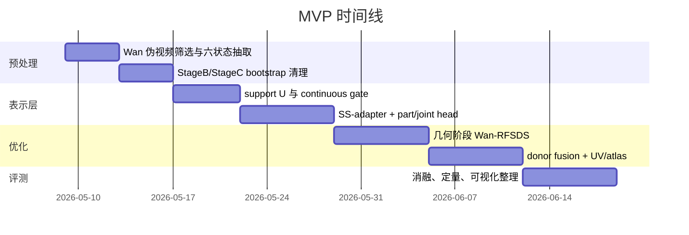

# 基于 TRELLIS 的单图铰接拟合研究报告

## Executive Summary

结论很明确：主线应以 **new_v_2 的 single-canonical / SS 内建模 / bootstrap 降级** 为骨架，但必须吸收 **new_v_1 的可微 inverse-warp、解析 joint rollout 与连续 gate**；不建议把 `argwhere` 直接用纯 STE 强行打通。最优方案是一个**混合版 CAST**：`support superset U + continuous gate g_i + SS-adapter/part-head/joint-head + analytic SE(3) rollout + Gaussian/RF proxy + 两阶段 Wan-RFSDS + canonical donor fusion`。它比纯 new_v_1 更稳、比纯 new_v_2 更不容易锁死错误几何，逻辑最闭环，也最符合 entity["organization","AAAI","artificial intelligence conference"] 对可解释性、消融充分性与工程可复现性的要求。fileciteturn0file1 fileciteturn0file2 fileciteturn19file0L1-L1 fileciteturn20file0L1-L1 citeturn3search1turn3search5turn4search0turn6search0turn6search1

## 证据底座与任务重述

本次研究已按要求先使用启用连接器：urlGitHubhttps://github.com、urlHugging Facehttps://huggingface.co、urlFigmahttps://www.figma.com。其中，GitHub 连接器用于核验并读取指定仓库 `chengu-123/research`，Hugging Face 连接器用于核验 entity["software","TRELLIS","3D generation model"] 与 entity["software","Wan2.2","video generation model"] 的官方模型资料；Figma 连接器已做可用性核验，但未发现与该仓库直接对应的设计稿文件，因此没有把 Figma 内容作为证据来源。技术证据主要来自四类：仓库 README 与代码、你上传的 `new_v_1/new_v_2`、官方论文/模型卡、以及旧 `stageB/stageC` 代码快照。仓库 README 清楚表明当前公开入口实际上是 entity["software","FreeArt3D","training-free articulated 3D generation framework"] 的实现，并明确致谢了 entity["software","TRELLIS","3D generation model"] 与 GIM，这说明你当前代码基底本质上已经是“静态 3D prior + articulation wrapper”的范式，而不是原生 articulated generator。urlchengu-123/research 仓库https://github.com/chengu-123/research fileciteturn14file0L1-L1

任务本身可以严格重述为：输入是**单张闭态图像 + prompt**，经 entity["software","Wan2.2","video generation model"] 生成固定单视角打开视频，抽取 6 个状态；目标是在冻结的 entity["software","TRELLIS","3D generation model"] 上恢复一个**唯一 canonical articulated asset**，并输出 `(base/move part segmentation, trajectory / joint params, texture / UV atlas)`，而不是生成 6 份彼此对齐的终态几何。这个重述与 entity["software","TRELLIS","3D generation model"] 官方的两阶段 structured latent 设计、entity["software","CHORD","4D distillation framework"] 的冻结视频模型蒸馏思路，以及 entity["software","FreeArt3D","training-free articulated 3D generation framework"] 的 per-instance optimization 范式是一致的。fileciteturn0file2 citeturn3search1turn3search5turn4search0turn3search6turn6search0turn6search1

从官方描述看，entity["software","TRELLIS","3D generation model"] 的核心是统一的 SLAT 表示，先生成 sparse structure，再在该 support 上生成 structured latent，最后解码为 radiance field、3D Gaussian 或 mesh；而官方管线与仓库代码都表明，`sample_sparse_structure` 先从 SS latent 解码出 occupancy，再离散提取 active coords，这个职责划分本身就决定了：**part/joint 必须尽量前移到 SS 阶段，texture 细化才应该放到 SLAT 阶段**。citeturn3search1turn3search5

## 架构审计与问题诊断

仓库现有旧主线可以概括为：`stage_b_scar.py` 做 K 状态粗一致性与 state-0 SDEdit 修补，`stage_c_segmatch/run_stage_c.py` 再在已有 `O_stack` 上做 partition、EM、swept-volume carve、graph-cut、axis refine 与 aggregation。也就是说，旧路线默认**voxel/support 已基本稳定**，再去解释部件与关节；它不是在 support 生成时就显式建模 articulation。fileciteturn19file0L1-L1 fileciteturn20file0L1-L1

`stage_b_scar.py` 的文件头和核心注释已经把两个关键事实写得很清楚。第一，它的 Pass-1 / Pass-2 依然是“先解码 occupancy，再用 guide 回编码，再重采样”的路线；这天然会把小的 logit 差异放大为 support 的离散抖动。第二，它明确认为 `z_final` 过于压缩，而 SS-DiT 中后层隐藏状态更适合作为 part prior，这反过来支持了“adapter/head 应该插在 SS block 内，而不是 Stage C 后解释”的判断。fileciteturn19file0L1-L1

`run_stage_c.py` 也同样揭示了旧方案的边界：它一开始就加载 `O_stack`、`M_attn_64`、`z_final/dit_hidden`，然后在此基础上做 count partition、anchor 选择、phase EM、swept volume、late carve、seg refine 和 axis refine。换句话说，它擅长**对已有 voxel 的后验解释与修整**，却不具备“把 support 定义权重新收回 SS 主环”的能力。对你当前最核心的“位置偏移、形状抖动、base 未完全对齐”，这类后处理路线只能缓解，不能根治。fileciteturn20file0L1-L1

### new_v_1 与 new_v_2 的核心差异

下表综合对照了 `new_v_1` 与 `new_v_2` 的主张；证据位置使用文档节标题与仓库伪路径，因为部分仓库文件通过连接器返回的是完整快照而不是逐行编号。整体判断是：**new_v_1 更“激进可微”，new_v_2 更“因果正确、实现稳定”；最终应采用 new_v_2 的表示因果链，再借 new_v_1 给 joint 与 gate 重开梯度。** fileciteturn0file1 fileciteturn0file2 fileciteturn19file0L1-L1 fileciteturn20file0L1-L1

| 维度 | new_v_1 | new_v_2 | 证据位置 | 判断 |
|---|---|---|---|---|
| 主表示 | `base_canonical + move_canonical`，强调从 `s2` 逆扭曲回 `φ=0` | 单 canonical support / occupancy / part / joint，一开始就把 StageB/C 降成 bootstrap | `new_v_1`：§6；`new_v_2`：方法总览、阶段三 fixed support gate | new_v_2 更符合“唯一资产”目标 |
| 梯度策略 | 试图用 `soft-mask + STE` 打通 SS→SLAT，并叠加 LoRA | 不去强行微分 `argwhere`，而是通过 support gate 绕开它 | `new_v_1`：§4.2；`new_v_2`：阶段三 fixed support gate；`trellis/.../trellis_image_to_3d.py::sample_sparse_structure` | new_v_2 更稳，但要避免 support 过早冻结 |
| joint 建模 | 强调可微 inverse-warp、`grid_sample` 与轴梯度回传 | 强调 joint/head 在 SS 中同步预测，rollout 生成多状态 | `new_v_1`：§6.2；`new_v_2`：PartTrajectoryHead、single-DoF rollout | 二者应合并 |
| StageB 地位 | 仍有更强主环作用 | 明确只做一次 bootstrap | `new_v_1`：§5；`new_v_2`：bootstrap only | new_v_2 更利于 AAAI 叙事 |
| 纹理路线 | SLAT LoRA + donor / atlas，但仍偏“可微桥”视角 | canonical donor fusion、provenance-aware texture 更清楚 | `new_v_1`：§6.3、§8；`new_v_2`：texture refinement、donor fusion | new_v_2 叙事更干净 |
| 最大风险 | STE 代理偏差大，模块过多，训练自由度过高 | support `U` 若建错会把错误几何固定下来，过于像“几何先定，纹理后修” | `new_v_1`：§4；`new_v_2`：阶段三 support gate | 最优是混合而非二选一 |

### 问题—成因—证据—优先级表

下表给出本问题最关键的故障源。需要特别指出：**new_v_2 的“梯度断点问题”不是传统意义上的 `argwhere` 不可微，而是“support 一旦用 bootstrap 固定得过早，真正的几何生长/修正通道被截断”**。这会把方法推向类似 entity["software","FreeArt3D","training-free articulated 3D generation framework"] 的“先几何、后纹理”工作流，只是把 hash-grid 换成了 gate-on-support。fileciteturn0file2 fileciteturn19file0L1-L1 fileciteturn20file0L1-L1 fileciteturn14file0L1-L1 citeturn3search6turn4search0

| 问题 | 可能成因 | 证据位置 | 优先级 | 可修复性 |
|---|---|---|---|---|
| SS→SLAT 的硬断裂 | `decoded_occ > 0` 后离散提取 coords，support membership 对 logit 非连续 | `trellis/trellis/pipelines/trellis_image_to_3d.py::sample_sparse_structure`；`new_v_1` §4；`new_v_2` “Hard support extraction” | 极高 | 高 |
| 位置偏移 / shape jitter | 6 个 state 仍各自采样、各自解码，再做后修补 | `pipelines/stage_b_scar.py` 文件头 Pass-1/Pass-2 设计 | 极高 | 中高 |
| state-0 偏置与 base 收缩 | StageB 明确承认 closed-state shrink bias，只是用均值稀释，而不是从变量定义上消灭 | `stage_b_scar.py::_compute_P_base_shared` | 高 | 中高 |
| StageC 只能解释、不能重生 support | 所有 partition/EM/graph-cut 都建立在已给定 `O_stack` 上 | `pipelines/stage_c_segmatch/run_stage_c.py::run_stage_c` | 极高 | 高 |
| new_v_2 的“几何先定化” | support `U` 一旦固定，`U` 外真值几何没有梯度入口；base 未完全对齐时会被锁死 | `new_v_2` 阶段三 fixed support gate；`new_v_2` 代码改动清单 | 极高 | 高 |
| new_v_1 的 STE 偏差 | hard coords 与 surrogate gradient 不匹配，容易出现训练表面平滑但离散 support 仍错 | `new_v_1` §4.2 Soft-Mask × STE | 高 | 中 |
| FreeArt3D carpet/disk 只能粗对齐 | 它解决的是 grounding/global alignment，不是 TRELLIS 内部 canonical support 形成 | 仓库 README；FreeArt3D 论文摘要 | 中高 | 中 |
| Wan 伪视频引入假运动 / 相机漂移 | 官方 I2V 是通用视频模型，不是固定机位铰接专模 | Wan2.2 官方 README / 模型卡 | 高 | 中 |
| 纹理 donor 与几何绑定过弱 | 若 canonical 几何不稳，open-only surfaces 会被 donor fusion 拉花 | `new_v_2` donor fusion 段；TRELLIS 官方“SLAT 解耦 geometry/appearance” | 高 | 高 |

## 推荐完整 pipeline

### 总体裁决

推荐的最终方法不是纯 new_v_1，也不是纯 new_v_2，而是一个**混合版 CAST**：

- **表示与因果链**：采用 new_v_2 的 `bootstrap → canonical geometry in SS → texture in SLAT/UV`。
- **梯度与运动链**：采用 new_v_1 的 `differentiable inverse-warp / analytic rollout`，但**不用纯 STE 作为主路径**。
- **桥接方式**：不对 `argwhere` 本身求导，而是构造一个**support superset U**，在固定坐标上优化**continuous gate** 与 part / joint / texture。这样既保留 sparse 结构，又避免过早几何冻结。fileciteturn0file1 fileciteturn0file2 citeturn3search1turn3search5turn4search0

### 输入与输出

输入定义为：
\[
(I_0,\; p)\rightarrow V_{\text{wan}}\rightarrow \{I_k\}_{k=0}^{5}\rightarrow \text{SS-adapter}\rightarrow U,\;B,\;M,\;\psi\rightarrow \text{SLAT/UV}\rightarrow \mathcal{A}
\]

其中 \(I_0\) 是闭态图像，\(p\) 是 prompt，\(\{I_k\}\) 是 6 个状态图，\(U\) 是 support superset，\(B/M\) 是 canonical base/move occupancy，\(\psi\) 是关节参数，\(\mathcal{A}\) 是 atlas/texture。最终输出为：`part segmentation + trajectory/joint + texture/UV atlas + URDF/export mesh`。这比“六个状态各产一套 voxel 再对齐”更符合最终交付形式。fileciteturn0file2 citeturn3search1turn3search5turn6search0turn6search1

```mermaid
flowchart TD
    A[闭态图 I0 + prompt] --> B[Wan2.2 I2V 伪视频]
    B --> C[筛选并抽取六状态 I0..I5]
    C --> D[旧 StageB/StageC 一次性 bootstrap]
    D --> E[coarse priors: O_stack_soft z_final M_attn dit_hidden ψ0]
    C --> F[冻结 TRELLIS SS 主干]
    F --> G[SS-adapter at blocks 14/16/18]
    E --> G
    G --> H[continuous gates g_i + part logits + joint params]
    H --> I[canonical base B and move M on support U]
    I --> J[analytic rollout T_k(ψ)]
    J --> K[Gaussian/RF proxy render]
    K --> L[Wan-RFSDS geometry phase]
    I --> M[SLAT adapter + donor fusion]
    C --> M
    M --> N[UV/atlas optimization]
    N --> O[mesh/gaussian/RF export + URDF]
```

### SS-adapter / part-head / joint-head 设计

建议只在 SS Flow 的**中后层 block 14 / 16 / 18**插入 adapter，而不是全 24 层都动。原因有二：一是旧 `stage_b_scar.py` 已明确把这些 block 视为语义“sweet spot”；二是全层注入会显著放大实例级优化自由度，不利于稳定性。adapter 形式建议采用**零初始化残差 cross-state attention**：对相同 voxel token index 的 K 个状态做 state-dimension attention，再回写到每个状态 token。这样初始行为严格等价于冻结原模型，只有当 loss 需要时才逐步偏离。fileciteturn19file0L1-L1 fileciteturn0file2

对每个 support voxel \(u_i\in U\)，head 输出：

\[
g_i=\sigma(\ell_i^g/T_g),\qquad
\pi_i=\mathrm{softmax}[\ell_i^b,\ell_i^m,\ell_i^u],
\]

其中 \(g_i\) 是 continuous occupancy gate，\(\pi_i\) 分别对应 base / move / uncertain；导出时 part mask 取 `argmax`，训练时保留 soft。Joint-head 输出：

\[
\psi=\{p_{\text{rev}}, p_{\text{pris}}, \hat{\omega}, q, \hat{v}, \phi_1,\ldots,\phi_5\}.
\]

其中 revolute 与 prismatic 在早期用 soft routing，后期硬选。为保证单调开合，建议用
\[
\phi_k=\sum_{j\le k}\mathrm{softplus}(\delta_j),\quad \phi_0=0.
\]
初始化上，\(g_i\) 初值来自 coarse occupancy，part logits 来自 StageB 的 `M_attn/dit_hidden` warm start，\(\psi_0\) 来自旧 StageC 的 axis/anchor 结果。激活函数推荐 SiLU；损失头全部 zero-init。fileciteturn19file0L1-L1 fileciteturn20file0L1-L1 fileciteturn0file1 fileciteturn0file2

### support superset U 的构造

这是整个方法的关键。**不要把 U 直接等于某一次 hard threshold support**；应构造成“保守但可优化”的超集：

\[
U = U_{\text{StageB}} \;\cup\; U_{\text{6-state}} \;\cup\; \mathrm{Dilate}(U_{\text{6-state}}, r)\;\cup\; U_{\text{uncertain}}.
\]

其中：
- \(U_{\text{StageB}}\)：旧 StageB 的 soft occupancy 过阈值并集；
- \(U_{\text{6-state}}\)：六状态直接经 TRELLIS/旧代码得到的 supports 并集；
- `Dilate`：一层或两层 shell，给几何生长预留空间；
- \(U_{\text{uncertain}}\)：base/move logits 接近、或 `M_attn`/`dit_hidden` 显示边界不确定的体素带。fileciteturn19file0L1-L1 fileciteturn20file0L1-L1 fileciteturn0file2

伪代码如下：

```python
# inputs: O_stack_soft, coarse_base_prior, coarse_move_prior, M_attn, dit_hidden
U_stageB = union_k(O_stack_soft[k] > tau_occ)
U_6state = union_k(Trellis_state_occ[k] > tau_occ)
U_shell  = dilate(U_6state, radius=1)
U_uncertain = (abs(coarse_base_prior - coarse_move_prior) < eps_band) \
              | (M_attn < tau_attn_low) \
              | semantic_boundary(dit_hidden)

U = U_stageB | U_6state | U_shell | U_uncertain
coords_U = sparse_coords(U)

g_init = sigmoid(logit_from_stageB(coords_U))
part_init = softmax(head_warmstart(coords_U))
psi_init = stageC_joint_warmstart()
```

参数推荐：`tau_occ=0.35~0.45`，`radius=1`，`eps_band=0.10~0.15`。如果担心 U 过大，可在几何阶段中期根据 `g_i` 稀疏化一次，但不建议早于总迭代的 50%。这是比纯 fixed-support 更稳健、也比 `argwhere+STE` 更可控的中间路线。fileciteturn0file2 fileciteturn0file1

### 替代 argwhere 的可微化主通路

推荐不用“让 `argwhere` 可微”这种说法，而是**定义一个不会依赖 `argwhere` 的训练通路**。训练通路固定 `coords_U`，只优化 gate 与特征；导出通路才做 hard threshold。推荐的前向写法是：

\[
B(x)=\sum_{i\in U} g_i\,\pi_i^{(b)}\,\kappa(x-u_i),\qquad
M(x)=\sum_{i\in U} g_i\,\pi_i^{(m)}\,\kappa(x-u_i),
\]

其中 \(\kappa\) 可以是 trilinear / Gaussian kernel。对第 \(k\) 个状态，解析 rollout 为

\[
M_k(x)=M(T_k^{-1}x;\psi),\qquad
O_k(x)=1-(1-B(x))(1-M_k(x)).
\]

这样梯度直接流向 \(g_i\)、part logits 和 \(\psi\)。如果需要使用 SLAT，则不是把 `coords = argwhere(O_k>0)` 送入 SLAT，而是把固定 `coords_U` 与 gated features 送入一个**SparseTensor-on-U**：所有坐标都在，但低 gate 坐标贡献接近零。这样仍保留 sparse 计算图，同时避免 coords membership 的离散跳变。fileciteturn0file2 fileciteturn0file1 citeturn3search1turn3search5

这一步比 pure STE 更推荐，原因是：STE 的 surrogate gradient 不保证和离散 membership 的真实优化方向一致，而固定 `U` + continuous gate 至少保证了“在超集内的增删改动是连续的”。它相比纯 new_v_2 的优点，则是**不是先把 support 完全冻结成常量**，而是允许 support mass 在超集内重分配，因此不会那么像“geometry locked, texture later”的 FreeArt3D 路线。fileciteturn0file1 fileciteturn0file2 fileciteturn14file0L1-L1

### RFSDS 如何回传到 SS-adapter、joint 与 SLAT

entity["software","CHORD","4D distillation framework"] 的核心启发不是它的 4D 表示本身，而是：**冻结视频模型可作为动态老师，速度残差可回传给底层 3D/4D 表示**。你的任务里，Wan 只需要承担“motion/layout/newly-visible texture teacher”，而不是直接给 part label。于是损失可拆为两组：

\[
L_{\text{geo}}=\lambda_{\text{rfsds}}L_{\text{Wan-RFSDS}}^{\text{high-noise}}
+\lambda_{\text{first}}L_{\text{first-frame}}
+\lambda_{\text{base}}L_{\text{base-static}}
+\lambda_{\text{joint}}L_{\text{single-dof}}
+\lambda_{\text{gate}}L_{\text{gate-reg}},
\]

\[
L_{\text{tex}}=\lambda_{\text{rfsds}}'L_{\text{Wan-RFSDS}}^{\text{low-noise}}
+\lambda_{\text{donor}}L_{\text{donor-fusion}}
+\lambda_{\text{uv}}L_{\text{uv-smooth}}
+\lambda_{\text{prov}}L_{\text{provenance}}.
\]

其中高噪声阶段只更新 \(\theta_{\text{SS-adapter}}, \theta_{\text{part}}, g, \psi\)，低噪声阶段主要更新 \(\theta_{\text{SLAT}}, \theta_{\text{atlas}}, w_{\text{donor}}\)。对于 joint，建议直接采用解析 SE(3) rollout / inverse-warp，使
\[
\frac{\partial O_k}{\partial \psi}
\]
通过 `grid_sample` 或 Gaussian proxy 的采样坐标获得，而不是依赖 StageC 式的后验 axis refine。fileciteturn0file1 fileciteturn0file2 citeturn4search0turn6search0turn6search1

### 两阶段优化 schedule

推荐 schedule 不是“先几何全定，再纹理全优”，而是**先几何主导、后纹理主导，中间留一个弱耦合重分配区**：

| 阶段 | 迭代区间 | 采样噪声 | 打开参数 | 目标 |
|---|---|---:|---|---|
| 几何预热 | 0–20% | 高噪声，\(\tau\in[0.55,0.85]\) | \(g,\pi,\psi,\theta_{SS}\) | 去漂移、稳 base、粗 joint |
| 几何主阶段 | 20%–60% | 双路：高噪声主、低噪声辅 | \(g,\pi,\psi,\theta_{SS}\) + very light \(\Delta z_{slat}\) | 修正 move corridor、压 shape jitter |
| 纹理准备 | 60%–75% | 中低噪声 | 冻结大部分几何，只放开边界 gate 与 donor weight | 防止 texture 把几何拉坏 |
| 纹理阶段 | 75%–100% | 低噪声，\(\tau\in[0.05,0.30]\) | \(\theta_{SLAT}, \theta_{atlas}, w_{donor}\) | 内表面、背面、atlas 补全 |

如果只能做一个 MVP，建议把双路噪声简化为“几何阶段只高噪声、纹理阶段只低噪声”。这比 `new_v_1` 的完整 dual-τ 更容易落地，也更接近仓库当前成熟度。fileciteturn0file1 fileciteturn0file2 citeturn4search0turn6search0turn6search1

### 如何得到对齐 base 并减少位置偏移与形状抖动

推荐的 base 对齐流程是：

1. 用 Wan 生成多个 seed，先做**相机稳定性筛选**，只保留 bbox 尺度、背景光流、主体质心变化最小的一条；
2. 用旧 `stage_b_scar.py` 只跑一次，拿 `O_stack_soft / z_final / M_attn / dit_hidden`；
3. 参考 entity["software","FreeArt3D","training-free articulated 3D generation framework"] 的 carpet/disk，先做 grounding 清理，但**不把它当 canonical 形成机制**；
4. 构造 `U` 后，在 canonical 空间只允许 `move` 通过 \(T_k(\psi)\) 变化，`base` 在所有状态共享；
5. 对 `base` 使用跨状态静态损失，对 `move` 使用 inverse-warp / rollout 一致性损失；
6. 所有状态的 donor 与 visibility 都回到 canonical surface 做融合。fileciteturn14file0L1-L1 fileciteturn19file0L1-L1 fileciteturn20file0L1-L1 fileciteturn0file2

最有效的四个改进措施是：共享 seed 噪声、去掉 state-0 特权、对 `base` 用 robust trimmed mean 而不是简单票选、把 StageC 从“最终输出器”降为“warm start + regularizer”。这四件事加起来，比单独继续打磨 StageB 或继续堆 graph-cut 都更有价值。fileciteturn19file0L1-L1 fileciteturn20file0L1-L1 fileciteturn0file1 fileciteturn0file2

## 备选方案比较与最终裁决

下表比较四条可行路线。用户要求的“文件/函数证据位置”已放入最后一列；若仓库未直接包含，则明确标为“仓库未包含”。整体裁决是：**推荐 B，不推荐 A，C 适合作为 teacher 解释框架，D 太重、太偏离当前仓库。** fileciteturn0file1 fileciteturn0file2 fileciteturn19file0L1-L1 fileciteturn20file0L1-L1 citeturn4search0turn3search1turn3search5

| 方案 | 核心想法 | 可微性 | 实现难度 | 收敛稳定性 | AAAI 可发表性 | 预期效果 | 证据位置 |
|---|---|---|---|---|---|---|---|
| A | hard-support + STE 反向 | 表面上强，实则 surrogate bias 大 | 中 | 低到中 | 中 | 容易跑偏，ablation 难自洽 | `new_v_1` §4.2；`trellis/.../trellis_image_to_3d.py::sample_sparse_structure` |
| B | **support superset + continuous gate + analytic rollout** | **高** | **中** | **高** | **高** | **最均衡，最适合当前仓库** | `new_v_2` fixed support gate；`stage_b_scar.py`；`run_stage_c.py` |
| C | CHORD-style：冻结视频模型，只回残差到 3D 表示 | 高 | 中高 | 中高 | 高 | 适合作 teacher，但仍需配合 B 的表示层 | entity["software","CHORD","4D distillation framework"] 论文；仓库未包含直接实现 |
| D | end-to-end differentiable renderer + learned warp fields | 很高 | 很高 | 中 | 中高 | 上限高，但过重且偏离 single-DoF/URDF 目标 | 仓库未包含；仅 `sajo/screw.py`/`axis_refine.py` 有局部基础 |

最终裁决如下。**纯 new_v_1** 的问题在于，它把所有难点都打成“连续可微”，但实际最难的是**离散 support membership 与 sparse tensor 拓扑**，这恰恰不是 STE 能优雅解决的。**纯 new_v_2** 的问题在于，它把 support gate 定义得太像“半固定几何”，如果 bootstrap 错了，就很难在 canonical 几何上真正恢复。**混合版 CAST** 则同时保留了三件关键事：表示因果链正确、梯度不断、工程复杂度可控。对 AAAI 来说，这条线的叙事也最清楚：不是“比 FreeArt3D 更会调 loss”，而是“首次把 articulation-aware canonical support formation 前移到冻结 TRELLIS 的 sparse-structure stage”。fileciteturn0file1 fileciteturn0file2 fileciteturn14file0L1-L1 citeturn3search1turn3search5turn3search6turn4search0

## 实验与工程落地

### 必做实验、基线与指标

最低限度必须包含五类基线：仓库当前旧 `StageB+StageC`；6 状态独立过 entity["software","TRELLIS","3D generation model"] 再后对齐；entity["software","FreeArt3D","training-free articulated 3D generation framework"]；纯 new_v_1；纯 new_v_2。若只和旧方法比，不足以证明“support 形成机制改变才是关键”。fileciteturn14file0L1-L1 fileciteturn19file0L1-L1 fileciteturn20file0L1-L1 fileciteturn0file1 fileciteturn0file2

定量指标建议分四组：canonical 几何、部件/轨迹、纹理、导出质量。最重要的不是单个 PSNR，而是**是否真的解决了 P1/P3/P4/P5**。建议指标包括：`Base Consistency IoU`、canonical `Chamfer-L1`、`support jitter rate`、`part mIoU`、`trajectory MAE`、axis direction/pivot error、state-0 visible `PSNR/LPIPS`、open-only visible `LPIPS`、`texture provenance coverage`、UV seam error、URDF rollout self-intersection rate。若有 PartNet-Mobility 或合成数据，优先用它做有 GT 的主表；真实单图场景则做 first-frame / consistency / donor-visible metrics 的副表。仓库 README 已经给出了 PartNet-Mobility 与 multi-joint 数据组织方式，可直接复用为实验骨架。fileciteturn14file0L1-L1

合理的目标值可以设为：`Base IoU > 0.90`、`support jitter < 3%`、`part mIoU > 0.80`、axis direction error `< 5°`、trajectory 归一化误差 `< 0.10`、state-0 visible `LPIPS < 0.20`。失败判定标准则反过来设：`Base IoU < 0.75`、`support jitter > 10%`、URDF rollout 明显穿模、open-only 表面 donor 失败或 provenance 覆盖不足。这些阈值不是论文必须逐字采用，但需要在内部实验中明确，否则很难避免“看起来能动，但 canonical 资产不可交付”的伪成功。fileciteturn0file2

### MVP 步骤与时间估计

最小可行实验不应一上来做 full donor fusion。建议的 MVP 顺序是：



按当前仓库成熟度估计：开发 4–5 周，单对象优化与调试 0.5–1 天，完整评测 1–2 周。若只做几何 MVP，不做 donor fusion，可压缩到 2 周内验证“base 稳定 + joint 正确 + rollout 正常”。fileciteturn0file2

### 关键代码修改点与工程建议

最关键的改动位点只有六处：

| 优先级 | 文件 / 模块 | 改动 |
|---|---|---|
| P0 | `trellis/trellis/pipelines/trellis_image_to_3d.py` | 新增 `sample_sparse_structure_with_logits()`、`run_articulated_single_image()` |
| P0 | `trellis/trellis/models/sparse_structure_flow.py` | 在 blocks 14/16/18 外挂 SS-adapter |
| P0 | `trellis/trellis/modules/transformer/modulated.py` | 扩展 `ModulatedTransformerCrossBlock` 支持 state-dim residual attention |
| P0 | 新建 `mine/pipelines/articulation/support_gate.py` | 管理 `U`、`g_i`、稀疏坐标缓存 |
| P1 | 新建 `mine/pipelines/articulation/part_joint_head.py` | 输出 `g_i / part logits / ψ / φ_k` |
| P1 | 新建 `mine/pipelines/articulation/rfsds_opt.py` | Wan-RFSDS 两阶段优化器 |
| P1 | 旧 `pipelines/stage_b_scar.py` | 只导出 bootstrap，不再定义最终几何 |
| P1 | 旧 `pipelines/stage_c_segmatch/run_stage_c.py` | 只返回 warm-start joint/contact，不再当最终结果 |

这个清单与 `new_v_2` 的代码修改建议高度一致，但需要额外加上 `new_v_1` 式的 analytic rollout/inverse-warp 模块。否则 `ψ` 仍然会退化成一个“事后解释变量”。fileciteturn0file1 fileciteturn0file2 fileciteturn19file0L1-L1 fileciteturn20file0L1-L1

硬件方面，entity["software","Wan2.2","video generation model"] 官方 README 明确写到 `Wan2.2-I2V-A14B` 单卡推理至少需要约 80GB VRAM；因此如果使用 A14B，1×80GB 是合理底线。几何优化与 donor fusion 则建议使用 1×80GB 或 2×80GB 进行快速 ablation；若只做几何 MVP，不跑 full atlas，1×48GB 也可能够，但不建议作为主实验环境。citeturn6search0turn6search1

调试上，最重要的是看**中间量**而不是只看最终 mesh：`g_i` 直方图、base/move 概率分布、每个状态的 canonical rollout 投影、joint 角度曲线、U 的覆盖率、donor provenance map、以及各参数组梯度范数。只要这几类图不稳定，继续调 renderer 或 UV 都是低效的。fileciteturn0file1 fileciteturn0file2

## 风险、AAAI 投稿标准与开放问题

最大的技术风险有四个。第一，Wan 伪视频本身会 hallucinate；如果“打开方式”错了，后续所有 RFSDS 都会把 3D 资产拉向一个错误但自洽的解释。第二，若 `U` 构造得太小，几何会被锁死；若太大，又会导致优化空间过宽。第三，single-DoF / single-joint 是方法成立的重要前提，超出这个前提的类别会显著恶化。第四，open-only 隐藏表面的纹理本质上是“弱观测 + 先验补全”，必须输出 provenance mask，否则论文在可解释性上会吃亏。citeturn6search0turn6search1turn4search0turn3search6 fileciteturn0file2

从 AAAI 写作标准看，最重要的是三件事：第一，主故事必须是“**canonical support 在 SS 阶段形成**”，而不是“后处理更强”；第二，消融必须明确剥离 `bootstrap`、`support gate`、`analytic rollout`、`Wan-RFSDS`、`donor fusion` 各自贡献；第三，统计必须报告多对象均值与方差，而不是单个漂亮案例。建议主文至少包含：方法总图、support jitter 对比、canonical base 可视化、joint rollout 定性、texture donor/provenance 定性、主定量表、关键消融表。代码与数据方面，至少要开源：prompt 模板、Wan seed 选择规则、support U 构造脚本、训练/优化配置、评测脚本、provenance 导出。fileciteturn14file0L1-L1 fileciteturn0file2 citeturn3search1turn3search5turn4search0turn6search1

### 最终推荐方案

最终推荐的是：**以 new_v_2 为主骨架、吸收 new_v_1 的可微 joint 机制、但放弃 pure STE 桥接的混合版 CAST**。更具体地说：

1. **保留 new_v_2**：single-canonical、SS 内 part/joint、StageB/C 只做 bootstrap、texture 在 SLAT/UV 完成。  
2. **吸收 new_v_1**：analytic inverse-warp / rollout、`grid_sample` 可微 joint、dual-stage Wan-RFSDS 的高低噪分工。  
3. **放弃 new_v_1 的纯 STE 主桥**：不直接对 `argwhere` 做 surrogate 反传，而是用 `support superset U + continuous gate` 替代。  
4. **把 new_v_2 的 fixed support 改成 soft-fixed superset**：这样既不会像 old StageB/C 那样后对齐，也不会像 FreeArt3D 那样把几何过早定死。fileciteturn0file1 fileciteturn0file2 fileciteturn19file0L1-L1 fileciteturn20file0L1-L1 fileciteturn14file0L1-L1 citeturn3search1turn3search5turn3search6turn4search0turn6search0turn6search1

开放问题主要有三点。其一，仓库中并非所有 `record/*` 文档都能通过连接器逐行稳定读取，因此少数证据位置只能给到“文件/函数/伪位置”，没有完整精准行号。其二，旧 `stageB/stageC` 快照与 GitHub 主仓某些目录组织并不完全一致，因此最终落地时需要先做一次路径统一。其三，若后续要扩到 multi-joint，当前推荐方案的 single-DoF 解析 rollout 需要升级为 slot-wise joint composition，这会显著增加方法复杂度，因此不建议进入第一版 AAAI 主稿。fileciteturn14file0L1-L1 fileciteturn19file0L1-L1 fileciteturn20file0L1-L1