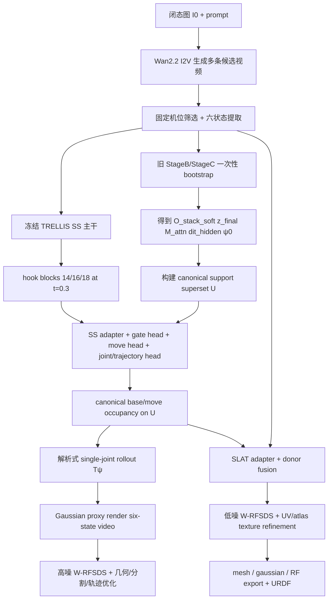
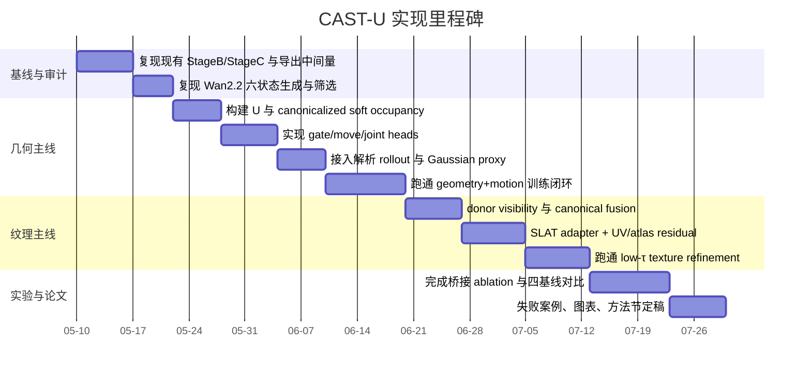

# 基于 TRELLIS 的单图铰接拟合完整方案

## 执行摘要

我先按你的要求，用已启用的 urlGitHubhttps://github.com、urlHugging Facehttps://huggingface.co 和 urlFigmahttps://www.figma.com 连接器做了入口核验；随后把实质证据落在你的仓库 urlchengu-123/researchhttps://github.com/chengu-123/research、官方 entity["software","TRELLIS","Structured 3D Latents for Scalable and Versatile 3D Generation"]、entity["software","Wan2.2","Open and Advanced Large-Scale Video Generative Models"]、entity["software","FreeArt3D","Training-Free Articulated Object Generation using 3D Diffusion"] 和 entity["other","CHORD","Choreographing a World of Dynamic Objects"] 的官方实现与论文上。你的仓库当前根 README 仍明确以 FreeArt3D 为主入口，并说明借用了 TRELLIS 与 GIM；仓库内可运行主线则主要是 `stage_b_scar.py` 的 Pass-1/Pass-2 BMCSA/SCAR 与 `run_stage_c.py` 的 partition→EM→swept-volume→graph-cut→axis refine。与此同时，官方 TRELLIS 仍是典型的两阶段 SS→SLAT 管线，而且在 `sample_sparse_structure` 中先 `decoder(z_s)` 再 `torch.argwhere(...>0)` 提取 sparse coords；这一行就是你现在真正的“梯度断点”。fileciteturn20file0L1-L1 fileciteturn6file0L1-L1 fileciteturn7file0L1-L1 citeturn5search0turn5search2turn0search0turn1search2turn2search5

对你上传的两份方案，我的结论非常明确：**new_v_2 的“canonical-first 因果顺序”比 new_v_1 更接近正确主线，也更接近 entity["event","AAAI Conference on Artificial Intelligence","artificial intelligence conference"] 更愿意接受的方法学叙事；但 new_v_2 原写法如果把 support `U` 固定得过早，就会退化成“先定几何、后补纹理”的弱版本，和 FreeArt3D 的 training-free 优化范式过近。相反，new_v_1 中真正值得保留的是 differentiable inverse-warp、single-joint 解析 rollout，以及 CHORD 式双噪声段 RFSDS；但把 `argwhere` 直接用纯 STE 硬连起来，工程风险太高，结果也最不稳。**最好的最终答案不是二选一，而是：**采用 new_v_2 的 canonical-first 骨架，吸收 new_v_1 的 motion/RFSDS 机制，再用一个“support superset + continuous gate + periodic refresh”的可微软替代，去取代原始的硬梯度断点。**fileciteturn0file3 fileciteturn0file4 citeturn1search0turn2search0turn5search0

因此，我推荐的最终方法不是“重新让 `argwhere` 可导”，而是**从变量定义上绕开 `argwhere`**：先用你仓库现有 Stage B/C 做一次性 bootstrap，构造一个**保守但可优化的 support superset \(U\)**；然后在 \(U\) 上预测连续 presence gate \(g_i\) 与 move gate \(m_i\)，并把所有几何、部件分割、关节参数、SLAT 纹理都写到这个固定 sparse 坐标系上；内环里对 \(g_i,m_i,\psi,\text{SLAT}\) 做全可微优化，外环再低频刷新 \(U\)。这条路比“纯软 mask”更有 support 塑性，比“纯 STE 过 argwhere”更稳，也比“先几何后纹理”更有新意、更符合你的科学问题。fileciteturn0file3 fileciteturn0file4 citeturn2search0turn5search0turn5search2

## 证据基础与问题根因

你的仓库当前已经积累了三类非常有价值的资产。第一类是 **Stage B 的多状态粗一致性资产**：`stage_b_scar.py` 明确包含 Pass-1 SCAR、Pass-2 SDEdit/BMCSA、`P_base_shared`、`M_attn`、以及在 SS-DiT 中 hooks 14/16/18 block hidden states 的逻辑；`stageb_detail.md` 还清楚记录了长抽屉场景下 `P_base` 污染与 guide 过大问题。第二类是 **Stage C 的 coarse articulated prior**：`run_stage_c.py` 把输入限定在 `O_stack`、`M_attn_64`、`z_final`、可选 `dit_hidden` 上，并通过 partition、anchor state selection、phase EM、swept volume、graph-cut、axis refine 产出 `joint_type / T_k / phi_k / canonical_base / canonical_move`。第三类是 **旧方案文档的决定性判断**：它们都越来越接近同一个结论——“不能再让六个最终状态各自产生一套最终几何，然后在后面用 heuristic 去解释”。fileciteturn6file0L1-L1 fileciteturn18file0L1-L1 fileciteturn7file0L1-L1 fileciteturn10file0L1-L1

官方 TRELLIS 的事实边界也很清楚。README 明确把模型表述为“先 Sparse Structure，再 Structured LATent”，并且同时支持 image-conditioned 与 tuning-free multi-image conditioning，还强调了 unified SLAT 可以解码成 Gaussian、radiance field 和 mesh；但 issue #310 直接引用了官方 `trellis_image_to_3d.py` 中的关键代码：`coords = torch.argwhere(decoder(z_s)>0)`。这意味着：**在官方实现里，SS 的连续 occupancy latent 一旦经过硬阈值与 `argwhere`，support membership 就从连续 logit 变量变成了离散坐标集合；SLAT 及其后续渲染的梯度，不会自动回到 SS occupancy logits。**这不是“小断点”，而是决定整个系统优化方式的主断点。citeturn5search0turn5search2turn0search3

你仓库里现有 Stage B/C 的价值也因此要重新定位。Stage B 的 BMCSA/SCAR 在代码和文档里都清楚表明，它是在**K 个状态独立采样已经发生之后**，再去做跨状态 base 一致性矫正，并且当前文档还承认了 closed-state shrink bias 与 long-drawer 污染。Stage C 则更加彻底：它所有的 partition、EM、graph-cut、axis refine 都建立在已经给定的 `O_stack` 上。换言之，**Stage B/C 很擅长提供粗 base/move/joint warm start，却并不具备“把错误 support 重新生出来”的能力。**这也是为什么你现在会反复碰到“位置偏移、形状抖动、base 不完全对齐、move corridor 被污染”，而且越到后面越难救。fileciteturn18file0L1-L1 fileciteturn6file0L1-L1 fileciteturn7file0L1-L1 fileciteturn10file0L1-L1

与此同时，FreeArt3D 与 CHORD 分别给了你两条可直接吸收的“强证据”。FreeArt3D 的论文和官方实现都明确表明：可以把预训练静态 3D diffusion model 当作 articulated per-instance optimization 的 prior，而不去训练一个新的 articulated generator。CHORD 则给出了 RF 视频模型的 RFSDS/W-RFSDS 数学形式，并且其项目页与论文摘要都说明它本质上是在**冻结视频生成器的前提下**，从 Eulerian video representation 中蒸馏 Lagrangian motion。你的任务和它们不同，但它们提供的范式是对的：**冻结大模型主干，新增小型 adapter/head，在 per-instance 优化里学 canonical geometry、motion 与 texture。**citeturn1search0turn1search2turn2search0turn2search5

## 两份方案的裁决

你上传的 `new_v_1`，主轴是 **BMCSA latent bootstrap + differentiable inverse-warp + dual-τ W-RFSDS + STE/soft bridge**；`new_v_2` 的主轴则是 **canonical-first + support-gated + SS 内前移 part/joint + SLAT donor fusion**。这两份文档都不是错的；它们分别抓住了一个真正重要的问题。只不过，new_v_1 抓住的是“梯度必须回到 motion/geometry 变量”，new_v_2 抓住的是“变量的因果顺序必须先 canonical, 再 joint, 再 texture”。从论文叙事与结果可控性看，后者更重要；从最终训练能否真跑通看，前者又不能缺。fileciteturn0file4 fileciteturn0file3

| 维度 | new_v_1 | new_v_2 | 我的裁决 |
|---|---|---|---|
| 表示因果顺序 | 仍较强调“把梯度接回旧管线” | 明确 canonical-first | **new_v_2 更正确** |
| 对 `argwhere` 的处理 | 纯 STE / hard-soft 桥接，理论更激进 | 固定 support `U`，工程更稳 | **两者都不够，需第三条路** |
| support 塑性 | 强，但最不稳定 | 稳，但容易早冻住 | **superset-U + continuous gate 最合适** |
| 关节建模 | inverse-warp 与解析 rollout 很强 | 有，但不如 new_v_1 鲜明 | **保留 new_v_1** |
| 纹理路线 | 相对靠后 | donor fusion + canonical atlas 更完整 | **保留 new_v_2** |
| 与现有 repo 对接 | 需要改动更多 | 更贴近你当前代码演化 | **new_v_2 更容易落地** |
| 与 FreeArt3D 的距离 | 更远，方法学更新更明显 | 若 support 过早固定，容易太像 | **必须补一个新桥接机制** |
| AAAI 叙事 | 技术味浓，但因果链不够干净 | 因果链干净，但若几何冻结则说服力下降 | **混合后最好** |

真正决定你会不会“像 FreeArt3D”的，不是你有没有把 geometry 和 texture 分两阶段，而是**你有没有把最终可优化变量写成一个 canonical articulated asset，而不是六个静态状态的后对齐**。因此，new_v_2 的 canonical-first 是必须保留的。它比 new_v_1 更接近最终可发表主线，也更接近“一个资产、一个 joint、一张 atlas”的交付逻辑。fileciteturn0file3 citeturn1search0turn1search2

但同样必须直说：**new_v_2 当前版本对梯度断点的替代还不够。**如果 `U` 直接来自 bootstrap hard support，再只用 soft gate 做乘法，那么 `U` 外的真值几何从一开始就没有梯度入口；而一旦 bootstrap base 没完全对齐，这种错误会被 canonical-first 放大，而不是被修复。换句话说，new_v_2 的问题不是“太像 FreeArt3D”，而是“太早把 topology 冻住了”。这一点，正是 new_v_1 想通过 inverse-warp 和 STE 去补回来的。fileciteturn0file3 fileciteturn0file4 citeturn5search0turn1search0

所以最终裁决只有一句：**主干选 new_v_2，关键技术件吸收 new_v_1，但把“纯 STE 过 argwhere”替换成“superset support + hard-concrete/STE gate + 低频 support refresh”。**这是逻辑上最正确、结果上最可能跑通、并且最容易写成完整方法节的版本。fileciteturn0file3 fileciteturn0file4

## 推荐的完整 pipeline

### 流程总览

下面这条 pipeline 是我认为最符合你问题定义、最容易产出正确结果、也最符合 AAAI 主方法叙事的版本。我把它称为 **CAST-U**：**Canonical Articulation-aware Sparse Trellis with Superset U-Gates**。它保留你要求的输入形式——单张闭态图 + Wan2.2 伪视频 + 6 个状态；保留你仓库里现成的 Stage B/C 作为一次性 bootstrap；但最终核心变量被改写为 `canonical support superset U + continuous gates + single-joint parameters + canonical texture atlas`。fileciteturn20file0L1-L1 fileciteturn6file0L1-L1 fileciteturn7file0L1-L1 citeturn0search0turn5search2turn2search0turn1search0

### 关键设计维度

| 设计维度 | 推荐设计 | 为什么这样选 |
|---|---|---|
| support proposal \(U\) | `inverse-warped union + entropy shell + dilation + uncertain queue` | 既保守覆盖真 support，又不给 topology 过早上锁 |
| SS adapter | 仅 hook SS blocks 14/16/18, 在 canonical grid 上做跨状态聚合 | 这正是你当前 Stage B 已经验证最有语义价值的块位 |
| part / joint / trajectory heads | 在 canonical feature 上新增 3 个小 head，不改 SS 主干 | 最小参数改动，最容易写清楚 novelty |
| continuous gate | \(g_i\) presence gate + \(m_i\) move gate，binary-concrete + STE | 比纯 soft mask 更有 support 塑性，比纯 STE 更稳 |
| state warping \(T_\psi\) | 单关节解析 SE(3) rollout，revolute/prismatic 双分支软选后硬选 | 单 DoF 问题里，解析式比自由形变更干净、更可解释 |
| 渲染代理 | **用 SLAT 表示，用 Gaussian decoder 作优化代理，用 mesh 只作最终导出** | Gaussian 路径最平滑，mesh 提取不适合作 inner-loop |
| 视频蒸馏 | CHORD 式 W-RFSDS；geometry phase 用高噪段，texture phase 用低噪段 | 直接吸收 CHORD 的正确数学形式 |
| 两阶段优化 | geometry+motion 先收敛，再 texture donor fusion | 因果顺序正确，同时避免纹理干扰 joint |
| support 更新 | inner-loop 固定 \(U\)，outer-loop 每 150–250 iter 低频 refresh 一次 | 兼顾可微稳定性与 topology 塑性 |

这张表里，最关键的不是某一个 head，而是**你把“support membership”从原始的 `argwhere` 坐标集合，改写成了在 \(U\) 上可优化的 gate 变量。**这一步会直接改变后续所有梯度路径。citeturn5search0turn5search2turn2search0

### support proposal \(U\) 的构建

我不建议把 \(U\) 直接定义成某次阈值后的 occupied voxels，而建议从 bootstrap 得到的六状态 soft occupancies 先做一次粗 canonicalization，再构造一个“保守超集”。具体写法可以是：

\[
\tilde P_k(v)=\mathcal W\!\left(T_{\psi_0}^{(k)^{-1}},\,P_k\right)(v),
\quad
P_{\max}(v)=\max_k \tilde P_k(v),
\quad
P_{\text{mean}}(v)=\frac{1}{K}\sum_k \tilde P_k(v).
\]

然后定义熵壳层
\[
H(v)=-P_{\text{mean}}(v)\log P_{\text{mean}}(v)-(1-P_{\text{mean}}(v))\log(1-P_{\text{mean}}(v)),
\]
再用
\[
U=\operatorname{Dilate}\!\Big(\{v: P_{\max}(v)>\tau_{\max}\}\cup \{v:H(v)>\tau_H\},\,r\Big)\ \cup\ U_{\text{uncertain}}.
\]

这里 \(U_{\text{uncertain}}\) 取 top-M 个“靠近阈值但被 Stage B/C 判成高不确定”的 voxel，用来给后续几何增长留下入口。推荐起始超参是 \(\tau_{\max}=0.15\sim0.25\)、\(\tau_H\) 取熵的 75–85 分位、dilation 半径 \(r=1\)；把 \(|U|\) 控制在 bootstrap active support 的 1.3–1.8 倍之间，避免把 sparse 问题重新变回 dense 64³ 优化。这个 \(U\) 一开始就比 new_v_2 的 hard fixed support 更有余量，但又不会像 pure STE 那样每一步都在改 sparse coordinate set。fileciteturn6file0L1-L1 fileciteturn7file0L1-L1 fileciteturn10file0L1-L1

### SS adapter 与新增 heads

我建议**不直接改 TRELLIS 官方 `sample_sparse_structure`**，而是在 SS 主干外侧加一个“canonical feature lifting”分支。具体做法是：复用你 Stage B 当前已经有的 `capture_dit_hidden_states` 逻辑，在 SS-DiT 的 block 14/16/18、时间步 \(t^\*=0.3\) 处抓取 hidden states；对每个 block 先做一个小投影 \(1024\rightarrow192\)，然后根据当前 joint estimate \(T_\psi\) 把每个状态的 16³ hidden volume 逆变形到 canonical 16³ grid，再在 \(U\) 上 trilinear 采样。这样，每个 \(u_i\in U\) 都会得到一个跨状态、跨 block 的 canonical feature tensor。你当前 Stage B 代码自己就把 14/16/18 描述成 “semantic sweet spot”，所以这不是拍脑袋选层，而是沿用了你现有 repo 已经形成的经验。fileciteturn6file0L1-L1

在这些 canonical features 上，新增三组小 head 即可：

\[
F_i = \operatorname{Concat}\big[\mu_i,\ \sigma_i,\ \max_i,\ h_i^{(0)}\big],
\]

其中 \(\mu_i,\sigma_i,\max_i\) 是对六个状态 canonicalized hidden 的统计，\(h_i^{(0)}\) 是 state-0 对应特征。然后：

\[
\ell_i^g = H_g(F_i),\qquad \ell_i^m = H_m(F_i),\qquad \psi = H_\psi\!\left(\operatorname{Pool}_{m_i}(F_i)\right).
\]

推荐具体结构是：
- `H_g`: MLP \(2304 \rightarrow 512 \rightarrow 1\)
- `H_m`: MLP \(2304 \rightarrow 512 \rightarrow 1\)
- `H_\psi`: move-weighted attention pooling 后接 MLP \(512 \rightarrow 256 \rightarrow (2 + 3 + 3 + 3 + (K-1))\)

这里输出依次对应：joint type logits 2、revolute axis direction 3、pivot \(q\) 3、prismatic direction 3、\(\delta_1,\ldots,\delta_{K-1}\)。参数量仍然只在百万级，不会破坏“冻结 TRELLIS 主干”的前提。这个结构比把 `H_part` 放到 Stage B 后处理更合理，因为它把部件判别直接放在 SS hidden 上，而不是已经 jitter 的 decoded voxels 上；同时它又比在全 24 层插 LoRA 更可控。fileciteturn0file3 fileciteturn0file4 fileciteturn6file0L1-L1

### continuous gate \(g_i,m_i\) 的定义与温度/STE 处理

我建议采用**两头 gate，而不是三分类 softmax**。presence gate \(g_i\) 决定这个 support voxel 是否存在；move gate \(m_i\) 决定它在存在时属于 move 的概率。于是

\[
B_i = g_i(1-m_i), \qquad M_i = g_i m_i.
\]

训练时用 binary concrete relaxation：

\[
g_i = \sigma\!\left(\frac{\ell_i^g + \log u_i - \log(1-u_i)}{T_g}\right),\qquad
m_i = \sigma\!\left(\frac{\ell_i^m + \log v_i - \log(1-v_i)}{T_m}\right),
\]
其中 \(u_i,v_i\sim \mathcal U(0,1)\)。

前向为保持 sparse 分布，用 hard gate；反向让梯度走 soft 路径：

\[
\bar g_i = \mathbf 1[g_i>\delta] - g_i^{\text{sg}} + g_i,\qquad
\bar m_i = \mathbf 1[m_i>\delta] - m_i^{\text{sg}} + m_i.
\]

这里 `sg` 表示 stop-gradient。于是前向时 \(\bar g_i,\bar m_i\) 是硬 0/1，保持 TRELLIS/SLAT 的 sparse 习惯；反向时
\[
\frac{\partial \bar g_i}{\partial \ell_i^g}\approx \frac{\partial g_i}{\partial \ell_i^g},\qquad
\frac{\partial \bar m_i}{\partial \ell_i^m}\approx \frac{\partial m_i}{\partial \ell_i^m},
\]
不会像纯 hard support 那样断掉。温度上，推荐 \(T_g,T_m\) 在 geometry phase 从 1.5 余弦退火到 0.2，texture phase 固定在 0.1–0.2；阈值 \(\delta=0.5\)。这比纯 new_v_1 的硬 STE 更稳，因为 forward/backward 至少共享了同一个 relaxed Bernoulli；也比 new_v_2 的纯 soft mask 更强，因为 forward 真正执行的是硬裁剪。fileciteturn0file4 fileciteturn0file3 citeturn5search0

### state warping \(T_\psi(\cdot)\) 的形式

单 DoF 问题里，我建议彻底坚持解析式，而不是让网络直接输出 arbitrary flow field。定义当前 joint parameter 为
\[
\psi=\{\pi_{\text{rev}},\pi_{\text{pris}},\hat\omega,q,\hat v,\phi_1,\ldots,\phi_{K-1}\},
\]
其中 \(\phi_0=0\)，\(\phi_k=\sum_{j\le k}\operatorname{softplus}(\delta_j)\) 保证单调。

则 canonical 到 state-\(k\) 的变换为：

\[
T_\psi^{(k)}(x)=
\begin{cases}
q + \exp(\phi_k[\hat\omega]_\times)(x-q), & \text{revolute}\\[4pt]
x+\phi_k \hat v, & \text{prismatic}
\end{cases}
\]

base 不动，move 被 inverse/forward warp。canonical occupancy 在 state \(k\) 的 soft 预测可写成

\[
\widehat O_k(x)=\bar g(x)\bigl(1-\bar m(x)\bigr) \;+\; 
\mathcal W\!\left(\bar g(\cdot)\bar m(\cdot),\,T_\psi^{(k)^{-1}}\right)(x),
\]

其中 \(\mathcal W\) 是 trilinear sampling。这个写法的最大好处是：**轨迹 head 不再直接回归一条“路径”，而是只回归 single-joint 的最小参数；轨迹由解析物理模型生成。**这会显著减轻过拟合，并且把论文 novelty 集中到“如何从单图 + 伪视频恢复 canonical part 和 joint”上。fileciteturn0file4 fileciteturn7file0L1-L1 fileciteturn10file0L1-L1

### 渲染/代理选择

这里我的结论非常明确：**表示保留 SLAT，优化代理选 Gaussian decoder，mesh 只做最终导出。**原因不是偏好，而是可微性。TRELLIS 官方 README 已经把 Gaussian、radiance field、mesh 都列为最终输出格式；但 CHORD 之所以选 3D-GS，就是因为它能提供平滑梯度。你的最终系统也一样：inner-loop 要最平滑，outer export 才考虑最终资产格式。citeturn5search2turn2search1

| 选择 | 是否推荐 | 用途 | 原因 |
|---|---|---|---|
| SLAT + Gaussian decoder | **推荐** | 主优化代理 | 梯度最稳，最适合 W-RFSDS 与 donor fusion |
| SLAT + Radiance Field decoder | 可做辅助 ablation | 次选优化代理 | 视角表达更强，但训练更重、更慢 |
| SLAT + Mesh decoder | 仅最终导出 | 资产交付 | 网格提取与 UV 固定不适合作主优化路径 |
| 跳过 SLAT, 直接 3DGS proxy | 不推荐做主线 | baseline/失败备用 | 太像 CHORD/FreeArt3D，且失去 TRELLIS 的统一 SLAT 叙事 |

### RFSDS 与纹理 donor fusion

你要的纹理目标并不是“随便补一个 texture”，而是**把 state0 可见、open-only 可见、以及所有状态都不可见的区域严格分开**。这和 TRELLIS 官方“统一 SLAT 表示 + local editing”、以及 FreeArt3D/CHORD 的 per-instance optimization 范式是兼容的。我的建议是：

对 canonical texel \(u\)，从每个状态 \(k\) 收集 donor：
\[
w_{u,k}\propto \operatorname{vis}_{u,k}\cdot \exp\!\big(-\lambda_n(1-\cos\theta_{u,k})-\lambda_d d_{u,k}\big)\cdot c_k,
\]
其中 \(\operatorname{vis}_{u,k}\) 是 visibility，\(\theta_{u,k}\) 是视角夹角，\(d_{u,k}\) 是投影误差，\(c_k\) 是该状态整体置信度。归一化后得到
\[
A(u)=\sum_k \tilde w_{u,k} \, C_{u,k}.
\]

在 geometry+motion phase，只用 donor 生成一个**粗 canonical appearance**，其主要作用是让视频 teacher 看见“这真的是一个柜门/抽屉/微波炉门”，而不是纯灰色体块；真正的细粒度纹理留到 texture phase 再做。texture phase 中，把 SLAT latent residual 与显式 UV atlas residual 一起优化，并对“无 donor 区域”只让低噪声 W-RFSDS 与 atlas TV/LPIPS 去补全，而不要让 high-noise teacher 在这些区域强行改 topology。这样，你就能把“s0 看见正面、s5 看见背面”这件事真正写成 canonical atlas 的信息融合，而不是写成“多个状态之间各自贴图”。fileciteturn0file3 citeturn0search0turn1search0turn2search0turn5search2

## 关键公式与可微链路

CHORD 给你的不是一个口号，而是一条可以直接落到你系统上的梯度主干。其 RFSDS/W-RFSDS 形式本质上是对 RF 视频模型速度预测的蒸馏；你上传的 CHORD 论文快照中已经给出了关键速度项 \((\hat v-\epsilon+z)\) 的写法。这一点必须原样保留，不要改写成 diffusion-score 那一套。fileciteturn0file2 citeturn2search0

在你的系统里，几何期的主梯度可以写成：

\[
\nabla_\Theta L_{\text{W-RFSDS}}
=
\mathbb E_{\tau,\epsilon}\!\left[
\bigl(\hat v(z_\tau;\tau,y)-\epsilon+z\bigr)\;
\frac{\partial z}{\partial \Theta}
\right],
\]

其中 \(z\) 是六状态 Gaussian proxy render 出来的视频，\(\Theta\) 包含 SS adapter、gate/move/joint heads，外加少量 SLAT/atlas 参数。

关键是把链式法则明确写开：

\[
\frac{\partial z}{\partial \Theta}
=
\frac{\partial z}{\partial \mathcal G}
\left(
\sum_{i\in U}
\frac{\partial \mathcal G}{\partial \bar g_i}
\frac{\partial \bar g_i}{\partial \ell_i^g}
\frac{\partial \ell_i^g}{\partial \Theta}
+
\sum_{i\in U}
\frac{\partial \mathcal G}{\partial \bar m_i}
\frac{\partial \bar m_i}{\partial \ell_i^m}
\frac{\partial \ell_i^m}{\partial \Theta}
+
\frac{\partial \mathcal G}{\partial T_\psi}
\frac{\partial T_\psi}{\partial \psi}
\frac{\partial \psi}{\partial \Theta}
+
\frac{\partial \mathcal G}{\partial z^{\text{slat}}}
\frac{\partial z^{\text{slat}}}{\partial \Theta}
\right).
\]

这条式子非常重要，因为它说明了**你不需要去对 `argwhere` 本身求导**。你真正需要的是：把几何的可训练自由度，重写为 \(U\) 上的 \(\bar g_i,\bar m_i\) 与解析 joint \(\psi\)。于是 RFSDS 梯度自然就能回到 SS hidden → heads → gates/joint，而不必穿过原始离散 support extraction。也就是说，**你不是“修复了原断点”，而是“用新的可微变量替代了原断点”。**这在方法学上更干净。fileciteturn0file2 citeturn5search0turn2search0

如果你坚持保留 support 的少量增长/收缩能力，我建议把它放到**外环 refresh**，而不是内层 backprop。形式上可以写成：

\[
U^{(t+1)}=
\Big(U^{(t)}\cup \mathcal N\{i:\bar g_i>\tau_{\text{grow}}\}\Big)
\setminus
\{i:\bar g_i<\tau_{\text{prune}}\},
\]

其中 \(\mathcal N(\cdot)\) 是 1-voxel 邻域扩张。这个更新每 150–250 iter 做一次即可。它不是内环可微步骤，但它解决了 new_v_2“support 永久冻结”的问题，同时不会像 pure STE over argwhere 那样每一步都引入坐标集震荡。fileciteturn0file3 fileciteturn0file4

下面这张表给出整个主链路的可微性、风险点、替代方案与预期效果。

| 模块 | 变量 | 内环是否可微 | 主要风险 | 替代方案 | 预期效果 |
|---|---|---|---|---|---|
| Wan2.2 伪视频 | 候选视频/六状态 | 否 | 相机漂移、假运动 | 多 seed 筛选 | 给出 teacher 与 donor 来源 |
| Stage B/C bootstrap | \(O_k,z_{final},M_{attn},\psi_0\) | 否 | warm-start 偏差 | 多次 bootstrap 取最好 | 给出稳定初值 |
| support superset \(U\) | sparse coords 超集 | 外环更新，内环固定 | 过大/过小 | 仅 union 或仅 entropy | 在稳定与塑性间折中 |
| gate/move heads | \(g_i,m_i\) | **是** | all-on/all-off collapse | 三分类 softmax | 取代原始 hard support |
| joint head | \(\psi\) | **是** | rev/pris 早期互相污染 | late hard-select | 解析轨迹更稳 |
| Gaussian proxy render | \(z\) | **是** | 颜色过粗影响 teacher | RF proxy | 最平滑的 RFSDS 路径 |
| mesh extraction / UV 固化 | 最终资产 | 否 | 提前离散化 | 延后到最后 | 不破坏 inner-loop |

## 训练与实验设计

### 两阶段优化策略

**几何+运动阶段**只优化：SS adapter、gate head、move head、joint/trajectory head，以及极少量 SLAT 输入侧残差；冻结 SLAT 主干绝大部分权重、冻结 mesh decoder、冻结最终 atlas。这个阶段的目标是先把 `canonical base / canonical move / joint type / axis / phi_k` 稳定下来。建议起始 1200–1800 iter，优化器用 AdamW；学习率可从 `SS heads 1e-3`、`joint params 5e-3`、`SLAT input residual 3e-4` 开始。loss 只保留五类：canonical consistency、visible photometric/silhouette、motion monotonicity、high-τ W-RFSDS、gate sparsity/entropy regularization。之所以把纹理从这个阶段拿掉，是因为你现在最容易失败的不是 texture，而是 base/move/support/joint 的相互缠绕。fileciteturn0file4 fileciteturn0file3 fileciteturn0file2

**纹理阶段**冻结 \(U\) 与大部分 \(g_i,m_i,\psi\)，只保留一个很小的 joint 学习率用于微调，然后打开 SLAT adapter、donor fusion 权重、UV/atlas residual。这个阶段的主目标是：把六状态 donor 的可见纹理汇入同一个 canonical atlas，并让 unseen 区域通过 low-τ W-RFSDS 与 texture smoothness 慢慢补全。建议 1000–1500 iter，`SLAT adapter 5e-4`、`atlas residual 1e-2`、`joint fine-tune 1e-4`。这一阶段只用低噪声段 teacher，因为高噪声 teacher 会重新扰动几何边界。fileciteturn0file3 fileciteturn0file2 citeturn2search0

### 输入生成与数据细节

Wan2.2 官方模型卡与 README 已明确给出两点：I2V-A14B 支持 image-to-video，支持 480P/720P；单卡命令可在至少 80GB VRAM 上运行。对你的任务，我建议每个 object 生成 4 条候选视频，每条 81 帧；按“背景光流方差最小、物体框尺度变化最小、开合位移最单调”的规则选 1 条，再从中抽 6 个状态。状态抽取不要等间隔按帧号取，而要按累计 motion magnitude 的分位点取，这样 \(\phi_k\) 更均匀。对输入预处理，如果真实照片没有干净 alpha，你仓库 README 现阶段仍要求先做分割并可选加 disk；因此论文主文里不应把“自动分割”写成贡献，而应把它作为数据准备假设。fileciteturn20file0L1-L1 citeturn0search0turn0search1turn0search4

关于“single-view / multi-view 合成”，我建议在论文中明确区分三种来源。第一，**真实监督只有单视角六状态**；第二，**appearance donor 是 articulation-induced pseudo-multi-view**，即不同开合状态暴露了原先不可见的表面；第三，**训练期可渲染 novel views 只用于内部可见性计算与几何正则，不作为 teacher supervision**。这样写既诚实，也能解释为什么你的系统在没有真实多视角的前提下仍能补后侧/内表面纹理。fileciteturn0file3 citeturn0search0turn5search2

### 评估指标

你要求的评估维度，我建议按“几何、运动、分割、纹理、稳定性”五组来写：

| 指标组 | 具体指标 | 说明 |
|---|---|---|
| 几何对齐 | canonical base IoU, canonical move IoU, symmetric surface distance, Chamfer-L1 | 看 canonical 资产是否稳定 |
| 轨迹 / 关节 | joint type acc, axis angular error, pivot distance, normalized \(\phi\) MAE | revolute / prismatic 分开报 |
| 分割 | canonical part IoU, per-state part IoU | 同时报 canonical 与 rollout 后状态 |
| 纹理 | visible-region PSNR / SSIM / LPIPS, open-only surface PSNR / LPIPS | 重点看你最关心的“开后才看见”的区域 |
| 稳定性 | support churn rate, 可复现率, 失败率 | 这组对新桥接方法很关键 |

如果用你仓库现有数据协议，baseline 至少要保留四个：当前 repo 主线（也就是 FreeArt3D-style baseline）、new_v_1、new_v_2、我的 CAST-U。当前 repo README 已经把 PartNet-Mobility 的处理方式、URDF 输出与 evaluation script 写出来了；旧 Stage C 文档也已经给出了现在 warm-start 能输出的 `joint_type / T_k / phi_k / canonical masks` 结构，因此你完全可以把这些 baseline 统一放在同一评价协议下。fileciteturn20file0L1-L1 fileciteturn10file0L1-L1

### 实验对比矩阵

| 对比项 | 目的 | 你最该关心的现象 |
|---|---|---|
| FreeArt3D baseline vs 现 repo | 证明当前仓库主干本质上仍是 static-prior articulation wrapper | 结果可作为可运行下界 |
| new_v_1 vs new_v_2 | 证明“梯度 ambition”和“因果顺序正确”不是同一件事 | new_v_1 更活，但更不稳；new_v_2 更稳，但会早冻 |
| new_v_2 vs CAST-U | 证明 `support superset + continuous gate` 的必要性 | 几何恢复能力、support churn、最终 IoU |
| pure STE vs binary-concrete+STE | 证明你不是简单换个名字 | 训练稳定性和 run success rate |
| fixed \(U\) vs periodic refresh \(U\) | 证明 topology 低频塑性是必要的 | 基何补洞和 over-pruning 情况 |
| Gaussian proxy vs RF proxy | 证明代理选择合理 | 收敛速度、梯度稳定性、最终纹理质量 |
| with / without donor fusion | 证明纹理主线成立 | open-only surfaces 的 LPIPS / PSNR |

就“最可能发出好 paper”而言，我预期比较关系会是：**几何与分割稳定性：CAST-U > new_v_2 > new_v_1；关节轨迹精度：CAST-U ≈ new_v_1 > new_v_2；纹理细粒度：CAST-U > new_v_2 > current repo / FreeArt3D baseline；工程可重复性：new_v_2 ≈ CAST-U > new_v_1。**这里最大的胜负手不是 teacher 换不换，而是你有没有把 support 变量定义对。fileciteturn0file3 fileciteturn0file4 fileciteturn20file0L1-L1

## 风险、替代方案与里程碑

最大的风险不是“网络头不够大”，而是有三类结构性失败。第一类是 **Wan 伪视频错误**：相机轻微漂移、伪非刚性开合、材质闪烁，都会直接污染 teacher 和 donor。第二类是 **support 变量退化**：\(g_i\) 全亮或全灭、\(U\) 过大导致稀疏性消失、\(U\) 过小导致真实 geometry 永远进不来。第三类是 **joint mode collapse**：rev/pris 早期互相污染，或者 \(\phi_k\) 被 teacher 拉成非单调。你必须把这些风险当作方法的一部分，在诊断里显式监控，而不是等最后可视化失败了再猜。citeturn0search0turn1search0turn2search0turn5search0

| 风险点 | 监控量 | 首选修复 | 备选修复 | 预期影响 |
|---|---|---|---|---|
| Wan 相机漂移 | background flow variance | 多 seed 筛选 + prompt 收紧 | 仅保留位移单调片段 | 直接提升 teacher 可信度 |
| \(U\) 过大 | \(|U|/|O_{\text{bootstrap}}|\) | 提高 \(\tau_{\max}\) / 降低 entropy shell | 两轮 trim | 保住 sparse 优势 |
| \(U\) 过小 | support recall on visible region | 增加 uncertain queue / refresh 频率 | dilation 从 1→2 | 让 geometry 有增长入口 |
| \(g_i\) all-on/all-off | gate entropy / active ratio | 加 sparsity + target active band | 冻结 refresh 一轮 | 防止 trivial solution |
| joint 类型抖动 | type logit gap | 早期 soft routing，70% 迭代后硬选 | 类别先验 warm start | 稳定轨迹学习 |
| donor seams | atlas seam LPIPS | 分 base/move atlas + seam TV | visibility reweight | 提升纹理完整度 |
| refresh 震荡 | support churn rate | 每 200 iter 才 refresh | 第二维 refresh 只增不减 | 提升可重复性 |

最后给出我建议的实现优先级。这里不要一开始就写全系统。**最短闭环**应该是：先跑通 `bootstrap → U-gate bridge → Gaussian proxy → geometry/joint optimization`，等这条链完全稳定后，再接 donor fusion 与 UV/atlas。只要第一条链稳定，你的论文主线其实已经成立；纹理是第二阶段加分项，而不是第一阶段的生死项。fileciteturn6file0L1-L1 fileciteturn7file0L1-L1 citeturn2search0turn5search2

综合以上所有代码、文档、官方实现与第一性原理判断，我的最终结论是：**如果你的目标是“逻辑更正确、结果更可能优异、也更容易被 AAAI 接受”，那就不要再试图把 `argwhere` 本身做成一个看似 end-to-end 的假可微操作；应当采用 new_v_2 的 canonical-first 总骨架，把 new_v_1 的 inverse-warp 与 dual-τ W-RFSDS 吸收进来，再用“support superset \(U\) + continuous gates \(g_i,m_i\) + low-frequency refresh”来替代原始梯度断点。**这条路线既最符合你当前仓库的真实演化方向，也最像一个完整的方法，而不是一串补丁。fileciteturn0file3 fileciteturn0file4 fileciteturn20file0L1-L1 fileciteturn6file0L1-L1 fileciteturn7file0L1-L1 citeturn1search0turn2search0turn5search0turn5search2