# CAST-U++ 完整实现研究报告

## 执行摘要

本报告的核心结论是：**最优主线不是把原始 `argwhere` 梯度硬接回去，也不是把几何完全冻结后再做纹理，而是用一个“可微 support surrogate + 低频 support refresh”的替代机制，把 entity["software","TRELLIS","Structured 3D Latents for Scalable and Versatile 3D Generation"] 的 SS 阶段重新变成 articulation 的主优化舞台，再把细粒度纹理留给 SLAT。**这是因为官方与仓库代码都表明，TRELLIS 的真实数据流是 **SS latent → occupancy decoder → 硬阈值/`argwhere` → sparse coords → SLAT**；一旦走到 `argwhere`，support membership 就从连续 logit 变量变成离散坐标集合，后续 SLAT 与渲染梯度不会自然回到 SS 的 occupancy 决策。你仓库当前的 `stage_b_scar.py` 和 `run_stage_c.py` 也印证了这一点：旧路线本质上是在**已有 O_stack 上做跨状态修补与后验解释**，而不是在 structure 生成时就显式学习 canonical base/move 与 joint。fileciteturn11file0L1-L1 fileciteturn13file0L1-L1 fileciteturn7file0L1-L1 fileciteturn8file0L1-L1

因此，我建议的最终方法 **CAST-U++** 是：以你更接近“因果顺序正确”的 new_v_2 / 修改意见路线为骨架，保留 new_v_1 与 Claude/v18 中真正有价值的两件事——**可微 inverse-warp / analytic rollout** 与 **SS 中后层的 part-motion head**——但放弃“直接对 `argwhere` 做纯 STE 硬桥接”这条高风险路线。CAST-U++ 用一个 **support superset \(U\)** 表示所有可能出现的 canonical 体素，再在 \(U\) 上学习 **presence gate \(g_i\)** 与 **move gate \(m_i\)**，并让 SS 头直接输出 dense support logit、dense move logit、轨迹与关节参数；内环优化始终保持可微，外环再低频刷新 \(U\)。这样，SS 阶段可以真正通过 RFSDS 与重建损失优化**部件分割、轨迹与 joint**，而 SLAT 阶段则在同一 canonical support 上做 donor fusion、细粒度材质补全与 atlas 导出。fileciteturn11file0L1-L1 fileciteturn16file0L1-L1 citeturn5search1turn6search0turn6search2turn8search0turn9search5

这条路线比 new_v_1 更稳，因为它不要求 raw `argwhere` 在每一步都可导；比 new_v_2 更强，因为它没有把 support 从一开始就硬冻结；比 Claude/v18 更合理，因为它保留了“part/joint 在 SS 前移”的优点，却把高风险的 raw STE 桥换成了**更可控的 hard-concrete / straight-through gates + outer-loop support refresh**；从 entity["organization","AAAI Conference on Artificial Intelligence","artificial intelligence conference"] 的方法学标准看，它也更容易讲清楚“变量定义—梯度路径—消融设计—工程可复现”的完整闭环。citeturn7search0turn7search3turn1search0turn3search4turn6search0

## 已使用连接器与仓库审计

按你的要求，本次研究先使用了已启用连接器：urlGitHubhttps://github.com、urlHugging Facehttps://huggingface.co、urlFigmahttps://www.figma.com。GitHub 连接器用于核验并读取你指定的仓库 urlchengu-123/researchhttps://github.com/chengu-123/research；Hugging Face 连接器用于核验 entity["software","TRELLIS","3D generation model"] 与 entity["software","Wan2.2","video generation model"] 的官方模型资料；Figma 连接器已确认可用，但未发现与该仓库主线直接对应、足以进入方法证据链的设计稿内容，因此本报告未把 Figma 文件作为主证据。仓库 README 明确显示当前公开入口仍是以 entity["software","FreeArt3D","training-free articulated 3D generation framework"] 为主的实现，并在致谢里明确指出借用了 TRELLIS 与 GIM；这说明你现在的代码基底已经天然处在“静态 3D prior + articulated wrapper”的范式中。fileciteturn4file0L1-L1 citeturn24search0turn24search1

从仓库结构看，当前最关键的模块可以归纳为下表。它们共同说明：**你已经有很好的 bootstrap 资产，但还缺一个真正把 canonical articulated variable 写进 SS 主环的统一方法。**

| 模块 | 关键文件 | 当前作用 | 对 CAST-U++ 的意义 |
|---|---|---|---|
| TRELLIS 主 pipeline | `TRELLIS/trellis/pipelines/trellis_image_to_3d.py` | 定义 SS→`argwhere`→SLAT 的真实主路径 | 精确定位梯度断点与插层点 |
| SS 主干 | `TRELLIS/trellis/models/sparse_structure_flow.py` | SS-DiT，self-attn/cross-attn over latent tokens | SS 适配器与 PartMotionHead 的主插层位置 |
| Transformer block 修改 | `TRELLIS/trellis/modules/transformer/modulated.py` | 已实现 BMCSA 的 block 级混合 attention | 证明在 SS block 内加结构化控制是工程可行的 |
| SLAT 主干 | `TRELLIS/trellis/models/structured_latent_flow.py` | sparse latent refinement 与 decoder 前主干 | 细粒度纹理与 donor fusion 的承载层 |
| Stage B | `pipelines/stage_b_scar.py` | SCAR/BMCSA/SDEdit、多状态粗一致性、`dit_hidden` 捕获 | 只适合作一次性 warm start，不应再做论文主表示 |
| Stage C | `pipelines/stage_c_segmatch/run_stage_c.py` | partition→EM→swept volume→graph-cut→axis refine | 提供 joint/base/move 的初始化，但不解决 support 主断点 |
| 设计与诊断文档 | `record/v15.md`、`record/past/stageB/stageb_detail.md` 等 | 记录 canonical-first 与旧路线诊断 | 支持“旧路线降级为 bootstrap”的裁定 |

fileciteturn11file0L1-L1 fileciteturn13file0L1-L1 fileciteturn16file0L1-L1 fileciteturn18file0L1-L1 fileciteturn7file0L1-L1 fileciteturn8file0L1-L1 fileciteturn26file0L1-L1

更关键的是，`trellis_image_to_3d.py` 明确写出 `sample_sparse_structure` 的逻辑是先得出 occupancy，再提取 active coords；而 `SparseStructureFlowModel` 明确表明 SS 主干就是由一串 `ModulatedTransformerCrossBlock` 构成，时间条件通过 AdaLN 注入，图像条件通过 cross-attention 注入。你仓库自己的 `stage_b_scar.py` 又进一步指出：**相比压缩后的 `z_final`，SS-DiT 中后层 hidden state 更能保留 per-voxel 的 DINO 对齐语义信息。**这恰好说明，把 part/motion 学习前移到 SS block 里，是比“在 Stage C 只做后验解释”更合理的路线。fileciteturn11file0L1-L1 fileciteturn13file0L1-L1 fileciteturn7file0L1-L1

## 方案裁决与核心结论

你给出的几份草案，本质上分别抓住了不同真问题。new_v_1 抓住了“**joint 与几何必须重新获得梯度**”；new_v_2 抓住了“**变量因果顺序必须 canonical-first**”；Claude/v18 抓住了“**part/joint head 必须前移到 SS，而不是拖到 SLAT 或 Stage C**”；而你最新的修改意见，最接近最终正确答案，因为它已经意识到：**真正要替代的不是某个局部 trick，而是 raw `argwhere` 这条不适合内环优化的 support 决策机制。**基于这些文档与你仓库代码现状，我的最终裁决如下。

| 方案 | 可微主链 | 工程稳健性 | 发表潜力 | 落地可行性 | 裁决 |
|---|---:|---:|---:|---:|---|
| new_v_1 | 6/10 | 4/10 | 6/10 | 4/10 | 优点是 inverse-warp 与 analytic rollout 思路对；缺点是 raw STE 过 `argwhere` 太冒险，变量太多，内环很容易炸 |
| new_v_2 | 7/10 | 7/10 | 7/10 | 8/10 | canonical-first 是对的，但若 support `U` 固定过早，会退化成“几何先定、纹理后修”的弱版本 |
| Claude/v18 | 7/10 | 5/10 | 7/10 | 5/10 | SS 内置 H_part / H_joint 是正确方向，但“混合 STE 直接桥接 raw support”风险仍偏高 |
| CAST-U++ | 9/10 | 8/10 | 9/10 | 7/10 | 最平衡：canonical-first + SS 前移 + analytic rollout + differentiable gates + outer-loop refresh |

这张表的关键不是“谁写得更激进”，而是谁的**变量定义**更正确。只要最终目标是一个能够导出 base/move mesh、single-joint 参数、UV/atlas 的资产，那么真正的优化变量就不应该是六份终态 voxel，而应该是一个 **canonical articulated asset**。官方 TRELLIS 也本来就是两阶段 structured latent 设计：第一阶段负责 sparse structure，第二阶段负责在 support 上编码细节与外观；项目页和官方仓库同时强调了它的 local editing 与 tuning-free multi-image conditioning 能力，这为“SS 负责几何与 part/joint，SLAT 负责细节纹理”提供了正当性。citeturn6search0turn6search2turn0search2turn4search0

因此，本报告最终推荐的不是“把梯度断点重新连回原始 `argwhere`”，而是**用一个更好的可微替代物来消解它**：内环把 `argwhere` 替换为 `support superset U + dense support logits + hard-concrete/STE gates`，外环再用 `support refresh` 去补 topology 可塑性。这样一来，SS 阶段的优化目标就可以直接写成对 \(g_i,m_i,\psi,\phi_k\) 的函数；RFSDS 梯度不再需要穿过原始离散 support 抽取，而是沿 renderer → gate / rollout → SS head / joint head 的路径自然回传。与此同时，SLAT 也不再独立定义 geometry，而是在同一个 canonical support 上只做 donor fusion 与细纹理。citeturn5search1turn7search0turn7search3

## pipeline.md

### 文件头

**文件名：** `pipeline.md`

**目标一句话：**  
在冻结的 entity["software","TRELLIS","3D generation model"] 上，从“单张闭态图 + entity["software","Wan2.2","video generation model"] 单视角伪视频”恢复一个唯一的 canonical articulated asset，并输出 `base/move segmentation + joint/trajectory + textured asset + UV/atlas + URDF`。citeturn24search0turn24search1turn6search0turn6search2

### 总体流程

```mermaid
flowchart TD
    A[closed.png + prompt.txt] --> B[Wan2.2 I2V 多seed伪视频]
    B --> C[固定机位筛选与6状态抽帧]
    C --> D[旧 Stage B / Stage C 一次性 bootstrap]
    D --> E[O_stack_soft / dit_hidden / base_prior / move_corridor / joint_init]
    E --> F[构建 canonical support superset U0]
    C --> G[冻结 TRELLIS SS 主干]
    G --> H[Cross-State Canonical Adapter]
    H --> I[dense support logits r(x)]
    H --> J[dense move logits b(x)]
    H --> K[joint + state progress head]
    I --> L[g_i on U]
    J --> M[m_i on U]
    K --> N[analytic rollout T_{psi,phi_k}]
    L --> O[canonical soft support]
    M --> O
    N --> P[state-wise warped Gaussian/occupancy proxy]
    P --> Q[高噪 W-RFSDS + silhouette/perceptual losses]
    O --> R[SLAT initialization on U]
    C --> S[visibility-aware donor gathering]
    R --> T[SLAT donor fusion adapter]
    S --> T
    T --> U[canonical atlas / texture latent]
    U --> V[低噪 W-RFSDS + tex losses]
    V --> W[base.obj move.obj atlas.png uv.obj joint.json object.urdf]
```

这条流程与仓库现状兼容：旧 `stage_b_scar.py` 与 `run_stage_c.py` 只承担一次性初始化；正式论文主方法从 **support superset \(U\)** 开始进入新的可微主链。这样既继承了你已有的工程资产，也避免把旧 heuristic 管线硬包装成主体创新。fileciteturn7file0L1-L1 fileciteturn8file0L1-L1

### 阶段时间线

```mermaid
gantt
    title CAST-U++ 单对象推荐时间线
    dateFormat  HH
    axisFormat %Hh
    section Data
    Wan2.2 多seed视频生成        :a1, 00, 02h
    伪视频筛选与6状态抽帧        :a2, after a1, 01h
    section Bootstrap
    Stage B/Stage C warm start    :b1, after a2, 02h
    U0构建与缓存                 :b2, after b1, 01h
    section Geometry
    SS gate/joint warmup          :c1, after b2, 02h
    高噪W-RFSDS + support refresh :c2, after c1, 06h
    section Appearance
    SLAT donor init               :d1, after c2, 02h
    联合细化                      :d2, after d1, 04h
    texture-only polish           :d3, after d2, 02h
    section Export
    UV/atlas bake + mesh/URDF导出 :e1, after d3, 01h
```



上表是**推荐值**而不是硬约束；你没有给出固定 GPU 与训练时长限制，因此本报告把资源假设记为“**无特定约束**”，同时给出一组可落地建议值：`1×A100/H800 80GB` 每对象约 `16–22 小时`，`4×80GB` 主要用于多对象并行而非单对象数据并行。Wan2.2 官方模型卡与官方仓库均表明其 `I2V-A14B` 属于高显存模型，80GB 档位是合理建议。citeturn24search1turn1search2turn0search7

### 阶段定义、输入输出与接口

#### 阶段 A

**名称：** `pseudo_video_generation`  
**输入：**
- `inputs/closed.png`
- `inputs/prompt.txt`

**输出：**
- `cache/videos/seed_000.mp4 ... seed_003.mp4`
- `cache/states/s00.png ... s05.png`
- `cache/states/meta.json`

**关键接口：**
```text
meta.json
{
  "K": 6,
  "selected_seed": 2,
  "frame_ids": [0, 16, 32, 48, 64, 80],
  "camera_locked_score": 0.91,
  "bbox_stability": 0.88
}
```

**工程注意事项：**  
这一阶段一定要把 prompt 写成“**第一帧尽量等于输入图；相机完全静止；只有部件刚性开合**”。因为 Wan2.2 官方支持 image-to-video，但并不原生保证 locked camera，因此你真正依赖的是“prompt 约束 + 多 seed 筛选 + 后验过滤”的组合，而不是单次生成的魔法稳定性。citeturn24search1turn1search2turn0search7

#### 阶段 B

**名称：** `bootstrap_legacy`  
**输入：**
- `cache/states/s00.png ... s05.png`

**输出：**
- `bootstrap/O_stack_soft.pt`
- `bootstrap/dit_hidden.pt`
- `bootstrap/base_prior.npy`
- `bootstrap/move_corridor.npy`
- `bootstrap/joint_init.json`
- `bootstrap/anchors.npy`

**关键接口：**
```text
joint_init.json
{
  "joint_type": "revolute | prismatic",
  "axis": [ax, ay, az],
  "pivot": [qx, qy, qz],
  "slide_dir": [vx, vy, vz],
  "phi": [0.0, ..., phi_5],
  "confidence": 0.73
}
```

**工程注意事项：**  
这里直接复用你仓库里已经存在的 `stage_b_scar.py` 与 `run_stage_c.py`，但只跑一次。`stage_b_scar.py` 已经能产出 `dit_hidden`，且明确说明中后层隐藏状态比 `z_final` 更适合做语义/部件信号；`run_stage_c.py` 已经能给出 `anchor_state_idx`、`phi_k`、`joint_type`、canonical base/move 等粗估计。fileciteturn7file0L1-L1 fileciteturn8file0L1-L1

#### 阶段 C

**名称：** `ss_canonical_articulation`  
**输入：**
- `bootstrap/*`
- `cache/states/*`
- 冻结 SS 主干 hidden

**输出：**
- `cast_upp/U0.npz`
- `cast_upp/ss_logits.pt`
- `cast_upp/gates.pt`
- `cast_upp/joint_state.pt`
- `cast_upp/proxy_render/`

**关键接口：**
```text
U0.npz
{
  "coords": int16 [N, 3],
  "protect_mask": bool [N],
  "source": "bootstrap_union+dilation+swept_volume"
}

gates.pt
{
  "g": float32 [N],
  "m": float32 [N],
  "age": int32 [N],
  "uncertainty": float32 [N]
}
```

**工程注意事项：**
- 这是**真正的论文主舞台**。
- 不再在内环里调用 raw `argwhere`。
- `U0` 的推荐构造是：`inverse-warped union of bootstrap states + move corridor + anchor/contact band + 1~2 voxel dilation`。
- `g_i` 表示 voxel 是否存在，`m_i` 表示该 voxel 是否属于可动部件。
- 刷新 \(U\) 的频率建议低，不要高于每 `200–400` 个迭代一次；否则会把 outer-loop 的离散更新重新引入不稳定性。

#### 阶段 D

**名称：** `slat_texture_refinement`  
**输入：**
- `cast_upp/U0.npz`
- `cast_upp/gates.pt`
- `cache/states/*`
- donor visibility / provenance

**输出：**
- `cast_upp/slat_init.pt`
- `cast_upp/atlas.png`
- `cast_upp/uv.obj`
- `cast_upp/material.json`

**关键接口：**
```text
material.json
{
  "atlas_res": 2048,
  "visible_ratio": 0.81,
  "completed_ratio": 0.19,
  "donor_weights_shape": [N, K]
}
```

**工程注意事项：**  
SLAT 阶段不重新定义 geometry。它只在 **同一个 \(U\)** 上做三件事：  
一是 donor feature fusion；二是 visibility/provenance-aware texture 组装；三是对隐藏区域做低置信 completion。官方 TRELLIS 把 SLAT 定义为 unified latent，支持解码成 3D Gaussian、radiance field 和 mesh；MorphAny3D 则证明了在 structured latent / attention 里做 source-target 融合确实是有效方向；Tex4D 与 TEXTure 则提供了“多视图一致纹理装配”的外部参照。citeturn6search0turn6search2turn8search0turn9search5turn9search4

#### 阶段 E

**名称：** `export_and_eval`  
**输入：**
- `cast_upp/*`

**输出：**
- `outputs/base.obj`
- `outputs/move.obj`
- `outputs/object.urdf`
- `outputs/atlas.png`
- `outputs/joint.json`
- `outputs/report.json`

**工程注意事项：**  
仓库 README 已经明确给出 URDF 导出的使用方式，因此工程上完全可以把最终结果组织成 `mesh + atlas + URDF` 的标准资产交付，而不是只停留在可视化视频。fileciteturn4file0L1-L1

### 核心超参数建议

| 组别 | 参数 | 建议值 |
|---|---|---|
| 数据 | `K` | `6` |
| Support | `|U0|` | `20k–60k`，复杂柜体可到 `80k` |
| Gate | `τ_gate_init → τ_gate_final` | `2.0 → 0.3` |
| Gate | `refresh_interval` | `250` iter |
| Gate | `max_refresh_rounds` | `4` |
| Geometry | `phase_c_iters` | `6k–10k` |
| Geometry | `λ_rfsds_geom` | `0.2–0.5` |
| Geometry | `λ_mask / λ_perc / λ_dino` | `1.0 / 0.5 / 0.2` |
| Joint | `lr_psi, lr_phi` | `5e-3, 1e-2` |
| SLAT | `phase_d_iters` | `4k–8k` |
| Texture | `atlas_res` | `2048`，MVP 可用 `1024` |
| Texture | `λ_rfsds_tex` | `0.1–0.3` |

这些值是**建议起点**。你没有给出必须服从的显存、训练轮数、对象数限制，所以这里按“无特定约束”处理，给出的是**最像论文主实验的经验设定**，不是唯一可行值。

### 可复现实验步骤

首先，按仓库 README 与 TRELLIS / Wan2.2 官方模型安装环境，保证能分别调用旧 `stage_b_scar.py`、`run_stage_c.py`、TRELLIS image pipeline 与 Wan2.2 I2V。其次，对每个对象生成多 seed 伪视频并筛选出 locked-camera 最稳定的一条，再抽 6 帧。随后，运行旧 Stage B/Stage C，缓存 bootstrap 工件。接着，构造 \(U_0\)，启动 CAST-U++ 的 geometry-motion 阶段，只优化 SS adapter、support/move heads、joint head 与显式 joint variables。待几何稳定后，进入 donor-init 的 SLAT 阶段，开启 joint refinement 与 texture refinement 的重叠窗口；最后冻结几何，只做 atlas polish 和导出。TRELLIS 与仓库代码已经表明：SS 阶段负责 sparse structure，SLAT 阶段负责 structured latent 细化，这个训练顺序与主干职责是吻合的。fileciteturn11file0L1-L1 fileciteturn18file0L1-L1 citeturn6search0turn6search2

### 资源估计

| 配置 | 推荐用途 | 单对象总时长 |
|---|---|---:|
| `1×80GB` | 主方法开发 / ablation MVP | `16–22h` |
| `2×80GB` | 同时跑几何与纹理 ablation | `10–16h` |
| `4×80GB` | 小规模论文实验并行 | `按对象并行` |

### 方案优劣总表

| 方案 | 优点 | 致命问题 | 是否推荐 |
|---|---|---|---|
| 直接 raw STE 过 `argwhere` | 理论上“最像重新连上梯度断点” | support 每步变化，训练极不稳，AAAI 叙事风险很高 | 不推荐 |
| 完全固定 `U` 不刷新 | 工程简单 | 很像“先定几何后修纹理”，不够强 | 不推荐作为最终版 |
| 只在 SLAT 做 part/motion | 不碰 SS，改动小 | 违背 TRELLIS 两阶段职责；几何根因仍在 SS | 不推荐 |
| **CAST-U++** | 变量因果顺序对，内环可微，outer-loop 有 topology 可塑性 | 需要认真写 refresh 规则与 ablation | **推荐** |

## method.md

### 文件头

**文件名：** `method.md`

**方法名：**  
**CAST-U++: Canonical Articulation-aware Sparse TRELLIS with Refreshable Support Superset**

### 方法总述

CAST-U++ 的思路可以浓缩成一句话：  
**不用 raw `argwhere` 去定义优化空间，而是先定义一个 refreshable support superset \(U\)，再让 SS 头在 \(U\) 上输出连续 gate、part gate 与 joint 参数；这样所有几何与运动都变成连续变量，RFSDS 可以直接回传到 SS。**

形式上，我们把单对象优化变量写成：
\[
\Theta=\{\theta_{\text{ss}},\alpha_g,\alpha_m,\psi,\phi_{1:K-1},Z_{\text{slat}},A_{\text{uv}}\},
\]
其中 \(\theta_{\text{ss}}\) 是 SS adapter 与 heads，\(\alpha_g,\alpha_m\) 是 presence / move gate logit，\(\psi\) 是 joint 全局参数，\(\phi_k\) 是每个状态的关节进度，\(Z_{\text{slat}}\) 是同一 canonical support 上的 structured latent，\(A_{\text{uv}}\) 是 atlas 参数。这个变量设计与 TRELLIS 官方的两阶段 structured latent 角色分工一致：SS 负责 geometry-support，SLAT 负责细节 appearance。citeturn6search0turn6search2turn0search2

### TRELLIS 层级理解与插层位置

由仓库源码可知，SS 主干 `SparseStructureFlowModel` 由一串 `ModulatedTransformerCrossBlock` 组成，block 内部是 **self-attn → cross-attn → MLP**，时间条件通过 AdaLN 注入，图像条件通过 cross-attention 注入；而 `trellis_image_to_3d.py` 则明确表明它先走 `sample_sparse_structure`，随后才把 extracted coords 交给 `sample_slat`。这决定了：如果你想让 part / trajectory / joint 真正改写 geometry，就必须插在 SS block 后，而不是等到 SLAT 才尝试解释。fileciteturn13file0L1-L1 fileciteturn16file0L1-L1 fileciteturn11file0L1-L1

我建议的具体插层方式是：

- 在 SS block 的中后段 hidden 上加 **Cross-State Canonical Adapter**。
- Adapter 读取 `block 14/16/18` 的 hidden volume，这与你仓库 `stage_b_scar.py` 已经实践的语义 sweet spot 一致。
- Adapter 输出三类头：  
  `H_sup`：dense support logits \(r(x)\)；  
  `H_part`：dense move logits \(b(x)\)；  
  `H_joint`：joint type / axis / pivot or slide direction / \(\phi_k\)。

这种做法与 Claude/v18 中“SS 内部 H_part / H_joint 前移”的方向一致，但把真正的几何可塑性从 raw `argwhere` 转移到 dense logits 与 refreshable \(U\)。fileciteturn7file0L1-L1

### 连续 gate 与 support superset \(U\)

#### 初始化

用 bootstrap 工件构造初始 superset：
\[
U_0=\mathrm{Dilate}\Big(
\bigcup_{k=0}^{K-1} T_{\psi_0,\phi_k^0}^{-1}(\operatorname{supp}(P_k^{\text{boot}}> \tau_{\text{occ}}))
\;\cup\;
C_{\text{move}}^0
\;\cup\;
A_{\text{anchor}}^0
\Big).
\]

其中 \(P_k^{\text{boot}}\) 是旧 Stage B 的 soft occupancy，\(C_{\text{move}}^0\) 是旧 Stage C 给出的 move corridor，\(A_{\text{anchor}}^0\) 是 contact / anchor 带。这样做的目的是让 \(U_0\) 足够保守，从而把真 support 包进去，但不要求它一开始就绝对准确。这个思路比“把 \(U\) 设成单个 bootstrap support 并永久冻结”更稳。fileciteturn7file0L1-L1 fileciteturn8file0L1-L1

#### gate 定义

对于每个 \(u_i \in U\)，从 dense support / move logit 场采样：
\[
a_i = r(u_i),\qquad b_i = b(u_i).
\]

然后用 hard-concrete / straight-through gate：
\[
\tilde g_i = \operatorname{HC}(a_i;\tau_g,\gamma,\zeta),\qquad
\tilde m_i = \operatorname{HC}(b_i;\tau_m,\gamma,\zeta),
\]
\[
g_i = \operatorname{stopgrad}(\mathbb{1}[\tilde g_i>0.5]-\tilde g_i)+\tilde g_i,
\qquad
m_i = \operatorname{stopgrad}(\mathbb{1}[\tilde m_i>0.5]-\tilde m_i)+\tilde m_i.
\]

这里用 hard-concrete 的理由很直接：Louizos 等人的 \(L_0\) regularization 工作已说明，这类 gate 允许在**保留离散稀疏语义**的同时维持可微期望；如果你想更简单，也可以退化成 sigmoid + straight-through，但硬混凝土更适合在论文里写清楚 sparsity 与结构选择。citeturn7search0turn7search3

#### outer-loop refresh 规则

CAST-U++ 最关键的一步，不是 raw `argwhere`，而是下面这个低频更新规则：
\[
U^{(t+1)}=
\operatorname{Protect}\!\left(
U^{(t)}\setminus\{u_i:\bar g_i<\tau_{\text{drop}},\ \text{age}_i>R\}
\right)
\;\cup\;
\{x \in \mathcal C^{(t)}:\sigma(r(x))>\tau_{\text{add}}\},
\]
其中 candidate set
\[
\mathcal C^{(t)}
=
\operatorname{Dilate}(\operatorname{supp}(g^{(t)}),\delta)
\;\cup\;
\operatorname{SV}(\psi^{(t)},m^{(t)})
\;\cup\;
\operatorname{UncertainBand}(r^{(t)}).
\]

解释如下：

- `drop`：长期低 gate 的 voxel 才删除，避免一时噪声造成 support 崩塌。
- `add`：只从当前 support 邻域、预测 swept volume、以及高不确定带里加新的 voxel。
- `Protect`：contact band、anchor band、最近被 donor 观察到的区域、以及强 move corridor 永不轻易删除。

这就是 CAST-U++ 对“梯度断点”的真正替代：**内环完全可微，离散 support 更新只在外环低频发生。**

### 解析式 rollout 与状态生成

对 single-DoF 任务，使用 analytic rollout 比自由形变更干净，也更容易被 AAAI 接受。

#### revolute

\[
T_{\psi,\phi_k}(x)=R(\omega,\phi_k)(x-q)+q,
\]
其中 \(\psi=\{\omega,q\}\)。

#### prismatic

\[
T_{\psi,\phi_k}(x)=x+\phi_k \hat v,
\]
其中 \(\psi=\{\hat v\}\)。

给定 \(g_i,m_i\)，第 \(k\) 个状态下第 \(i\) 个 canonical voxel 的中心写成
\[
\mu_i^{(k)}=(1-m_i)u_i + m_i\,T_{\psi,\phi_k}(u_i),
\]
不透明度写成
\[
\alpha_i^{(k)}=g_i.
\]

这条式子很重要，因为它直接说明了梯度来源：
- 对 \(g_i\) 的梯度来自 opacity / occupancy；
- 对 \(m_i\) 的梯度来自“保持静止”与“跟随 joint 运动”两支的混合；
- 对 \(\psi,\phi_k\) 的梯度来自 \(T_{\psi,\phi_k}\) 对 \(\mu_i^{(k)}\) 的导数。  
因此 joint / trajectory / part segmentation 从一开始就在同一条连续链路里耦合，不再是“先分割，再拟轨，再后修”。这正是 new_v_1 里可微 inverse-warp 的好处，但现在它被放到了更稳定的表示里。

### RFSDS 如何回传到 \(g_i,m_i,\psi,SLAT\)

令 renderer 把当前 canonical asset 渲染成第 \(k\) 状态图像 \(x_k(\Theta)\)，视频堆栈为
\[
x(\Theta)=\{x_k(\Theta)\}_{k=0}^{K-1}.
\]
经过 Wan VAE 编码得到 latent
\[
z = E_{\text{wan}}(x(\Theta)).
\]
在 rectified-flow / flow-matching 记号下，对噪声级别 \(\tau\) 采样并构造
\[
z_\tau = (1-\tau)z + \tau \epsilon.
\]

根据 CHORD 的 W-RFSDS 形式，可把梯度写成
\[
\nabla_\Theta \mathcal L_{\text{W-RFSDS}}
=
\mathbb E_{\tau\sim \hat w(\tau),\epsilon}
\left[
\left(
\hat v_\phi(z_\tau;\tau,c)-\epsilon+z
\right)
\frac{\partial z}{\partial \Theta}
\right].
\]

其中
\[
\frac{\partial z}{\partial \Theta}
=
\frac{\partial z}{\partial x}
\frac{\partial x}{\partial \mu^{(k)}}
\frac{\partial \mu^{(k)}}{\partial \Theta}
\;+\;
\frac{\partial z}{\partial x}
\frac{\partial x}{\partial \text{appearance}}
\frac{\partial \text{appearance}}{\partial \Theta}.
\]

于是梯度路径可以逐项拆开：

\[
\frac{\partial \mu_i^{(k)}}{\partial g_i}\neq 0
\quad\text{（通过 alpha / occupancy 贡献）}
\]
\[
\frac{\partial \mu_i^{(k)}}{\partial m_i}
=
T_{\psi,\phi_k}(u_i)-u_i
\]
\[
\frac{\partial \mu_i^{(k)}}{\partial \psi}
=
m_i\frac{\partial T_{\psi,\phi_k}(u_i)}{\partial \psi}
\]
\[
\frac{\partial x}{\partial Z_{\text{slat}}}\neq 0
\quad\text{（通过 Gaussian / RF / mesh decoder）}
\]

这意味着：

- **SS 的 part / support**：通过 \(g_i,m_i\) 接收高噪 RFSDS 梯度；
- **joint / trajectory**：通过变换矩阵 \(T_{\psi,\phi_k}\) 接收高噪 RFSDS 梯度；
- **SLAT / 纹理**：通过 decoder 与 renderer 接收低噪 RFSDS 梯度。  

这正是你想要的“SS 阶段能通过 RFSDS 优化部件分割、轨迹与关节参数，并在 SLAT 阶段实现细粒度纹理”。CHORD 官方论文与项目页同时说明了 W-RFSDS、噪声级别采样、以及使用 3D Gaussian proxy 以获得平滑梯度的价值，因此这里用 Gaussian proxy 做几何/纹理阶段的统一可微渲染，是理论与工程上都更稳的选项。citeturn5search1turn1search0turn2search3

### 损失函数总和

我建议把总损失写成
\[
\mathcal L
=
\lambda_{\text{rfsds-g}}\mathcal L_{\text{W-RFSDS}}^{\text{geom}}
+
\lambda_{\text{recon}}\mathcal L_{\text{recon}}
+
\lambda_{\text{sil}}\mathcal L_{\text{sil}}
+
\lambda_{\text{dino}}\mathcal L_{\text{dino}}
+
\lambda_{\text{inv}}\mathcal L_{\text{inv-warp}}
+
\lambda_{L_0}\mathcal L_{L_0}
+
\lambda_{\text{joint}}\mathcal L_{\text{joint-reg}}
+
\lambda_{\text{rfsds-t}}\mathcal L_{\text{W-RFSDS}}^{\text{tex}}
+
\lambda_{\text{donor}}\mathcal L_{\text{donor}}
+
\lambda_{\text{seam}}\mathcal L_{\text{seam}}.
\]

各项含义如下：

- \(\mathcal L_{\text{W-RFSDS}}^{\text{geom}}\)：高噪 Wan 视频蒸馏，主攻 geometry / motion。
- \(\mathcal L_{\text{recon}}\)：对伪视频帧的 RGB / LPIPS / VGG perceptual 重建。
- \(\mathcal L_{\text{sil}}\)：mask / alpha / silhouette 一致性。
- \(\mathcal L_{\text{dino}}\)：与冻结 DINOv2 图像特征的一致性，抑制纹理漂移时的语义错位。DINOv2 作为通用视觉特征基础模型，已经被 TRELLIS 直接用作图像条件与多视角 visual features 来源。fileciteturn11file0L1-L1 citeturn8search8
- \(\mathcal L_{\text{inv-warp}}\)：把各状态 move 区域 inverse-warp 回 canonical 后的一致性损失。
- \(\mathcal L_{L_0}\)：gate 稀疏正则，防止 \(U\) 被全开。
- \(\mathcal L_{\text{joint-reg}}\)：轴单位化、pivot 在 bbox 内、\(\phi_k\) 单调等物理弱先验。
- \(\mathcal L_{\text{W-RFSDS}}^{\text{tex}}\)：低噪 Wan 蒸馏，主攻细纹理。
- \(\mathcal L_{\text{donor}}\)：有观测区域优先服从 donor，而非凭空 hallucinate。
- \(\mathcal L_{\text{seam}}\)：atlas seam / TV / Laplacian 平滑。

### warm-start 策略

warm-start 不是“启发式胶水”，而是让 optimizer 从可解释 basin 起步的必要步骤，但它必须退居为初始化而非主体。

推荐的 warm-start 顺序是：

1. 用旧 Stage B/Stage C 得到 \(\psi_0,\phi_k^0,B_0,C_0\)；
2. 用它们构造 \(U_0\)；
3. 用 \(B_0\) 初始化 support logits 的 base 区域，用 \(C_0\) 初始化 move logits；
4. 在前 `500–1000` iter 只开 \(\theta_{\text{ss}},\alpha_g,\alpha_m,\phi_k\)，暂时冻结 \(\psi\)；  
5. 再解冻 \(\psi\)，进入高噪 RFSDS 几何阶段；
6. 几何稳定后，再解冻 \(Z_{\text{slat}}\) 和 \(A_{\text{uv}}\)。

这样既吸收了你现有 stageB/stageC 的积累，也避免变成“我先做了一套 heuristic，再在论文里假装它不是主体”。

### 训练调度

不是“几何完全结束后才开始纹理”，而是**三段式重叠调度**：

- **几何 warmup**：只优化 \(g,m,\phi\)，轻开 support refresh；
- **几何主阶段**：高噪 W-RFSDS + reconstruction，\(\psi\) 与 gate 一起学；
- **联合过渡阶段**：几何 learning rate 降到 `0.1×`，解冻 SLAT 与 atlas，让 donor fusion 进入；
- **纹理 polish**：冻结 \(g,m,\psi\)，只精修 \(Z_{\text{slat}},A_{\text{uv}}\)。

这比“先全部几何，再全部纹理”更符合你的问题，因为单视图里的隐藏面几何与纹理有耦合，但它又比“从第一步就所有变量一起飞”稳定得多。

### 建议优化器与超参

- `AdamW` for \(\theta_{\text{ss}}, Z_{\text{slat}}, A_{\text{uv}}\)
- `Adam` for \(\psi,\phi_k,\alpha_g,\alpha_m\)

推荐初始学习率：

| 参数组 | 学习率 |
|---|---:|
| `θ_ss` | `1e-4` |
| `α_g, α_m` | `5e-3` |
| `ψ` | `5e-3` |
| `φ_k` | `1e-2` |
| `Z_slat` | `1e-3` |
| `A_uv` | `5e-3` |

### ablation 设计

论文里必须至少做下面这些消融，否则 AAAI 说服力不够：

| 消融 | 目的 |
|---|---|
| 去掉 support refresh，只保留固定 \(U\) | 证明 topology 可塑性是必须的 |
| 用 raw STE 替代 CAST-U++ gate | 证明为何不用直接桥 raw `argwhere` |
| 把 H_part/H_joint 放到 SLAT 而不是 SS | 证明“主舞台在 SS”更正确 |
| 去掉 inverse-warp consistency | 证明 part 与 motion 的耦合必要 |
| 去掉 high-noise W-RFSDS，只剩重建 | 证明视频教师不是装饰 |
| 去掉 donor fusion，只做 low-noise texture optimization | 证明多状态可见纹理融合有贡献 |
| 固定 \(\psi\) 只学 gate | 证明 joint 也确实需要被优化 |
| 不用 bootstrap，纯随机 init | 证明 warm-start 的实际必要性 |

## 参考文献优先级与局限

本报告的证据优先级如下。**P1** 是你仓库源码与官方论文/官方实现；**P2** 是官方模型卡与项目页；**P3** 是与门控、纹理、morphing 直接相关的原始论文。

| 优先级 | 推荐资料 | 作用 |
|---|---|---|
| P1 | urlchengu-123/research 仓库https://github.com/chengu-123/research | 你的真实工程基底 |
| P1 | urlTRELLIS 项目页turn6search0 | 两阶段 SLAT / local editing / official story |
| P1 | urlTRELLIS 官方仓库turn6search2 | multi-image conditioning / code path |
| P1 | urlWan2.2 官方仓库turn0search7 | I2V 教师与资源边界 |
| P1 | urlWan2.2 官方模型卡https://huggingface.co/Wan-AI/Wan2.2-I2V-A14B | 模型可用性与 I2V 入口 |
| P1 | urlCHORD 项目页turn2search3 | W-RFSDS 与视频蒸馏 |
| P1 | urlFreeArt3D 官方仓库turn3search0 | training-free articulated 优化范式 |
| P2 | urlMorphAny3D 项目页https://xiaokunsun.github.io/MorphAny3D.github.io/ | structured latent donor/morph 融合灵感 |
| P2 | urlTex4D 项目页turn9search0 | multiview / temporal texture completion |
| P3 | urlL0 Regularization 论文页turn7search0 | hard-concrete gate 理论依据 |
| P3 | urlGumbel-Softmax 论文页turn7search3 | straight-through / reparameterization 对照 |
| P3 | urlDINOv2 论文页turn8search8 | 特征约束与视觉编码器背景 |
| P3 | urlTEXTure 论文页turn9search4 | atlas / view-consistent texturing 外参照 |

本方案仍有四个需要诚实承认的局限。第一，单视图伪视频的上界由 Wan2.2 决定；camera drift 与 shape drift 不是你方法本身可以完全消灭的。第二，support refresh 虽比 raw `argwhere` 内环稳定得多，但它仍然是 outer-loop 的非平滑更新，因此必须用低频、保护带和年龄阈值来控制。第三，single-DoF 假设对双门柜、复合铰链与带弹性件的对象不成立，这些对象应作为后续工作。第四，背面和内腔纹理在本质上仍是“观测驱动 completion”，而不是有真实监督的重建，因此论文里必须区分**observed donor texture** 与 **hallucinated completion** 两种区域。以上四点不是方法缺陷被掩盖，而是应该在论文里主动写明的边界。citeturn24search1turn1search2turn3search4turn5search1turn9search5

最终推荐语可以压缩为一句论文式表述：**CAST-U++ 采用 canonical-first 的变量定义，以 refreshable support superset 替代 raw `argwhere` 的不可微 support 抽取，在 SS 阶段通过 dense logits + hard-concrete gates + analytic rollout 学习 base/move/joint，在 SLAT 阶段以 donor fusion 与低噪 W-RFSDS 学习细粒度纹理，从而在冻结 TRELLIS 主干的前提下，把“部件分割—轨迹—关节—纹理”写进一个统一、可优化、可导出的 articulated asset。**