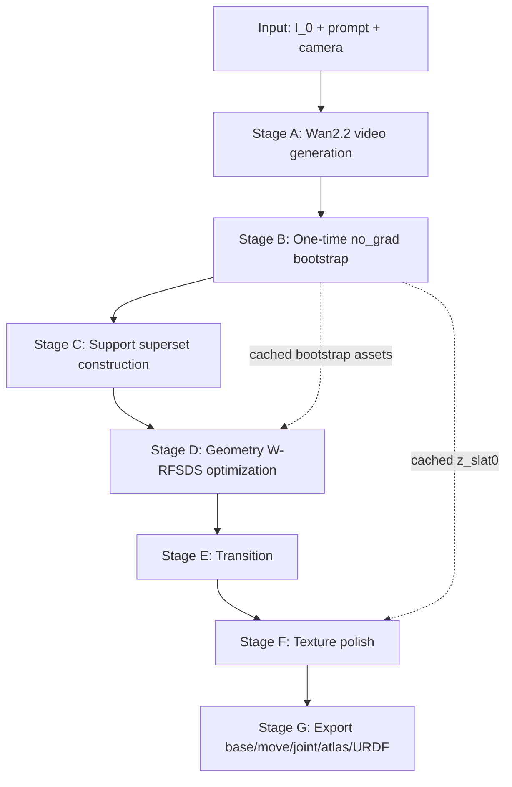
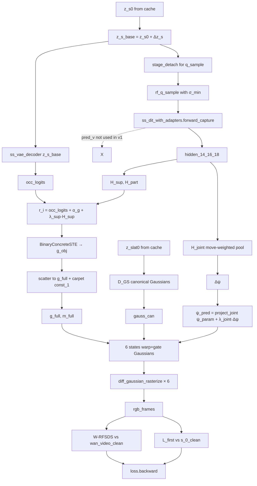

# CAST-U A'B v1 — Pipeline

> 工程实现规范文档。配合 `method_v1.md` 一起阅读。`method_v1.md` 回答"为什么这样建模"，`pipeline.md` 回答"工程上怎么跑通"。

---

## 0. 目录

1. 顶层数据流
2. 冻结与可学习模块
3. TRELLIS 关键工程约定
4. Stage A — Wan2.2 伪视频生成
5. Stage B — 一次性 Bootstrap
6. Stage C — Support Superset 构造
7. Stage D — Geometry W-RFSDS 优化（A'B 核心 inner loop）
8. Stage E — Transition
9. Stage F — Texture W-RFSDS
10. Stage G — Export
11. 推荐文件结构
12. 资源估算
13. Sanity Check 清单

---

## 1. 顶层数据流



### 1.1 各阶段输入 / 输出 / 优化变量 / 冻结

| Stage | 主要输入 | 主要输出 | 优化变量 | 冻结项 |
|---|---|---|---|---|
| A | `I_0, prompt` | `s_0..s_5` clean RGB frames | 无 | Wan2.2 |
| B | `s_0..s_5 + carpet` | `z_s0, z_slat0, dit_hidden_cache, O_init, M_attn_boot, U_object, U_carpet, ψ_0, φ_0, anchors_object` | 无 (no_grad) | TRELLIS, DINOv2 |
| C | bootstrap cache | `U = U_object ∪ U_carpet`, `is_carpet_mask` | 无 (一次性) | — |
| D | `U, bootstrap cache, wan_video_clean, s_0_clean, cond_can` | trained `Δz_s, α_g, α_m, ψ_param, delta_phi, adapter, H_*` | `Δz_s, α_g, α_m, ψ_param, delta_phi, adapter_{14,16,18}, H_sup, H_part, H_joint` | TRELLIS 全主干, Wan2.2 |
| E | Stage D 输出 | `U` 冻结 + sharpen gates | 同 D 但 lr 降到 0.1× | + U 不变 |
| F | Stage D/E 输出 + wan_video_clean | `Δz_slat, D_GS_LoRA, Δ A_uv, donor_weights, A_fused, provenance` | `Δz_slat, D_GS_LoRA, Δ A_uv, donor_weights` | 全部 Stage D 学的变量 |
| G | Stage D + F 输出 | `base.glb, move.glb, joint.json, atlas.png, object.urdf` | 无 | 全部 |

---

## 2. 冻结与可学习模块

### 2.1 全程冻结的主干

| 模块 | 路径 | 角色 |
|---|---|---|
| `ss_dit` | `trellis/models/sparse_structure_flow.py::SparseStructureFlowModel` | 单步 forward 拿 hidden，不调 sampler |
| `ss_vae_decoder` | `trellis/models/sparse_structure_vae.py` | dense occupancy logit 16³→64³ |
| `slat_dit` | `trellis/models/structured_latent_flow.py` | 只用于 Stage B no_grad init，inner loop 不调 |
| `d_gs` | `trellis/models/structured_latent_vae/decoder_gs.py` | Gaussian decoder，inner loop 每 iter 调一次 |
| `dinov2` | `torch.hub.load('facebookresearch/dinov2', 'dinov2_vitl14_reg')` | image cond 编码器 |
| `wan22_vae_encoder` | Wan-AI/Wan2.2-I2V-A14B | W-RFSDS 中 grad-enabled |
| `wan22_dit` | Wan-AI/Wan2.2-I2V-A14B | W-RFSDS 中 no_grad（teacher） |
| `wan22_video_generator` | full pipeline | 仅 Stage A 使用 |

启动后必须显式调：

```python
for module in [ss_dit, ss_vae_decoder, slat_dit, d_gs, dinov2, 
               wan22_vae_encoder, wan22_dit]:
    for p in module.parameters():
        p.requires_grad_(False)
    module.eval()
```

**严禁**用 `with torch.no_grad():` 包 `ss_dit.forward(...)`：那样 adapter 拿不到梯度（激活不保存）。`requires_grad_(False)` 不会阻止激活保存，只阻止权重更新。

### 2.2 可学习模块

**P1 Geometry**（Stage D / E）：

```
Δz_s                shape [1, 8, 16, 16, 16]    init zeros
α_g                 shape [|U_object|]          init logit(O_init clamp)
α_m                 shape [|U_object|]          init logit(M_attn_boot clamp)
ψ_param             shape [19]                  init encode_joint(ψ_0)
delta_phi           shape [5]                   init inverse_softplus(φ_0 increments)

adapter_14          SSAdapter                   output proj zero-init
adapter_16          SSAdapter                   output proj zero-init
adapter_18          SSAdapter                   output proj zero-init
H_sup               ZeroInitResidualHead        output proj zero-init
H_part              ZeroInitResidualHead        output proj zero-init
H_joint             ZeroInitJointResidualHead   output proj zero-init
```

**P2 Texture**（Stage F）：

```
Δz_slat             shape [|U|, 8]              init zeros
D_GS_LoRA           rank=8, alpha=16
Δ A_uv              atlas residual
donor_weights       per-texel confidence
```

---

## 3. TRELLIS 关键工程约定

这些是 TRELLIS 源码层面的硬约定，违反会导致训练失败或无声错误。

### 3.1 Timestep 缩放（× 1000）

`SS-DiT.forward` 内部的 `timestep_embedding` 期望 `t ∈ [0, 1000]` 范围（标准 sinusoidal embedding with `max_period=10000`）。flow timestep 是 `[0, 1]`，必须先 × 1000：

```python
# 正确 ✓
pred_v = ss_dit(x_t, 1000.0 * t, cond)

# 错误 ✗ — 模型会得到错误时间嵌入
pred_v = ss_dit(x_t, t, cond)
```

参考：`pipelines/samplers/flow_euler.py:38-42`、`trainers/flow_matching/flow_matching.py:167`。

### 3.2 q_sample 公式（含 σ_min）

```python
σ_min = 1e-5    # 从 trainers/flow_matching/flow_matching.py:62
ε = torch.randn_like(z_s_base)

# 正确 ✓ — TRELLIS 训练时的公式
z_t = (1 - t) * z_s_base + (σ_min + (1 - σ_min) * t) * ε

# 错误 ✗ — σ_min=0 的简化版，与训练分布失配
z_t = (1 - t) * z_s_base + t * ε
```

参考：`trainers/flow_matching/flow_matching.py:87` (`diffuse` 方法)。

### 3.3 pred_x0 公式（仅 ablation 用）

主版本**不解码 pred_x0**，仅作 ablation 的 residual mix。若启用：

```python
pred_x0 = (1 - σ_min) * z_t - (σ_min + (1 - σ_min) * t) * pred_v
```

参考：`pipelines/samplers/flow_euler.py:32-36` (`_v_to_xstart_eps`)。

### 3.4 Adapter 注入位置

`SparseStructureFlowModel.forward` 的 block loop 在 `sparse_structure_flow.py:191-192`：

```python
# 原版
for block in self.blocks:
    h = block(h, t_emb, cond)
```

改造为（subclass + override）：

```python
class SS_DiT_with_Adapters(SparseStructureFlowModel):
    def __init__(self, base, adapters):
        super().__init__(base.config)
        self.load_state_dict(base.state_dict())
        self.adapters = adapters  # nn.ModuleDict({"14": adapter_14, ...})
        self._captured = {}
    
    def forward_capture(self, x, t, cond):
        h = self.input_layer(x)
        h = h + self.pe                                  # APE
        t_emb = self.t_embedder(t)
        if self.share_mod:
            t_emb = self.adaLN_modulation(t_emb)
        h = h.type(self.dtype); t_emb = t_emb.type(self.dtype); cond = cond.type(self.dtype)
        
        for k, block in enumerate(self.blocks):
            h = block(h, t_emb, cond)
            if str(k) in self.adapters:
                h = h + self.adapters[str(k)](h)         # ★ post-block residual
                self._captured[k] = h                    # ★ post-adapter
        h = h.type(x.dtype)
        out = self.out_layer(h)
        return out, dict(self._captured)
```

**关键**：
- adapter 在 `block(...)` 输出后注入
- head 读取的 hidden 必须是 **post-adapter** 的（如果读 pre-adapter，adapter 对 head 无影响）

### 3.5 Sampler 绕开

完整 SS sampling 走 `FlowEulerGuidanceIntervalSampler.sample()`（`pipelines/samplers/flow_euler.py:79`），它带 `@torch.no_grad()` 装饰，且做 24 步 Euler 去噪。

A'B 主线**不调 sampler**，只调一次 `forward_capture`：

```python
# 一次性 Bootstrap 内（no_grad）调 sampler 一次：
with torch.no_grad():
    z_s_final = sampler.sample(ss_dit, noise, cond=cond_mixed).samples

# Inner loop 内（grad-enabled）只调一次 forward：
pred_v, captured = ss_dit_with_adapters.forward_capture(z_t, 1000*t_ss, cond_can)
```

### 3.6 SparseTensor.coords 不在 autograd

```python
sparse = SparseTensor(feats, coords)   # coords 是 int32 索引
```

参考：`modules/sparse/basic.py:70-77`。所以梯度不能"穿过 coords 调整体素位置"。所有可微优化必须经过 `feats` 或 Gaussian opacity / center。

### 3.7 D_GS 输入是 SparseTensor

```python
sparse_in = SparseTensor(feats=z_slat0_full, coords=U)    # 注意 feats 在 P1 是固定的 z_slat0
gauss = d_gs(sparse_in)
```

`gauss` 是 `Gaussian` 对象（`trellis/representations/gaussian/gaussian_model.py`），含 `_xyz`, `_scaling`, `_rotation`, `_opacity`, `_features_dc`。可微 grad 走 `feats`。

### 3.8 diff_gaussian_rasterization

```python
from diff_gaussian_rasterization import GaussianRasterizer
rast = GaussianRasterizer(raster_settings)
rendered, radii = rast(
    means3D = gauss._xyz,
    opacities = gauss._opacity,
    shs = gauss._features_dc,
    scales = gauss._scaling,
    rotations = gauss._rotation,
)
```

对所有输入 fully differentiable。Camera 固定（locked-off）。

---

## 4. Stage A — Wan2.2 伪视频生成

### 4.1 输入 / 输出

```
Input:
    s_0_clean   :  [3, H, W] uint8 RGB, 用户提供的真实输入图
    prompt      :  str
    camera_lock :  bool (recommend True)

Output:
    clean_video :  [6, 3, H, W] uint8 RGB
    s_0..s_5    :  从 video 抽 6 帧
```

注：`s_0_clean` 既作为 Wan2.2 输入也作为 Stage D 的 `L_first` 监督真值。`s_0..s_5` 中的 `s_0` 应当≈`s_0_clean`（Wan2.2 第 0 帧通常等于输入）。

### 4.2 Prompt 模板

**中文**：
> 一个固定机位、固定焦距、单镜头连续拍摄的视频。第一帧严格等于输入图片。相机完全静止，没有平移、旋转、推拉、变焦、视角变化。只有 `{part_name}` 发生缓慢、连续、刚性的开合运动，物体主体保持静止。材质、纹理、光照、背景保持一致。不要出现相机漂移、额外物体、非刚性形变、纹理闪烁、造型漂移或镜头切换。

**English**：
> A locked-off single-camera video. The first frame should match the input image as closely as possible. The camera is completely static: no pan, no tilt, no orbit, no dolly, no zoom, and no viewpoint change. Only the `{part_name}` performs a slow, rigid opening motion, while the main body remains stationary. Materials, texture, lighting, and background stay consistent. No extra objects, no non-rigid deformation, no shape drift, no flicker, no cuts.

### 4.3 采样规范

```python
seeds              = [s1, s2, s3, s4]      # 4 seeds, 后续筛选最稳的
n_frames_per_video = 81
inference_steps    = 50
guidance_scale     = 5.0
resolution         = 480P or 720P  (按输入比例)
```

### 4.4 多 seed 筛选

```python
candidates = [wan_i2v(s_0_clean, prompt, seed=s) for s in seeds]

def select_locked_camera(video):
    score = (
        background_stability(video) +
        bbox_scale_stability(video) +
        optical_flow_monotonicity(video)
    )
    return score

best_video = max(candidates, key=select_locked_camera)
```

### 4.5 抽帧

```python
frame_indices = np.round(np.linspace(0, 80, 6)).astype(int)   # [0, 16, 32, 48, 64, 80]
s_0..s_5 = best_video[frame_indices]                          # K=6 clean states
```

---

## 5. Stage B — 一次性 Bootstrap（no_grad）

### 5.1 输入 / 输出

```
Input:
    s_0..s_5 (clean)
    prompt

Output (cached to disk, ~200 MB / object):
    bootstrap/
      z_s0.pt                  [1, 8, 16, 16, 16]
      z_slat0.pt               [|U|, 8]
      dit_hidden_cache.pt      {14, 16, 18}: [1, 4096, 1024]   # diagnostic only
      O_init.npy               [1, 1, 64, 64, 64]
      M_attn_boot.npy          [|U|]
      is_carpet_mask.npy       [|U|] bool
      U_object.npy             [N_obj, 3]   int32
      U_carpet.npy             [N_carpet, 3] int32
      psi_0.json
      phi_0.npy                [6]
      anchors_object.npy       [N_a, 3]
```

### 5.2 步骤

```python
@torch.no_grad()
def stage_b_bootstrap(s_0..s_5, prompt):
    # 1) 加 carpet
    s_k_carpet = [add_grounding_disk(s_k) for s_k in [s_0..s_5]]
    
    # 2) Latent-space mixed input (SCAR Pass-1)
    z_k_latent = [encode_to_ss_vae_latent(s_k_carpet) for s_k_carpet in ...]
    z_k_mixed = [
        0.3 * z_0_latent + 0.4 * z_k_latent + 0.3 * z_5_latent
        for k in range(6)
    ]
    
    # 3) 跑 BMCSA-enabled SS-DiT sampler
    # - K=6 parallel batch
    # - 24 blocks 全部开 BMCSA (K/V cross-state averaging with M_base soft gate)
    # - Pass-1 SCAR symmetric mix at sampler steps 0..7
    # - Pass-2 SDEdit from t*=0.5
    # - forward_hook 截取 block 14/16/18 之后的 hidden
    z_final, dit_hidden_cache = run_bmcsa_ss_sampler(
        z_k_mixed,
        cond=[dinov2(s_k_carpet) for s_k_carpet in ...],
        capture_blocks=[14, 16, 18],
    )
    
    # 4) 合并 K state
    z_s0 = z_final.mean(dim=0, keepdim=True)
    
    # 5) Decode 到 64³ occupancy
    O_init = torch.sigmoid(ss_vae_decoder(z_s0))
    
    # 6) Cross-state cosine consistency 作 move prior
    M_attn_boot = compute_token_cosine_consistency(z_final)
    
    # 7) FreeArt3D plane fitting → carpet mask
    is_carpet_mask = freeart3d_detect_carpet_plane(O_init)
    
    # 8) SLAT bootstrap（一次性，no_grad）
    coords_init = active_voxels(O_init > 0.3)
    z_slat0 = run_slat_sampler(z_s0, coords_init, cond=dinov2(s_0_carpet))
    
    # 9) StageC joint init
    # partition (kmeans on M_attn) → P_base / P_move
    # BIC joint type voting → revolute or prismatic
    # swept volume carve / axis refine
    psi_0, phi_0, anchors_object = stage_c_joint_init(
        z_final, M_attn_boot, O_init
    )
    
    # 10) 构造 U_object, U_carpet
    U_object = construct_support_superset(
        O_init_no_carpet=O_init * (~is_carpet_mask),
        corridor=swept_volume_from(psi_0, phi_0),
        anchors=anchors_object,
        uncertain_shell=(O_init > 0.1) & (O_init < 0.3),
        dilate=1
    )
    U_carpet = active_voxels(is_carpet_mask)
    
    # 11) 全部 detach 写盘
    save_to_disk({
        'z_s0': z_s0.detach(),
        'z_slat0': z_slat0.detach(),
        'dit_hidden_cache': {k: v.detach() for k, v in dit_hidden_cache.items()},
        'O_init': O_init.detach().cpu().numpy(),
        'M_attn_boot': M_attn_boot.detach().cpu().numpy(),
        'is_carpet_mask': is_carpet_mask.cpu().numpy(),
        'U_object': U_object,
        'U_carpet': U_carpet,
        'psi_0': psi_0,
        'phi_0': phi_0,
        'anchors_object': anchors_object,
    })
```

### 5.3 Bootstrap 的角色定位

旧 BMCSA / StageC 路线**不是最终方法**，只作为 warm-start。它解决 Q1/Q2/Q3：
- Q1：carpet trick 修 TRELLIS 尺度偏移
- Q2：mixed input 修 base 不一致
- Q3：BMCSA cross-state K/V 平均修 s0/s5 voxel 尺度漂移

Q4/Q5（SS↔SLAT 梯度断、RFSDS 优化 SS 部件）由 Stage D 的 A'B 主体解决。

---

## 6. Stage C — Support Superset 构造

### 6.1 设计原则

`U_object` 必须**保守**：宁可包含多余 voxel（可被 g_i 推到 0），不可漏掉真实 voxel（不在 U 内的位置永远不被渲染，RFSDS 无入口救）。

### 6.2 构造公式

```python
ε_occ = 0.3
boundary_band = (O_init > 0.1) & (O_init < 0.3)
move_corridor = swept_volume(psi_0, phi_0, anchors_object)

raw_object_voxels = (
    coords(O_init * (~is_carpet_mask) > ε_occ)
    | coords(boundary_band * (~is_carpet_mask))
    | move_corridor
    | anchor_band(anchors_object, radius=2)
)

U_object = dilate(raw_object_voxels, radius=1)   # voxel-level 1-neighbor expansion
U_carpet = coords(is_carpet_mask)
U_full = U_object ∪ U_carpet
```

### 6.3 大小目标

```
|U_object|  : 10,000 - 30,000 voxel
              drawer 类     ≤ 15k
              cabinet/fridge ≤ 25k
              长抽屉/复杂柜  ≤ 30k

|U_carpet|  : 2,000 - 5,000 voxel
```

如果 `|U_object| > 30000`，说明 dilation 或 uncertain_shell 太宽，需要回头调 thresholds。

### 6.4 U 全程不变

**不做 outer-loop refresh**。所有几何 / 部件 / 关节优化都在 U 上通过可微 gate 完成。理由参考 `method_v1.md` §2.2 D4 与 §3.5。

---

## 7. Stage D — Geometry W-RFSDS 优化（A'B 核心）

### 7.1 单 iter 数据流



### 7.2 Inner loop 完整代码骨架

```python
@torch.enable_grad()
def stage_d_geometry(cfg, bootstrap, wan_video_clean, s_0_clean):
    # ----- 加载 bootstrap & 实例化可学参数 -----
    z_s0          = bootstrap.z_s0
    z_slat0       = bootstrap.z_slat0
    U_object      = bootstrap.U_object
    U_carpet      = bootstrap.U_carpet
    U_full        = concat(U_object, U_carpet)
    anchors_object = bootstrap.anchors_object
    
    Δz_s = nn.Parameter(torch.zeros_like(z_s0))
    
    # 关键：α_m 从 M_attn_boot 初始化，不能 zeros
    α_g = nn.Parameter(
        logit(bootstrap.O_init.flatten()[U_object_idx].clamp(1e-3, 1-1e-3))
    )
    α_m = nn.Parameter(
        logit(bootstrap.M_attn_boot[U_object_idx].clamp(1e-3, 1-1e-3))
    )
    
    ψ_param = nn.Parameter(encode_joint(bootstrap.psi_0))
    
    # 关键：delta_phi 从 BMCSA φ_0 增量反 softplus，不能 zeros
    phi_inc_0 = (bootstrap.phi_0[1:] - bootstrap.phi_0[:-1]).clamp_min(1e-4)
    delta_phi = nn.Parameter(inverse_softplus(phi_inc_0))
    
    # 关键：adapter / head 输出 proj 全部 zero-init
    adapters = nn.ModuleDict({
        '14': SSAdapter(dim=1024, zero_init_proj2=True),
        '16': SSAdapter(dim=1024, zero_init_proj2=True),
        '18': SSAdapter(dim=1024, zero_init_proj2=True),
    })
    H_sup   = ZeroInitResidualHead(in_dim=1024, out_dim=1)
    H_part  = ZeroInitResidualHead(in_dim=1024, out_dim=1)
    H_joint = ZeroInitJointResidualHead(in_dim=1024, out_dim=19)
    
    ss_dit_w = SS_DiT_with_Adapters(ss_dit, adapters)
    
    # 冻结 TRELLIS
    for m in [ss_dit, ss_vae_decoder, slat_dit, d_gs, dinov2,
              wan22_vae_encoder, wan22_dit]:
        for p in m.parameters(): p.requires_grad_(False)
        m.eval()
    
    # ----- Optimizer -----
    opt = torch.optim.AdamW([
        {'params': Δz_s,                  'lr': 1e-4},
        {'params': [α_g, α_m],            'lr': 5e-3},
        {'params': ψ_param,               'lr': 5e-3},
        {'params': delta_phi,             'lr': 1e-2},
        {'params': adapters.parameters(), 'lr': 1e-4},
        {'params': list(H_sup.parameters()) + list(H_part.parameters()),
                                          'lr': 5e-4},
        {'params': H_joint.parameters(),  'lr': 5e-4},
    ])
    
    cond_can = dinov2(s_0_carpet)
    psi_ema = ψ_param.detach().clone()
    
    # ----- Main loop -----
    for it in range(cfg.N_geom):
        phase = phase_of(it, cfg)
        t_ss  = sample_t_schedule(it, phase)
        λ_sup, λ_part, λ_joint = schedule_lambdas(it, phase)
        T_g, T_m = schedule_temperatures(it, phase)
        ε = torch.randn_like(z_s0)                          # K-state shared noise
        
        # ----- z_s_base + staged detach -----
        z_s_base = z_s0 + Δz_s
        z_for_q  = stage_detach(z_s_base, phase, mode="q_sample")
        
        # ----- RF q_sample (TRELLIS formula) -----
        σ_min = 1e-5
        z_t = (1 - t_ss) * z_for_q + (σ_min + (1 - σ_min) * t_ss) * ε
        
        # ----- One-step SS-DiT forward with adapters -----
        pred_v, captured = ss_dit_w.forward_capture(
            z_t,
            torch.tensor([1000.0 * t_ss]),                  # ★ × 1000
            cond_can,
        )
        hidden = combine_hidden(captured[14], captured[16], captured[18])
        
        # ----- 稳定几何底座 -----
        occ_logits = ss_vae_decoder(z_s_base)               # [1, 1, 64, 64, 64]
        
        # ----- Gate logits with α + head residual -----
        # 关键：α_g, α_m 必须真进 logits
        r = (
            occ_logits.reshape(-1)[U_object_idx]
            + α_g
            + λ_sup * H_sup(hidden, U_object)
        )
        b = α_m + λ_part * H_part(hidden, U_object)
        
        # ----- BinaryConcrete + STE -----
        g_obj = BinaryConcreteSTE(r, T_g)
        m_obj = BinaryConcreteSTE(b, T_m)
        
        # ----- 拼接 object + carpet -----
        g_full = scatter_with_carpet(g_obj, U_object, U_carpet, carpet_val=1.0)
        m_full = scatter_with_carpet(m_obj, U_object, U_carpet, carpet_val=0.0)
        
        # ----- Joint residual -----
        pooled = move_weighted_pool(hidden, m_obj, U_object)
        Δψ = H_joint(pooled)
        ψ_for_warp = stage_detach(ψ_param, phase, mode="joint", ema_buffer=psi_ema)
        ψ_pred = project_joint(ψ_for_warp + λ_joint * Δψ)
        
        # ----- φ from cumulative softplus -----
        phi_inc = F.softplus(delta_phi)
        phi = torch.cat([
            torch.zeros(1, device=phi_inc.device),
            torch.cumsum(phi_inc, dim=0)
        ])                                                   # [6]
        
        # ----- Canonical Gaussians (once per iter) -----
        sparse_in = SparseTensor(z_slat0, U_full)
        gauss_can = d_gs(sparse_in)                          # ★ outside K loop
        
        # ----- Analytic rollout + render K=6 -----
        rgb_frames = []
        for k in range(6):
            T_k = SE3_rollout(ψ_pred, phi[k])                # phi[0]=0 → identity
            
            base_gauss_k = gauss_can.clone()
            base_gauss_k._opacity *= (g_full * (1 - m_full)).unsqueeze(-1)
            
            move_gauss_k = warp_gaussians(gauss_can, T_k)
            move_gauss_k._opacity *= (g_full * m_full).unsqueeze(-1)
            
            gauss_k = merge_gaussians(base_gauss_k, move_gauss_k)
            rgb_k = diff_gaussian_rasterize(gauss_k, camera)
            rgb_frames.append(rgb_k)
        
        # ----- Losses (active <= 4 terms) -----
        loss = (
            cfg.λ_rfsds   * L_WRFSDS(rgb_frames, wan_video_clean, τ_high_mid, text_cond)
          + cfg.λ_first   * (l1_loss(rgb_frames[0], s_0_clean)
                             + lpips_loss(rgb_frames[0], s_0_clean))
          + cfg.λ_contact * L_contact_anchor(ψ_pred, anchors_object)
          + cfg.λ_gate    * gate_entropy_loss(torch.sigmoid(r), torch.sigmoid(b))
          + cfg.λ_z       * (Δz_s ** 2).mean()
        )
        
        opt.zero_grad()
        loss.backward()
        opt.step()
        
        # EMA update for ψ
        psi_ema.mul_(0.95).add_(0.05 * ψ_param.detach())
```

### 7.3 W-RFSDS 实现细节

```python
def L_WRFSDS(rgb_frames, wan_video_target, τ_range, text_cond):
    """
    rgb_frames:       List[Tensor]  6 frames, grad-enabled
    wan_video_target: Tensor        6 frames, fixed teacher
    τ_range:          Tuple         e.g. (0.6, 0.9) for P1
    """
    τ = sample_uniform(τ_range)
    
    # ★ Wan VAE encode MUST be grad-enabled (gradient flows back to rgb_frames)
    z_θ = wan22_vae_encoder(rgb_frames)
    
    # ★ Wan DiT no_grad (teacher)
    with torch.no_grad():
        ε = torch.randn_like(z_θ)
        z_τ = (1 - τ) * z_θ.detach() + τ * ε
        v_pred = wan22_dit(z_τ, τ, text_cond)
    
    # RFSDS residual
    residual = v_pred - (ε - z_θ.detach())
    w_τ = compute_w_rfsds_weight(τ)
    
    # SDS inner product form: gradient flows from z_θ back to rgb_frames
    loss = w_τ * (residual.detach() * z_θ).sum() / z_θ.numel()
    return loss
```

### 7.4 Schedule 函数

```python
def sample_t_schedule(it, phase):
    if phase.name == 'warmup_g0':    return 0.30
    if phase.name == 'main_g1':      return float(np.random.uniform(0.25, 0.55))
    if phase.name == 'transition':   return float(np.random.uniform(0.20, 0.40))
    if phase.name == 'texture':      return float(np.random.uniform(0.10, 0.40))


def schedule_lambdas(it, phase):
    f = it / phase.total_iter
    if f < 0.10:
        return 0.0, 0.0, 0.0
    elif f < 0.30:
        x = (f - 0.10) / 0.20
        return lerp(0, 0.1, x), lerp(0, 0.1, x), lerp(0, 0.5, x)
    elif f < 0.60:
        x = (f - 0.30) / 0.30
        return lerp(0.1, 0.3, x), lerp(0.1, 0.3, x), 0.5
    else:
        return 0.3, 0.3, 0.5


def schedule_temperatures(it, phase):
    if phase.name == 'warmup_g0':   return 1.5, 1.5
    if phase.name == 'main_g1':
        x = (it - phase.start) / (phase.end - phase.start)
        return cosine_anneal(1.5, 0.4, x), cosine_anneal(1.5, 0.4, x)
    if phase.name == 'transition':
        x = (it - phase.start) / (phase.end - phase.start)
        return cosine_anneal(0.4, 0.2, x), cosine_anneal(0.4, 0.2, x)
    if phase.name == 'texture':      return 0.15, 0.15


def stage_detach(tensor, phase, mode, ema_buffer=None):
    f = phase.iter / phase.total
    if f < 0.05:
        return tensor.detach()
    elif f < 0.15:
        if mode == "joint":
            # EMA branch
            ema_buffer.mul_(0.95).add_(0.05 * tensor.detach())
            return ema_buffer.clone()
        else:
            # mixing for z_s_base
            ρ = (f - 0.05) / 0.10
            return tensor.detach() + ρ * (tensor - tensor.detach())
    else:
        return tensor
```

---

## 8. Stage E — Transition (60–75%)

冻结 U（一直就是冻结的，本阶段确保 hard gate 与 U_object 对齐）。
gate 温度退到 `T_g = T_m = 0.2`（接近 hard）。
准备 P2：`Δz_slat = zeros_like(z_slat0)`，启动 coarse donor 估计。
此阶段仍跑 Stage D 的 loss，但 lr 降到 `0.1×`，让所有参数稳定锁定。

---

## 9. Stage F — Texture W-RFSDS (75–100%)

### 9.1 冻结 / 可学

```
Freeze (all Stage D learnable):
    Δz_s, α_g, α_m, ψ_param, delta_phi,
    adapter_{14,16,18}, H_sup, H_part, H_joint

Learnable:
    Δz_slat
    D_GS_LoRA (rank=8)
    Δ A_uv
    donor_weights
```

### 9.2 Donor collection

```python
for canonical_point p in canonical_surface_points:
    for k in 0..5:
        if is_move_part(p):
            p_k = T_k @ p
        else:
            p_k = p
        u_k = project_to_camera(p_k, camera)
        
        if visible(p_k, camera, k):
            vis_k   = compute_visibility(p_k, k)
            angle_k = view_angle_cos(p_k, camera, k)
            depth_k = depth_consistency(p_k, k)
            blur_k  = frame_blur_score(s_k, u_k)
            
            α_k = vis_k * exp(-β1·angle_k² - β2·depth_k - β3·blur_k)
            donor_k = sample(s_k_clean, u_k)
    
    A_fused(p) = Σ_k α_k · donor_k / (Σ_k α_k + ε)
    
    provenance(p) = classify_source_type(α_0..α_5, geom_completed)
```

### 9.3 Texture losses

```python
L_tex = (
    cfg.λ_rfsds_low · L_WRFSDS(rgb_frames, wan_video_clean, τ=(0.1, 0.4), text_cond)
  + cfg.λ_donor    · L_donor_consistency(rgb_frames_at_visible, A_fused)
  + cfg.λ_seam     · L_uv_seam(A_fused)
  + cfg.λ_first    · L_first_frame_rgb_anchor(rgb_frames[0], s_0_clean)
  + cfg.λ_unseen   · L_unseen_smooth_prior(A_fused, provenance)
)
```

注：`rgb_frames` 仍由 Stage D 的渲染链产生，但 Stage D 的可学参数已冻结，只有 `Δz_slat, LoRA, Δ A_uv` 会被更新。

---

## 10. Stage G — Export

### 10.1 硬阈值

```python
g_obj_hard = (torch.sigmoid(
    occ_logits[U_object_idx] + α_g + λ_sup * H_sup_final
) > 0.5)
m_obj_hard = (torch.sigmoid(α_m + λ_part * H_part_final) > 0.5)

base_voxels = U_object[g_obj_hard & ~m_obj_hard]
move_voxels = U_object[g_obj_hard &  m_obj_hard]
# U_carpet 不参与导出
```

### 10.2 Mesh + atlas

```python
z_slat_final = z_slat0 + Δz_slat_final

# 两个独立子网格各自提
sparse_base = SparseTensor(z_slat_final, base_voxels)
sparse_move = SparseTensor(z_slat_final, move_voxels)

mesh_base = d_mesh(sparse_base)      # via FlexiCubes decoder
mesh_move = d_mesh(sparse_move)

base_atlas = uv_unwrap_and_bake(mesh_base, A_fused, provenance)
move_atlas = uv_unwrap_and_bake(mesh_move, A_fused, provenance)
```

### 10.3 Joint + URDF

```python
ψ_hard = harden_joint(ψ_pred_final)

joint_json = {
    "type":        ψ_hard.type,             # "revolute" or "prismatic"
    "origin":      ψ_hard.origin.tolist(),
    "axis":        ψ_hard.axis.tolist(),
    "limit_lower": 0.0,
    "limit_upper": float(phi[5]),
    "states":      phi.tolist(),
    "confidence":  ψ_hard.confidence,
}

urdf_xml = build_urdf(
    base="base.glb",
    move="move.glb",
    joint=joint_json,
)
```

### 10.4 Texture provenance 报告

```python
texture_provenance = {
    "visible_in_s0_ratio":       count_of('visible_in_s0') / total,
    "visible_in_open_ratio":     count_of('visible_in_open') / total,
    "multi_state_fused_ratio":   count_of('multi_state_fused') / total,
    "low_conf_completion_ratio": count_of('low_conf_completion') / total,
    "unobserved_ratio":          count_of('unobserved') / total,
}
```

---

## 11. 推荐文件结构

```
cast_u_v1/
├── configs/
│   └── v1.yaml                           # 主超参数
├── pipelines/
│   ├── stage_a_wan.py
│   ├── stage_b_bootstrap.py              # BMCSA + StageC + cache write
│   ├── stage_c_support.py
│   ├── stage_d_geometry.py               # ★ A'B core inner loop
│   ├── stage_e_transition.py
│   ├── stage_f_texture.py
│   └── stage_g_export.py
├── modules/
│   ├── ss_adapter.py                     # SSAdapter (zero output proj)
│   ├── heads.py                          # H_sup, H_part, H_joint (zero-init)
│   ├── binary_concrete.py                # BinaryConcreteSTE
│   ├── analytic_se3.py                   # SE3_rollout + project_joint
│   ├── gaussian_warp.py                  # warp_gaussians for K states
│   ├── stage_detach.py                   # staged detach for z_s & ψ
│   └── ss_dit_with_adapters.py           # SparseStructureFlowModel subclass
├── losses/
│   ├── w_rfsds.py                        # high-mid & low τ versions
│   ├── first_frame.py
│   ├── contact_anchor.py
│   ├── gate_entropy.py
│   └── donor_consistency.py
├── representations/
│   ├── canonical_asset.py                # B, M, gauss_can wrapper
│   └── joint_param.py                    # encode/decode/project
├── trellis_vendor/                       # frozen TRELLIS (vendored)
├── wan_vendor/                           # frozen Wan2.2 wrapper
├── bootstrap_cache/                      # per-object cache
│   └── {object_id}/
│       ├── z_s0.pt
│       ├── z_slat0.pt
│       ├── dit_hidden_cache.pt
│       ├── O_init.npy
│       ├── M_attn_boot.npy
│       ├── is_carpet_mask.npy
│       ├── U_object.npy
│       ├── U_carpet.npy
│       ├── psi_0.json
│       ├── phi_0.npy
│       └── anchors_object.npy
├── outputs/
│   └── {object_id}/
│       ├── base.glb
│       ├── move.glb
│       ├── joint.json
│       ├── atlas.png
│       ├── atlas_confidence.png
│       ├── texture_provenance.json
│       ├── object.urdf
│       ├── optimized_video.mp4
│       └── diagnostics/
├── train.py
├── infer.py
└── eval.py
```

---

## 12. 资源估算

H800 80GB / A100 80GB 单卡，per-instance optimization：

| 阶段 | 耗时 | 显存峰值 | 备注 |
|---|---|---|---|
| Stage A (Wan2.2 video) | 10–15 min | ~50 GB | 4 seeds × 81 frames × 50 steps |
| Stage B (Bootstrap) | 5–15 min | ~30 GB | 含 SLAT sampler |
| Stage D (Geometry, ~1500 iter) | 1–2 h | ~40 GB | 含 W-RFSDS |
| Stage E (Transition, ~300 iter) | 15–30 min | ~40 GB | lr × 0.1 |
| Stage F (Texture, ~1000 iter) | 30–60 min | ~35 GB | 低 τ W-RFSDS |
| Stage G (Export) | 1–5 min | ~10 GB | mesh + UV + URDF |
| **Total** | **~3–4 h** | — | 单对象 |

显存节约措施（实现时必须做）：
- SS-DiT one-step forward 用 `torch.utils.checkpoint`（24 block × adapter）
- adapter / head bf16，grad fp32
- D_GS 输出 Gaussian count cap 在 50k 上限
- Wan2.2 VAE encode bf16
- ε 在 K 状态间共享，节约 noise tensor 显存

---

## 13. Sanity Check 清单

实现完成后逐项验证。**任一项失败都意味着方法不正确或不会收敛**。

### 13.1 静态结构验证

```
✓ ss_dit.forward 没被 torch.no_grad 包裹
✓ ss_dit / ss_vae / slat_dit / d_gs / dinov2 / wan22_dit / wan22_vae 全部 requires_grad_(False)
✓ adapter / head / 显式 Parameter 全部 requires_grad_(True)
✓ adapter / head / H_joint 的 output projection 全部 zero-init（forward step 0 时 ≡ 0）
```

### 13.2 TRELLIS 约定验证

```
✓ ss_dit forward 调用时 timestep 传入 1000 * t (不是 t)
✓ q_sample 用 (1-t)*z + (σ_min + (1-σ_min)*t)*ε 公式 (σ_min=1e-5)
✓ pred_x0 不参与主版本 decoder; 主版本走 ss_vae_decoder(z_s_base)
✓ adapter 在 block.forward 输出后注入 (post-block residual)
✓ head 读取的 hidden 是 post-adapter 而非 pre-adapter
✓ SparseTensor.coords 不参与梯度计算
```

### 13.3 可学参数验证

```
✓ α_g, α_m 真正出现在 r_i, b_i logit 计算式中（grep 代码确认）
✓ α_m 初始化是 logit(M_attn_boot) 不是 zeros
✓ α_g 初始化是 logit(O_init) 不是 zeros
✓ delta_phi 初始化是 inverse_softplus(φ_0 increments) 不是 zeros
✓ ψ_pred = project_joint(ψ_param + λ_joint·Δψ); ψ_param 不被 H_joint 输出覆盖
✓ phi = cat([0, cumsum(softplus(delta_phi))]); 长度 6 (含 phi_0=0)
```

### 13.4 训练步结构验证

```
✓ D_GS 在 k=0..5 循环外调用一次, K 次仅 warp_gaussians
✓ SLAT-DiT 不出现在 inner loop (geometry phase)
✓ ε 在 K 状态间共享, 每 iter 重新采样
✓ stage_detach 在 0-5% / 5-15% / 15%+ 正确切换 (Δz_s 和 ψ_param 各一份)
✓ gate 施加位置是 D_GS 输出 Gaussian opacity, 不是 SLAT input feats
✓ gate_entropy_loss 用 sigmoid(r), sigmoid(b) 软值; 不能用 hard 值
```

### 13.5 carpet 隔离验证

```
✓ carpet voxels 没有可学 α_g, α_m
✓ contact_anchor 仅在 U_object 上计算
✓ joint loss 仅在 U_object 上计算
✓ Stage G 导出时 U_carpet 不进 base/move voxel set
✓ 渲染时 carpet voxel 提供尺度锚 (g=1, m=0, 永不 warp)
```

### 13.6 W-RFSDS 梯度验证

```
✓ wan22_vae_encoder 调用在 grad 上下文 (不在 no_grad 内)
✓ wan22_dit 调用在 torch.no_grad 内
✓ residual = v_pred - (ε - z_θ.detach()), 在 no_grad 后 detach
✓ 内积形式: (residual.detach() * z_θ).sum() 让梯度从 z_θ 流回 rgb_frames
✓ τ 在 P1 采自 [0.6, 0.9], P2 采自 [0.1, 0.4]
```

### 13.7 梯度流验证（一次 dry run）

实现完后跑一次 dummy forward + backward，检查：
```
✓ Δz_s.grad is not None
✓ α_g.grad is not None
✓ α_m.grad is not None
✓ ψ_param.grad is not None
✓ delta_phi.grad is not None
✓ adapter_14/16/18.params.grad is not None
✓ H_sup/H_part/H_joint.params.grad is not None
✓ ss_dit / ss_vae_decoder / d_gs / slat_dit 全部参数 .grad is None (或 0)
✓ wan22 全部参数 .grad is None
```

---

## 总结

本 pipeline 描述从单图 + prompt 出发的端到端 per-instance optimization 流程：通过 Wan2.2 生成伪开合视频、通过 BMCSA 一次性 bootstrap 出 canonical 初始资产、然后通过 A'B 主线（grad-enabled one-step SS-DiT structural refiner + W-RFSDS）做几何 / 部件 / 关节联合优化，最后通过 canonical SLAT donor fusion 完成纹理 polish 并导出 URDF。

整条 pipeline 严格遵循 TRELLIS 的 RF / timestep / σ_min / SparseTensor.coords 约定，所有梯度路径均经过 file:line 级别的源码核验。`carpet` 作为 fixed scaffold 提供尺度锚但不进 object 优化主线。所有离散决策通过 BinaryConcrete + STE 在 D_GS 输出 Gaussian opacity 端硬化，避免 SLAT 输入端被 ResBlock 卷积模糊。

