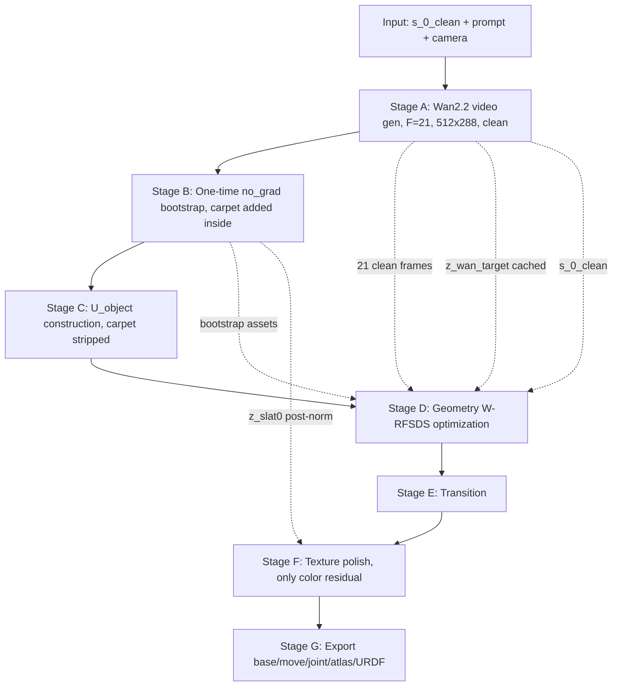
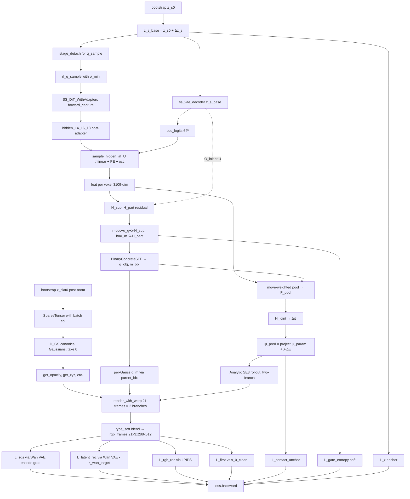

# CAST-U A'B v2 — Pipeline

> 工程实现规范文档。配合 `method_v2.md` 一起阅读。
>
> **本版与 v1 的差异**：所有 GPT 验证的 16 处接口 bug 已修，所有声明均经过 TRELLIS 与 Wan2.2 源码 `file:line` 级别核验。F=21、分辨率 512×288 已定，BMCSA mixed input 改为"sampling-time SCAR latent mix"（不是 image encode）。

---

## 0. 目录

1. 顶层数据流
2. 冻结与可学习模块
3. TRELLIS 关键工程约定（含源码 file:line 证据）
4. Wan2.2 关键工程约定
5. Stage A — Wan2.2 视频生成（F=21, 512×288）
6. Stage B — 一次性 Bootstrap（含 z_wan_target 缓存）
7. Stage C — Support Superset 构造
8. Stage D — Geometry W-RFSDS 优化（A'B inner loop）
9. Stage E — Transition
10. Stage F — Texture（只学 color residual）
11. Stage G — Export
12. 推荐文件结构
13. 资源估算（F=21, 512×288）
14. Sanity Check 清单

---

## 1. 顶层数据流



---

## 2. 冻结与可学习模块

### 2.1 全程冻结

| 模块 | 路径 |
|---|---|
| `ss_dit` | `trellis/models/sparse_structure_flow.py::SparseStructureFlowModel` |
| `ss_vae_decoder` | `trellis/models/sparse_structure_vae.py::SparseStructureDecoder` |
| `slat_dit` | `trellis/models/structured_latent_flow.py::SLatFlowModel` (仅 Stage B no_grad init 用) |
| `d_gs` | `trellis/models/structured_latent_vae/decoder_gs.py::SLatGaussianDecoder` |
| `dinov2` | `torch.hub.load('facebookresearch/dinov2', 'dinov2_vitl14_reg')` |
| `wan22_vae` | `Wan-AI/Wan2.2-I2V-A14B::WanVAE_` |
| `wan22_dit` | `Wan-AI/Wan2.2-I2V-A14B::WanModel` |
| `wan22_i2v_pipeline` | `Wan-AI/Wan2.2-I2V-A14B::WanI2V` (仅 Stage A 用) |

启动后必须：

```python
for module in [ss_dit, ss_vae_decoder, slat_dit, d_gs, dinov2,
               wan22_vae, wan22_dit]:
    for p in module.parameters():
        p.requires_grad_(False)
    module.eval()
```

**严禁** `with torch.no_grad():` 包 `ss_dit.forward(...)`：adapter 拿不到梯度。`requires_grad_(False)` 不会阻止激活保存，只阻止权重更新。

### 2.2 可学习模块

**P1 Geometry**：

```
Δz_s                shape [1, 8, 16, 16, 16]    init zeros
α_g                 shape [N_obj]               init zeros (★ residual to occ_logits)
α_m                 shape [N_obj]               init logit(M_attn_boot.clamp(0.05, 0.95))
ψ_param             shape [19]                  init encode_joint(ψ_0)
delta_phi           shape [5]                   init inverse_softplus(φ_0 increments)

adapter_14, _16, _18            SSAdapter         output proj zero-init
H_sup, H_part                   ZeroInitResHead   in_dim=3109, hidden=512, out=1
H_joint                         ZeroInitJointHead in_dim=3109, hidden=512, out=19
```

**P2 Texture**（**几何全部冻结**）：

```
Δ_features_dc       shape [N_gauss, 1, 3]       init zeros
donor_weights       shape [N_texel, K=6]        init from visibility heuristic
```

P2 **不学** `Δz_slat`、不开 `D_GS LoRA`：避免改 geometry channels。

---

## 3. TRELLIS 关键工程约定（含源码 file:line 证据）

### 3.1 Timestep 必须 ×1000

```python
# 正确 ✓
pred_v = ss_dit(x_t, 1000.0 * t, cond)
```

证据：`pipelines/samplers/flow_euler.py:38-42`：
```python
t = torch.tensor([1000 * t] * x_t.shape[0], ...)
return model(x_t, t, cond, **kwargs)
```
训练侧同：`trainers/flow_matching/flow_matching.py:167` `denoiser(x_t, t * 1000, cond)`

### 3.2 q_sample 公式含 σ_min

```python
σ_min = 1e-5    # trainers/flow_matching/flow_matching.py:62
z_t = (1 - t) * z_s_base + (σ_min + (1 - σ_min) * t) * ε
```

证据：`flow_matching.py:87`：
```python
x_t = (1 - t) * x_0 + (self.sigma_min + (1 - self.sigma_min) * t) * noise
```

### 3.3 pred_x0 公式（**仅 ablation 用，主版本不解码**）

```python
pred_x0 = (1 - σ_min) * z_t - (σ_min + (1 - σ_min) * t) * pred_v
```

证据：`flow_euler.py:32-36` (`_v_to_xstart_eps`)。

主版本：`occ_logits = ss_vae_decoder(z_s_base)`，不走 pred_x0。

### 3.4 SS-DiT Adapter 注入 — composition wrapper（**不 subclass**）

```python
class SS_DiT_WithAdapters(nn.Module):
    """Composition, NOT subclass."""
    def __init__(self, base_ss_dit, adapters):
        super().__init__()
        self.base = base_ss_dit                # 持有引用，不复制
        self.adapters = nn.ModuleDict(adapters)
        for p in self.base.parameters():
            p.requires_grad_(False)
    
    def forward_capture(self, x, t_raw, cond):
        t_model = torch.tensor([1000.0 * t_raw], device=x.device, dtype=torch.float32)
        
        # 手动复刻 base.forward 的 block loop
        h = self.base.input_layer(x.view(1, 8, -1).permute(0, 2, 1))
        h = h + self.base.pos_emb[None]
        t_emb = self.base.t_embedder(t_model)
        if self.base.share_mod:
            t_emb = self.base.adaLN_modulation(t_emb)
        h, t_emb, cond = h.type(self.base.dtype), t_emb.type(self.base.dtype), cond.type(self.base.dtype)
        
        captured = {}
        for k, block in enumerate(self.base.blocks):
            h = block(h, t_emb, cond)
            if str(k) in self.adapters:
                h = h + self.adapters[str(k)](h)    # ★ post-block residual
                captured[k] = h                     # ★ post-adapter
        
        h = h.type(x.dtype)
        pred_v = self.base.out_layer(h)
        return pred_v, captured
```

**不要 subclass SparseStructureFlowModel**：
- `super().__init__(base.config)` 不存在（model 无 `self.config` 属性，且 `__init__` 需要 6 个必填参数）
- subclass 会复制权重，`requires_grad_(False)` 原始 ss_dit 不会 freeze wrapper

证据：`sparse_structure_flow.py:56-74` 的 `__init__` 签名。

### 3.5 Sampler 绕开

```python
# Stage B 内 (no_grad):
with torch.no_grad():
    z_s_final = sampler.sample(ss_dit, noise, cond=cond_mixed).samples

# Stage D inner loop (grad-enabled):
pred_v, captured = ss_dit_w.forward_capture(z_t, t_ss, cond_can)
```

证据：`pipelines/samplers/flow_euler.py:49,79,126,166` 全部带 `@torch.no_grad()`；`sparse_structure_flow.py:176` 的 `forward` **没有** `@torch.no_grad`。

### 3.6 SparseTensor coords 必须 [N, 4]，第 0 列为 batch index

```python
# 正确 ✓
batch_col = torch.zeros(N_obj, 1, dtype=torch.int32, device=device)
coords_4 = torch.cat([batch_col, U_object_xyz.int()], dim=-1)    # [N_obj, 4]
sparse = SparseTensor(feats=z_slat0, coords=coords_4)

# 错误 ✗ — [N, 3] 直接传
sparse = SparseTensor(feats=z_slat0, coords=U_object_xyz)
```

证据：`modules/sparse/basic.py:107-127` `coords[:, 0]` 作 batch index；`trellis_image_to_3d.py:191` 用 `argwhere(...)[:,[0,2,3,4]]` 构造 4 列 coords。

### 3.7 D_GS 返回 `List[Gaussian]`，取 `[0]`

```python
gauss_list = d_gs(sparse_in)        # List[Gaussian]
gauss_can = gauss_list[0]            # batch=1, 取第 0 个
# Gaussian 类没有 .clone() 方法 — 不要 gauss_can.clone()
```

证据：`decoder_gs.py:118` `forward(...) -> List[Gaussian]`；`gaussian_model.py` 全文 grep 无 `def clone`。

### 3.8 Gaussian opacity gating — 用 `get_opacity` 不改 `_opacity`

```python
# 正确 ✓
opacity_canon = gauss_can.get_opacity                # sigmoid(_opacity + opacity_bias)
opacity_base = opacity_canon * g_per_gauss * (1 - m_per_gauss)
opacity_move = opacity_canon * g_per_gauss * m_per_gauss
# 直接传给 rasterizer

# 错误 ✗ — gauss_can._opacity 是 pre-sigmoid logit
gauss_can._opacity *= g_per_gauss
```

证据：`gaussian_model.py:60-69` `opacity_bias = inverse_sigmoid(...)`；`gaussian_model.py:90-92` `get_opacity = sigmoid(_opacity + opacity_bias)`；`renderers/gaussian_render.py:104` `opacity = pc.get_opacity`。

### 3.9 SLAT latent 必须 post-norm cache

```python
# 正确 ✓ — cache decoder 期望的输入分布
with torch.no_grad():
    z_slat_raw = slat_sampler.sample(...).samples
    z_slat0 = z_slat_raw * slat_std + slat_mean       # apply post-normalization
cache["z_slat0"] = z_slat0    # 命名建议加 _post 后缀避免混淆

# Inner loop 直接用，不再做 *std+mean
sparse_in = SparseTensor(feats=cache["z_slat0"], coords=U_object_with_batch)
gauss_can = d_gs(sparse_in)[0]
```

证据：`trellis_image_to_3d.py:248-250`：
```python
std = torch.tensor(self.slat_normalization['std'])[None].to(slat.device)
mean = torch.tensor(self.slat_normalization['mean'])[None].to(slat.device)
slat = slat * std + mean
```

### 3.10 SS-DiT hidden grid 是 16³（patch_size=1）

证据：`configs/generation/ss_flow_img_dit_L_16l8_fp16.json:14` `"patch_size": 1`。

**不要硬编码 16**。runtime 读：

```python
grid_res = round(hidden_14.shape[1] ** (1/3))    # 推导自 token count
```

### 3.11 Hidden → U 坐标映射 — trilinear + PE + occ_logits

```python
def sample_hidden_at_U(hidden_14, hidden_16, hidden_18, U_xyz, occ_logits):
    grid_res = round(hidden_14.shape[1] ** (1/3))    # = 16
    coord_norm = (U_xyz.float() / 63.0) * 2.0 - 1.0   # [N, 3] in [-1, 1]
    
    sampled = []
    for h in [hidden_14, hidden_16, hidden_18]:
        h_grid = h.view(1, 1024, grid_res, grid_res, grid_res)
        f = F.grid_sample(
            h_grid,
            coord_norm.view(1, -1, 1, 1, 3),
            mode='bilinear',          # 5D bilinear = trilinear
            align_corners=True,
            padding_mode='border',
        ).squeeze(-1).squeeze(-1).squeeze(0).permute(1, 0)    # [N, 1024]
        sampled.append(f)
    
    pe = fourier_pe(U_xyz.float() / 63.0, num_freqs=6)        # [N, 36]
    
    U_flat_idx = U_xyz[:, 0] * 64 * 64 + U_xyz[:, 1] * 64 + U_xyz[:, 2]
    occ_per_voxel = occ_logits.view(-1)[U_flat_idx].unsqueeze(-1)    # [N, 1]
    
    return torch.cat([*sampled, pe, occ_per_voxel], dim=-1)    # [N, 3·1024 + 36 + 1 = 3109]
```

---

## 4. Wan2.2 关键工程约定

### 4.1 Frame count constraint: F % 4 == 1

证据：`wan/image2video.py:295` mask reshape 要求 `(F+3) % 4 == 0`：
```python
msk = torch.concat([
    torch.repeat_interleave(msk[:, 0:1], repeats=4, dim=1), msk[:, 1:]
], dim=1)
msk = msk.view(1, msk.shape[1] // 4, 4, lat_h, lat_w)     # ★ silent shape contract
```

**我们用 F=21** = 4·5+1 → 6 个 latent frames（满足 K=6 articulation states 需求）。

### 4.2 VAE 时间下采 = 4

证据：`wan/configs/wan_i2v_A14B.py:17` `vae_stride = (4, 8, 8)`。

Latent frame 公式：`n_latent = (F - 1) // 4 + 1`。F=21 → 6 latent frames。

### 4.3 Wan VAE encoder 必须 grad-enabled（W-RFSDS）

```python
# 正确 ✓
z_θ = wan22_vae_encoder(rgb_frames)        # grad flows back to rgb_frames

# 错误 ✗ — wraping with no_grad kills SDS gradient flow
with torch.no_grad():
    z_θ = wan22_vae_encoder(rgb_frames)
```

注：CHORD 论文 §D Limitation 承认这一点："a substantial portion of the runtime is spent backpropagating through the VAE"。可用 `torch.utils.checkpoint` 控显存。

### 4.4 Wan22 DiT 全程 no_grad（teacher）

```python
with torch.no_grad():
    v_pred = wan22_dit(z_τ, τ, text_cond, image_cond)
```

证据：CHORD §B "we omit the term that backpropagates through the RF model"。

### 4.5 默认分辨率 832×464，我们降到 512×288

证据：CHORD §A.1 line 774 "All training is conducted at a resolution of 832 × 464 (the default for Wan 2.2)"。

我们走 **512 × 288**：保持 ~16:9 比例，节约 ~3.6× VAE 显存（`H·W` 比 `832·464`）。Wan2.2 接受任意分辨率（只是 832×464 是 model card 默认）。

---

## 5. Stage A — Wan2.2 视频生成

### 5.1 输入 / 输出

```
Input:
    s_0_clean        : [3, H, W] uint8 RGB, 用户提供的真实输入图
    prompt           : str
    camera_locked    : bool = True

Output:
    s_0_clean..s_20_clean   : 21 RGB frames at 512×288 (clean, NO carpet)
```

### 5.2 Wan2.2 调用参数

```python
output = wan22_i2v_pipeline(
    image       = s_0_clean,
    prompt      = prompt,            # e.g., "open the drawer slowly..."
    n_frames    = 21,                # ★ F=21 = 4·5+1
    resolution  = (288, 512),        # H, W
    seeds       = [s1, s2, s3, s4],  # 4 seeds for filtering
    steps       = 50,
    guidance    = 5.0,
)
```

### 5.3 Prompt 模板

**中文**：
> 一个固定机位、固定焦距、单镜头连续拍摄的视频。第一帧严格等于输入图片。相机完全静止，没有平移、旋转、推拉、变焦、视角变化。只有 `{part_name}` 发生缓慢、连续、刚性的开合运动，物体主体保持静止。材质、纹理、光照、背景保持一致。不要出现相机漂移、额外物体、非刚性形变、纹理闪烁、造型漂移或镜头切换。

**English**：
> A locked-off single-camera video. The first frame matches the input image. The camera is completely static. Only `{part_name}` performs a slow, rigid opening motion. Materials, textures, lighting, and background stay consistent.

### 5.4 多 seed 筛选

```python
candidates = [wan_i2v(s_0_clean, prompt, F=21, res=(288,512), seed=s) for s in seeds]

def score(video):
    return (
        background_stability(video)
        + bbox_scale_stability(video)
        + optical_flow_monotonicity(video)
    )

best = max(candidates, key=score)
s_0..s_20 = best   # 21 frames clean
```

---

## 6. Stage B — 一次性 Bootstrap

完整 `torch.no_grad()`。输出 `method_v2.md §4.2` 列出的所有资产。

### 6.1 输入

```
s_0_clean..s_20_clean      # 21 clean frames from Stage A
prompt                      # for text cond
```

### 6.2 输出（cached to disk）

```
bootstrap/
  z_s0.pt                  [1, 8, 16, 16, 16]              float32
  z_slat0.pt               [N_obj, 8]   post-norm           float32
  dit_hidden_cache.pt      {14, 16, 18}: [1, 4096, 1024]   diagnostic only
  O_init.npy               [1, 1, 64, 64, 64]
  M_attn_boot.npy          [N_obj]
  is_carpet_mask.npy       [N_full] bool
  U_object.npy             [N_obj, 3]    int32             ★ 已去掉 carpet
  psi_0.json
  phi_0.npy                [6]
  anchors_object.npy       [N_a, 3]
  gaussian_parent_idx.npy  [N_gauss]                       ★ N_obj·32 → N_obj 映射
  z_wan_target.pt          [1, C_lat, 6, h_lat, w_lat]    ★ Wan VAE-encoded clean video
```

### 6.3 步骤

```python
@torch.no_grad()
def stage_b_bootstrap(s_0_clean..s_20_clean, prompt):
    # 1) 从 21 帧抽 6 个 BMCSA state（均匀）
    state_indices = [0, 4, 8, 12, 16, 20]
    s_clean_6 = [s_clean[i] for i in state_indices]
    
    # 2) 加 carpet（仅用于 BMCSA TRELLIS 输入）
    s_carpet_6 = [add_grounding_disk(s) for s in s_clean_6]
    
    # 3) DINOv2 cond per state
    cond_k = [dinov2(s_k_carpet) for s_k_carpet in s_carpet_6]   # K=6 conds
    
    # 4) K=6 parallel SS sampler with SCAR + BMCSA
    # - Init: K parallel noise tracks z_t = randn([K, 8, 16, 16, 16])
    # - Pass 1 (steps 0..7):
    #     after each sampler step:
    #         for k in 1..4:
    #             z_t[k] ← 0.3*z_t[0] + 0.4*z_t[k] + 0.3*z_t[5]
    # - Pass 2 (steps 8..24):
    #     enable BMCSA on all 24 blocks (K/V across-batch averaging)
    #     no SCAR mix
    # - forward_hook capture hidden at blocks 14, 16, 18
    z_final, dit_hidden_cache = run_bmcsa_ss_sampler(
        cond_k, capture_blocks=[14, 16, 18]
    )
    
    # 5) 合并 K state
    z_s0 = z_final.mean(dim=0, keepdim=True)
    
    # 6) Decode dense occupancy
    O_init = torch.sigmoid(ss_vae_decoder(z_s0))      # [1, 1, 64, 64, 64]
    
    # 7) Cross-state token cosine → move prior
    M_attn_boot_full = compute_token_cosine_consistency(z_final)  # 在 64³ flat
    
    # 8) FreeArt3D plane fitting → carpet mask
    is_carpet_mask = freeart3d_detect_carpet_plane(O_init)         # [64³] bool
    
    # 9) 构造 U_object (★ 去掉 carpet)
    O_obj = O_init.view(-1) * (~is_carpet_mask).float()
    raw_voxels = torch.nonzero(O_obj > 0.3, as_tuple=False)        # [N_raw, 1] flat idx
    raw_xyz = unflatten_to_3d(raw_voxels, res=64)
    # 加上 corridor / anchor band / uncertain shell
    raw_xyz = raw_xyz | swept_volume_corridor(psi_0_rough) | anchor_band | uncertain_shell
    U_object = dilate_voxels(raw_xyz, radius=1)                    # [N_obj, 3]
    
    M_attn_boot = M_attn_boot_full[flat_idx(U_object)]              # [N_obj]
    
    # 10) SLAT bootstrap with U_object coords (★ NOT coords_init from O_init)
    U_object_batch = torch.cat([
        torch.zeros(len(U_object), 1, dtype=torch.int32),
        U_object.int()
    ], dim=-1)                                                      # [N_obj, 4]
    
    z_slat_raw = slat_sampler.sample(
        noise = SparseTensor(
            feats=torch.randn(len(U_object), 8),
            coords=U_object_batch,
        ),
        cond = {'cond': cond_k[0], 'neg_cond': neg_cond},     # use s_0 cond
    ).samples                                                  # SparseTensor.feats: [N_obj, 8]
    
    # ★ post-normalization
    z_slat0 = z_slat_raw.feats * slat_std + slat_mean         # [N_obj, 8]
    
    # 11) StageC joint init
    psi_0, phi_0, anchors_object = stage_c_joint_init(
        z_final, M_attn_boot, O_init, is_carpet_mask
    )
    
    # 12) Wan VAE 编码 clean 21-帧（★ 缓存 target latent，避免每 iter 重算）
    wan_target_video = torch.stack(s_clean_21).unsqueeze(0)   # [1, 21, 3, 288, 512]
    z_wan_target = wan22_vae_encoder(wan_target_video).detach()
    # z_wan_target shape: [1, C_lat, 6, 36, 64] (6 = (21-1)//4 + 1)
    
    # 13) Save
    save_to_disk({
        'z_s0': z_s0,
        'z_slat0': z_slat0,                          # post-norm
        'dit_hidden_cache': dit_hidden_cache,
        'O_init': O_init.cpu().numpy(),
        'M_attn_boot': M_attn_boot.cpu().numpy(),
        'is_carpet_mask': is_carpet_mask.cpu().numpy(),
        'U_object': U_object.int().numpy(),
        'psi_0': psi_0,
        'phi_0': phi_0,
        'anchors_object': anchors_object.numpy(),
        'gaussian_parent_idx': build_gaussian_parent_idx(len(U_object), 32),  # [N_obj*32]
        'z_wan_target': z_wan_target,
    })
```

### 6.4 角色定位

- 解决 Q1/Q2/Q3：carpet trick + mixed SCAR latent + BMCSA cross-state K/V → TRELLIS 尺度稳定
- 不解决 Q4/Q5：SS↔SLAT 梯度断 + RFSDS 优化 SS 部件 → 由 Stage D 解决

---

## 7. Stage C — Support Superset 构造

`U_object` 与 `is_carpet_mask` 已在 Stage B step 9 构造。本节只说大小目标与原则。

### 7.1 大小目标

```
|U_object|: 10,000 - 30,000 voxel
            drawer 类         ≤ 15k
            cabinet/fridge    ≤ 25k
            长抽屉/复杂柜      ≤ 30k
```

### 7.2 全程不变

固定 U，不做 outer-loop refresh（避免周期性离散更新引入不稳定）。

---

## 8. Stage D — Geometry W-RFSDS 优化（A'B 核心）

### 8.1 单 iter 数据流



### 8.2 完整 inner-loop pseudocode

```python
@torch.enable_grad()
def stage_d_inner_loop(it, total_iters, cfg, bootstrap, ss_dit_w, learnable):
    # ----- Phase decision (use GLOBAL progress) -----
    f_global = it / total_iters
    phase = phase_of(f_global, cfg)
    t_ss = sample_t_schedule(f_global, phase)
    τ_sds_range = sample_tau_range(phase)
    λ_sup, λ_part, λ_joint = schedule_lambdas(f_global)
    λ_sds, λ_lat, λ_rgb = schedule_w_rfsds_weights(phase)
    T_g, T_m = schedule_temperatures(f_global, phase)
    ε = torch.randn_like(bootstrap.z_s0)
    
    # ----- z_s_base + staged detach -----
    z_s_base = bootstrap.z_s0 + learnable.Δz_s
    z_for_q = stage_detach(z_s_base, f_global, mode="q_sample")
    
    σ_min = 1e-5
    z_t = (1 - t_ss) * z_for_q + (σ_min + (1 - σ_min) * t_ss) * ε
    
    # ----- One-step SS-DiT (composition wrapper) -----
    pred_v, captured = ss_dit_w.forward_capture(
        z_t, t_ss, bootstrap.cond_can
    )
    hidden_14, hidden_16, hidden_18 = captured[14], captured[16], captured[18]
    
    # ----- 稳定几何底座 -----
    occ_logits = ss_vae_decoder(z_s_base)        # [1, 1, 64, 64, 64]
    
    # ----- Hidden → U 坐标映射 -----
    feat = sample_hidden_at_U(
        hidden_14, hidden_16, hidden_18,
        bootstrap.U_object, occ_logits
    )                                            # [N_obj, 3109]
    
    # ----- Gate logits (★ α_g, α_m 必须真进 logits) -----
    U_flat_idx = bootstrap.U_object[:, 0] * 64*64 + bootstrap.U_object[:, 1] * 64 + bootstrap.U_object[:, 2]
    occ_at_U = occ_logits.view(-1)[U_flat_idx]   # [N_obj]
    
    r = occ_at_U + learnable.α_g + λ_sup  * learnable.H_sup(feat).squeeze(-1)
    b =           learnable.α_m + λ_part * learnable.H_part(feat).squeeze(-1)
    
    # ----- BinaryConcrete + STE -----
    g_obj = BinaryConcreteSTE(r, T_g)            # [N_obj]
    m_obj = BinaryConcreteSTE(b, T_m)
    
    # ----- Joint residual (★ ψ_param 不被覆盖) -----
    weights = m_obj / (m_obj.sum() + 1e-6)
    F_pool = (weights.unsqueeze(-1) * feat).sum(dim=0)     # [3109]
    Δψ = learnable.H_joint(F_pool)                          # [19]
    ψ_for_warp = stage_detach(learnable.ψ_param, f_global, mode="joint",
                              ema_buf=learnable.psi_ema)
    ψ_pred_raw = ψ_for_warp + λ_joint * Δψ
    ψ_pred = project_joint(ψ_pred_raw)
    # ψ_pred 含 axis, origin, type_logit, ...
    type_soft = torch.sigmoid(ψ_pred.type_logit)
    
    # ----- φ from cumulative softplus (★ 长度 6 含 phi[0]=0) -----
    phi_inc = F.softplus(learnable.delta_phi)               # [5]
    phi = torch.cat([torch.zeros(1, device=phi_inc.device),
                     torch.cumsum(phi_inc, dim=0)])         # [6]
    
    # ----- 21-frame interpolated phi -----
    phi_render = linear_interp_through(phi, n_out=21)       # [21]
    
    # ----- Canonical Gaussians (★ K loop 外，每 iter 一次) -----
    U_batch = torch.cat([
        torch.zeros(len(bootstrap.U_object), 1, dtype=torch.int32, device=device),
        bootstrap.U_object.int()
    ], dim=-1)                                               # [N_obj, 4]
    sparse_in = SparseTensor(feats=bootstrap.z_slat0, coords=U_batch)
    gauss_can = d_gs(sparse_in)[0]                          # ★ [0]，因为返回 List
    
    opacity_canon = gauss_can.get_opacity                    # ★ post-sigmoid [N_gauss, 1]
    xyz_canon     = gauss_can.get_xyz                        # [N_gauss, 3]
    rot_canon     = gauss_can.get_rotation                   # [N_gauss, 4] quat
    scale_canon   = gauss_can.get_scaling                    # [N_gauss, 3]
    sh_canon      = gauss_can._features_dc                   # [N_gauss, 1, 3]
    
    # Per-voxel → per-Gauss
    parent_idx = bootstrap.gaussian_parent_idx               # [N_gauss]
    g_per_gauss = g_obj[parent_idx]
    m_per_gauss = m_obj[parent_idx]
    
    # ----- Two-branch SE(3) rollout + render -----
    T_revolute  = [SE3_revolute(ψ_pred.axis, ψ_pred.origin, phi_render[t]) for t in range(21)]
    T_prismatic = [SE3_prismatic(ψ_pred.axis, phi_render[t]) for t in range(21)]
    
    rgb_revolute  = render_warp_21(xyz_canon, rot_canon, scale_canon, sh_canon,
                                   opacity_canon, g_per_gauss, m_per_gauss,
                                   T_revolute)              # [21, 3, 288, 512]
    rgb_prismatic = render_warp_21(xyz_canon, rot_canon, scale_canon, sh_canon,
                                   opacity_canon, g_per_gauss, m_per_gauss,
                                   T_prismatic)
    
    # Joint type soft blend at RGB level (★ not SE(3) linear mix)
    rgb_frames = (1 - type_soft) * rgb_revolute + type_soft * rgb_prismatic   # [21, 3, 288, 512]
    
    # ----- Losses -----
    L_sds = W_RFSDS_prior(
        rgb_frames, bootstrap.cond_can, bootstrap.text_cond,
        τ=sample_uniform(τ_sds_range),
    )
    
    z_render = wan22_vae_encoder(rgb_frames.unsqueeze(0))   # [1, C_lat, 6, h, w]
    L_latent_rec = ((z_render - bootstrap.z_wan_target.detach()) ** 2).mean()
    
    L_rgb_rec = (
        l1_loss(rgb_frames, bootstrap.wan_video_target)
        + lpips_loss(rgb_frames, bootstrap.wan_video_target)
    )
    
    L_first = (
        l1_loss(rgb_frames[0], bootstrap.s_0_clean)
        + lpips_loss(rgb_frames[0], bootstrap.s_0_clean)
    )
    
    L_contact = contact_anchor_loss(ψ_pred, bootstrap.anchors_object)
    
    # ★ 用 soft 值算 entropy
    L_gate = (torch.sigmoid(r) * (1 - torch.sigmoid(r))).mean() + \
             (torch.sigmoid(b) * (1 - torch.sigmoid(b))).mean()
    
    L_z = (learnable.Δz_s ** 2).mean()
    
    loss = (
        λ_sds   * L_sds
      + λ_lat   * L_latent_rec
      + λ_rgb   * L_rgb_rec
      + cfg.λ_first   * L_first
      + cfg.λ_contact * L_contact
      + cfg.λ_gate    * L_gate
      + cfg.λ_z       * L_z
    )
    
    optimizer.zero_grad()
    loss.backward()
    optimizer.step()
```

### 8.3 W-RFSDS 实现

```python
def W_RFSDS_prior(rgb_frames, image_cond, text_cond, τ):
    """CHORD-style pure SDS prior. No target alignment."""
    # rgb_frames shape: [21, 3, 288, 512]
    z_θ = wan22_vae_encoder(rgb_frames.unsqueeze(0))    # ★ grad-enabled
    # z_θ shape: [1, C_lat, 6, h_lat, w_lat]
    
    with torch.no_grad():
        ε = torch.randn_like(z_θ)
        z_τ = (1 - τ) * z_θ.detach() + τ * ε
        v_pred = wan22_dit(z_τ, τ, text_cond, image_cond)
    
    # CHORD Eq. 3
    residual = v_pred - ε + z_θ.detach()
    
    return (residual.detach() * z_θ).sum() / z_θ.numel()
```

### 8.4 Stage Detach（用全局 iter，不用 per-phase）

```python
def stage_detach(tensor, f_global, mode, ema_buf=None):
    """
    f_global ∈ [0, 1] 是全局训练进度，不是 per-phase iter.
    防止 transition / texture 阶段误进入 detach state.
    """
    if f_global < 0.05:
        return tensor.detach()
    elif f_global < 0.15:
        if mode == "joint":
            ema_buf.mul_(0.95).add_(0.05 * tensor.detach())
            return ema_buf.clone()
        else:
            ρ = (f_global - 0.05) / 0.10
            return tensor.detach() + ρ * (tensor - tensor.detach())
    else:
        return tensor    # full gradient
```

### 8.5 Schedule

```python
def sample_t_schedule(f_global, phase):
    if phase.name == 'warmup_g0':    return 0.30
    if phase.name == 'main_g1':      return float(np.random.uniform(0.25, 0.55))
    if phase.name == 'transition':   return float(np.random.uniform(0.20, 0.40))
    if phase.name == 'texture':      return float(np.random.uniform(0.10, 0.40))


def sample_tau_range(phase):
    if phase.name == 'warmup_g0':    return (0.85, 0.85)    # fixed
    if phase.name == 'main_g1':      return (0.6, 0.9)
    if phase.name == 'transition':   return (0.4, 0.6)
    if phase.name == 'texture':      return (0.1, 0.4)


def schedule_lambdas(f_global):
    if f_global < 0.10:
        return 0.0, 0.0, 0.0
    elif f_global < 0.30:
        x = (f_global - 0.10) / 0.20
        return lerp(0, 0.3, x), lerp(0, 0.3, x), lerp(0, 0.5, x)
    else:
        return 0.3, 0.3, 0.5


def schedule_w_rfsds_weights(phase):
    if phase.name == 'warmup_g0':    return 1.0, 0.0, 0.0      # SDS only
    if phase.name == 'main_g1':      return 1.0, 0.1, 0.0      # SDS dominant
    if phase.name == 'transition':   return 0.5, 0.5, 0.1      # mixed
    if phase.name == 'texture':      return 0.2, 1.0, 1.0      # recon dominant


def schedule_temperatures(f_global, phase):
    if phase.name == 'warmup_g0':    return 1.5, 1.5
    if phase.name == 'main_g1':
        x = (f_global - 0.10) / 0.50
        return cosine_anneal(1.5, 0.4, x), cosine_anneal(1.5, 0.4, x)
    if phase.name == 'transition':
        x = (f_global - 0.60) / 0.15
        return cosine_anneal(0.4, 0.2, x), cosine_anneal(0.4, 0.2, x)
    if phase.name == 'texture':      return 0.15, 0.15
```

---

## 9. Stage E — Transition (60–75%)

冻结 U（一直冻结的）。Gate 温度退到 `T_g = T_m = 0.2`（接近 hard）。准备 P2 的 `Δ_features_dc = zeros`。lr 降到 P1 的 `0.1×`。

---

## 10. Stage F — Texture（只学 color residual）

### 10.1 冻结 / 可学

```
Freeze (P1 全部 learnable + ψ_pred + phi):
    Δz_s, α_g, α_m, ψ_param, delta_phi,
    adapter_{14,16,18}, H_sup, H_part, H_joint,
    z_slat0 (永远不动)

Learnable:
    Δ_features_dc       per-Gaussian SH₀ color residual
    donor_weights       per-texel donor fusion weight
    # 不学 Δz_slat，不开 D_GS LoRA
```

### 10.2 Inner loop

```python
def stage_f_inner_loop(it, total_p2_iters, cfg, frozen_state):
    f_global = 0.75 + 0.25 * (it / total_p2_iters)   # 全局进度从 0.75 → 1.0
    
    # ----- 重建 canonical Gaussians from frozen z_slat0 -----
    sparse_in = SparseTensor(feats=frozen_state.z_slat0,
                              coords=frozen_state.U_batch)
    gauss_can = d_gs(sparse_in)[0]
    
    # ★ ALL geometry detached
    xyz       = gauss_can.get_xyz.detach()
    scale     = gauss_can.get_scaling.detach()
    rotation  = gauss_can.get_rotation.detach()
    opacity   = gauss_can.get_opacity.detach()
    sh_base   = gauss_can._features_dc.detach()
    
    # ★ Color path: base + learnable residual (must enter renderer)
    sh_optimized = sh_base + learnable.Δ_features_dc          # [N_gauss, 1, 3]
    
    # Gates frozen from P1
    g_per_gauss = frozen_state.g_per_gauss
    m_per_gauss = frozen_state.m_per_gauss
    
    # Joint frozen
    ψ_pred = frozen_state.ψ_pred
    phi_render = frozen_state.phi_render   # [21]
    
    # Choose joint type hard (P2)
    type_hard = (torch.sigmoid(ψ_pred.type_logit) > 0.5)
    
    # Render 21 frames (single branch, since type is hard)
    rgb_frames = render_warp_21(
        xyz, rotation, scale, sh_optimized,    # ★ sh has learnable color
        opacity, g_per_gauss, m_per_gauss,
        T_list=[SE3(ψ_pred, phi_render[t], type=type_hard) for t in range(21)]
    )
    
    # Texture losses
    τ_low = float(np.random.uniform(0.1, 0.4))
    L_sds_low = W_RFSDS_prior(rgb_frames, frozen_state.cond_can,
                              frozen_state.text_cond, τ=τ_low)
    
    z_render = wan22_vae_encoder(rgb_frames.unsqueeze(0))
    L_latent_rec = ((z_render - frozen_state.z_wan_target.detach()) ** 2).mean()
    
    L_rgb_rec = (l1_loss(rgb_frames, frozen_state.wan_video_target)
               + lpips_loss(rgb_frames, frozen_state.wan_video_target))
    
    L_first = (l1_loss(rgb_frames[0], frozen_state.s_0_clean)
             + lpips_loss(rgb_frames[0], frozen_state.s_0_clean))
    
    L_color_smooth = local_smooth_penalty(learnable.Δ_features_dc, neighbor_graph)
    
    loss = (
        0.2 * L_sds_low
      + 1.0 * L_latent_rec
      + 1.0 * L_rgb_rec
      + cfg.λ_first   * L_first
      + cfg.λ_smooth  * L_color_smooth
    )
    
    optimizer_p2.zero_grad()
    loss.backward()
    optimizer_p2.step()
```

### 10.3 Donor 收集（可选 P2 后期增强）

为每个 canonical surface 点收集 K=6 状态下 visibility / view-angle / depth / blur 加权融合 donor color，记录 provenance type。本节作为 v1.5 选项，v1 主线只学 `Δ_features_dc`。

---

## 11. Stage G — Export

### 11.1 硬阈值

```python
r_final = occ_at_U + α_g + λ_sup_final * H_sup_final
b_final = α_m + λ_part_final * H_part_final

g_hard = (torch.sigmoid(r_final) > 0.5)
m_hard = (torch.sigmoid(b_final) > 0.5)

base_voxels_xyz = bootstrap.U_object[g_hard & ~m_hard]
move_voxels_xyz = bootstrap.U_object[g_hard &  m_hard]
# carpet 不参与导出 (U_object 已剥离 carpet)
```

### 11.2 Mesh + atlas（subset feats 必须对齐）

```python
# 整体 decode mesh 一次（避免 base/move 独立 decode 的边界 artifact）
U_all_batch = torch.cat([torch.zeros(len(bootstrap.U_object), 1, dtype=torch.int32),
                         bootstrap.U_object.int()], dim=-1)
sparse_all = SparseTensor(feats=bootstrap.z_slat0, coords=U_all_batch)
mesh_full = d_mesh(sparse_all)[0]    # SLatMeshDecoder returns List[MeshExtractResult]

# 按 voxel 归属切分 triangle
base_tri_mask = assign_triangles_to_voxel_set(mesh_full, base_voxels_xyz)
move_tri_mask = assign_triangles_to_voxel_set(mesh_full, move_voxels_xyz)

mesh_base = extract_submesh(mesh_full, base_tri_mask)
mesh_move = extract_submesh(mesh_full, move_tri_mask)

# UV unwrap + atlas bake
base_atlas = uv_unwrap_and_bake(mesh_base, sh_optimized_final, base_tri_mask)
move_atlas = uv_unwrap_and_bake(mesh_move, sh_optimized_final, move_tri_mask)
```

### 11.3 Joint + URDF

```python
ψ_hard = harden_joint(ψ_pred_final)

joint = {
    "type":        ψ_hard.type,
    "origin":      ψ_hard.origin.tolist(),
    "axis":        ψ_hard.axis.tolist(),
    "limit_lower": 0.0,
    "limit_upper": float(phi[5]),
    "states":      phi.tolist(),
}

object.urdf = build_urdf("base.glb", "move.glb", joint)
```

---

## 12. 推荐文件结构

```
cast_u_v2/
├── configs/
│   └── v2.yaml
├── pipelines/
│   ├── stage_a_wan.py
│   ├── stage_b_bootstrap.py         # BMCSA + SLAT init + Wan VAE target cache
│   ├── stage_c_support.py
│   ├── stage_d_geometry.py          # ★ A'B inner loop
│   ├── stage_e_transition.py
│   ├── stage_f_texture.py           # only color residual
│   └── stage_g_export.py
├── modules/
│   ├── ss_adapter.py                # SSAdapter (zero output proj)
│   ├── heads.py                     # H_sup, H_part, H_joint (zero-init output)
│   ├── ss_dit_wrapper.py            # ★ composition wrapper (NOT subclass)
│   ├── binary_concrete.py           # BinaryConcreteSTE
│   ├── analytic_se3.py              # SE3_rollout + project_joint
│   ├── gaussian_warp.py             # render_warp_21 (base + move concat)
│   ├── coord_mapping.py             # sample_hidden_at_U
│   ├── sparse_tensor_helpers.py     # add_batch_col
│   └── stage_detach.py
├── losses/
│   ├── w_rfsds.py                   # W_RFSDS_prior + L_latent_rec + L_rgb_rec
│   ├── first_frame.py
│   ├── contact_anchor.py
│   └── gate_entropy.py
├── trellis_vendor/                  # frozen TRELLIS
├── wan_vendor/                      # frozen Wan2.2
├── bootstrap_cache/                 # per-object cache
│   └── {object_id}/
│       └── (see Stage B §6.2)
├── outputs/
│   └── {object_id}/
│       ├── base.glb
│       ├── move.glb
│       ├── joint.json
│       ├── atlas.png
│       ├── texture_provenance.json
│       └── object.urdf
├── train.py
├── infer.py
└── eval.py
```

---

## 13. 资源估算（F=21, 512×288）

H800 80GB 单卡：

| 阶段 | 耗时 | 显存峰值 | 备注 |
|---|---|---|---|
| Stage A (Wan2.2, F=21, 512×288) | 5–10 min | ~35 GB | 4 seeds, 50 steps |
| Stage B (Bootstrap) | 5–15 min | ~30 GB | BMCSA 24 steps + SLAT sampler + Wan VAE encode 缓存 |
| Stage D (Geometry, ~1500 iter) | 1.5–2.5 h | ~55 GB | 2 分支 × 21 帧 render + Wan VAE backward |
| Stage E (Transition, ~300 iter) | 20–40 min | ~55 GB | lr × 0.1 |
| Stage F (Texture, ~1000 iter) | 30–50 min | ~45 GB | 1 分支 × 21 帧 (joint type hard 后) |
| Stage G (Export) | 1–5 min | ~10 GB | mesh + UV + URDF |
| **Total** | **~3–4 h** | | per object |

显存关键节约：
- `torch.utils.checkpoint` on Wan VAE encoder（最大瓶颈）
- adapter / head bf16，grad fp32
- D_GS 输出 Gaussian count: `N_obj × 32`，base/move 双份 = `64 × N_obj`。N_obj=20k → ~1.28M Gaussians per frame。21 帧 × 2 分支 = 42 renders/iter
- 如果显存仍紧：可以 F=21 → F=9 (latent 3 frames)，或分辨率 512×288 → 384×216

---

## 14. Sanity Check 清单

实现完后逐项验证。**任一项失败都意味着不会收敛或会无声出错**。

### 14.1 静态结构

```
✓ ss_dit.forward 没被 torch.no_grad 包裹
✓ ss_dit / ss_vae / slat_dit / d_gs / dinov2 / wan22_vae / wan22_dit 全部 requires_grad_(False)
✓ adapter / head / 显式 Parameter requires_grad_(True)
✓ adapter / H_sup / H_part / H_joint 的 output projection 全部 zero-init
✓ SS_DiT_WithAdapters 是 composition wrapper (持有 base 引用), 不是 subclass
```

### 14.2 TRELLIS 约定

```
✓ ss_dit 调用时 timestep 是 1000 * t_raw, 不是 t_raw
✓ q_sample 用 (1-t)*z + (σ_min + (1-σ_min)*t)*ε,  σ_min=1e-5
✓ pred_x0 不参与主版本 decoder; occ_logits = ss_vae_decoder(z_s_base)
✓ adapter 在 block.forward 输出后注入 (post-block residual)
✓ head 读 post-adapter hidden
✓ SparseTensor coords 是 [N, 4] 含 batch index 列, 不是 [N, 3]
✓ z_slat0 是 post-norm (slat_sampler 输出 * std + mean)
✓ d_gs(sparse_in) 返回 List, 必须取 [0]
✓ opacity gating 用 gauss.get_opacity (post-sigmoid), 不改 ._opacity (pre-sigmoid logit)
✓ d_mesh(sparse_in) 同样返回 List, 取 [0]
```

### 14.3 可学参数初始化

```
✓ α_g 真正出现在 r_i 计算式中 (grep 代码)
✓ α_m 真正出现在 b_i 计算式中
✓ α_g 是 zero-init (residual), 避免与 occ_logits 双重计数
✓ α_m 是 logit(M_attn_boot.clamp(0.05, 0.95)), 不是 zeros
✓ delta_phi 是 inverse_softplus(φ_0 increments), 不是 zeros
✓ ψ_pred = project_joint(ψ_param + λ_joint·Δψ); ψ_param 不被 H_joint 覆盖
✓ phi = cat([0, cumsum(softplus(delta_phi))]); 长度 6 (含 phi[0]=0)
```

### 14.4 Wan2.2 约定

```
✓ F = 21 (4·5+1), 不是 6 或 9
✓ Wan video 分辨率 512×288 (不是 832×464)
✓ wan_vae_encoder 调用在 grad 上下文 (Stage D inner loop)
✓ wan_dit 调用在 torch.no_grad 内
✓ z_wan_target 在 Stage B 缓存, inner loop 不重算
✓ residual = v_pred - ε + z_θ.detach() (CHORD Eq. 3 形式)
✓ τ_sds 在 P1 采自 [0.6, 0.9], P2 采自 [0.1, 0.4]
```

### 14.5 训练步结构

```
✓ d_gs 在 K loop 外调用一次, K=21 帧仅 warp Gaussians
✓ slat_dit 不出现在 inner loop (Stage D / F)
✓ ε 在 K=21 帧间共享 (q_sample 用同一 ε)
✓ stage_detach 用 global_iter / total_iters, 不用 per-phase iter
✓ stage_detach 三阶段: 0-5% detach, 5-15% mixing/EMA, 15%+ full
✓ Joint type soft blend 在 render 端 (rgb_revolute + rgb_prismatic), 不在 SE(3) 矩阵端
✓ Render base + move 双贡献 concat (2*N_gauss), 不 clone Gaussian 对象
✓ L_gate_entropy 用 sigmoid(r), sigmoid(b) soft 值, 不是 hard
```

### 14.6 carpet 隔离

```
✓ Stage A Wan 输入是 s_0_clean (无 carpet)
✓ Wan 输出 21 帧全 clean
✓ Stage B 仅给抽样的 6 帧加 carpet (BMCSA 用)
✓ FreeArt3D 检测 carpet voxels → is_carpet_mask
✓ U_object 已剥离 carpet voxels
✓ Stage D 渲染没有 carpet
✓ wan_video_target / s_0_clean / z_wan_target 全部 clean (无 carpet)
✓ Export 不包含 carpet
```

### 14.7 P2 Texture 几何冻结

```
✓ P2 只学 Δ_features_dc + donor_weights
✓ xyz, scale, rotation, opacity, _features_dc base 全部 detach
✓ Δ_features_dc 真正进入 renderer (sh_optimized = sh_base + Δ_features_dc)
✓ P2 不学 Δz_slat, 不开 D_GS LoRA
✓ P2 ψ_pred, phi 全部 frozen
```

### 14.8 梯度流（dry run）

跑一次 dummy forward + backward 后：

```
✓ Δz_s.grad is not None
✓ α_g.grad is not None
✓ α_m.grad is not None
✓ ψ_param.grad is not None
✓ delta_phi.grad is not None
✓ adapter_{14,16,18}.params.grad is not None
✓ H_sup / H_part / H_joint.params.grad is not None
✓ ss_dit / ss_vae_decoder / slat_dit / d_gs.params.grad is None (or all-zero)
✓ wan22_vae.params.grad is None (不更新权重, 但激活有 grad)
✓ wan22_dit.params.grad is None
```

---

## 总结

本 pipeline 与 method_v2.md 共同定义一个端到端 per-instance optimization 流程：

- **F=21 + 512×288** （Wan2.2 `4k+1` 约束 + 显存节约）
- **A'B 主线**：one-step grad-enabled SS-DiT forward（composition wrapper），不调 sampler
- **D_GS 输出端 BinaryConcreteSTE opacity gate**（不改 `_opacity`，乘 `get_opacity`）
- **Wan VAE encode 保 grad，DiT no_grad**
- **W-RFSDS = SDS prior + Wan VAE latent reconstruction + RGB rec 混合**，按阶段权重调度
- **carpet 仅 Stage B 内部，之后剥离**

所有 TRELLIS 约定（1000×t / σ_min / SparseTensor.coords 4 列 / D_GS List 返回 / `get_opacity` / SLAT post-norm / 16³ hidden grid）均经 `file:line` 源码核验。所有 Wan2.2 约定（`F % 4 == 1` / VAE 时间下采 4×）均经 `wan/configs/wan_i2v_A14B.py` 和 `wan/image2video.py` 核验。
