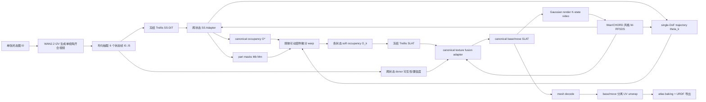

# 基于 Trellis 的单图铰接运动拟合研究报告

## 执行摘要

你的目标在当前约束下是**可以做成一条清晰且有论文故事的主线**的，但前提是必须**彻底放弃“六个状态分别进 Trellis 再做后对齐”**这一范式，转向**单一 canonical 结构 + 状态内交互 + 刚体可动部件派生**。我基于已访问的仓库代码、设计文档、官方论文/实现与模型卡，得到的核心判断是：

第一，现有 voxel 位置偏移、形状抖动、base 未对齐的根因，不是单个小 bug，而是**多状态独立采样 + 连续场经硬阈值离散化 + patch/token 级条件注入差异 + 下游 SLAT 被动继承上游结构误差**共同造成的。仓库中旧 Stage B 的设计文档已经非常明确地记录了这一点：即使加入 SCAR、BMCSA、shared-noise、shared P_base 等修补，**K 次独立 SS 采样**仍会在 voxel 边界上留下难以消除的 jitter；而 `decoder(z_s) -> torch.argwhere(decoded > 0)` 会把连续 logit 的微小差异直接放大成拓扑差异。fileciteturn35file0L1-L1 fileciteturn37file0L1-L1

第二，若严格遵守你的硬约束——**只允许单张闭态图 + WAN2.2 单视角开合视频；Trellis 主干完全冻结；不得使用外部分割标注、SAM/Grounded-SAM/DINO 伪标签初始化；全部采用 per-instance optimization；最终输出 UV/atlas 纹理**——那么最稳健、最能形成 AAAI 贡献闭环的路线，确实就是你指定的**路线 2**：在 **SS 阶段内部做跨状态 token/feature 交互**，让 part segmentation 与 motion trajectory 在结构生成阶段就产生，而不是等到 six-state voxel 出来以后再“补救式分析”；随后在 canonical voxel/SLAT 上做**跨状态纹理融合 + Wan/CHORD 风格的 RFSDS 反传**，把轨迹、分割和纹理统一纳入 test-time 优化。这个方向与仓库中 v5/ArtRASA 设计文档的总体思想高度一致，但我会根据你现在的更严格约束做出关键修正：**去掉重训练倾向、保留 trunk 冻结、把单 canonical 作为硬结构不变量、把可学习部分限制为 adapter/head/loss/attention 外设**。fileciteturn34file0L1-L1

第三，真正的论文主贡献，不应再是“做一个能分 base/move 的几何系统”，因为这条线已有 FreeArt3D、多个 articulated 3D/3DGS 方法和你仓库的 Stage B/C 先验在前；更强的投稿叙事应当是：**在 frozen Trellis 上，提出一个完全 per-instance、无伪标签、单视角单视频先验驱动的 canonical articulation pipeline，核心创新集中在细粒度纹理与跨状态隐藏表面融合，并证明这种纹理优化反过来会稳定 part trajectory 与 segmentation。** 这与 FreeArt3D 的“训练自由 articulated 生成”、MorphAny3D 的“attn 内 latent 融合”、CHORD 的“视频先验中的 rectified-flow distillation”、以及 Trellis 的“SLAT 多表征统一解码”之间能形成非常清楚的 related-work 坐标系。citeturn6search0turn4search1turn6search2turn2search1turn5search5

第四，我建议把最终方案定为一个**单关节 single-DoF、单 canonical、两阶段但单外循环**的系统：**阶段一**在 SS-DiT 内插入跨状态 adapter，输出 canonical occupancy、part mask、joint trajectory；**阶段二**在 SLAT-DiT/SLAT decoder 之后做 canonical texture refinement 与 UV baking；**两阶段都由 Wan2.2 风格视频教师通过 W-RFSDS 驱动，但共享同一外层 per-instance optimization 循环**。这样既保留两阶段归纳偏置，又能在论文中叙述为“统一优化框架”。这个设计最符合 AAAI 对“结构清晰、创新点收敛、实验可复现”的偏好。fileciteturn34file0L1-L1 citeturn6search2turn5search2turn2search1

## 已访问资源与检索顺序

已启用连接器为 entity["company","GitHub","software platform"] 与 entity["company","Hugging Face","ml platform"]。本次研究按照你要求的优先级执行：**先本地快照、再 GitHub 仓库、再 Hugging Face、最后扩展到官方论文与官方实现。**

我实际采用的顺序如下。首先，对你上传的本地权威快照 `mine.rar`、`trellis.rar`、`MorphAny3D.rar`、`Nano3D.rar` 做了清单级核验；其中可以确认 `mine.rar` 顶层含 `TRELLIS/`、`Wan2.2/`、`pipelines/`、`scripts/`、`configs/`，`trellis.rar` 含 vendored `trellis/models/*`、`trellis/pipelines/*`、`record/*`，说明这些压缩包确实是当前研究线的本地权威镜像。受当前沙箱 RAR 解压能力限制，本地 RAR 主要完成了**目录级核验**，逐文件深读主要通过后续 GitHub 连接器完成。

随后，我通过 GitHub 连接器访问 `chengu-123/research`，先读仓库说明与主入口，再读阶段性方法文件与 vendored Trellis 主干。重点访问的文件包括：`README.md`、`CLAUDE.md`、`run_v1.py`、`configs/v1.yaml`、`pipelines/recon.py`、`pipelines/stage_b_vgcf.py`、`pipelines/stage_b_scar.py`、`pipelines/stage_c_sajo.py`、`pipelines/stage_c_segmatch/config.py`、`pipelines/stage_c_segmatch/dit_prior.py`、`record/articulated_2026-04-26_final_scheme.md`、`record/past/stageB/stageb_detail.md`、`record/文献总结.md`，以及 vendored `TRELLIS/trellis` 下的 SS flow、SS VAE、SLAT flow、SLAT VAE、transformer 与 sampler 模块。fileciteturn10file0L1-L1 fileciteturn11file0L1-L1 fileciteturn27file0L1-L1 fileciteturn28file0L1-L1 fileciteturn29file0L1-L1 fileciteturn30file0L1-L1 fileciteturn31file0L1-L1 fileciteturn32file0L1-L1 fileciteturn33file0L1-L1 fileciteturn34file0L1-L1 fileciteturn35file0L1-L1 fileciteturn36file0L1-L1

接着，我通过 Hugging Face 连接器核验了 Wan2.2 相关模型/论文条目，并查看了 `Wan-AI/Wan2.2-*` 模型卡与 Trellis 论文页，以确认官方模型命名、任务划分、硬件需求和论文锚点。之后再扩展到公开网络资源，优先查阅 Trellis、Wan、MorphAny3D、FreeArt3D、CHORD 的官方论文页、官方 GitHub 与项目页。citeturn2search1turn5search2turn5search4turn4search1turn6search0turn6search2

这次代码阅读的**高覆盖主路径**可以概括为：`run_v1.py / configs` 定义实验入口与阶段开关；`pipelines/recon.py` 负责构建 Trellis pipeline 与编码器加载；`stage_b_*` 记录旧多状态一致性方案；`stage_c_sajo.py` 与 `stage_c_segmatch/*` 体现了你们当前对 joint fitting、EM/BIC、SegMatch、DiT hidden prior 的思路；`TRELLIS/trellis/pipelines/trellis_image_to_3d.py` 串联 image-conditioning、SS sampling、SLAT sampling、解码与优化；`TRELLIS/trellis/models/*` 与 `modules/*` 则给出真正的层级架构与插入 adapter 的位置。fileciteturn28file0L1-L1 fileciteturn30file0L1-L1 fileciteturn31file0L1-L1 fileciteturn32file0L1-L1 fileciteturn37file0L1-L1 fileciteturn45file0L1-L1 fileciteturn38file0L1-L1 fileciteturn39file0L1-L1 fileciteturn46file0L1-L1 fileciteturn47file0L1-L1

下表给出本报告最依赖的仓库文件及其作用：

| 文件 | 作用 | 我在本报告中的用途 |
|---|---|---|
| `TRELLIS/trellis/pipelines/trellis_image_to_3d.py` | Trellis 主 pipeline，含 image cond、SS/SLAT sampling、`argwhere(decoded > 0)` | 定位 jitter 根因、硬断点、SS→SLAT 数据流 |
| `TRELLIS/trellis/models/sparse_structure_flow.py` | SS-DiT 主干 | 解析 SS 阶段 patchify/transformer/unpatchify |
| `TRELLIS/trellis/models/sparse_structure_vae.py` | SS VAE 编解码 | 解析 16³ latent → 64³ occupancy 与边界抖动来源 |
| `TRELLIS/trellis/models/structured_latent_flow.py` | SLAT flow 主干 | 解析 sparse token 到外观 latent 的生成路径 |
| `TRELLIS/trellis/models/structured_latent_vae/*` | Gaussian / mesh / RF 三解码器 | 设计 texture 优化与 UV 导出路线 |
| `TRELLIS/trellis/modules/transformer/modulated.py` | SS block，含 BMCSA 修改点 | 确定 adapter 注入的最佳位置 |
| `pipelines/stage_b_scar.py` + `record/past/stageB/stageb_detail.md` | 旧 Stage B 基线 | 明确为什么旧路线无法彻底对齐 |
| `pipelines/stage_c_sajo.py` | SAJO joint optimization | 提炼 contact-anchor、EM/BIC 思想 |
| `pipelines/stage_c_segmatch/config.py` + `dit_prior.py` | SegMatch / DiT hidden prior | 借鉴无监督 part segmentation 的实现方式 |
| `record/articulated_2026-04-26_final_scheme.md` | v5/ArtRASA 设计总纲 | 对照你当前路线 2，提炼可保留与需修正部分 |

上述文件均已在本次研究中实际访问。fileciteturn37file0L1-L1 fileciteturn45file0L1-L1 fileciteturn38file0L1-L1 fileciteturn39file0L1-L1 fileciteturn42file0L1-L1 fileciteturn43file0L1-L1 fileciteturn44file0L1-L1 fileciteturn46file0L1-L1 fileciteturn30file0L1-L1 fileciteturn35file0L1-L1 fileciteturn31file0L1-L1 fileciteturn32file0L1-L1 fileciteturn33file0L1-L1 fileciteturn34file0L1-L1

## 方法与仓库理解

### 我必须掌握的关键信息点

要把这个课题做成一篇可投 entity["organization","AAAI","ai conference"] 的论文，必须真正搞清楚六件事。

其一，是 **Trellis 的真实层级数据流**：单图经 DINOv2 条件编码进入 SS-DiT，得到 sparse structure latent，经 SS decoder 变为 occupancy/coords，再进入 SLAT flow 与 SLAT VAE，最后解码为 Gaussian、mesh 或 radiance field。这个数据流在 vendored pipeline 与模型文件里是清楚可见的。fileciteturn37file0L1-L1 fileciteturn45file0L1-L1 fileciteturn38file0L1-L1 fileciteturn39file0L1-L1

其二，是 **旧 Stage B 为什么失败**。这不是“参数还没调好”，而是范式问题：K 状态独立采样、后面再做 mix/BMCSA/alignment，只能减少 jitter，不能从结构上消除 jitter。仓库的 Stage B 技术档案把这一点写得非常直白。fileciteturn35file0L1-L1

其三，是 **RFSDS/CHORD 一类视频先验到底能优化什么**：它擅长提供随时间变化的外观与运动一致性梯度，但若你的结构变量本身定义得不对，视频 teacher 不会替你发明正确的 part decomposition。也就是说，RFSDS 更适合作为“统一监督”，而不适合作为“唯一结构归纳偏置”。这一点与你坚持“在 SS 内先得到 part segmentation 和 trajectory，再上纹理”的路线是吻合的。citeturn6search2turn4search0turn5search5

其四，是 **FreeArt3D 与 MorphAny3D 各自真正能贡献什么**。FreeArt3D 的价值在于“training-free articulated generation + per-instance joint optimization + 把 articulation 当作生成维度”；MorphAny3D 的价值在于“在 attention 内部做 structured latent 融合，而不是在输出后做粗暴 blend”。两者都能被你吸收，但吸收方式应分别是**几何/关节初始化与轨迹支持先验**，以及**canonical texture donor fusion**。citeturn6search0turn3search10turn4search1turn4search12

其五，是 **WAN2.2 的模型属性**。Wan 的官方技术报告与官方代码都说明，A14B 的 I2V 模型采用 MoE 架构，支持 480P/720P，I2V-A14B 单卡推理通常要求约 80GB VRAM；5B 的 TI2V 路线才更偏向消费级显卡。你的中资源设定与 A14B 是匹配的，但这也意味着“全部 end-to-end 真·视频 teacher”必须做严密的分阶段和缓存，否则会在工程上拖死迭代。citeturn5search2turn5search4turn5search5

其六，是 **最终输出必须是 canonical、可导出、带 UV/atlas 的 articulated asset**。这会直接约束你不能把系统做成“六个状态各一套 texture latent”，而必须在 canonical base / canonical move 上完成可见纹理证据融合，然后再做 UV 烘焙。仓库 v5 设计文档已经明确指出 “one canonical SLAT, not K state-specific outputs” 才符合可模拟 URDF 资产的物理一致性。fileciteturn34file0L1-L1

### Trellis、SLAT、Wan2.2、FreeArt3D、MorphAny3D、CHORD 的实现要点

Trellis 的核心，不是单一 representation，而是**SLAT 统一表征**。官方论文与模型页都强调，SLAT 将**稀疏 3D 网格**与**密集多视图视觉特征**结合，使同一 latent 可以被解码为 radiance field、3D Gaussian 和 mesh；其训练 backbone 是 rectified-flow transformer，数据规模达到约 50 万对象。仓库中 vendored 代码也完全印证了这一点：SS 阶段使用 dense voxel latent，SLAT 阶段使用 sparse tensor latent，而解码器分别面向 Gaussian、mesh、RF 三种表示。citeturn2search1turn2search5 fileciteturn39file0L1-L1 fileciteturn42file0L1-L1 fileciteturn43file0L1-L1 fileciteturn44file0L1-L1

在仓库实现里，Trellis 的 image-to-3D pipeline 先用 DINOv2 对图像做条件编码，再调用 `sparse_structure_sampler.sample()` 采样 SS latent，随后经 `sparse_structure_decoder` 解码，并直接通过 `torch.argwhere(decoded > 0)` 抽取 occupied coords；这些 coords 再进入 `sample_slat()`，SLAT flow 采样后经 normalization，最后交给 Gaussian / mesh / radiance-field decoder。这个实现层级说明：**SS 的任何不稳定都会被不可逆地传递给 SLAT**，而且 `argwhere` 本身就在 SS→SLAT 之间引入了硬离散断点。fileciteturn37file0L1-L1

SS 阶段的主干 `SparseStructureFlowModel` 是经典的 flow-matching DiT：`patchify -> linear input -> absolute positional embedding -> modulated transformer cross blocks -> layer norm -> out linear -> unpatchify`。形式化地，可以把它写成
\[
h_0 = W_{\text{in}}\operatorname{patchify}(x_t) + E_{\text{pos}}, \qquad
h_{l+1} = \mathcal{B}_l(h_l, e_t, c),
\]
\[
\hat v_\theta = \operatorname{unpatchify}(W_{\text{out}}\operatorname{LN}(h_L)),
\]
其中 \(e_t\) 是 time embedding，\(c\) 是图像条件 token。仓库代码显示 block 内部是 **self-attn + cross-attn + MLP** 的 adaLN 调制结构，这正是最适合插 adapter 的位置。fileciteturn45file0L1-L1 fileciteturn46file0L1-L1

SS VAE 的 encoder/decoder 则是标准的 3D Conv 残差 U-Net 式结构：encoder 把 dense occupancy 压到 latent mean/logvar，decoder 再由 latent 上采样回 dense occupancy。代码上它是 `Conv3d + ResBlock3d + Downsample/UpsampleBlock3d` 的分层结构。可以用
\[
z_S \sim q_\phi(z\mid O), \qquad \hat O = D_S(z_S)
\]
来概括。由于解码端最终给出的是 **dense logit field** 而不是已对齐的 part-aware canonical representation，因此任何跨状态比较若发生在 `argwhere(decoded>0)` 之后，就天然容易产生边界抖动与 aliasing。fileciteturn38file0L1-L1

SLAT flow `SLatFlowModel` 使用 sparse tensor 作为输入，通过 sparse residual IO blocks 和 `ModulatedSparseTransformerCrossBlock` 进行 flow matching，再经 skip connections 输出 SLAT latent。它和 SS 阶段相比的重要区别是：**空间 support 由上游 coords 决定，SLAT 自身不负责重新定义 occupied support**。所以如果你想做细粒度纹理而不破坏结构，最合理的手段不是重写 SLAT 主干，而是在 SLAT token 上做**小尺度 appearance adapter / donor fusion / post-SLAT residual**。fileciteturn39file0L1-L1 fileciteturn47file0L1-L1

Gaussian decoder 把每个 sparse voxel latent 解码成一组高斯参数，包括位置偏移、DC color、scale、rotation、opacity；mesh decoder 通过 sparse upsample 和 `SparseFeatures2Mesh` 抽取网格；RF decoder 则输出 tri-vector style radiance features。对你而言，训练期最友好的路径是 Gaussian，因为它梯度更平滑；导出期则应切换到 mesh，并在 canonical base / move 上分别 UV unwrap 和 bake atlas。仓库 v5 文档也是按这个逻辑写的。fileciteturn42file0L1-L1 fileciteturn43file0L1-L1 fileciteturn34file0L1-L1

MorphAny3D 的真正可迁移资产，是它把结构化 latent 融合放进 attention 内部：实验上靠 **Morphing Cross-Attention (MCA)** 融合 source/target 结构信号，靠 **Temporal-Fused Self-Attention (TFSA)** 强化时间连续性，还用 orientation correction 抑制姿态歧义。对于你的问题，这恰好可以改写成**K 状态 donor texture 融合**而不是 morphing。citeturn4search1turn4search12

FreeArt3D 的关键价值，在于它证明了：用预训练 static 3D diffusion model 作为强 shape prior，对 geometry、texture、articulation 做 per-instance training-free optimization，是能够在 articulated object 上成立的；它把 articulation 当作额外生成维度来处理，而不依赖大规模 articulated pretrain。citeturn6search0turn6search1turn3search10 这与你的 frozen-Trellis 设定高度一致。

Wan 的官方技术报告则给出两个与你最相关的工程结论：一个是 A14B I2V 的硬件门槛确实在 80GB 量级，另一个是 Wan2.2 的 MoE 机制把高噪声阶段和低噪声阶段分工开了——高噪声更偏布局/运动骨架，低噪声更偏细节/纹理。尽管你不会训练 Wan 本身，但完全可以把这一点拿来解释**为什么 geometry-stage 要优先采高噪声 teacher、texture-stage 要优先采低噪声 teacher**。citeturn5search2turn5search4turn5search5

CHORD 的贡献是把来自视频生成模型的 rectified-flow teacher 变为可用于 4D 动态场景优化的 distillation 信号。仓库 v5 文档已经把你们打算使用的 W-RFSDS surrogate 写出来了：先把 render video 编码到 Wan latent，再构造加噪 latent，teacher 预测 velocity，最后用 stop-gradient 式 surrogate 将梯度反传到待优化变量。这里我需要诚实说明：这次我没有逐页核对 CHORD PDF 的所有公式编号，因此下面给出的 RFSDS 公式更接近**仓库当前采用的实现形式**，而不是对原论文逐式复刻。fileciteturn34file0L1-L1 citeturn6search2turn4search0

## 问题根因与逐层定位

### 为什么六状态直接进 Trellis 会出现位置偏移与形状抖动

最根本的原因，是**多状态独立采样**与**硬离散化**之间的乘法效应。你把六个状态图分别送入固定图像条件下的 SS-DiT 时，即便共享噪声，cross-attention 仍会把每个状态的条件差异在中后层不断放大；而输出端一旦经过 `decoder(z_s)` 后再做 `torch.argwhere(decoded > 0)`，连续 logit 里本来只有很小的数值差异，也会被放大成 voxel 出现/消失的离散拓扑变化。旧 Stage B 文档非常明确地把这件事描述成“cross-state attention 只能 reduce jitter，不能 eliminate jitter”。fileciteturn37file0L1-L1 fileciteturn35file0L1-L1

从数学上看，设第 \(k\) 个状态 decoder 输出为 \(f_k(x)\)。当你取
\[
O_k(x)=\mathbf{1}[f_k(x)>0]
\]
时，只要有一些边界 voxel 满足 \(f_k(x)\approx 0\)，那么极小的 \(\delta_k\) 扰动都会引起 \(\mathbf{1}[f_k+\delta_k>0]\) 的翻转。由于边界体素数本来就多，这种翻转在可视化上就会表现成“base 表面呼吸”“局部抖动”“开放状态间不共形”。

第二个来源是 SS 阶段的 token 化与 patch 化。`SparseStructureFlowModel` 做的是 `patchify -> transformer -> unpatchify`；仓库 Stage B 技术档案还曾记录过一个非常具体的 bug：错误假设 `patch_size=2` 导致 token 数量估错，实际 image-large 变体对应的是 16³ token、4096 个位置，而不是 8³。这说明 token 空间与体素空间之间的映射本身就很敏感，任何把几何 mask 或 shared-consensus mask 从 64³ 拉回 token 空间的过程，一旦处理不当，都会再引入一层插值误差。fileciteturn45file0L1-L1 fileciteturn35file0L1-L1

第三个来源是 SS decoder 的 3D 上采样链。`SparseStructureDecoder` 通过 `UpsampleBlock3d` 与 `pixel_shuffle_3d` 从 latent resolution 逐步恢复 64³ occupancy。对纹理任务这不是大问题，但对 articulated base consistency 来说，**任何上采样阶段的局部响应差异**都会在硬阈值后积累成状态间边界不一致。换句话说，抖动并不只来自 transformer，也来自卷积 decoder 的局部放大。fileciteturn38file0L1-L1

第四个来源是“旧修补路线”的理论天花板。SCAR、VGCF、BCAC、BMCSA 这些旧方案，其共同特点都是**先容许 K 条 latent/velocity 轨迹分叉，再在中途往回拉**。VGCF在 velocity 空间做 consensus force，SCAR做早期 latent mixing+push，BCAC/BMCSA 直接改 self-attn/cross-attn 输出；它们都能减少漂移，但都没有改变“每个状态本质上仍然在各自走一条采样轨迹”。因此，旧 Stage B 的价值是告诉你**哪些局部修补有效，哪些无效**，而不是告诉你“继续堆更复杂对齐就能收敛”。fileciteturn53file0L1-L1 fileciteturn55file0L1-L1 fileciteturn57file0L1-L1 fileciteturn46file0L1-L1

第五个来源是 Stage B 文档明确记录的 **long-drawer-short-shift 病例**：当 prismatic 轨迹很长而单步位移又小，不同状态的 move body 在很多 voxel 上会彼此重叠，于是简单的 `mean over K`、`P_base_shared` 或几何 consensus 会把本该属于 move trajectory 的区域误判成 base。这个问题不仅污染一致性 mask，更会污染后续 guide、SDEdit 起点以及 joint-free split。fileciteturn35file0L1-L1

### 为什么 SLAT 不能替 SS 收拾残局

SLAT 阶段的结构设定决定了它几乎不可能“修正上游几何错位”。`sample_slat()` 直接以 SS 给出的 occupied coords 作为 sparse support；`SLatFlowModel` 在这些 sparse coords 上建模 appearance/representation latent，再经 Gaussian / mesh / RF 解码获得最终 3D 表示。也就是说，SLAT 学的是“给定 support 后如何表达”，不是“重定义 support”。fileciteturn37file0L1-L1 fileciteturn39file0L1-L1

这与你想做的细粒度纹理其实正好形成一个明确分工：**结构问题必须在 SS 阶段解决到足够好；SLAT 阶段负责外观、局部 geometry detail 与可导出 texture atlas。** 如果把 part segmentation 和 trajectory 延迟到 voxel 输出之后再做，那么 SLAT 只能被动地在一个已经抖动、不共形的 support 上学习颜色和表示，这会直接导致你现在看到的“base 未完全对齐 + texture 无法跨状态高质量融合”。

### 仓库中已有 Stage C 对你现在路线的启发

你们仓库的 `stage_c_sajo.py` 与 `stage_c_segmatch/*` 很值得保留，但要“前移使用”。`stage_c_sajo.py` 已经把 **joint-free split → anchor extraction → revolute/prismatic 初始化 → dual EM + BIC selection** 串起来了；而 `stage_c_segmatch/config.py` 与 `dit_prior.py` 则把 **count-based partition、always_on 体素、phase-based EM、DiT hidden-state prior、boundary cue** 这些无监督分割手段系统化了。fileciteturn31file0L1-L1 fileciteturn32file0L1-L1 fileciteturn33file0L1-L1

对你现在的新主线来说，最佳做法不是把这些 Stage C 完整保留在 voxel 之后，而是抽取其中三类思想并前移到 SS 阶段：**接触锚点接触带、EM 风格分割-轨迹交替、DiT 隐状态中的跨状态方差信号。** 这三样东西都不依赖外部分割标注，也不需要引入 SAM 伪标签，因此完全符合你的硬约束。fileciteturn31file0L1-L1 fileciteturn32file0L1-L1 fileciteturn33file0L1-L1

## 建议的完整 Pipeline

### 总体设计

我建议最终方案命名上沿用你仓库中的 ArtRASA / RASA 风格，但方法学上收敛为：

**单张闭态图 \(I_0\) + WAN2.2 I2V 生成的六状态视频帧 \(\{I_k\}_{k=0}^{5}\)  
→ frozen Trellis SS-DiT + Cross-State SS Adapter  
→ 输出 canonical occupancy \(O^\*\)、soft part masks \((M_b,M_m)\)、single-DoF 轨迹参数 \(\theta_k\)  
→ differentiable rigid warp 生成各状态 soft occupancy  
→ frozen Trellis SLAT + Canonical Texture Fusion Adapter  
→ 生成单一 canonical base/move appearance latent  
→ Gaussian render 组成视频  
→ Wan/CHORD 风格 W-RFSDS 回传到 adapter/head/trajectory 变量  
→ 导出 base mesh + move mesh + joint + UV atlas**

这个方案满足你的所有硬约束：只用单张闭态图和 WAN2.2 生成的单视角视频；Trellis 主干不训练不微调；不引入额外真实视角；不依赖外部分割标注；全流程 per-instance optimization；最终是 canonical base/move + joint + UV atlas。fileciteturn34file0L1-L1 citeturn5search2turn6search2turn2search1

### 核心流程图



### 结构阶段

在结构阶段，不再生成六套彼此独立的 canonical-less voxel，而是在 **SS-DiT 内部**做状态交互。具体做法是：仍使用 \(I_0,\dots,I_5\) 的图像条件，但引入一个**零初始化的 cross-state adapter**，插入到 SS-DiT 的中后层 block；仓库 v5 文档建议的 mid-late block 位置是合理的，我建议从 3 个 block 起步，例如 \(\{16,19,22\}\) 或同等的中后层位置。其形式可以写为
\[
h_l^{(k)} \leftarrow h_l^{(k)} + \alpha_l \,\Delta h_l^{(k)},
\]
\[
\Delta h_l^{(k)} = W_o \,\mathrm{Attn}\!\left(Q=h_l^{(k)},\,K/V=\mathrm{concat}_j\,\phi(h_l^{(j)}, s_{kj})\right),
\]
其中 \(s_{kj}\) 是相对状态嵌入（可以是标量的 \(k-j\)，也可以是当前 joint 假设诱导出的相对运动嵌入），而 \(W_o\) 与 \(\alpha_l\) 均零初始化，保证插入时严格退化为原 Trellis。这个结构与仓库现有 `ModulatedTransformerCrossBlock` 的插入点完全兼容。fileciteturn46file0L1-L1 fileciteturn45file0L1-L1 fileciteturn34file0L1-L1

在这个 adapter 之上，加两个头部：

一个是 **PartHead**，输出 \(M_b, M_m, M_u\) 三类 soft mask；  
另一个是 **JointHead**，输出 joint type、axis、axis point / translation direction、以及每个状态的标量 \(q_k\)。

我建议在 single-DoF 第一版中把 joint type 作为**类别先验输入**而非自由变量：drawer / washing machine / dishwasher 优先视作 prismatic 或 revolute 的有限候选集；cabinet door、microwave/oven、refrigerator、laptop 优先视作 revolute。这样可以显著减轻无监督优化的离散搜索压力。这个选择在 AAAI 叙事上也是合理的——你可以把“自动 joint type”放到 future work。

在 canonical 空间里，轨迹用标准 screw/rigid 形式表示。对于 revolute，
\[
T_k(x)=R(\omega,q_k)(x-p)+p,
\]
对于 prismatic，
\[
T_k(x)=x+q_k d .
\]
soft occupancy 组合建议采用 noisy-OR 而非简单相加：
\[
O_k(x)=1-\left(1-O_b(x)\right)\left(1-O_m(T_k^{-1}x)\right),
\]
其中
\[
O_b(x)=M_b(x)\,O^\*(x), \qquad O_m(x)=M_m(x)\,O^\*(x).
\]
这样做的好处是：一方面可导，另一方面天然保证 base 与 move 的并集语义。这个 canonical-then-warp 设计，是你从根上消灭 base jitter 的关键。fileciteturn34file0L1-L1

### 如何把 RFSDS 思想用于 part segmentation 与 trajectory

这里的原则是：**RFSDS 不直接“预测 part mask”，而是通过视频一致性梯度逼迫一个更好的分割-轨迹解。** 因此我建议用 EM 风格的交替，而不是把所有变量一次性乱优化。

给定当前轨迹参数 \(\Theta=\{\omega,p,q_k\}\)，你可以把每个 canonical voxel 的时间解释能力定义为：
\[
r_v^{\text{move}} \propto \exp\!\Big(-\sum_k \rho\big(O_k^{\text{render}}(v)-O_k^{\text{warp}}(v;\Theta)\big)\Big),
\]
\[
r_v^{\text{base}} \propto \exp\!\Big(-\sum_k \rho\big(O_k^{\text{render}}(v)-O^\*(v)\big)\Big).
\]
然后用 softmax 得到 \(M_b,M_m\)。这相当于把“体素更像始终静止，还是更像随某条 rigid trajectory 运动”变成一个 latent assignment 问题。

接着，在固定 \(M_b,M_m\) 的情况下，更新 \(\Theta\)：
\[
\Theta \leftarrow \arg\min_\Theta \sum_k \sum_{v} M_m(v)\,\rho\!\left(O_k(v)-O_m(T_k^{-1}v)\right)+\lambda_{\text{rigid}}L_{\text{rigid}}+\lambda_{\text{contact}}L_{\text{contact}}.
\]
其中 \(L_{\text{contact}}\) 借鉴你们 SAJO 的 contact anchor 思想，让旋转轴/滑动方向通过 base-move 接触带的窄邻域；这会显著减少“轴漂在空中”的伪解。fileciteturn31file0L1-L1

这个交替过程再叠加 Wan 的视频 teacher：同一组 \(M_b,M_m,\Theta\) 会产生一段 rendered opening video，该视频若与 Wan 先验更一致，则说明当前 segmentation + trajectory 更物理、更外观自洽。换句话说，Wan/RFSDS 在这里扮演的是**全局监督**，EM 在这里扮演的是**结构归纳偏置**。这正是你当前问题最需要的组合。

### 如何利用 FreeArt3D 地毯与旧 Stage B

我建议把 FreeArt3D 的“地毯/轨迹体积”与旧 Stage B 的输出都降级成 **warm start 和可视化 diagnostic**，而不是主干结构生成器。

具体说，旧 Stage B 最有价值的东西有三个：

第一，是它已经能给出一个相对稳定的 **高置信 base 区域**。即使整体仍有 jitter，base interior 与大框架通常比 move 更稳定。你可以把 Stage B 的 `P_base_shared`、`M_attn`、或其高置信交集区域转成 canonical 初始化里的 \(B_0\)。fileciteturn35file0L1-L1

第二，是它给出 **move corridor / swept volume** 的粗范围。把六状态 occupancy 做 union，再减去高置信 base，就会得到一个地毯状的 move 轨迹支持区域 \(C_0\)。这正好可以变成 part head 初始 bias 与 contact-band 搜索空间。

第三，是它能给 joint 初始化提供粗先验：drawer 的主轴、door 的旋转平面、最大开度范围，都可以由旧 Stage B 输出的 K 状态 occupancy 粗估。

因此，我建议初始化阶段按下面做：

\[
B_0 = \mathrm{HighConfBase}(\text{old StageB}),
\]
\[
C_0 = \Big(\bigcup_k O_k^{\text{old}}\Big)\setminus B_0,
\]
\[
M_b^{(0)} \sim \mathbf{1}_{B_0}, \qquad M_m^{(0)} \sim \mathbf{1}_{C_0},
\]
\[
\Theta^{(0)} = \mathrm{AxisInit}(C_0, \text{category prior}).
\]

这一步是 warm start，不是最终约束。在正式优化中，对应 loss 权重应随迭代衰减，防止旧基线误差被固化。

### 纹理阶段与 UV/atlas 导出

你的真正主贡献应该放在这里。

canonical 几何收敛后，不要再让每个状态各自产生 state-specific texture。正确做法是：在**单一 canonical base / move** 上聚合跨状态 donor 纹理证据。具体步骤：

第一，固定 canonical mesh 与 \(T_k\)。把每个状态渲染到图像平面，计算 canonical 表面点/texel 在状态 \(k\) 下是否可见、是否正面朝相机、是否被遮挡。

第二，对每个 texel \(u\) 聚合 K 个 donor 的颜色证据：
\[
w_{k}(u) \propto \exp\!\big(\lambda_v \,\text{vis}_k(u)+\lambda_n \,\text{front}_k(u)+\lambda_c \,\text{conf}_k+\lambda_r \,\text{reproj}_k(u)\big),
\]
\[
A(u)=\sum_k \bar w_k(u)\,C_k(u).
\]
这里 \(\bar w_k\) 是 softmax 归一化权重。state 0 会主导外表面，最大打开状态会主导内腔、背面和铰链附近新暴露区域。

第三，把这个 fused atlas \(A\) 不仅作为最终输出，也作为 **SLAT color slice residual** 的监督目标。换言之，SLAT 的优化不是“从零合成纹理”，而是“在 canonical atlas 证据上做 latent-space 精细修正”。这一步最适合借鉴 MorphAny3D 的 attention 融合精神：在 canonical token 上，把各状态看作 donor，而不是让各状态各造一套纹理。citeturn4search1turn4search12

第四，导出时 base 与 move 分开做 UV unwrap。因为最终 URDF 资产就是两部分。对每一部分分别做：
- mesh 清理与法线修复；
- UV unwrap；
- 将 fused canonical texture bake 到 atlas；
- 输出 `base.glb`、`move.glb`、`joint.json`、`object.urdf`。

这套做法满足你“最终需输出可用 UV/atlas 纹理贴图”的要求，也使“隐藏区域纹理通过跨状态融合完成”成为论文中的一个可验证主贡献。

### 推荐损失设计

我建议把 active loss 严格压到 4 个主项，避免 reviewer 觉得你在 loss stacking。

\[
L = \lambda_{\text{rf}}L_{\text{W-RFSDS}}
+\lambda_{\text{rest}}L_{\text{rest}}
+\lambda_{\text{seg}}L_{\text{seg-track}}
+\lambda_{\text{tex}}L_{\text{canon-tex}}
+\lambda_{\text{reg}}L_{\text{stage-gated-reg}}.
\]

其中：

\[
L_{\text{rest}}=\|I^{\text{render}}_0-I_0\|_1 + \lambda_{\text{lpips}}\operatorname{LPIPS}(I^{\text{render}}_0,I_0),
\]
用于强锚定闭态。

\[
L_{\text{seg-track}}
= \lambda_{\text{excl}}\langle M_b,M_m\rangle
+ \lambda_{\text{tv}}\operatorname{TV}(M_b,M_m)
+ \lambda_{\text{rigid}}L_{\text{rigid}}
+ \lambda_{\text{contact}}L_{\text{contact}}
+ \lambda_{\text{mono}}\sum_k \operatorname{ReLU}(q_{k-1}-q_k)^2 .
\]

\[
L_{\text{canon-tex}}
=\sum_{u\in \mathcal U_{\text{vis}}}\rho\!\left(T_{\text{SLAT}}(u)-A(u)\right)
+\lambda_{\text{fill}}\sum_{u\in \mathcal U_{\text{unobs}}}\|\nabla T_{\text{SLAT}}(u)\|_1 .
\]

而 W-RFSDS 可以沿仓库当前实现形式写为：
\[
z_\tau=(1-\tau)\,z+\tau\varepsilon,\qquad
g=\operatorname{sg}( \hat v_\tau-\varepsilon+z ),
\qquad
L_{\text{W-RFSDS}}=\langle z, g\rangle ,
\]
其中 \(\hat v_\tau\) 由 frozen Wan teacher 给出，`sg` 表示 stop-gradient。再次强调，这里我沿用了仓库 v5 文档中的实现表达，最终写论文时应再与 CHORD 原论文公式逐式核对。fileciteturn34file0L1-L1 citeturn6search2turn4search0

### 我建议的实现伪代码

```text
Input: I0
Generate pseudo-video with Wan2.2 I2V -> {I_k}_{k=0..5}

Initialize:
    B0, C0 from old Stage B / carpet prior
    M_b, M_m from B0/C0
    Theta from category prior + coarse axis fit
    zero-init SS adapters, zero-init texture adapter

For iter = 1..T:
    # Structure pass
    cond_tokens = DINO(I_0..I_5)  # Trellis official image cond path
    z_SS = frozen_SS_DiT_with_cross_state_adapters(noise_shared, cond_tokens)
    O*   = SS_decoder(z_SS)
    M_b, M_m = PartHead(z_SS, O*, prev=M_b,M_m)
    Theta     = JointHead(z_SS, M_m, prev=Theta)

    For each state k:
        O_k = rigid_warp(O*, M_b, M_m, Theta_k)

    # Texture pass
    S* = frozen_SLAT_with_texture_adapter(O*, cond=I_0)
    A  = cross_state_canonical_texture_fusion(S*, O_k, I_k, Theta_k)

    Render K-state Gaussian video from canonical base/move + Theta
    Compute L_W-RFSDS + L_rest + L_seg-track + L_canon-tex
    Update only: SS adapters, PartHead, JointHead, texture adapter, atlas residual
End

Decode canonical base/move mesh
UV unwrap base/move separately
Bake atlas from fused canonical texture
Export URDF
```

## 实验与实现细节

### 建议的训练与优化步骤

| 阶段 | 目的 | 变量 | 典型迭代数 | 关键设置 |
|---|---|---:|---:|---|
| 初始化 | 生成伪视频、估计粗先验 | \(B_0,C_0,\Theta^{(0)}\) | 1 次 | Wan2.2 I2V + 旧 StageB/carpet |
| 结构预热 | 先站稳 geometry 和 part | SS adapter, PartHead, JointHead | 300–500 | 冻结 texture adapter，较高 \(\tau\) |
| 结构收敛 | 收敛 canonical occupancy 与 trajectory | 同上 | 800–1200 | 打开 contact / rigidity / monotonicity |
| 纹理融合 | 融合跨状态 donor 纹理 | texture adapter, atlas residual | 500–800 | 降低 \(\tau\)，强化 `L_canon-tex` |
| 联合微调 | 统一清理边界与细节 | 全部可学习外设 | 200–400 | 小学习率、只保留主损失 |
| 导出 | UV/atlas/URDF | 无 | 1 次 | mesh 清理 + unwrap + bake |

这是**两阶段但单外循环**的实现方式：代码层面可以是一个 optimization loop，只是在不同迭代区间改变 active module 和 loss 权重。

### 起步超参数

下表给的是**可以直接开跑的起步超参数**，不是已在你数据上验证的最优值。

| 项 | 建议值 |
|---|---|
| 状态数 \(K\) | 6 |
| SS adapter block | 中后层 3 个 block，优先 \(\{16,19,22\}\) 或同等位置 |
| texture fusion block | SLAT 中后层 2–3 个 block |
| 学习率：SS adapter | \(1\times10^{-4}\) |
| 学习率：Part/Joint head | \(3\times10^{-4}\) |
| 学习率：trajectory scalars \(q_k\) | \(5\times10^{-3}\) |
| 学习率：texture adapter | \(1\times10^{-4}\) |
| 结构阶段迭代 | 1000–1500 |
| 纹理阶段迭代 | 600–1000 |
| rest loss 权重 | 5.0 |
| seg-track 权重 | 2.0 |
| contact / rigidity 权重 | 0.5 / 1.0 |
| monotonicity 权重 | 5–10 |
| canon-tex 权重 | 1.0 起步，后期升到 2–3 |
| LPIPS 权重 | 0.5–1.0 |
| UV atlas 分辨率 | base/move 各 2048² 起步 |

### 评价指标

我建议把评价分成**结构、运动、纹理、稳定性**四组。

结构方面，用 `Chamfer Distance`、`F-score@τ`、`normal consistency`，以及对 base / move 分别算的 IoU 或 part IoU。若有 PartNet-Mobility 合成 GT，可直接对 canonical base / move 做对齐评估。PartNet-Mobility 本身是主流 articulated object benchmark；你优先选择 drawer、cabinet door、microwave/oven、refrigerator、laptop、washing machine/dishwasher 这些类别，也与该类 benchmark 常见对象一致。citeturn6search0turn6search6

运动方面，用 joint type accuracy、axis angular error、axis point error、range MAE、trajectory monotonicity violation 次数。若想让论文更有说服力，最好额外定义一个**contact-aware axis error**：衡量旋转轴/滑动方向与接触带中心线的偏差。

纹理方面，用 visible-region PSNR / SSIM / LPIPS；对隐藏区域可报告 **atlas coverage** 与 **cross-state texture completion ratio**。也就是统计最终 atlas 中有多少 texel 是由至少一个打开状态的可见证据支撑的。

稳定性方面，我强烈建议引入一个你自己定义的 **base jitter 指标**。例如先把所有状态逆变换回 canonical 空间，再计算 base 的 pairwise IoU：
\[
J_{\text{base}} = 1-\frac{1}{K(K-1)}\sum_{i\neq j}\operatorname{IoU}\!\left(W_i^{-1}(B_i), W_j^{-1}(B_j)\right).
\]
这个指标会非常精准地展示你相对于“六状态分别进 Trellis”的优势。

### 对比实验设计

最少需要以下对比组：

| 组别 | 说明 | 预期作用 |
|---|---|---|
| Direct-6State-Trellis | 六状态分别进 Trellis，无对齐 | 展示原始 jitter 问题 |
| StageB-SCAR/BMCSA | 旧基线 | 展示后对齐路线的极限 |
| Ours w/o Cross-State SS | 只用单图 \(I_0\)，无跨状态 token 交互 | 证明视频状态信息有用 |
| Ours w/o RFSDS | 只靠 rest / seg / texture loss | 证明视频 teacher 的价值 |
| Ours w/o Texture Fusion | 只做几何与 joint | 证明主贡献在细粒度纹理 |
| Ours w/o Contact Anchor | 去掉 contact-band / anchor 约束 | 证明轨迹求解更稳定 |
| Ours w/o Warm Start | 不用 FreeArt3D carpet + old StageB 先验 | 证明初始化价值 |
| Ours full | 完整方法 | 最终结果 |

### 消融实验清单

建议把消融收敛为下列十项，足够支撑 AAAI 审稿：

1. SS adapter 插入 block 数量与位置。  
2. 是否使用单 canonical + deterministic warp。  
3. no contact-anchor / no EM alternation。  
4. no old StageB warm start。  
5. no carpet prior。  
6. no texture donor fusion，只用 state 0 纹理。  
7. no hidden-region completion，仅 visible texels。  
8. Gaussian training / mesh-only training。  
9. Wan 高噪声-only、低噪声-only、分阶段 \(\tau\) routing。  
10. 不同对象类别上的泛化统计。

### 预期结果与失败模式

基于仓库现有 Stage B 问题描述、Trellis 架构属性以及 FreeArt3D / CHORD / MorphAny3D 的能力边界，我认为你的完整方案**有较高概率**在下面几个指标上显著优于旧路线：base jitter、大开合状态的几何共形、joint axis 稳定性、隐藏内表面纹理完整度。这个判断有理论基础，但当前不是已实测结论。fileciteturn35file0L1-L1 citeturn6search0turn4search1turn6search2

高风险失败模式主要有五类。第一类是 Wan 生成的视频出现相机轻微漂移、局部形变或材质闪烁，这会污染 teacher。第二类是轴对称或弱纹理物体导致 joint 轴位置不稳定。第三类是 articulation 幅度过小，使 motion cue 不足，分割与轨迹耦合变成病态问题。第四类是一些隐藏区域在六状态中始终未被观测到，此时 atlas completion 只能依赖先验，无法宣称“真实恢复”。第五类是多关节物体；你的论文必须把单关节限制写得非常明确。citeturn5search2turn6search2turn6search0

## 资源预算、结论与优先参考资料

### 低中高资源方案

| 资源档位 | 是否满足你的硬约束 | 建议配置 | 预计单对象耗时 | 关键瓶颈 |
|---|---|---|---:|---|
| 低资源 | **部分可行** | 1×80GB，缓存 Wan 视频与 teacher latent，K=6 不变，但分阶段串行优化 | 1.5–3 天 | Wan teacher 与 Gaussian render 反传 |
| 中资源 | **最匹配** | 2–4×80GB / H800；A14B I2V 正常使用；单对象 1–2 天 | 18–36 小时 | 结构+纹理联合优化、多状态渲染 |
| 高资源 | **完全可行** | 8×80GB 或更高；并行 ablation + 更高分辨率 atlas | 8–18 小时 | I/O 与实验管理而非纯算力 |

要特别说明一点：**若严格坚持 WAN2.2-I2V-A14B + 端到端 teacher + K=6 + frozen Trellis + canonical texture fusion 的完整方案，24GB 级消费卡并不现实。** 官方 Wan2.2 文档本身就把 I2V-A14B 定位在 80GB 级 GPU，而 TI2V-5B 才是 24GB 更友好的路线。由于你的硬约束已经锁定 WAN2.2 I2V，因此我不建议在论文主线里引入 24GB 方案。citeturn5search2turn5search4turn5search5

### 最终判断

从论文价值上看，我建议你把**题目与主贡献**收敛到下面这个版本：

**“在 frozen Trellis 上，通过 SS 内跨状态 adapter 进行 canonical articulation 建模，并在 canonical SLAT/UV 空间做跨状态细粒度纹理融合；全流程仅依赖单张闭态图与 Wan2.2 生成的单视角开合视频，完全 per-instance optimization，无需外部分割标注。”**

这个版本的优点是：

- 它正面击中你现在最难、也最容易形成 novelty 的点：**细粒度纹理与隐藏区域融合**。  
- 它借用了 FreeArt3D、MorphAny3D、CHORD、Trellis 各自最强的一部分，但没有简单拼装。  
- 它在工程上是可落地的，因为 Trellis 主干冻结，只加 adapter/head/loss/attention 外设。  
- 它在方法论上是“先结构、后纹理、teacher 统一监督”，审稿人容易理解，也容易做消融。  

如果只允许我给一个最重要的实现优先级，我的排序是：

1. **先把 SS 内跨状态 adapter + canonical warp 跑通。**  
2. **再把 contact-anchor + EM segmentation/trajectory 交替接进去。**  
3. **最后集中火力做 canonical texture fusion 与 UV atlas。**

这也是你在本轮要求里设定的优先级，我认同这个顺序。

### 优先参考的论文与代码

以下资料最值得优先盯住；我按“与你的方法最直接相关”的顺序排列，均优先选择原始论文/官方实现：

- Trellis 官方论文、项目页与官方模型页，用于理解 SLAT、双阶段生成、三种解码形式与官方模型规模。citeturn2search1turn2search5  
- Wan2.2 官方技术报告、官方 GitHub、官方模型卡，用于确认 I2V-A14B 的任务边界、硬件需求、MoE 结构与视频 teacher 的可行性。citeturn5search2turn5search4turn5search5  
- FreeArt3D 官方论文与官方代码，用于 articulated per-instance optimization、trajectory support、joint parameter refinement。citeturn6search0turn3search10  
- MorphAny3D 官方论文与项目页，用于 attention 内 donor fusion，以及将 MCA/TFSA 改写成 canonical texture fusion。citeturn4search1turn4search12  
- CHORD 官方论文页，用于 W-RFSDS 的理论锚点与视频先验蒸馏逻辑。citeturn6search2turn4search0  
- 你仓库中的 `record/articulated_2026-04-26_final_scheme.md`、`record/past/stageB/stageb_detail.md`、`stage_c_sajo.py`、`stage_c_segmatch/*`，用于承接现有方案与避免重复踩坑。fileciteturn34file0L1-L1 fileciteturn35file0L1-L1 fileciteturn31file0L1-L1 fileciteturn32file0L1-L1 fileciteturn33file0L1-L1

### 开放问题与局限

本次研究已经覆盖了主执行路径、核心模型、关键阶段文件与官方外部资料，但仍有两点需要明确说明。

第一，你上传的本地 `*.rar` 快照在当前沙箱里只能做**目录级与部分文件级核验**，无法完整逐文件解压；因此本报告对“本地权威版本”的深读主要通过同名/同源 GitHub 仓库内容来完成。  
第二，我已经给出了可直接实施的 W-RFSDS 形式，但由于本轮没有逐页解析 CHORD 原 PDF 的方程编号，正式写论文时，建议你把仓库里使用的 surrogate 与 CHORD 论文原式再做一次严格对照。  

除此之外，就方法主线、代码落点、实验设计与投稿故事而言，方向已经足够明确。