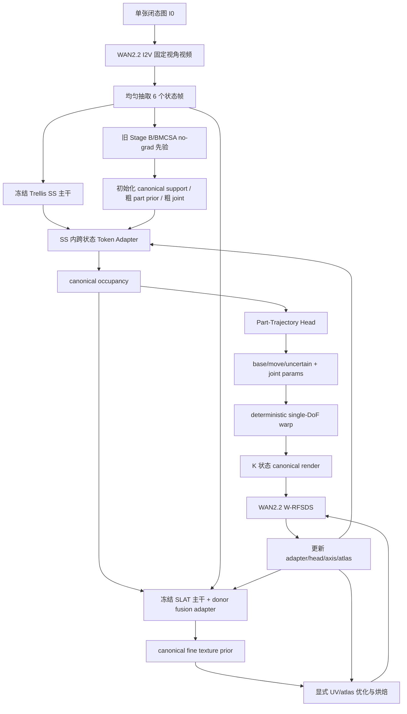
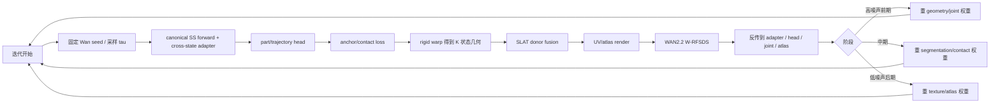

# 基于 Trellis 冻结主干的单图铰接拟合研究报告

## 执行摘要

本报告的核心结论是：在你给定的**全部硬约束**下，若仍坚持“把 6 个状态分别喂给 Trellis，再事后对齐”，那么 **voxel 位置偏移、形状抖动、base 不完全对齐** 不是偶发现象，而是这一路线的结构性后果。你指定仓库中的最新主线文档其实已经明确承认这一点：`Stage B` 的 K 并行 SS 采样即便加入 SCAR/BMCSA，也只能**减轻**而不是**消除** base jitter；仓库后续的 `v5 final scheme` 已经把“**单一 canonical sparse structure + 单关节确定性派生 K 状态**”写成主线，因为 K 次独立采样配合硬阈值会把连续 logit 微差放大成离散拓扑差异。fileciteturn73file0 fileciteturn72file0

因此，如果目标是达到 **AAAI 级别、可实现、且在你的约束下真正有创新性**，我不建议继续把“多状态 Trellis 输出对齐”当作最终范式，而建议采用下面这个更稳的主线：**先用旧 Stage B/BMCSA 做一次 no-grad 粗先验与问题定位，再切换到单一 canonical 表示；在 SS 内部做跨状态 token/feature 交互，仅输出一个 canonical 几何；随后以 single-DoF 刚体变换生成各状态；最后在冻结的 SLAT 主干之外，用 donor-fusion + 显式 UV/atlas 优化细粒度纹理，并用 CHORD 风格的 W-RFSDS 做全流程 per-instance 无监督优化。**这条路线既保留了你偏好的“路线 2：在 Trellis SS 内做跨状态交互得到轨迹与分割”，又避开了 K 个 SS 输出必然抖动的根因。fileciteturn76file0 fileciteturn73file0 citeturn19search13turn21search0turn20search0

从工程上看，这条路线与仓库中已有资产高度兼容。当前 repo 已经具备：`SparseStructureFlowModel` 的块级 kwargs 透传、BMCSA/M_attn 的 token-space 逻辑、Pass-1/Pass-2 的 SCAR 框架、`dit_hidden.pt` 的中层特征捕获、以及 SAJO 的 joint-free split 与 anchor 提取链条。也就是说，你并不是从零起步，而是在一个已经“半步迈向 canonical 思路”的代码基上，把它真正收束成**single-canonical articulation + canonical texture**。fileciteturn59file0 fileciteturn76file0 fileciteturn71file0

在资源层面，中资源配置是可行的。官方 `Wan2.2-I2V-A14B` README 明确写到单卡推理需要至少 80GB VRAM；仓库自己的 `v5 final scheme` 又给出了 H800 80GB 下单对象 6–8 小时级别的先验估计。结合你要求的 per-instance 优化、6 状态、单对象 1–2 天预算，我认为**2–4 卡 80G**足以把“canonical SS + 关节 + donor-SLAT + atlas baking”的完整版本跑通。citeturn14view4turn18search0 fileciteturn73file0

## 约束、未指定项与决定性信息需求

先把你的**硬约束**完整重述，因为这直接决定什么路线可以做、什么路线必须放弃。

你的输入被严格限制为：**单张闭态图 + WAN2.2 i2v 生成的单视角打开视频**，不可引入任何额外真实视角；**Trellis 主干必须冻结**，不能微调或再训练，只允许添加 adapter/head/loss/attention 或改变结构外设；**不能使用 SAM / Grounded-SAM / DINO 特征作为分割伪标签初始化**，也不能使用外部分割标注；整个训练范式必须是**完全 per-instance optimization**；最终必须输出**可用 UV/atlas 纹理贴图**；主贡献倾向于**细粒度纹理**，并先做 **single-DoF / single-joint**；路线偏好是**在 Trellis SS 内做跨状态 token/feature 交互，再做纹理，再用 RFSDS 统一优化**。这些约束的合并结果是：你不能走“训练一个 articulated diffusion backbone”的路线，也不能走“借助外部大分割器先造伪标签”的路线；唯一合理的解法，只能是**冻结生成主干 + 测试时实例优化 + 内部可学习小模块**。citeturn14view4turn20search0turn21search0turn19search13

本题真正决定成败的 **info needs** 有六个，而且缺一不可。

第一，必须弄清 **Trellis 在 SS 与 SLAT 两级里，哪些算子会把小的连续差异离散放大成 voxel jitter**。这决定了你到底应该“修补 K 状态对齐”，还是“改成单 canonical 再刚体派生”。仓库 `v5` 文档已经给出强结论：后者才是根本解。fileciteturn73file0

第二，必须弄清 **RFSDS/CHORD 能不能在不训练主干的前提下，稳定地把视频先验梯度传回 articulation 变量与 texture 变量**。如果做不到，后面的 canonical texture 就只能靠启发式融合，AAAI 创新会明显不足。CHORD 的 W-RFSDS 恰好提供了这一条理论与实现路径。citeturn19search13turn19search0

第三，必须弄清 **WAN2.2 在“固定相机、首帧锚定、只让关节打开”的 prompt 约束下，到底能提供多少可靠的 pseudo-state 信息**。官方 README 明确支持 image-to-video、支持“仅从输入图生成视频”、推荐 prompt extension，且 size 跟随输入图长宽比；但官方并**没有**给出专门面向“固定相机铰接视频”的 prompt 模板，因此这部分必须区分“官方明确支持”和“基于最佳实践的保守推导”。citeturn14view4turn18search0

第四，必须弄清 **如何在不使用外部分割监督的情况下，仅靠 SS 内部特征与跨状态差异，联合得到 part segmentation 与 single-joint trajectory**。这正是你偏好的路线 2，也是我认为最有论文价值的一点：把分割和轨迹都建立在**canonical-contact prior + cross-state token interaction**上，而不是建立在后验 graph-cut 或外部 mask teacher 上。fileciteturn76file0 fileciteturn71file0

第五，必须弄清 **SLAT 的哪一层最适合承接 donor fusion 与细粒度纹理增强**。因为你的最终交付不是“可看的高斯颜色”，而是**可导出的 UV/atlas**。Trellis 的 SLAT 端同时支持 Gaussian、mesh、radiance field 三种 decoder，这给你“先用 Gaussian/RF 获得稳定颜色监督、最后 bake 成 UV atlas”留下了很大空间。fileciteturn62file0 fileciteturn63file0 fileciteturn64file0

第六，必须把你新增的物理先验——**base 与 move 必然接触，旋转轴必须穿过接触边界附近 anchor set**——真正数学化成可优化的软 loss，而不是只写成文字直觉。这个点非常重要，因为它既能补足“单视角 + pseudo-video”的几何不充分性，又足够新，适合作为 AAAI 方法学贡献之一。

这里也有若干**未指定/假设**，我不会擅自改约束，而是在后文按低/中/高资源分别给方案：其一，真实照片的背景复杂度与裁剪质量未指定；其二，joint type 是否已知未指定；其三，最终 UV atlas 分辨率未指定；其四，单对象优化步数未指定；其五，真实数据是否带 GT articulation 参数未指定；其六，是否接受把旧 Stage B 仅作为初始化器而非最终主线未指定。后文我都给出可落地假设与成本区间。

## 已访问资源与检索顺序

本次研究按你要求，先覆盖已启用连接器与本地快照，再扩展到外部高质量资源。

首先，已启用连接器为：entity["organization","GitHub","code hosting platform"]、entity["organization","Hugging Face","ml platform"]。按照你本轮任务中显式要求的顺序，我先用 **GitHub 侧资源**审读指定仓库 `chengu-123/research` 的关键实现与文档；随后覆盖 **Hugging Face / 官方页面**上的 Trellis、WAN2.2、MorphAny3D、FreeArt3D、CHORD 等论文/模型资料；最后才补充一般网页与 PDF。fileciteturn58file0 fileciteturn72file0 citeturn14view4turn20search0turn21search0turn19search13

本地快照方面，我先访问了 `/mnt/data/mine.rar`、`/mnt/data/trellis.rar`、`/mnt/data/MorphAny3D.rar`、`/mnt/data/Nano3D.rar`，并确认：`mine.rar` 顶层包含 `TRELLIS/`、`configs/`、`pipelines/`、`scripts/` 共 396 项；`trellis.rar` 顶层为上游 `trellis/` 代码，共 140 项；`MorphAny3D.rar` 顶层为 `MorphAny3D/`，共 201 项；`Nano3D.rar` 顶层为 `Nano3D/`，共 187 项。另有 `/mnt/data/readme.md`、`target.md`、`v6.md`、`v7_1.md`、`v7_2.md`、`文献总结.md` 作为本地设计文档。需要说明的是：在当前环境里，RAR 内容可做目录级访问与核验，但**不能直接生成行级 `filecite`**；因此下文所有可核验的行级代码引用，统一来自 GitHub 连接器抓取到的 `chengu-123/research` 文件。

就仓库阅读顺序而言，我优先打开了真正决定你问题成因与方法方向的文件，而不是从外围脚本开始。顺序如下。

第一组，是 Trellis 主链路与 repo 实际接入点：`TRELLIS/trellis/pipelines/trellis_image_to_3d.py`、`TRELLIS/trellis/models/sparse_structure_flow.py`、`TRELLIS/trellis/models/sparse_structure_vae.py`、`TRELLIS/trellis/models/structured_latent_flow.py`、`TRELLIS/trellis/models/structured_latent_vae/decoder_gs.py`、`decoder_mesh.py`、`decoder_rf.py`。这些文件共同决定了 SS 与 SLAT 的数据流、token 化方式、解码方式，以及 jitter 可能出现在哪些层。fileciteturn58file0 fileciteturn59file0 fileciteturn60file0 fileciteturn61file0 fileciteturn62file0 fileciteturn63file0 fileciteturn64file0

第二组，是 repo 现有“多状态 SS 对齐”路线的核心文件：`TRELLIS/trellis/modules/transformer/modulated.py`、`TRELLIS/trellis/pipelines/samplers/flow_euler.py`、`vgcf.py`、`bcac.py`、`scar.py`、`pipelines/stage_b_scar.py`、`configs/v1.yaml`、`record/past/stageB/stageb_detail.md`。这组文件非常关键，因为你的“现有问题”恰好就在这里：它们把 repo 内部已经尝试过的 VGCF、BCAC、SCAR、BMCSA、M_attn、Pass-2 guide 污染等问题写得很清楚。fileciteturn65file0 fileciteturn67file0 fileciteturn68file0 fileciteturn69file0 fileciteturn70file0 fileciteturn76file0 fileciteturn74file0 fileciteturn72file0

第三组，是 repo 中已经朝“single-canonical articulated asset”转向的文件：`pipelines/stage_c_sajo.py`、`pipelines/recon.py`、`record/articulated_2026-04-26_final_scheme.md`。其中 `stage_c_sajo.py` 已经具备 joint-free split、anchor extraction、dual EM 和 BIC selection 的骨架；`recon.py` 则说明了 repo 为了进行 SDEdit Pass-2，专门手动加载了 `SparseStructureEncoder`；而 `v5 final scheme` 文档已经把 canonical base/move 与 rigid transform 派生 K 状态的路线讲清楚了。fileciteturn71file0 fileciteturn75file0 fileciteturn73file0

外部资料方面，我优先选择了**原始论文页、官方 README、官方项目页**。覆盖范围包括：Trellis 官方页面；WAN2.2 的官方 GitHub README 与模型/文档入口；CHORD 项目页与论文 PDF；MorphAny3D 的官方论文页；FreeArt3D 的官方论文页；以及 Wan 系列在 diffusers 文档中公开暴露的公共推理接口参数。这样做的理由是：你要求的是**实现性研究报告**，不是泛泛综述，因此比起二手博客，项目页、README、PDF 和仓库源码更有价值。citeturn14view4turn18search0turn19search13turn20search0turn21search0

## 相关论文与实现细节梳理

先说 Trellis。官方项目强调它的核心不是“直接生成 mesh”，而是学习一种**统一的 structured latent representation**，再从这个 latent 解码到不同 3D 表示。你所用 repo 里的实现也与此一致：SS 端是一个 dense 3D latent flow，`SparseStructureFlowModel` 会先 `patchify` 输入 latent，再过一串 `ModulatedTransformerCrossBlock`，最后 `unpatchify` 回 3D latent；SLAT 端则是 sparse tensor 流水线，先做 sparse input/input blocks，再进 sparse transformer cross blocks，最后走不同 decoder。也就是说，Trellis 本身的设计哲学是“**先形成结构，再形成表示**”，这与你想把 part segmentation 与 trajectory 提前做进 SS，纹理放到后面的偏好是对齐的。fileciteturn59file0 fileciteturn61file0 citeturn0search0

用公式写，SS 端本质上是一个 flow-matching velocity model。repo 中 `FlowEulerSampler` 的更新规则很清楚：在每一步 `t → t_prev`，先由模型预测速度 `v_θ(x_t,t,c)`，再做 Euler 更新
\[
x_{t_{\mathrm{prev}}}=x_t-(t-t_{\mathrm{prev}})\,v_\theta(x_t,t,c).
\]
同时，`_v_to_xstart_eps` 会把速度参数化还原成 `x_0` 与 `\epsilon` 估计。也就是说，SS 端不是 score-based DDPM 式噪声预测，而是 rectified-flow / flow-matching 风格的**速度场积分**。这点对你非常重要，因为任何“中途硬性 warp 后再回灌网络”的方案，都会更容易破坏这条 OT-like 轨迹。fileciteturn67file0

SS-VAE 侧，repo 里 `SparseStructureEncoder` 与 `SparseStructureDecoder` 是标准的 3D ResBlock + downsample / upsample 结构：encoder 从 `64^3` occupancy 经过 3D conv/resblock/downsample 得到 latent，decoder 再从 latent 回到 occupancy logits。这里有两个实现细节值得记住。其一，encoder/decoder 都是**局部 3D 卷积金字塔**，所以对边界很敏感，任何 guide 的局部污染都会在回编码时“压缩进 16^3 latent”；其二，Pass-2 guide 需要手动加载 encoder，因为默认 Trellis inference pipeline 并不打包它，这一点 `recon.py` 写得很清楚。fileciteturn60file0 fileciteturn75file0

SLAT 侧，`SLatFlowModel` 使用 sparse tensor 输入、稀疏 resblock、稀疏 cross-attention 与 skip connection，把 canonical sparse support 上的特征推进到结构化 latent；然后不同 decoder 分别生成不同表示。Gaussian decoder 会为每个 active voxel 预测 `_xyz`、`_features_dc`、`_scaling`、`_rotation`、`_opacity`，并通过 `tanh(offset)` 与可选 `offset_perturbation` 生成 voxel 内子高斯偏移；mesh decoder 通过两级 `SparseSubdivideBlock3d` 上采样后接 `SparseFeatures2Mesh`；radiance-field decoder 则输出 trivec/density/color。你要做细粒度纹理，最稳妥的不是直接在 mesh decoder 末端硬改，而是把**Gaussian / RF 色彩分支当可导先验**，最后再 bake 到显式 UV。fileciteturn62file0 fileciteturn63file0 fileciteturn64file0

再说 CHORD / RFSDS。CHORD 的关键贡献不是几何表征本身，而是把视频模型的 rectified-flow 输出转成可用于 4D / 动态场景优化的蒸馏梯度。项目页与论文摘要明确说它将静态 3D 对象转成可动 4D 场景，并通过一种加权的 rectified-flow SDS 变体来更新 4D 表示；论文可见段落直接给出一个核心梯度形式：
\[
\nabla_\theta L_{\mathrm{W\text{-}RFSDS}}
=
\mathbb{E}_{\tau,\epsilon}
\Big[
(\hat v(z_\tau;\tau,y)-\epsilon+z)
\,\frac{\partial z}{\partial\theta}
\Big],
\]
并说明其训练中使用了退火噪声调度。对你的问题，这意味着：你完全可以把视频先验梯度送到**adapter、joint 参数、UV atlas、texture residual**这些新增变量，而不动 Trellis / Wan 主干。citeturn19search0turn19search13

FreeArt3D 的价值不在你要直接照搬它的 pipeline，而在于它证明了“**预训练静态 3D diffusion + per-instance optimization**”这一路子对于 articulated object 是能打的，而且它明确把 articulation 当成额外生成维度，把 geometry、texture、articulation parameter 一起做 per-instance 优化。它还强调 training-free、用稀疏状态图像联合优化、几分钟到几十分钟级别完成一个对象。这给你的方法一个很强的论文位姿：你不是在做“新 backbone 训练”，而是在做“**冻结 native 3D prior 的 articulated lifting**”。你还可以借用它的“grounding disk / carpet 移除”小技巧，当成 occupancy 后处理与 base 清洁先验。citeturn20search0 fileciteturn74file0

MorphAny3D 对你最有价值的，则是它对 SLAT 层内 attention 的改造思想。它提出的 MCA 与 TFSA，本质上都在说明：**不改主干权重，只在 attention 路径上做 source/target feature blending，就能把 structured latent 用起来**。这恰好能被你推广为 K-way donor fusion：不是“source/target morphing”，而是“closed/open/intermediate states for articulated texture completion”。因此，你的细粒度纹理主贡献最应该落在 SLAT 的 donor-fusion 与显式 atlas 上，而不应该落在重新发明一个全新的 3D texture backbone。citeturn21search0

最后说 WAN2.2。官方 README 明确支持 `i2v-A14B`，说明图生视频任务可以**仅从输入图生成视频**，推荐使用 prompt extension，且 `size` 参数代表生成视频面积，长宽比跟随原始输入图；单卡运行 `I2V-A14B` 需要至少 80GB VRAM。另一方面，官方并没有给出“固定相机铰接视频”的专用 prompt 模板；Wan-family 在公开接口中的一般默认则常见为 `num_frames=81`、`num_inference_steps=50`、`guidance_scale=5.0`。因此，关于 prompt 里的**静态相机约束语言**，我会在后文给出**保守推导模板**，并明确标注“这是基于官方能力边界与公开视频最佳实践的建议，而不是 README 明文模板”。citeturn14view4turn18search0

## Trellis 层级解析与 voxel 漂移根因定位

如果只看你当前现象，“六个状态图片给 Trellis 之后 voxel 有位置偏移、形状抖动、base 未完全对齐”，最容易误判成“还差一个更强的对齐 loss”。但把 repo 代码和文档前后读通之后，结论并不是这样。

SS 端的主路径是：`x -> patchify -> Linear -> pos_emb -> 多层 ModulatedTransformerCrossBlock -> layer norm -> out_layer -> unpatchify`。这意味着，只要每个状态的条件 `cond` 有微小差异，即便初始噪声共享，后续每一层的 cross-attention 注入也会把这点差异逐层放大。repo 中的 VGCF、BCAC、SCAR、BMCSA 全都在试图抑制这一点：VGCF 在速度空间加 consensus force，BCAC 在 block 输出层做跨状态共识融合，SCAR 在 latent 级做对称混合，BMCSA 则在 self-attention 输出上用 `M_base` 做 gated blend。它们都有效，但仓库文档反复说明：它们只能“reduce drift”，做不到从根上消除 K 独立采样的 topology jitter。fileciteturn59file0 fileciteturn68file0 fileciteturn69file0 fileciteturn70file0 fileciteturn72file0 fileciteturn73file0

repo 文档已经把一个最重要的根因点明了：**K 次独立 SS 采样 + 后续 `(soft > 0.5)` 或 `argwhere(>0)` 的硬阈值，会把连续 occupancy logit 的小差异直接放大成离散 voxel 拓扑差异。**这不是 loss 不够，而是离散化位置太靠前。仓库 `v5 final scheme` 正是因此明确放弃 K-batched SS 作为最终主线，改成“single canonical SS + deterministic rigid transform 派生 K 状态”。如果你继续维持 K 个终态几何，再加更多 patch，只会在工程上越来越复杂、故事上越来越弱。fileciteturn73file0 fileciteturn72file0

更具体地说，repo 当前 Stage B 里至少有八类数学与实现层面的抖动根因，可以逐层对应到代码。

第一，**cross-attention 条件分歧**。`SparseStructureFlowModel.forward` 里每个 block 都会把 `cond` 送进 `ModulatedTransformerCrossBlock`；而 `ModulatedTransformerCrossBlock` 包含 self-attn、cross-attn、FFN 三段。也就是说，你的 6 个状态不是“同一个网络只改个输出头”，而是每层都在被不同的图像条件重写。只要 `c_k` 不同，base 区域就会逐层发生 condition-driven drift。fileciteturn59file0 fileciteturn65file0

第二，**guide 回编码量化**。当前 repo 的 Pass-2 会把 `64^3` 的 `P_guide` 二值化，再送进 `SparseStructureEncoder` 回到 `16^3×8` latent，然后再去噪回 `64^3`。这等价于做了一次 `64^3 -> 16^3 -> 64^3` 的结构压缩-重建，对边界和薄片最敏感。你如果把多状态几何误差寄希望于 Pass-2 纠正，反而会放大这类量化误差。fileciteturn60file0 fileciteturn76file0

第三，**token-space / spatial-space 错配**。repo 文档专门记录过一次 BMCSA bug：误把 token 数当成 `8^3=512`，而实际 `Trellis-image-large` 是 `resolution=16, patch_size=1`，所以 token 数是 `16^3=4096`。这类“token resolution 假设错误”会直接导致 `M_base` pooling 错位，进一步制造 base gate 的空间污染。fileciteturn72file0 fileciteturn74file0

第四，**long-drawer 几何共识污染**。这是你现在问题里非常关键的一点。repo 文档明确指出，对于长抽屉、小位移的 prismatic case，某些 trajectory 中段 voxel 会因为被多个状态重复占据而被 `mean over K` 错误地判断成 base，继而在 BMCSA 或 guide 构造中把“drawer 轨迹中的中段”当成静态柜体。这会让 state 0 被强行补上不该有的 voxels，也会让 guide 的 `P_base_shared` 过大，最终出现你观察到的 base 未对齐、move 被污染。fileciteturn72file0 fileciteturn76file0

第五，**Gaussian decoder 的子 voxel 偏移**。`decoder_gs.py` 里每个 active voxel 都会预测 `_xyz` offset，并通过 `tanh(offset) / resolution * 0.5 * voxel_size` 叠加到 voxel 中心，且还可叠加 `offset_perturbation`。这对高质量细节是好事，但如果 canonical support 本身不稳、或跨状态 donor 没有统一 canonicalization，那么高斯中心会把小边界偏差直接放大成可见位置漂移。fileciteturn62file0

第六，**mesh decoder 的 subdivision 与 iso-surface 灵敏性**。`decoder_mesh.py` 两次 sparse subdivision 后才交给 `SparseFeatures2Mesh`，这使得边界处任何微小特征差异都可能在最后 mesh extraction 阶段表现为不同的三角片连接或薄壳位置，对 multi-state 对齐尤其不友好。fileciteturn63file0

第七，**SLAT 最后表示与最终导出目标不一致**。如果你只在 Gaussian 或 RF 上做颜色，而没有显式 canonical UV/atlas，那么你会得到“某个状态下 render 好看”的表象，却得不到真正可导出的、state-invariant 的 asset。repo 的 `v5` 文档已经反复强调 canonical base / canonical move / canonical texture 的必要性。fileciteturn64file0 fileciteturn73file0

第八，**旧 Stage B 的根本范式问题**。repo 最新 `v5 final scheme` 说得非常直白：Stage B 的 legacy 路线作为 ablation 可以保留，但主线应该改成 single-canonical，因为 “voxel-level base jitter (~±2 voxels) 不可避免”。这是你判断后续工作的关键证据。它意味着：**你现在不应该再问“怎样把 6 个状态更好对齐”，而应该问“怎样把 6 个状态只当条件，而不再让它们各自产生最终几何”**。fileciteturn73file0

基于上面这些证据，我的判断很明确：**真正应该保留的是“SS 内跨状态 token/feature 交互”的思想，不应该保留的是“K 个最终 SS 几何”这一输出形态。**这也是下面 pipeline 的出发点。

## 满足硬约束的完整创新 pipeline

我建议把方法命名为 **Canonical Contact-Constrained RASA for Trellis**。它严格满足你的冻结主干、per-instance、无外部分割标注、单图 + pseudo-video、single-joint、最终可导出 UV/atlas 的约束，同时最大化利用你现有 repo 资产。

先给总图。



这个方案分成五个阶段，但优化外形可以保持成“一条外循环”。关键思想不是堆更多补丁，而是把**canonical 几何**与**cross-state 证据注入**强行绑定在一起。

### WAN2.2 单视角视频生成与状态抽取

官方 README 明确支持 image-to-video、允许仅凭输入图生成视频、推荐 prompt extension，并说明 `size` 跟随输入图长宽比；但官方并**未**出版“固定单视角铰接视频”的专门 prompt 模板。因此，下面提示词是**基于官方能力边界的保守推导**，不是 README 的逐字模板。citeturn14view4turn18search0

**中文正向 prompt 模板：**

> 一个固定机位、固定焦距、单镜头连续拍摄的视频。第一帧尽量严格等于输入图片。相机完全静止，没有平移、没有旋转、没有推拉、没有变焦、没有视角变化。只有【可动部件名称】缓慢、连续、刚性地【滑出/旋开】；物体主体保持静止。材质、纹理、光照、阴影、背景都保持一致。不要出现额外物体，不要出现非刚性形变，不要出现闪烁，不要出现身份漂移。

**英文正向 prompt 模板：**

> A locked-off single-camera video. The first frame should match the input image as closely as possible. The camera is completely static: no pan, no tilt, no orbit, no dolly, no zoom, no viewpoint change. Only the [movable part] rigidly [slides open / rotates open] in a smooth continuous motion. The main body remains stationary. Material, texture, lighting, shadow, and background stay consistent across all frames. No extra objects, no non-rigid deformation, no flicker, no identity drift.

**中文负向 prompt 模板：**

> 相机运动，镜头移动，轨道运动，推拉，变焦，视角变化，背景变化，物体形变，额外部件，纹理闪烁，身份漂移，多物体，剪辑切换，镜头跳变，遮挡物漂移。

**英文负向 prompt 模板：**

> camera motion, pan, tilt, orbit, dolly, zoom, viewpoint change, background change, object morphing, non-rigid deformation, extra parts, texture flicker, identity drift, multiple objects, cuts, shot changes, drifting occluders.

关于具体超参，我把它分成“官方明确”和“保守建议”两层。官方明确的是：`I2V-A14B` 单 GPU 需要至少 80GB，`size` 跟随输入图长宽比，prompt extension 推荐开启。保守建议则是：**固定一个 seed；先生成 81 帧，再均匀抽取 6 帧；推理步数取 50 左右；guidance 取 4.5–6.0；如果背景复杂则多 seed 生成 2–3 条，选取“背景最稳 + 物体主轴最稳”的那条**。其中 `81/50/5.0` 并不是 Wan2.2 README 明文规定，而是 Wan-family 公开 API 常见缺省，因此我把它标记为保守推导。citeturn14view4turn18search0

我建议在生成完视频后，加一个**相机一致性筛选**。不需要外部学习模型，只做经典几何：对背景区域做 KLT / homography 残差，或者对目标框外像素做中值光流统计。若背景运动显著、或闭态物体整体 bbox 出现异常仿射变化，则直接丢掉该 seed。这个筛选对于 single-view fake video 非常重要，因为它相当于在进入 3D 之前先把“最容易让 RFSDS 学坏”的样本去掉。

### 旧 Stage B 只做初始化，不做最终几何

这一步是本报告与仓库现有设计最不同、但也是最务实的一点。

我建议把 `stage_b_scar.py` / BMCSA / M_attn / SAJO 全部**压缩成一个 no-grad initializer**。它的职责只有四个：给出粗 `P_base_shared`、粗 `M_attn`、粗 support voxels、粗 joint 初值；它**不再负责最终 K 状态几何**。这个思路与 repo `v5 final scheme` 的单 canonical 路线是一致的，也能最大限度复用你已经实现的工作。fileciteturn76file0 fileciteturn71file0 fileciteturn73file0

初始化器的输入仍然是 6 个状态帧，输出则定义为：

\[
\mathcal I=\{P_{\text{base}}^{(0)},\,M_{\text{attn}},\,S_0,\,\hat\omega,\,\hat q,\,\hat\phi_k\},
\]
其中 \(P_{\text{base}}^{(0)}\) 是粗 base 概率场，\(M_{\text{attn}}\) 是语义一致性 mask，\(S_0\) 是 canonical support 候选，\((\hat\omega,\hat q,\hat\phi_k)\) 是粗 axis / point / state value 初始化。这里 `SAJO` 的 `joint_free_split`、`extract_anchors`、dual EM 与 BIC selection 可以直接沿用，尤其适合在 single-joint 先做可靠初始化。fileciteturn71file0

FreeArt3D 的“地毯 / grounding disk 移除”则作为一个小但很值的预处理保留。repo 的 `v1.yaml` 已经把 `remove_disk: true` 写进了 `stage_b`，说明这一路径在当前代码里是现成的。我的建议是：**把 remove_disk 固化为所有 occupancy 级别操作的标准前处理**，包括 `P_base_shared` 的构造、anchor 提取、粗 support 拟合。对于 drawer / cabinet 这类靠地摆放的品类，它能有效降低 base 区域被地面支持污染的概率。fileciteturn74file0

### SS 内跨状态交互与 canonical part/trajectory 预测

这一步是你方法的第一主贡献。

注意，我并不建议在最终方案里保留 K 个 SS 终态 latent；但我完全建议在 **SS 的中间层里显式做跨状态 token 交互**。具体来说，我建议保留一个**单一 canonical latent trajectory** \(z_t^\star\)，而把 6 个状态帧都仅当作 condition token 源。这样既满足你偏好的“路由 2”，又避免 K 终态几何的结构性抖动。

因为 `SparseStructureFlowModel` 的 block 本来就接收 `cond`，你不需要改 Trellis 主干，只需要在 block 前后加一个**零初始化的 Cross-State Context Adapter**。形式如下：

\[
\bar c = \operatorname{Concat}_{k=0}^{K-1}\big(c_k + e_k + e_{\Delta\phi_k}\big) \in \mathbb{R}^{(KN_c)\times d},
\]
\[
\Delta h_\ell = W_o^\ell \Big( \operatorname{CrossAttn}(h_\ell,\bar c) - \operatorname{CrossAttn}(h_\ell,c_0) \Big),
\]
\[
h_\ell' = h_\ell + \alpha_\ell \, g_\ell \odot \Delta h_\ell .
\]

这里 \(h_\ell\) 是 canonical SS 流中的第 \(\ell\) 个 block token；\(c_k\) 是第 \(k\) 个状态的 frozen image tokens；\(e_k\) 是状态位置编码；\(e_{\Delta\phi_k}\) 是相对开合量编码；\(W_o^\ell\) 零初始化；\(\alpha_\ell\) 也是从 0 开始；\(g_\ell\) 是一个小 gating head，主要在 uncertain / move 区域开放，在 base 区域尽可能抑制残差。这一设计的优点是：**初始化时严格退化为 vanilla Trellis**，不会像显式 SE(3) warp-in-the-loop 那样从第一步就把 flow 轨迹打坏。它与 repo 现有 BMCSA 的方向一致，但比 BMCSA 更进一步：BMCSA 只是“在已有 K 轨迹间做共识门控”，而这里是“让 K 个状态只作为条件来生成一个 canonical 轨迹”。fileciteturn65file0 fileciteturn76file0

具体插层位置，我建议不要全层铺满，而是选**中后层三处**，对应当前 repo 已经验证过的 mid-late semantic sweet spots。`stage_b_scar.py` 默认捕获的块是 `{14,16,18}`；`v5 final scheme` 文档则建议 `{16,19,22}` 一类中后部块位。考虑泛化性，我建议在实现上按**相对深度**定位：若总 block 数为 \(L\)，则取 \(\{ \lfloor 0.58L \rfloor,\lfloor 0.75L \rfloor,\lfloor 0.92L \rfloor\}\)。这样不依赖 checkpoint 具体层数。fileciteturn76file0 fileciteturn73file0

在这三处 block 的输出之上，接一个 **Part-Trajectory Head**。它不需要大，只需要把三处 token 多尺度汇聚后预测四类场：base / move / uncertain / empty，以及 single-joint 参数。具体可写成：

\[
F = \operatorname{Fuse}(h_{\ell_1},h_{\ell_2},h_{\ell_3}),
\]
\[
[\ell_b,\ell_m,\ell_u] = \operatorname{MLP}_{\text{part}}(F),
\qquad
s_b=\sigma(\ell_b),\; s_m=\sigma(\ell_m),\; s_u=\sigma(\ell_u),
\]
\[
(\omega,q,\{\phi_k\}) = \operatorname{MLP}_{\text{joint}}(\operatorname{Pool}(F,s_m,s_u)).
\]

如果 joint type 已知，就只回归对应参数；如果未知，就并行输出 revolute / prismatic 两个 branch，再用 BIC/AIC 式能量做选择，这与 repo 当前 SAJO 的双分支思路是一致的。fileciteturn71file0

### Anchor-based soft loss 的数学化与纳入总损失

这是你新增先验里最值得写进论文主文的部分。

先定义 canonical 下的 soft base/move mask：
\[
s_b(x)=\sigma(\ell_b(x)),\qquad s_m(x)=\sigma(\ell_m(x)).
\]

定义 soft 接触边界场。为了避免把整个重叠区都当作 contact，我建议用“边界强度 + 区域近邻”的联合形式：

\[
\partial_b(x)=\|\nabla s_b(x)\|_2,\qquad
\partial_m(x)=\|\nabla s_m(x)\|_2,
\]
\[
c(x) = \sigma\!\left(\frac{\partial_b(x)\partial_m(x)-\tau_c}{\tau_g}\right)
       \cdot
       \sigma\!\left(\frac{s_b(x)+s_m(x)-\tau_o}{\tau_g}\right).
\]

然后从 \(c(x)\) 中提取离散 anchor set \(A=\{(a_n,w_n)\}_{n=1}^N\)。做法是：在 `c(x)` 上取 top-\(N\) 局部峰值，再做带权 Farthest Point Sampling / NMS；权重令 \(w_n \propto c(a_n)\)，归一化后为 \(\bar w_n\)。

对 **revolute**，设预测轴为单位方向 \(\omega\) 与轴上一点 \(q\)。anchor 到轴线的距离为
\[
d_n^{\text{rev}}=\left\|(I-\omega\omega^\top)(a_n-q)\right\|_2.
\]
为了表达“轴应穿过 contact anchor 的窄邻域”，不要用 hard min，而用 soft-min / soft coverage：
\[
L_{\text{anchor}}^{\text{rev}}
=
-\log\sum_{n=1}^N \bar w_n
\exp\!\left(-\frac{(d_n^{\text{rev}})^2}{2\sigma_a^2}\right).
\]
这等价于鼓励**至少有一簇高权重 anchor 离轴很近**，同时保持可导。

对 **prismatic**，你的要求是“滑动方向对 anchor band 的软约束”。我建议把 anchor set 的加权协方差写出来：
\[
\mu_A=\sum_n \bar w_n a_n,\qquad
\Sigma_A=\sum_n \bar w_n (a_n-\mu_A)(a_n-\mu_A)^\top.
\]
取最大特征向量 \(e_1\) 作为 anchor band 的主方向。若平移方向为单位向量 \(\hat v\)，则方向项：
\[
L_{\text{dir}}^{\text{pris}}=1-|\hat v^\top e_1|.
\]
同时要求 anchor set 在法平面上靠近一条与 \(\hat v\) 平行的窄带：
\[
d_n^{\text{pris}}=\left\|(I-\hat v\hat v^\top)(a_n-\mu_A)\right\|_2,
\]
\[
L_{\text{band}}^{\text{pris}}
=
-\log\sum_{n=1}^N \bar w_n
\exp\!\left(-\frac{(d_n^{\text{pris}})^2}{2\sigma_a^2}\right).
\]
最终
\[
L_{\text{anchor}}^{\text{pris}}
=
L_{\text{dir}}^{\text{pris}}+\lambda_{\text{band}}L_{\text{band}}^{\text{pris}}.
\]

为了表达“base–move 边界应形成连通或近连通接触区”，我再加一个 anchor-graph 连通性正则。对 anchor 做 \(k\)-NN 图 \(G=(A,E)\)，边权
\[
\alpha_{ij}=\exp\!\left(-\frac{\|a_i-a_j\|_2^2}{2r^2}\right).
\]
定义归一化 anchor 强度 \(g_i=\bar w_i/\sum_j \bar w_j\)，则
\[
L_{\text{conn}}=
\frac{\sum_{(i,j)\in E}\alpha_{ij}|g_i-g_j|}
{\sum_i g_i+\epsilon}.
\]
这个项越小，说明高置信 anchor 更容易形成连续带，而不是碎成一堆孤立点。

最后，把它们纳入总损失。对 single-joint 场景，我建议总损失写成：

\[
L_{\text{total}}
=
\lambda_{\text{rf}}L_{\text{W-RFSDS}}
+\lambda_{\text{rest}}L_{\text{rest-anchor}}
+\lambda_{\text{seg}}L_{\text{seg}}
+\lambda_{\text{rigid}}L_{\text{rigid}}
+\lambda_{\text{mono}}L_{\text{mono}}
+\lambda_{\text{contact}}L_{\text{contact}}
+\lambda_{\text{anchor}}L_{\text{anchor}}
+\lambda_{\text{conn}}L_{\text{conn}}
+\lambda_{\text{tex}}L_{\text{tex}}.
\]

其中 `revolute` 时 \(L_{\text{anchor}}=L_{\text{anchor}}^{\text{rev}}\)，`prismatic` 时 \(L_{\text{anchor}}=L_{\text{anchor}}^{\text{pris}}\)。推荐调度是：前 10% 迭代只给很小的 \(\lambda_{\text{anchor}}\) 与较大的 \(\sigma_a\)；中期逐渐把 \(\sigma_a\) 从 4 voxel 缩到 1 voxel；后期再抬高 \(\lambda_{\text{anchor}}\)，把 axis / slide direction 精修到 contact band 附近。这种 coarse-to-fine 调度比一开始就强压 contact 更稳定。

对应伪代码如下。它是**你论文方法节可以直接放的级别**。

```python
# inputs: base logit lb, move logit lm, joint params theta
# theta = (omega, q, phi_k) for revolute
# theta = (v_hat, phi_k) for prismatic

sb = sigmoid(lb)              # canonical base prob
sm = sigmoid(lm)              # canonical move prob

db = grad_norm(sb)
dm = grad_norm(sm)
contact = sigmoid((db * dm - tau_c) / tau_g) * sigmoid((sb + sm - tau_o) / tau_g)

anchors, weights = weighted_local_peaks_and_fps(contact, topN=N)
weights = weights / (weights.sum() + 1e-8)

if joint_type == "revolute":
    d = [norm((I - outer(omega, omega)) @ (a - q)) for a in anchors]
    L_anchor = -log(sum(w * exp(-(di**2) / (2 * sigma_a**2)) for w, di in zip(weights, d)) + 1e-8)

else:  # prismatic
    mu = sum(w * a for w, a in zip(weights, anchors))
    Sigma = sum(w * outer(a - mu, a - mu) for w, a in zip(weights, anchors))
    e1 = principal_eigenvector(Sigma)
    L_dir = 1.0 - abs(dot(v_hat, e1))

    d = [norm((I - outer(v_hat, v_hat)) @ (a - mu)) for a in anchors]
    L_band = -log(sum(w * exp(-(di**2) / (2 * sigma_a**2)) for w, di in zip(weights, d)) + 1e-8)
    L_anchor = L_dir + lambda_band * L_band

# anchor connectivity regularization
E = knn_graph(anchors, k=8)
L_conn = sum(alpha(i, j) * abs(weights[i] - weights[j]) for (i, j) in E) / (weights.sum() + 1e-8)

L_total = (
    lambda_rf * L_wrfsds
    + lambda_rest * L_rest
    + lambda_seg * L_seg
    + lambda_rigid * L_rigid
    + lambda_mono * L_mono
    + lambda_contact * L_contact
    + lambda_anchor * L_anchor
    + lambda_conn * L_conn
    + lambda_tex * L_tex
)
```

### canonical warp 与 K 状态派生

一旦有了 canonical base / move mask 和 joint 参数，K 状态几何就不能再来自 K 次独立 Trellis 输出，而应该来自**解析式刚体派生**。这是整条路线最关键的“消 jitter”步骤。

对 prismatic：
\[
T_k(x)=x+\phi_k \hat v.
\]

对 revolute：
\[
T_k(x)=R(\omega,\phi_k)(x-q)+q,
\]
其中 \(R(\omega,\phi_k)\) 用 Rodrigues 公式。

训练时不要急着做 hard occupancy union，而应该保持 soft 形态：
\[
P_b(x)=s_b(x)\,O^\star(x),\qquad
P_m(x)=s_m(x)\,O^\star(x),
\]
\[
P_{m,k}(x)=\operatorname{grid\_sample}(P_m,T_k^{-1}(x)),
\]
\[
P_k(x)=1-(1-P_b(x))(1-P_{m,k}(x)).
\]

这一步一旦采用，你的 base 一致性就不是 soft loss 逼出来的，而是**由构型定义保证**。这也是为什么我认为它比继续打磨 BMCSA 更适合 AAAI：叙事更清楚，理论更干净，实验也更容易做出显著差距。

### voxel 后的 SLAT 优化、细粒度纹理与 UV/atlas 输出

这是你的第二主贡献。

我的建议是分成**两层纹理变量**来做，而不是只押注在 SLAT latent 上。

第一层，是 **canonical SLAT donor fusion prior**。做法是：固定 canonical 几何与已估 joint 参数，对每个状态 \(k\) 都用冻结的 SLAT 主干得到 donor appearance feature \(F_k\)；但所有 donor 的可见颜色，都通过 inverse transform / visibility projection 回到同一个 canonical 表面参数域。这里最适合借用 MorphAny3D 的 MCA/TFSA 思想：把 source-target 双分支扩展成 K-way donor 分支。citeturn21search0

第二层，是 **显式 UV/atlas**。因为最终交付是 URDF-ready asset，所以必须显式有一张 atlas。流程如下：

\[
\text{Mesh}^\star \xrightarrow{\text{UV unwrap}} (V,F,\mathrm{uv}),
\]
\[
T_{\text{uv}} \in \mathbb{R}^{H\times W\times 3},
\]
\[
\hat C_k(p) = \Pi_k\!\left(T_{\text{uv}}(\mathrm{uv}(p))\right),
\]
其中 \(\Pi_k\) 是 state \(k\) 下的刚体移动和当前相机投影。然后把 donor 颜色与 atlas 联合优化：

\[
T_{\text{uv}}(u)
=
\frac{\sum_{k} w_k(u)\, \tilde C_k(u)}
{\sum_k w_k(u)+\epsilon}
+ \Delta T(u),
\]
其中 \(\tilde C_k(u)\) 是 donor state \(k\) 投到 canonical UV 上的观测颜色，\(w_k(u)\) 则由 visibility、视角夹角、图像清晰度、状态可信度共同决定。对隐藏表面，你要求“可由跨状态融合完成”，这在 drawer / cabinet / microwave 这些类别里其实非常合理，因为 closed/open 状态天然提供互补可见面。对于依然从未观察到的 texel，则由 canonical SLAT prior + TV regularization 填补，并在 `texture_provenance.json` 中标为低置信来源。fileciteturn62file0 fileciteturn64file0 citeturn21search0turn19search13

这一阶段的真正创新点，不是“我又优化了一张贴图”，而是：**把 RFSDS 只作用在 state-consistent canonical texture 上，而不是 K 张 state-specific texture 上。**这样你导出的 asset 在物理上是自洽的：base 纹理与 move 纹理都不依赖具体 state。repo `v5 final scheme` 其实已经把这个逻辑写得很清楚；你现在要做的是把它从文档变成真正可跑的代码，并且把“atlas baking”做实。fileciteturn73file0

下面给优化外循环。



### 训练与优化步骤表

下表是我建议的**单对象 per-instance 优化计划**。它是实际可跑的，不是论文式空表。

| 阶段 | 迭代范围 | 冻结 / 更新 | 主要目标 | 主要损失 | 备注 |
|---|---:|---|---|---|---|
| 初始化 | 0 | 全冻结 | 生成 WAN 视频、旧 Stage B 粗先验、粗 joint | 无 | no-grad |
| 几何热启动 | 1–300 | 只更新 SS adapter、Part/Joint Head | 稳定 canonical occupancy，避免 move 吞掉 base | `L_rest`, `L_seg`, `L_rigid`, 小权重 `L_anchor` | 纹理关闭 |
| 结构收敛 | 301–1200 | 更新 SS adapter、Part/Joint Head | 收敛 base/move 分割与 joint 轨迹 | `L_wrfsds`, `L_seg`, `L_rigid`, `L_mono`, `L_anchor`, `L_conn` | `sigma_a` 从大到小退火 |
| 纹理预热 | 1201–1800 | 额外更新 SLAT donor adapter、atlas residual | 建立 canonical donor fusion | `L_wrfsds`, `L_tex`, `L_rest` | 几何学习率降 10× |
| 纹理精修 | 1801–2600 | 重点更新 atlas residual 与 color adapter | 细粒度纹理、隐藏区域补全 | `L_wrfsds`, `L_tex`, `L_uv_tv`, `L_seam` | geometry 基本冻结 |
| 导出 | 最终 | 无 | bake mesh + atlas + URDF | 无 | 仅导出 |

推荐伪代码如下。这里 deliberately 不引入任何 backbone 微调。

```python
# phase 0: pseudo-state generation
video = wan22_i2v(I0, prompt_pos, prompt_neg, seed=s, num_frames=81)
states = sample_6_states(video)
init = run_stageB_initializer(states)  # no-grad

# phase 1: canonical geometry
theta = init_joint_params(init)
phi = init_state_values(init)
adapter_ss = ZeroInitSSAdapter()
part_head = PartTrajectoryHead()
adapter_slat = ZeroInitSLATDonorAdapter()
atlas = init_uv_atlas()

for it in range(max_iters):
    tau = schedule_tau(it)

    # canonical SS forward
    occ_star, hidden = ss_canonical_forward(
        I0, states, init_support=init.support,
        adapter=adapter_ss
    )

    # part segmentation + trajectory
    masks, theta, phi = part_traj_head(hidden, occ_star, init.theta0)

    # anchor/contact losses
    L_anchor, L_conn = anchor_contact_losses(masks, theta)

    # derive K states analytically
    occ_states = rigid_warp_states(occ_star, masks, theta, phi)

    # canonical SLAT donor fusion + atlas
    donor_feats = slat_donor_forward(states, occ_states, adapter_slat)
    tex_star = fuse_to_canonical_texture(donor_feats, atlas, theta, phi)

    # differentiable render
    video_render = render_locked_camera(occ_states, tex_star, theta, phi)

    # Wan2.2 W-RFSDS
    L_rf = wrfsds(video_render, I0, prompt_pos, tau)

    # other losses
    L_total = build_total_loss(L_rf, masks, theta, phi, L_anchor, L_conn, tex_star, I0, it)

    optimizer.zero_grad()
    L_total.backward()
    optimizer.step()

export_mesh_uv_urdf(occ_star, masks, theta, phi, tex_star)
```

## 实验设计、消融、资源方案与优先参考资料

### 评价指标与对比实验

由于你的目标是“分割 + 轨迹 + 细粒度纹理”，我建议指标体系也必须三分，不要只报 geometry。

**几何与分割**：canonical mesh 的 Chamfer / F-score；base IoU、move IoU；以及一个专门针对本文问题的 **Base Jitter Score**
\[
J_{\text{base}} = 1 - \frac{1}{K}\sum_k \operatorname{IoU}(B_k,\bar B),
\]
这里 baseline 用旧 Stage B 的 K 个 base；你方法里由于 by-construction，理论上 \(J_{\text{base}}\) 会显著更低。这是非常适合放进主文的指标。

**关节与轨迹**：joint type accuracy；revolute 轴角误差、轴上一点到 GT 轴距离；prismatic 方向误差、位移 MAE；以及本文新增的 **Anchor-Axis Distance**
\[
\operatorname{AAD}=\min_n d_n^{\text{rev}}
\quad\text{or}\quad
\min_n d_n^{\text{pris}},
\]
它能直接证明 anchor soft loss 的价值。

**纹理与视频一致性**：state render 的 PSNR / SSIM / LPIPS；UV seam energy；隐藏区域 texel coverage ratio；以及 first-frame identity consistency。考虑到 WAN 视频是伪监督，我建议额外报告一个 **跨状态 canonical texture consistency**：同一 canonical texel 从不同 donor 状态反投影回来，其颜色方差的均值。

**推荐 baseline** 至少包括四组。其一，**Plain Trellis per-state**：六状态独立跑，不做对齐；其二，**repo 旧 Stage B v4.3 BMCSA**：这是你最核心的历史 baseline；其三，**FreeArt3D adapted-to-pseudo-states**：把 6 个 WAN 状态当作 few-state 输入图片，做 per-instance joint optimization；其四，**本报告方法**。如果算力允许，再加一个 “canonical geometry but no SLAT/atlas optimization” 的弱版本，专门证明细粒度纹理贡献。fileciteturn72file0 citeturn20search0

### 消融清单

消融一定要围绕“为什么你的路线比旧 Stage B 和普通 FreeArt3D 更合理”来设计，而不是只删删小模块。

| 消融项 | 目的 | 预期现象 |
|---|---|---|
| 去掉 SS 内跨状态 adapter | 证明 route-2 交互必要 | segmentation 与轨迹更不稳，`J_base` 变差 |
| 保留 K 状态几何而非 canonical 几何 | 证明 single-canonical 是关键 | voxel jitter 回来，base 仍抖 |
| 去掉 anchor-based soft loss | 证明 contact prior 有用 | revolute 轴更漂，prismatic 方向更易偏 |
| 去掉 `L_conn` | 证明 contact 带连通性有用 | anchor 更碎，轴点不稳 |
| 去掉旧 Stage B 初始化 | 证明 repo 资产可有效利用 | 收敛更慢，support / joint 初值更差 |
| 去掉 donor-SLAT，仅做 atlas averaging | 证明细粒度纹理 prior 有用 | 纹理锐度、隐藏面补全变差 |
| 去掉显式 atlas，仅保留 Gaussian/RF 颜色 | 证明 UV/atlas 必要 | 最终导出不可用，state-invariant texture 弱 |
| 去掉 WAN 相机锁定 prompt | 证明 camera consistency 筛选必要 | RFSDS 方向不稳定、几何发散 |

其中“**去掉 anchor-based soft loss**”必须是主表消融之一，因为这是你新增物理先验最清晰、最容易出显著差距的地方。

### 关键超参与建议初值

下面给一套中资源可直接开跑的建议初值。它们不是唯一最优，但都在你的约束下合理。

| 模块 | 建议值 |
|---|---|
| WAN 视频总帧数 | 81 生成、均匀取 6 状态 |
| WAN 推理步数 | 50 左右 |
| WAN guidance | 4.5–6.0 |
| Stage B 初始化 | 旧 BMCSA v4.3，仅 no-grad 跑 1 次 |
| SS adapter 插层 | 相对深度 0.58 / 0.75 / 0.92 |
| SS adapter hidden rank | 64 或 96 |
| canonical occupancy 分辨率 | 64³ |
| anchor 数量 N | 32–128，默认 64 |
| `sigma_a` 退火 | 4 voxel → 1 voxel |
| `lambda_anchor` | 0.05 → 0.5 线性抬升 |
| `lambda_conn` | 0.02–0.05 |
| `lambda_mono` | 0.05 |
| `lambda_rigid` | 0.2 |
| atlas 分辨率 | 1024² 起步，主实验 2048² |
| donor 状态数 | 6 |
| 总迭代数 | 2000–2600 |
| 高噪声几何阶段 | 前 45% |
| 中期结构阶段 | 中间 25% |
| 低噪声纹理阶段 | 后 30% |

### 失败模式分析

这个问题的 failure mode 很集中，我建议你在论文里主动承认，而不是回避。

最常见的是 **WAN 生成相机不锁**。一旦背景或物体整体 pose 出现漂移，后面所有 articulation 优化都会受到污染。因为你没有额外真实视角，所以这一点必须靠 prompt 与 seed 筛选在前端解决。

第二类是 **长轨迹小位移 prismatic**。这正是 repo 当前 BMCSA 文档里花很大篇幅讨论的问题：trajectory 中段会被 `mean over K` 污染成 base。你的 canonical 路线虽能显著缓解，但如果初始化 support 就错得太厉害，仍可能把一部分轨迹吃进 base。此时 anchor-based prismatic band loss 与旧 Stage B 的 `M_attn` 初始化会非常关键。fileciteturn72file0 fileciteturn76file0

第三类是 **旋转对称的 revolute**，例如某些微波炉门、冰箱门、笔记本上盖边缘材质过于规则。这类物体在单视角下容易出现轴位置漂浮，尤其当接触边界很窄或被遮挡时更明显。你的 anchor loss 正是为此准备的，但如果 contact region 在视频里始终不可见，那么轴点仍可能只有弱约束。

第四类是 **从未显露的隐藏内表面纹理**。drawer 内背板、门铰链内侧这类区域，即便 open 状态也未必显露。对这些 texel，任何“完美恢复”都不诚实。我的建议是：显式输出 `texture_provenance.json`，把 texel 分成“直接观测”“跨状态融合观测”“prior hallucinated”三类，这样写进论文反而更可信。

### 低、中、高资源可行方案与成本预估

最后给资源分档。这部分必须实事求是。

| 资源档位 | 推荐配置 | 可运行版本 | 单对象耗时 | 关键瓶颈 | 裁剪策略 |
|---|---|---|---:|---|---|
| 低资源 | 1×24–48GB | `Wan TI2V-5B` 或降分辨率 I2V；K=4；无 donor-MCA，仅 atlas 融合 | 30–48h | WAN 推理、RFSDS 反传、atlas 渲染 | 降到 720p 以下；81 帧改 41 帧；atlas 1024²；关停 TFSA |
| 中资源 | 2–4×80GB | **推荐主实验**：`Wan2.2 I2V-A14B` + canonical SS + donor-SLAT + 2048 atlas | 12–24h | WAN A14B、K=6 donor render、后期纹理精修 | teacher latent 缓存；旧 Stage B 只跑一次；中后期冻结几何 |
| 高资源 | 8×80GB | 多 seed 并行、3 次独立初始化、全量 donor-MCA/TFSA、2048–4096 atlas | 6–10h / run | 多 seed 筛选、后期 texture overfit | 可做 3-seed best-of-3 选择 |

这里有两个缓存建议非常重要。第一，**缓存 Wan teacher 的 VAE latent 与 prompt embedding**，不要每轮都从头 encode；第二，**缓存旧 Stage B 的 \(P_{\text{base}}^{(0)}\)、`M_attn` 与粗 support**，它们不应该进入主循环。什么时候降低 K 或分辨率？规则很简单：如果 80G 都扛不住，就先降 donor fusion 的 K，再降 atlas 分辨率，最后再考虑把 81 帧降到 41 帧；不要先砍 canonical SS，因为那是几何主线。官方 README 说明 `I2V-A14B` 单卡至少 80GB，而 `TI2V-5B` 在 24GB 也可跑；repo `v5` 文档则给出 H800 80GB 下较乐观的 6–8 小时估计。综合你“1–2 天/对象”的预算，我认为中资源档最匹配。citeturn14view4turn18search0 fileciteturn73file0

### 优先参考论文与代码

优先阅读顺序，我建议与本报告保持一致。

首先是你自己的主仓库中最关键的几份文件：`record/articulated_2026-04-26_final_scheme.md`、`record/past/stageB/stageb_detail.md`、`pipelines/stage_b_scar.py`、`pipelines/stage_c_sajo.py`、`configs/v1.yaml`、`TRELLIS/trellis/models/sparse_structure_flow.py`、`structured_latent_flow.py`、`decoder_gs.py`、`decoder_mesh.py`、`decoder_rf.py`。它们共同决定了当前代码基的真实能力边界。fileciteturn73file0 fileciteturn72file0 fileciteturn76file0 fileciteturn71file0 fileciteturn74file0 fileciteturn59file0 fileciteturn61file0 fileciteturn62file0 fileciteturn63file0 fileciteturn64file0

外部论文与项目中，最优先的是 **Trellis 官方项目/论文**、**WAN2.2 官方 README / 模型文档**、**CHORD 项目页与论文 PDF**、**MorphAny3D 官方论文页**、**FreeArt3D 官方论文页**。这五者分别对应：3D structured latent prior、伪状态视频生成器、RFSDS 优化器、SLAT donor fusion 思想、training-free articulated optimization 范式。citeturn0search0turn14view4turn19search13turn21search0turn20search0

如果你问我“优先做什么”，我给的顺序也很明确。第一，**把旧 Stage B 正式降级成 initializer**；第二，**把 canonical SS + cross-state adapter + Part-Trajectory Head 跑通**；第三，**先用简单 donor averaging 跑通 canonical atlas，再升级成 K-way SLAT donor adapter**；第四，**把 anchor-based soft loss 做成主消融点**。只要这四步落地，这个题目就从“修修补补的 Stage B”变成了一个真正像 AAAI 论文的系统。