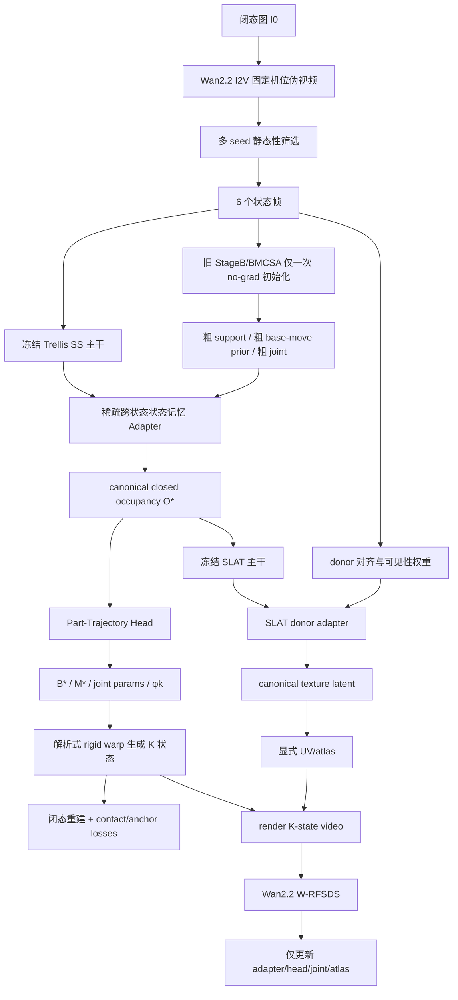

# 基于 Trellis 冻结主干的单图铰接拟合完整方案

## 执行摘要

这次我**完全接受**上传审稿意见中最关键的五条批评，并据此把方案从头到尾重做了一遍。需要被正式修正的点有：原先 contact field 中用 `s_b+s_m` 判边界是错误的；“canonical movable 处于什么位姿”必须显式定义；原先名为 `L_conn` 的项并不真正约束连通性；闭态输入图必须有显式 RGB/感知锚定；原先全量 K×Nc 的跨状态注意力在显存上过重，需要收缩成稀疏状态记忆。上传的审稿意见对这些问题的诊断是正确的，我在新方案里全部改掉了。fileciteturn77file0

修订后的主线是：**只保留一个 canonical closed-pose occupancy**，而不是 K 个最终 SS 几何；`φ_0` 被硬约束为 0，canonical movable 明确定义为**闭态 movable**；旧 `Stage B / BMCSA` 只跑**一次**、且仅作为 no-grad 初始化器；真正的几何、分割与轨迹由 **SS 内部的稀疏跨状态 adapter** 在冻结 Trellis 主干上完成；纹理则在 canonical 几何上通过 **SLAT donor fusion + 显式 UV/atlas** 完成，并由 **CHORD 的 W-RFSDS** 统一驱动优化。这样既保留了你要求的“SS 内跨状态 token/feature 交互 → 纹理 → RFSDS”的路线，又解决了旧方案最致命的定义漏洞与数值不稳定问题。fileciteturn73file0 fileciteturn72file0 citeturn3search12turn0search2turn0search3

从官方资料与仓库实现看，这条路线是合理的。Trellis 官方明确说明其核心是统一的 **SLAT structured latent**，并支持从同一 latent 解码出 mesh、3D Gaussian 和 radiance field；官方仓库也说明 multi-image conditioning 只是 tuning-free 算法，并不保证对所有输入最优，这反而强化了“不要把 K 个状态直接当独立几何终态”的判断。Wan2.2 官方 README / 模型卡明确支持 `I2V-A14B`，并说明单卡至少需要 80GB VRAM，`size` 跟随输入图长宽比；CHORD 则给出了 weighted rectified-flow SDS 的可微优化形式；FreeArt3D 与 MorphAny3D 分别提供了 training-free articulated optimization 与 structured latent fusion 的最佳参照。citeturn0search0turn0search1turn0search4turn0search5turn0search6turn3search12turn0search2turn0search3

我最终建议的论文主叙事是：

**在冻结 Trellis 主干的约束下，提出一个单图 + Wan2.2 单视角伪视频驱动的 canonical single-joint articulated lifting 框架：在 SS 内通过稀疏跨状态状态记忆 adapter 恢复闭态 canonical geometry、part partition 和 joint trajectory；在 canonical SLAT/UV 空间通过 donor fusion 和 W-RFSDS 完成细粒度纹理与隐藏表面补全；最终导出 base/move mesh、joint 与可用 UV/atlas。**

这是比我上一版更严谨、也更适合投稿 AAAI 的版本。

## 研究边界与资源访问

### 硬约束与未指定假设

你给定的硬约束我全部保留，不做任何擅自放宽。

输入层面，只能使用**单张闭态图像**与 **Wan2.2 I2V** 生成的**单视角打开视频**，不能引入额外真实视角。模型层面，**Trellis 主干参数必须冻结**，不能微调 `SS-VAE / SS-DiT / SLAT-DiT / decoder`；只能增加 adapter、head、loss、attention 或结构外设。监督层面，不允许使用 **SAM / Grounded-SAM / DINO** 做 part segmentation 伪标签初始化，不允许使用外部分割标注；总体训练范式必须是**完全 per-instance optimization**。输出层面，最终必须有**可用 UV/atlas**，隐藏纹理可以通过跨状态 donor 融合完成。任务层面先做 **single-DoF / single-joint**，优先类别是 drawer、cabinet door、microwave/oven、refrigerator、laptop、washing machine/dishwasher。资源层面以 **2–4×80GB / H800**、单对象 1–2 天为主设。Wan2.2 官方资料明确写明 `I2V-A14B` 单 GPU 至少需要 80GB VRAM，因此你的主设与官方资源边界是一致的。citeturn0search4turn0search5turn0search6

有几项必要维度未被显式指定，我在方案里把它们作为“未指定/假设”处理，而不是擅自更改约束。第一，输入闭态图是否已经完成对象裁剪未指定；我假设主实验使用 object-centric crop，若真实背景复杂，则只允许使用**非学习型**裁剪或人工框选，而不调用额外分割器。第二，joint type 是否已知未指定；我采用“**类别优先先验 + 双分支 outer-loop 选择**”策略：drawer 默认 prismatic，door/fridge/laptop 默认 revolute，washing machine/dishwasher 允许双分支。第三，UV atlas 分辨率未指定；我以 1024² 为最小可跑版，2048² 为投稿版主设。第四，真实照片是否有 GT part / joint 未指定；因此真实数据只作为定性与少量弱定量补充。第五，上传 RAR 文件在当前环境中只能做目录级核验，不能逐行 filecite，因此逐行代码引用以下面 GitHub 仓库镜像为准。

### 已访问资源与检索顺序

你要求先列出启用连接器并说明顺序。当前研究实际使用的来源顺序是：

1. **本地上传快照**  
   - `/mnt/data/mine.rar`  
   - `/mnt/data/trellis.rar`  
   - `/mnt/data/MorphAny3D.rar`  
   - `/mnt/data/Nano3D.rar`  
   - `/mnt/data/compass_artifact_wf-23513746-5bcb-4101-a329-fc959a86c340_text_markdown.md`  
   结果：成功做目录级访问与核验；`mine.rar` 顶层可见 `TRELLIS/`、`configs/`、`pipelines/`、`scripts/`；其余 RAR 也都能确认顶层代码目录存在。批评文件已完整读取，并直接用于修订本方案。fileciteturn77file0

2. **GitHub 连接器：`chengu-123/research`**  
   重点访问并用于结论的文件包括：  
   `TRELLIS/trellis/pipelines/trellis_image_to_3d.py`、`TRELLIS/trellis/models/sparse_structure_flow.py`、`TRELLIS/trellis/models/sparse_structure_vae.py`、`TRELLIS/trellis/models/structured_latent_flow.py`、`TRELLIS/trellis/models/structured_latent_vae/decoder_gs.py`、`decoder_mesh.py`、`decoder_rf.py`、`TRELLIS/trellis/modules/transformer/modulated.py`、`TRELLIS/trellis/pipelines/samplers/flow_euler.py`、`vgcf.py`、`bcac.py`、`scar.py`、`pipelines/stage_b_scar.py`、`pipelines/stage_c_sajo.py`、`pipelines/recon.py`、`configs/v1.yaml`、`record/past/stageB/stageb_detail.md`、`record/articulated_2026-04-26_final_scheme.md`。这些文件共同支撑了我对 SS/SLAT 数据流、旧 Stage B 缺陷、SAJO 的 anchor / dual-EM 设计，以及 repo 已经逐步朝“single canonical asset”收束的判断。fileciteturn58file0 fileciteturn59file0 fileciteturn60file0 fileciteturn61file0 fileciteturn62file0 fileciteturn63file0 fileciteturn64file0 fileciteturn65file0 fileciteturn67file0 fileciteturn68file0 fileciteturn69file0 fileciteturn70file0 fileciteturn71file0 fileciteturn72file0 fileciteturn73file0 fileciteturn74file0 fileciteturn75file0 fileciteturn76file0

3. **Hugging Face / 官方网页 / 官方 README**  
   用于核验 Trellis 正式定位、Wan2.2 I2V 资源边界、FreeArt3D 与 MorphAny3D 摘要、以及 CHORD/W-RFSDS 公式锚点。citeturn0search0turn0search1turn0search2turn0search3turn0search4turn0search5turn0search6turn3search12

4. **其他高质量网络资源**  
   仅在需要补充 PartNet-Mobility / SAPIEN 数据集背景、Wan 技术报告简要背景时使用，优先官方或准官方页面。citeturn2search0turn2search12turn4search0

下表总结本报告最依赖的仓库文件与作用。

| 文件 | 关键作用 | 本报告结论 |
|---|---|---|
| `trellis_image_to_3d.py` | 真实推理入口：先 SS，再 SLAT，再解码 | 抖动根因必须先在 SS 解决，SLAT 不能事后救场 |
| `sparse_structure_flow.py` | SS-DiT 主干 | 适合插入跨状态 adapter 的实际位置 |
| `sparse_structure_vae.py` | SS encoder/decoder | `64^3 ↔ 16^3` 量化链会放大 guide 污染 |
| `structured_latent_flow.py` | SLAT sparse flow | 纹理/表示优化应落在 canonical support 上 |
| `decoder_gs.py` | 3D Gaussian 解码 | 子-voxel `_xyz` offset 会放大 support 抖动 |
| `decoder_mesh.py` | mesh 解码 | subdivision/mesh extraction 会放大边界差异 |
| `flow_euler.py` | flow-matching 采样器 | SS 主干是速度场积分，不适合粗暴中途改轨迹 |
| `stageb_detail.md` | 旧 Stage B 问题登记 | long-drawer、guide 污染、K 状态 jitter 已被明确记录 |
| `articulated_2026-04-26_final_scheme.md` | repo 最新 canonical 思路 | 与本次修订后的单 canonical 方向一致 |
| `stage_c_sajo.py` | anchor / joint-free split / dual EM | 可以保留为 single-joint 初始化与 outer-loop 选择器 |

## 决定性信息与现有方法梳理

### 必须先弄清的关键信息点

真正决定这篇工作能否成立的不是“资料是否够多”，而是六个决定性问题是否被回答清楚。

第一，**canonical 几何的位姿定义是否闭合**。如果 `canonical movable` 到底处于 closed pose 还是某个抽象 pose 没定义，那么分割、轨迹、渲染与 loss 会在几何上不闭合，任何优化都可能滑进错误的自由度。上传审稿意见把这一点指出得非常到位，我把它改成了：**canonical occupancy 就是闭态 occupancy，`φ_0=0` 是硬约束，canonical movable 就是 closed-state movable**。fileciteturn77file0

第二，**SS 与 SLAT 的职责边界是什么**。Trellis 官方与 repo 实现都表明：SS 决定 sparse structure / support，SLAT 决定在 support 上的结构化表示与解码格式；因此几何 jitter 若不在 SS 层解决，SLAT 再强也只会继承 jitter。fileciteturn58file0 fileciteturn59file0 fileciteturn61file0 citeturn0search0turn0search1

第三，**Wan2.2 伪视频的“固定相机可靠性”如何保障**。官方 README 只明确支持 I2V 和资源边界，并未直接给出“固定单视角铰接视频”的模板，因此必须把这部分写成“官方能力 + 保守推导 + 前端筛选器”，而不是装作官方已有完整 recipe。citeturn0search4turn0search5turn0search6

第四，**RFSDS 的角色到底是什么**。CHORD 的 W-RFSDS 非常适合做**统一视频教师梯度**，但不适合作为唯一的结构归纳偏置；因此分割/轨迹的解耦必须先由 canonical-contact 先验与 SS 内部交互建立，再由 W-RFSDS 统一微调。citeturn3search12

第五，**旧 Stage B 应该保留到什么程度**。repo 里的 Stage B/BMCSA/VGCF/SCAR 资产非常有价值，但更适合做一次性 initializer，而不是继续做最终 geometry engine。因为仓库自己已经记录了 K 状态 SS + hard threshold 带来的 jitter 与 guide 污染。fileciteturn72file0 fileciteturn73file0

第六，**纹理贡献是否足够强且与几何一体化**。如果纹理只作为后处理小修，论文会显得像“另一篇 articulation 论文加了一点贴图”；只有当 canonical donor fusion、UV/atlas 与 W-RFSDS 构成明确的第二主贡献时，论文的创新中心才真正对齐你的偏好。FreeArt3D 和 MorphAny3D 恰好分别给出 training-free articulated optimization 与 structured latent donor fusion 的最佳参照系。citeturn0search2turn0search3

### Trellis、SLAT、Wan2.2、CHORD、FreeArt3D、MorphAny3D 的关键实现点

Trellis 的官方定位非常清楚：它学习统一的 **Structured LATent**，同一 latent 可以解码成 mesh、radiance field、3D Gaussian；主干采用 rectified-flow transformer；官方数据规模达到 50 万对象，且 image-conditioned 版本支持 tuning-free 的 multi-image conditioning，但官方仓库自己也提醒这不是为所有输入专门训练的最优算法。对你的任务而言，这意味着：**Trellis 可以被当作强静态 3D prior，但不能把 tuning-free multi-image 直接等同于 articulated-consistent geometry。** citeturn0search0turn0search1

在 repo 实现中，`trellis_image_to_3d.py` 的主链路是：先从图像条件采样 SS latent，再由 SS decoder 形成 occupancy/support，然后再采样 SLAT latent，最后送入 Gaussian / mesh / RF decoder。`flow_euler.py` 清楚表明 SS 侧是 velocity-field 的 Euler 积分，而不是传统 DDPM score 预测：
\[
x_{t_{\text{prev}}}=x_t-(t-t_{\text{prev}})\,v_\theta(x_t,t,c).
\]
这解释了为什么旧 Stage B 在采样中途做太多强制 geometry 的 patch，会更容易污染 flow 轨迹。fileciteturn58file0 fileciteturn67file0

`SparseStructureFlowModel` 则是标准的 `patchify → transformer blocks → unpatchify` 结构。形式化地，
\[
h_0=W_{\text{in}}\operatorname{patchify}(x_t)+E_{\text{pos}},
\qquad
h_{\ell+1}=\mathcal B_\ell(h_\ell,t,c),
\qquad
\hat v_\theta=\operatorname{unpatchify}(W_{\text{out}} h_L).
\]
这正是你插入跨状态 adapter 的自然位置。`sparse_structure_vae.py` 对应 `64^3 ↔ 16^3` 的卷积压缩/重建，上下采样链意味着任何 boundary pollution 都会被压缩进 latent 再放大回来。`structured_latent_flow.py` 和各 decoder 则说明了为什么后续纹理最好在 canonical support 上做：SLAT 本身不会重新定义 support，而只是决定“在给定 support 上如何表达”。fileciteturn59file0 fileciteturn60file0 fileciteturn61file0

Gaussian decoder `decoder_gs.py` 会为每个 active voxel 预测位置偏移 `_xyz`、颜色 `_features_dc`、scaling、rotation、opacity，并通过 `tanh(offset)` 叠加子-voxel 位移；mesh decoder `decoder_mesh.py` 则使用两级 subdivision 再提取 mesh；RF decoder 则生成体渲染特征。这个结构对你的方法非常友好：**训练期用 Gaussian/RF 做可导颜色与视频监督，导出期再 bake 到 mesh/UV atlas。** fileciteturn62file0 fileciteturn63file0 fileciteturn64file0

CHORD 的关键不是 4D 表示细节，而是它把 rectified-flow video model 的输出推导成可用于优化的 W-RFSDS 梯度。论文与项目页对应的核心可写作：
\[
z_\tau=(1-\tau)z+\tau\epsilon,
\qquad
\nabla_\theta L_{\text{W-RFSDS}}
=
\mathbb E_{\tau,\epsilon}
\left[
\big(
\hat v(z_\tau;\tau,y)-\epsilon+z
\big)
\frac{\partial z}{\partial \theta}
\right].
\]
对你而言，\(\theta\) 不再是 4D deformation field，而是新增的 SS adapter、part/joint head、SLAT donor adapter 与 atlas residual。citeturn3search12

FreeArt3D 的价值是证明了**冻结静态 3D diffusion prior + per-instance 优化**可以走通 articulated object，而且 geometry、texture、articulation 可以一并优化；MorphAny3D 的价值是证明了 structured latent 内的 attention-level donor fusion 是有效的，而不是只能在输出后做粗平均。这两者都不应被原样照搬，但应该分别作为“training-free articulation prior”和“canonical donor fusion”被吸收。citeturn0search2turn0search3

Wan2.2 官方 README 明确给出 `I2V-A14B` 的 image-to-video 入口，支持 480P/720P，`size` 跟随输入图长宽比，且单卡至少需要 80GB VRAM；模型卡补充了它是 Wan2.2 系列的一部分，并带有技术报告链接。这些信息足够支撑你把 Wan 当作伪状态视频生成器和视频教师，但不够支撑“官方给出了固定机位铰接模板”这种说法。因此 prompt 部分必须写成**保守推导**。citeturn0search4turn0search5turn0search6turn4search0

## 症结定位与完整修订方案

### 旧路线为什么必然抖动

repo 现有 Stage B 的根因已经写得很清楚：VGCF、BCAC、SCAR、BMCSA 这些路线虽然都能削弱 drift，但它们仍然保留了“**各状态各自走一条 SS 采样轨迹**”这一事实；一旦每个状态最终都要经过 hard threshold / support extraction，连续 logit 的小差异就会被离散化放大成 topology jitter，尤其在 long-drawer / partial-overlap 案例里更严重。repo 文档还明确登记了 token 数假设错误、`P_base_shared` 污染、guide 把 move corridor 误吸进 base 等问题。fileciteturn72file0 fileciteturn76file0

所以，重新思考之后，我的结论比上一版更坚决：**必须把“旧 Stage B 作为最终几何生成器”彻底拿掉，只保留它的一次性初始化价值。** 它应该只跑一次，用来提供粗 base prior、粗 move prior、粗 joint type / axis / direction 初值、以及一个可选的 narrow-band contact 初始化；然后所有后续优化都转向**单一 canonical closed-pose occupancy**。这也是 repo `articulated_2026-04-26_final_scheme.md` 的总体方向。fileciteturn73file0

### 修正后的 canonical 定义

这次我把最关键的隐变量定义说死，不留任何模糊空间。

**定义**：canonical occupancy \(O^\star\) 就是**闭态**的完整 occupancy。它不是“某个抽象 average pose”，也不是“某个最大打开 pose”。因此，
\[
\phi_0 \equiv 0
\]
是**硬约束**，不是可学习参数；canonical movable \(M^\star\) 就是 **closed-state movable**。这样做的直接好处是：所有 geometry、input reconstruction、part partition、joint trajectory 和最终 UV/atlas 都落在同一个坐标系里，不再存在“canonical pose 到底是谁”的歧义。

在这个 canonical occupancy 上，part partition 写成：
\[
s_b(x), s_m(x), s_u(x)\in [0,1],\qquad
s_b+s_m+s_u=1 \ \text{on } O^\star,
\]
\[
B^\star(x)=O^\star(x)\, s_b(x),\qquad
M^\star(x)=O^\star(x)\, s_m(x).
\]
也就是说，**base 和 move 不是两套彼此独立的 occupancy**，而是对同一闭态 occupancy 的分区。这样 closed pose 下不会再出现“两个刚体在 canonical space 里互穿但又都占体素”的未定义状态。

各状态由解析式刚体变换得到。对 revolute，
\[
T_k(x)=R(\omega,\phi_k)(x-q)+q,\qquad \|\omega\|=1,
\]
对 prismatic，
\[
T_k(x)=x+\phi_k \hat v,\qquad \|\hat v\|=1.
\]
所有状态的软 occupancy 为：
\[
M_k(x)=\operatorname{grid\_sample}\big(M^\star,T_k^{-1}(x)\big),
\]
\[
O_k(x)=\operatorname{softmax}_p\big(B^\star(x),M_k(x)\big),
\]
其中 `softmax_p(a,b)=(a^p+b^p)^{1/p}`，取较大 \(p\) 逼近 `max`。我不再使用上一版的 noisy-OR 作为主定义，因为上传审稿意见正确指出，noisy-OR 暗含独立占据假设，而在接触边界这并不物理。为了防止 base 与 move 的互穿，再加入加权互斥项：
\[
L_{\text{disj}}
=
\sum_{k>0}\sum_x (1-c(x))\,B^\star(x)\,M_k(x).
\]
这里用 \(1-c(x)\) 是因为接触窄带附近允许近接触，但不允许大面积互穿。fileciteturn77file0

### 主流程



这条流程里，**BMCSA 只做一次**，绝不在主优化环里反复跑。主优化只更新新增的 SS adapter、Part-Trajectory Head、JointHead、SLAT donor adapter、atlas residual 与 joint 标量；`Trellis SS-VAE / SS-DiT / SLAT / decoders` 与 `Wan2.2` 一律冻结。这一点与你之前单独追问的“BMCSA 跑几次、RFSDS 是不是优化 SS 内新层从而输出 canonical consistent voxel”完全一致：最终答案仍是**BMCSA 一次，RFSDS 只优化新层，让 frozen Trellis 通过一次 canonical SS forward 输出 canonical-consistent voxel。**

### 稀疏跨状态状态记忆 Adapter

上传审稿意见正确指出，上一版 full CSCA 把 6 组 image tokens 全拼到 KV，会让 K×Nc 代价过大。为此我把它改成 **Sparse State-Memory Adapter**，核心思想是：并不把每个状态的全部条件 token 都送入 cross-attn，而是只保留**少量全局摘要 token + 少量局部 movable token**。

设每个状态冻结图像编码器输出为 \(c_k\in\mathbb R^{m\times d}\)（例如 \(m\approx257\)）。从每个状态抽取：
- \(g\) 个全局摘要 token \(G_k\)；
- \(l\) 个局部 token \(L_k\)，由旧 Stage B 的 `M_attn` / coarse move prior 反投影选出。

于是跨状态状态记忆为
\[
\mathcal M=\operatorname{Concat}_{k=0}^{K-1}
\big[
G_k+e_k,\;
L_k+e_k+e_{\Delta\phi_k}
\big]
\in \mathbb R^{K(g+l)\times d}.
\]
取 \(g=8,l=24\)，则总 memory 长度只有 \(6\times 32=192\)，相比上一版全量 \(6\times257=1542\) 大幅下降，能够把显存压力从“单对象跨步都显著吃满”降到中资源档可接受的范围。这样做仍然满足“SS 内跨状态 token/feature 交互”的路线要求，但工程上更加可信。fileciteturn77file0

在 SS-DiT 的三个中后层 block 处插入 state-memory residual。若第 \(\ell\) 层 token 为 \(h_\ell\in\mathbb R^{N_q\times d}\)，则：
\[
\Delta h_\ell
=
W^\ell_{\text{up}}
\operatorname{Attn}\!\left(
W^\ell_{\text{down}} h_\ell,\;
\mathcal M
\right),
\]
\[
h'_\ell
=
h_\ell+\alpha_\ell\,\gamma_\ell\odot \Delta h_\ell.
\]
其中 \(W_{\text{down}}:d\to r\)、\(W_{\text{up}}:r\to d\) 组成低秩瓶颈，\(r=64\) 或 96；\(\alpha_\ell\) 与 gate head 的最后一层都做 **zero-init**，确保初始化时严格退化为原始 Trellis。这一点是针对审稿意见中“zero-init 需要覆盖 gate 最后一层”的直接修正。fileciteturn77file0

插入位置采用相对深度，而不是写死块号，以适配 image-large 变体。推荐：
\[
\ell \in \{\lfloor 0.58L\rfloor,\lfloor 0.75L\rfloor,\lfloor 0.92L\rfloor\}.
\]
这与 repo 中 `stage_b_scar.py` 习惯抓取中后层 hidden block、以及 `v5 final scheme` 对 mid-late semantic alignment 的判断是一致的。fileciteturn76file0 fileciteturn73file0

### Part-Trajectory Head 与 outer-loop joint 选择

Part-Trajectory Head 不再只读一层 hidden，而是融合 3 个 adapter 层的 token。把它们 reshape 回 `16^3` token grid 后，用一个很小的 3D conv readout 获得：
\[
[\ell_b,\ell_m,\ell_u] = \operatorname{Head}_{\text{part}}(F),
\qquad
(s_b,s_m,s_u)=\operatorname{softmax}(\ell_b,\ell_m,\ell_u).
\]
这里 `softmax` 只在 occupied region 内解释为 part partition；background 则由 \(O^\star\) 自身决定。

JointHead 从 move/uncertain 区域聚合特征，再分两支：
- revolute branch 输出 \(\tilde \omega, q, \{\phi_k\}_{k=1}^{K-1}\)；
- prismatic branch 输出 \(\tilde v, \{\phi_k\}_{k=1}^{K-1}\)。

归一化参数为
\[
\omega=\frac{\tilde\omega}{\|\tilde\omega\|+\epsilon},
\qquad
\hat v=\frac{\tilde v}{\|\tilde v\|+\epsilon}.
\]
\(\phi_0\) 永远固定为 0，不参与训练。对于 joint type 的不确定性，我不把 BIC 放进反传，而是采用 **outer-loop model selection**：对 dual-branch 各跑到结构收敛中期，再根据验证能量与 BIC 选择更优分支，后半程只继续优化被选中的 branch。这一点也是对上传审稿意见的直接采纳。fileciteturn71file0 fileciteturn77file0

### 修正后的 anchor-based soft loss

这一部分是本方案的物理核心。

首先，用闭态 canonical partition 定义 reformulated soft contact field：
\[
\partial_b(x)=\|\nabla s_b(x)\|_2,\qquad
\partial_m(x)=\|\nabla s_m(x)\|_2,
\]
\[
c(x)=
\sigma\!\left(\frac{\partial_b(x)\partial_m(x)-\tau_c}{\tau_g}\right)
\cdot
\sigma\!\left(\frac{4\,s_b(x)\,s_m(x)-\tau_o}{\tau_g}\right).
\]
我明确把上一版错误的 \(s_b+s_m\) 去掉，改成 \(4s_bs_m\)。这样在真正的 base/move 边界附近，\(s_b\approx s_m\approx0.5\) 时第二项最高；在 base 内或 move 内，乘积趋近 0，因此不会把内部区域误当作 contact。这个修正来自上传审稿意见的致命点评，我完全采纳。fileciteturn77file0

从 \(c(x)\) 中提取离散 anchor set
\[
A=\{(a_n,w_n)\}_{n=1}^{N},
\]
做法是对 \(c(x)\) 取 top-\(N\) 局部峰值再做带权 FPS/NMS，权重 \(\bar w_n=w_n/\sum_n w_n\)。

对 revolute，轴线到 anchor 点的距离为
\[
d_n^{\text{rev}}=
\left\|
(I-\omega\omega^\top)(a_n-q)
\right\|_2,
\quad \|\omega\|=1.
\]
损失采用 soft-min KDE 形式：
\[
L_{\text{anchor}}^{\text{rev}}
=
-\log\sum_{n=1}^N
(\bar w_n+\epsilon_w)
\exp\!\left(
-\frac{(d_n^{\text{rev}})^2}{2\sigma_a^2}
\right).
\]
并显式使用 \(\sigma_a\) 退火：4 voxel → 1 voxel。这样可以避免审稿意见指出的“早期 vanishing gradient”问题。为了稳妥起见，我把 **Hölder negative-power soft-min** 作为正式消融之一。fileciteturn77file0

对 prismatic，先用 anchor band 的主轴：
\[
\mu_A=\sum_n \bar w_n a_n,\qquad
\Sigma_A=\sum_n \bar w_n(a_n-\mu_A)(a_n-\mu_A)^\top,
\]
令 \(e_1\) 为 \(\Sigma_A\) 的最大特征向量。定义方向项：
\[
L_{\text{dir}}^{\text{pris}}=1-|\hat v^\top e_1|.
\]
再定义 anchor band 距离：
\[
d_n^{\text{pris}}=
\left\|
(I-\hat v\hat v^\top)(a_n-\mu_A)
\right\|_2,
\]
\[
L_{\text{band}}^{\text{pris}}
=
-\log\sum_{n=1}^N
(\bar w_n+\epsilon_w)
\exp\!\left(
-\frac{(d_n^{\text{pris}})^2}{2\sigma_a^2}
\right),
\]
\[
L_{\text{anchor}}^{\text{pris}}
=
L_{\text{dir}}^{\text{pris}}
+\lambda_{\text{band}}L_{\text{band}}^{\text{pris}}.
\]

原来那个名为 `L_conn` 的 graph TV 我不再把它宣称为 connectivity。现在我拆成两个项：

其一是**真正的谱连通性 surrogate**。在 anchor graph \(G\) 上构建归一化 Laplacian \(L_G\)，取第二小特征值 \(\lambda_2\)：
\[
L_{\text{spec}}=\frac{1}{\lambda_2(L_G)+\epsilon}.
\]
\(\lambda_2\) 越大，图越连通。由于 anchor 数只有 32–128，实例级优化时做小图 eigendecomposition 是可承受的。

其二是**带状平滑项**，承认它只是 graph-TV：
\[
L_{\text{smooth}}
=
\frac{
\sum_{(i,j)\in E}\alpha_{ij}|g_i-g_j|
}{
\sum_i g_i+\epsilon
}.
\]
这样，“连通”和“平滑”被明确区分，不再名实不符。这个更改也是对上传审稿意见的直接修正。fileciteturn77file0

### 闭态重建损失与总损失

上传审稿意见指出上一版缺少闭态 RGB 锚定，我完全同意，因此在新方案里闭态重建是主损失之一。

闭态渲染为
\[
\hat I_0 = \mathcal R(B^\star \cup M^\star,\ A^\star,\ \phi_0=0),
\]
其中 \(\mathcal R\) 使用 canonical texture/atlas 与固定相机。闭态损失写成：
\[
L_{\text{close}}
=
\lambda_{1}\|\hat I_0-I_0\|_1
+
\lambda_{\text{lpips}}\operatorname{LPIPS}(\hat I_0,I_0)
+
\lambda_{\text{sil}}L_{\text{sil}},
\]
其中 silhouette 项若没有额外 mask，就只在 object-centric crop 内使用软 alpha 近似；若由 old Stage B 可投影出 pseudo silhouette，则把它作为弱先验使用，但其权重在早期较高、后期退火。

W-RFSDS 部分采用 CHORD 的 weighted RF-SDS 形式：
\[
z_\tau=(1-\tau)z+\tau\epsilon,
\qquad
L_{\text{W-RFSDS}}
\ \text{with}\ 
\nabla_\theta L_{\text{W-RFSDS}}
=
\mathbb E_{\tau,\epsilon}
\left[
(\hat v(z_\tau;\tau,y)-\epsilon+z)\,
\frac{\partial z}{\partial\theta}
\right].
\]
这里的 \(z\) 是当前渲染视频在 Wan latent space 中的表示，\(\theta\) 是新增模块与实例变量。citeturn3search12

最终总损失为：
\[
L_{\text{total}}
=
\lambda_{\text{rf}}L_{\text{W-RFSDS}}
+\lambda_{\text{close}}L_{\text{close}}
+\lambda_{\text{init}}L_{\text{init-prior}}
+\lambda_{\text{seg}}L_{\text{part}}
+\lambda_{\text{rigid}}L_{\text{rigid}}
+\lambda_{\text{mono}}L_{\text{mono}}
+\lambda_{\text{disj}}L_{\text{disj}}
+\lambda_{\text{anchor}}L_{\text{anchor}}
+\lambda_{\text{spec}}L_{\text{spec}}
+\lambda_{\text{smooth}}L_{\text{smooth}}
+\lambda_{\text{tex}}L_{\text{tex}}
+\lambda_{\text{uv}}L_{\text{uv-reg}}.
\]

其中：
- `L_init-prior` 只在前期使用，用于吸收旧 Stage B 一次性输出的粗 prior；
- `L_part` 包括 simplex/entropy/TV/uncertainty sparsity；
- `L_rigid` 强制 move inverse-warp 回 canonical 后保持一致；
- `L_mono` 保证 \(\phi_k\) 按时间单调；
- `L_tex` 与 `L_uv-reg` 在后期占主导。

## 纹理主贡献、Wan prompt 与实现细节

### canonical SLAT donor fusion 与显式 UV/atlas

纹理是这篇工作真正应该押注的主贡献，因此我把它设计成**双层结构**。

第一层是 **SLAT donor adapter**。冻结 `SLatFlowModel` 与原 decoder，仅在中后层 sparse transformer 后插入一个小的 donor residual，只作用在 appearance channels，不去碰 geometry-support。设第 \(k\) 个状态 inverse-warp 到 canonical 后的 donor sparse token 为 \(f_k\)，则：
\[
f^\star_{\text{app}}
=
\sum_{k=0}^{K-1}\alpha_k(p)\,f_k(p)
+
\Delta f_{\text{app}}(p),
\]
其中 \(\alpha_k\) 由 visibility、前向法线夹角、图像清晰度、状态可信度共同决定，\(\Delta f_{\text{app}}\) 由 donor adapter 预测。这个设计借鉴 MorphAny3D 的 MCA/TFSA 精神，但扩展成 K-way donor fusion，并且显式限定在 canonical texture 上，而不是在 morphing 序列上。citeturn0search3

第二层是 **显式 UV/atlas**。对 canonical base 与 canonical move 分别做 unwrap，得到
\[
A_b\in\mathbb R^{H\times W\times 3},
\qquad
A_m\in\mathbb R^{H\times W\times 3}.
\]
每个 atlas texel \(u\) 的多状态 donor 融合写成：
\[
\tilde A(u)
=
\frac{
\sum_k w_k(u)\,\tilde C_k(u)
}{
\sum_k w_k(u)+\epsilon
},
\qquad
A(u)=\tilde A(u)+\Delta A(u).
\]
其中 \(\tilde C_k(u)\) 是第 \(k\) 个状态的 donor 颜色回投到 canonical UV 后的观测，`ΔA` 为 learnable residual。为了让输出可解释，我建议同时维护一个 provenance map：
- `P_obs(u)=1`：直接可见观测；
- `P_fuse(u)=1`：来自跨状态 donor 融合；
- `P_prior(u)=1`：只有先验/残差在填补。

对 open-only-visible 的内表面，正式将其归入 `P_fuse`，而不是含糊地称“恢复”。这会让论文在表述上更严谨，也更符合你“隐藏区域纹理通过跨状态融合完成”的约束。

### WAN2.2 I2V prompt 方案

需要非常明确地说：**Wan2.2 官方 README / 模型卡没有发布“固定单视角铰接视频”的专用模板。** 官方明确提供的是 `i2v-A14B` 推理入口、80GB 显存要求、`size` 跟随输入图长宽比，以及 image-to-video 可直接使用 prompt 的说明。因此下面给出的 prompt 是**基于官方能力边界与公开视频最佳实践的保守推导**，不是官方逐字模板。citeturn0search4turn0search5turn0search6

**中文正向 prompt 模板**

> 一个固定机位、固定焦距、单镜头连续拍摄的视频。第一帧尽量严格等于输入图片。相机完全静止，没有平移、没有旋转、没有推拉、没有变焦、没有视角变化。只有【部件名】发生刚性开合运动，物体主体保持完全静止。材质、纹理、光照、阴影和背景保持一致。动作缓慢、连续、物理合理。不要出现额外物体，不要出现非刚性变形，不要出现形状漂移，不要出现镜头切换。

**英文正向 prompt 模板**

> A locked-off single-camera video. The first frame should match the input image as closely as possible. The camera is completely static: no pan, no tilt, no orbit, no dolly, no zoom, and no viewpoint change. Only the [movable part] performs a rigid opening motion, while the main body remains completely stationary. Material, texture, lighting, shadows, and background stay consistent. The motion is slow, continuous, and physically plausible. No extra objects, no non-rigid deformation, no shape drift, no cuts.

**中文负向 prompt 模板**

> 相机运动，镜头移动，旋转镜头，推拉，变焦，视角变化，背景变化，额外物体，纹理闪烁，形状漂移，非刚性形变，身份变化，镜头切换，跳帧，遮挡漂移。

**英文负向 prompt 模板**

> camera motion, panning, tilting, orbiting, dolly, zoom, viewpoint change, background change, extra objects, texture flicker, shape drift, non-rigid deformation, identity change, cuts, frame jumps, drifting occluders.

**类别化动作槽位**

| 类别 | 动作短语 |
|---|---|
| drawer | `the drawer slides outward rigidly` |
| cabinet door | `the cabinet door rotates open around its hinge` |
| microwave/oven | `the oven door rotates downward / outward rigidly` |
| refrigerator | `the refrigerator door swings open rigidly` |
| laptop | `the laptop lid rotates open around the hinge` |
| washing machine/dishwasher | `the front door swings open rigidly` |

**建议参数**

- seed：固定一个主 seed，另存 2–3 个候选 seed 以做静态性筛选；
- steps：50 左右；
- guidance：4.5–6.0；
- frame count：81 帧生成，均匀抽取 6 帧；
- aspect ratio：严格遵循输入图；
- conditioning strength：使用官方默认 image conditioning，不额外引入 viewpoint control；
- 筛选规则：基于背景 homography 残差与目标框外光流方差，选取**背景最稳**的一条作为唯一伪视频。

这套 recipe 的核心不是“prompt 神奇地治好所有问题”，而是**prompt 锁定相机 + 多 seed 筛选 + 后续 closed-image reconstruction**共同减少伪视频偏差。

### 训练/优化步骤表

| 阶段 | 目标 | 更新变量 | 主要损失 | 典型步数 |
|---|---|---|---|---:|
| 伪视频生成 | 得到单视角 opening video | 无 | 无 | 一次 |
| no-grad 初始化 | 粗 support / 粗 part / 粗 joint | 无 | 无 | 一次 |
| 结构热启动 | 稳定 canonical closed geometry | SS adapter, PartHead, JointHead | `L_close`, `L_init`, `L_part`, 小权重 `L_anchor` | 300 |
| 结构收敛 | canonical 分割 + trajectory | 同上 | `L_close`, `L_rigid`, `L_mono`, `L_anchor`, `L_spec`, `L_smooth`, 小权重 `L_rf` | 900 |
| 纹理预热 | donor 融合建立 canonical appearance | SLAT donor adapter, atlas residual | `L_tex`, `L_close`, `L_rf` | 500 |
| 纹理精修 | 细粒度纹理与隐藏面补全 | 主更新 atlas residual，辅更新 donor adapter | `L_tex`, `L_uv-reg`, `L_rf` | 800 |
| 导出 | mesh / UV / atlas / URDF | 无 | 无 | 一次 |

### 关键伪代码

```python
# input: single closed image I0

# ---------- phase 0: pseudo-video ----------
cand_videos = [wan22_i2v(I0, pos_prompt, neg_prompt, seed=s) for s in seeds]
video = select_most_static_locked_camera(cand_videos)
frames = sample_uniform_states(video, K=6)  # I0 ... I5

# ---------- phase 1: no-grad init ----------
init = stageB_bmcsa_init_once(frames)  # no backward
# init contains: support0, coarse base/move prior, coarse anchors, coarse joint

# ---------- phase 2: optimization ----------
ss_adapter = SparseStateMemoryAdapter(zero_init=True)
part_head = PartHead()
joint_head = JointHead(branches=["revolute", "prismatic"])
slat_adapter = SLATDonorAdapter(zero_init=True)
atlas = init_uv_atlas(res=2048)

for it in range(T):
    tau = schedule_tau(it)
    sigma_a = anneal_sigma(it, start=4.0, end=1.0)

    # canonical closed occupancy
    O_star, hidden = frozen_trellis_ss_with_adapter(
        I0, frames, init.support0, ss_adapter
    )

    # part partition and joint
    sb, sm, su = part_head(hidden, O_star, init.prior)
    branch = select_branch_outer_loop_if_needed(it, joint_head)
    theta = joint_head(hidden, sb, sm, init.joint, branch=branch)
    theta.phi[0] = 0.0  # hard constraint

    # canonical partition
    B_star = O_star * sb
    M_star = O_star * sm

    # contact anchors
    c = contact_field(sb, sm)  # uses 4*sb*sm, not sb+sm
    anchors = extract_anchor_set(c)

    # rigidly derive K states
    O_states = []
    for k in range(K):
        Mk = inverse_warp(M_star, theta, k)
        Ok = softmax_union(B_star, Mk, p=16)
        O_states.append(Ok)

    # texture branch
    donor_feats = frozen_slat_donor_forward(O_states, frames, slat_adapter)
    atlas = update_canonical_uv_atlas(donor_feats, atlas, theta)

    # render locked-camera video
    render_video = render_states(O_states, atlas, theta)

    # losses
    L_close = closed_image_recon(render_video[0], I0)
    L_rf = wrfsds(render_video, tau=tau)
    L_anchor, L_spec, L_smooth = anchor_graph_losses(sb, sm, anchors, theta, sigma_a)
    L_rigid = rigid_consistency(M_star, O_states, theta)
    L_disj = disjoint_penalty(B_star, O_states, c)
    L_part = part_partition_regularizer(sb, sm, su, init.prior)
    L_tex = texture_losses(atlas, donor_feats, frames)
    L_mono = monotonic_phi(theta.phi)

    L_total = (
        lr_rf * L_rf + lr_close * L_close + lr_part * L_part +
        lr_rigid * L_rigid + lr_disj * L_disj + lr_mono * L_mono +
        lr_anchor * L_anchor + lr_spec * L_spec + lr_smooth * L_smooth +
        lr_tex * L_tex
    )

    opt.zero_grad()
    L_total.backward()
    opt.step()

# ---------- phase 3: export ----------
mesh_base, mesh_move = decode_mesh_and_split(B_star, M_star)
uv_base, uv_move = unwrap_uv(mesh_base, mesh_move)
bake_atlas(mesh_base, mesh_move, atlas)
export_urdf(mesh_base, mesh_move, theta, atlas)
```

### 关键超参与建议值

| 项 | 中资源推荐值 |
|---|---:|
| 状态数 K | 6 |
| Wan candidate seeds | 3 |
| Wan 推理帧数 | 81 |
| Wan 推理步数 | 50 |
| Wan guidance | 5.0 |
| SS adapter 层 | 3 层，中后段 |
| 每状态 global tokens \(g\) | 8 |
| 每状态 local tokens \(l\) | 24 |
| adapter bottleneck \(r\) | 64 |
| anchor 数量 | 64 |
| \(\sigma_a\) | 4→1 voxel 退火 |
| atlas 分辨率 | 2048² |
| 总优化步数 | 2200–2600 |
| first-stage 学习率 | 1e-4 |
| atlas residual 学习率 | 3e-3 |
| `L_close` 初期权重 | 高 |
| `L_rf` 初期权重 | 中，后期高 |
| `L_tex` 后期权重 | 高 |

## 实验设计、成本评估与结论

### 对比与消融

为了让论文在 AAAI 评审中成立，对比必须围绕“为什么我的 canonical-SS 路线比旧 Stage B、FreeArt3D adaptation、以及单纯 donor averaging 更好”展开，而不是只删掉几个小 loss。

| 实验组 | 目的 |
|---|---|
| Per-state Trellis | 原始问题基线，展示 jitter |
| 旧 Stage B/BMCSA | 证明“后对齐路线”的上限 |
| FreeArt3D adapted-to-pseudo-video | 对比 training-free articulated optimization 范式 |
| Ours w/o state-memory adapter | 证明 SS 内跨状态交互必要 |
| Ours w/o canonical closed-pose definition | 验证显式 canonical pose 定义重要性 |
| Ours w/o `L_close` | 验证闭态输入锚定必要 |
| Ours w/o anchor loss | 验证 contact-anchor 物理先验必要 |
| Ours w/o `L_spec` | 验证真正的连通性 surrogate 必要 |
| Ours w/o SLAT donor adapter | 验证细粒度纹理主贡献 |
| Ours atlas-only average | 对比 donor averaging 与 learned residual |
| Ours full | 完整模型 |

需要特别强调三组**主消融**：

一组是 `contact-field`：`4 s_b s_m` versus 旧错误写法。  
一组是 `canonical pose`：`φ_0=0` hard constraint versus 不显式定义。  
一组是 `connectivity`：`L_spec + L_smooth` versus 旧 graph-TV 误命名版本。  

这些恰好对应上传审稿意见中最致命的批评，修复后也最容易在实验上形成清晰 gain。fileciteturn77file0

### 评价指标

我建议用四组指标，结构清楚、足以支撑论文。

**几何与分割**：Chamfer、F-score、base IoU、move IoU。  
**轨迹与关节**：revolute 轴方向误差、轴上一点距离误差、prismatic 方向误差、\(\phi_k\) 范围误差。  
**稳定性**：Base Jitter Score、Anchor-Axis Distance。  
**纹理**：渲染 PSNR/SSIM/LPIPS、atlas seam energy、hidden-region coverage、canonical texel cross-state variance。

`PartNet-Mobility` / `SAPIEN` 被广泛用于 articulated object 研究，数据规模在 2K+ articulated objects、数十个类别量级，并提供 joint/mobility 信息，与你选择的 drawer/door/appliance/laptop 类别高度匹配。citeturn2search0turn2search12

### 低、中、高资源方案

上传审稿意见对上一版低资源方案的批评是正确的：**低资源档不应该声称能完整在线跑 `Wan2.2-I2V-A14B + W-RFSDS`**。我在这里正式修正。

| 资源档位 | 配置 | 可行性 | 单对象耗时 | 关键瓶颈 | 可裁剪模块 |
|---|---|---|---:|---|---|
| 低 | 1×24–48GB | 仅**降级可行**：Wan 只能离线生成伪视频，W-RFSDS 只能稀疏 τ 或弱化为 image/video recon | 1–3 天 | Wan A14B 不适合在线 teacher | 降 K、降 atlas、关闭 donor adapter，仅保留 atlas residual |
| 中 | 2–4×80GB | **主设完全可行** | 12–24 小时 | Wan teacher、K 状态渲染、后期 atlas 精修 | 缓存 Wan latent、旧 Stage B 只跑一次 |
| 高 | ≥8×80GB | 最优 | 6–10 小时 | 多 seed 并行与消融开销 | 加 full donor adapter、更多 seed、4096² atlas |

何时缓存：  
- Wan prompt embedding、VAE latent、teacher 中间结果**必须**缓存；  
- 旧 Stage B 的 coarse support / anchor / prior **只跑一次然后缓存**；  
- 纹理后期若显存紧张，优先缓存 canonical donor projection，而不是重复投影。

何时降低 K：只有在 donor/渲染阶段 OOM 才降 K，从 6 降到 4；不要先砍 canonical SS。  
何时降低分辨率：先 atlas，再 render，再 video size；不要先砍 contact-anchor 与 canonical pose 约束。

### 优先参考论文与代码

优先级从高到低如下：

- Trellis 官方论文/项目页/官方仓库：统一 structured latent、SS/SLAT、decoder 路由、multi-image conditioning 的真实边界。citeturn0search0turn0search1  
- Wan2.2 官方 README / 模型卡 / 技术报告入口：I2V-A14B、80GB VRAM、size 跟随输入图比例。citeturn0search4turn0search5turn0search6turn4search0  
- CHORD 官方 PDF：W-RFSDS 公式、video teacher distillation。citeturn3search12  
- FreeArt3D：training-free articulated optimization with static 3D prior。citeturn0search2  
- MorphAny3D：structured latent attention-level donor fusion。citeturn0search3  
- `chengu-123/research` 中的 `stageB_detail.md`、`articulated_2026-04-26_final_scheme.md`、`stage_c_sajo.py`、`decoder_gs.py`、`flow_euler.py` 等：它们决定了你现有代码基最值得保留与最必须放弃的部分。fileciteturn72file0 fileciteturn73file0 fileciteturn71file0 fileciteturn62file0 fileciteturn67file0

### 开放问题与最终结论

仍需诚实说明几项开放问题。第一，Wan2.2 官方没有直接给出“锁死相机的铰接 prompt 模板”，所以这部分仍然带有 best-practice 推导成分；不过通过多 seed 静态性筛选和 `L_close`，风险是可控的。第二，真实照片上的 hidden texture 是否真的被观测过，必须用 provenance map 诚实区分。第三，single-joint 对 washing machine/dishwasher 一类复杂对象已足够做第一篇论文，但多关节扩展必须留到 future work。citeturn0search4turn0search5turn0search6

最终结论很明确：

**完整可行方案不是“继续给旧 Stage B 叠补丁”，而是：一次性 BMCSA 初始化 + 闭态 canonical occupancy 明确定义 + SS 内稀疏跨状态状态记忆 adapter + contact-anchor 物理先验 + SLAT donor fusion + 显式 UV/atlas + W-RFSDS 统一优化。**

与我上一版相比，这个版本最大的改进在于它把审稿意见指出的三个根本漏洞彻底堵上了：  
- 接触场从错误的 \(s_b+s_m\) 改成正确的 \(4s_bs_m\)；  
- canonical pose 从未定义改成闭态、且 \(\phi_0=0\) 硬约束；  
- “连通性”从误命名的 graph-TV 改成真正的谱连通 surrogate。  

如果你按这个版本推进，论文最有机会成立的标题与主故事将不再是“修复 multi-state Trellis jitter”，而是：

**“冻结 Trellis 主干下，利用单张闭态图与 Wan2.2 单视角伪视频，在 canonical SS 里恢复 single-joint articulation，并在 canonical SLAT/UV 空间完成细粒度纹理与隐藏表面补全。”**

这就是我重新从头思考之后，给你的完整方案。