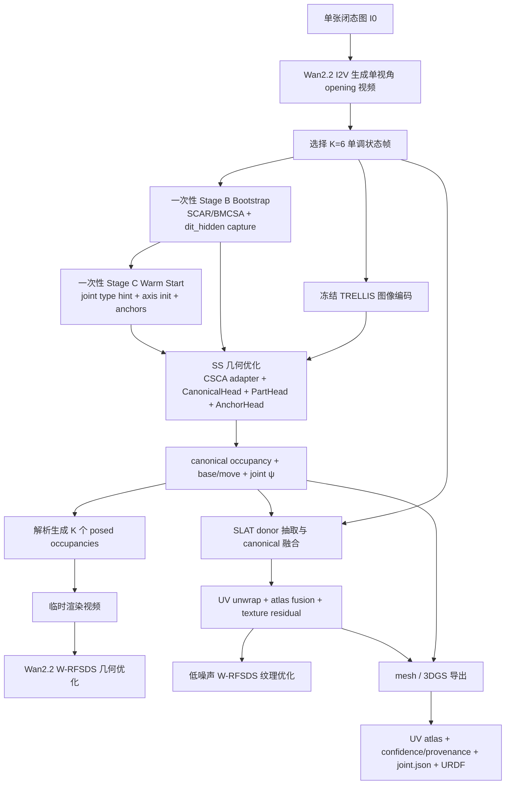

# 基于 TRELLIS 的单图铰接拟合与 UV 纹理生成研究报告

## 执行摘要

本次研究先按你的要求优先核对了代码连接器中的 `chengu-123/research`，实际读到的关键文件包括根 README、`pipelines/stage_b_scar.py`、`pipelines/stage_c_segmatch/run_stage_c.py`、`config.py`、`dit_prior.py`、`sajo/anchors.py`、`sajo/screw.py` 与 `configs/v1.yaml`；随后再核对了官方 entity["company","Microsoft","software company"] TRELLIS 项目页与源码、Wan2.2 官方模型卡/README，以及 CHORD、FreeArt3D、MorphAny3D、PAct、PartNet-Mobility、Tex4D、TAPESTRY 等一手资料。现有自研代码已经形成了“SCAR/BMCSA 一次性对齐 + Stage C 运动拟合”的强 warm start，但它的最终表示仍偏向“六个状态的后处理一致化”，而不是“一个 canonical 资产 + 一个单关节运动生成六个状态”。这正是你现在遇到位置偏移、形状抖动、base 不完全对齐、纹理不能跨状态真实回灌的根因。fileciteturn12file0L1-L1 fileciteturn14file0L1-L1 fileciteturn15file0L1-L1 fileciteturn19file0L1-L1 citeturn0search1turn0search3turn1search0turn12search0

我给出的最终建议很明确：**BMCSA 只做一次，只作为 bootstrap；主论文真正的方法体应当改成“canonical-first”**。也就是让冻结的 TRELLIS 不再被要求直接吐出 6 个最终 voxel，而是通过 **SS 内部的跨状态 canonical 交互 adapter** 学出一个 canonical occupancy latent，再由 **base/move 分割 + 单关节解析运动** 解析地产生 6 个状态；随后再进入 **visibility/provenance-aware 的跨状态纹理融合**，最终导出 **可用 UV/atlas**。RFSDS 不是去反复跑 BMCSA，也不是去当 segmentation teacher，而是作为冻结视频先验，去优化你新增的 SS adapter、分割 head、anchor head、joint 参数与后续 atlas/texture residual。这个方向与 TRELLIS 的“两阶段 3D latent”结构、CHORD 的加权 rectified-flow distillation、MorphAny3D 的跨状态注意力融合、以及 Tex4D/TAPESTRY 的多视角/多时刻纹理回灌逻辑是相容的，但组合方式在现有文献里并没有现成等价物。citeturn0search1turn12search0turn2search4turn5search0turn5search2

如果目标是 **AAAI 可发**，我建议论文只主打三个贡献，不要发散：第一，**冻结 TRELLIS 下的 SS 内部 canonical-aware cross-state adapter**，解决 base-consistent but move-preserving 的 occupancy 生成；第二，**接触边界 anchor-set 约束的无监督单关节细粒度拟合**，把“轴不能漂浮”做成可微的软约束；第三，**跨状态可见性/来源感知的 UV atlas 融合**，把 state0 正面、open state 背面/内侧、永不可见区域明确地区分开来。对 containment/boundary collision 问题，我认为可以给出**可运行的工程解**，但论文表述应保持客观：在 single-DoF 的 door/drawer/laptop/microwave/refrigerator/washing machine 这类 PartNet-Mobility 类别中可行，在一般多关节/复杂自遮挡场景下仍应表述为“部分解决”。这比宣称“已彻底解决 P2”更符合顶会审稿预期。citeturn2search0turn2search6turn3search0turn3search4turn5search6

## 澄清问题与默认假设

下表不是再向你追问，而是把当前研究已经隐含采用的假设写清楚，后续实现与论文都应显式固定。

| 可能澄清点 | 当前采用的默认假设 |
|---|---|
| 单视频状态是否单调打开 | 是。K=6 状态按照“从闭到开”单调排序，允许轻微生成噪声，但不允许回摆。 |
| 关节类型 | 只考虑 **single-DoF** 的 `revolute` 或 `prismatic` 二选一；先做单关节，再扩多部件。 |
| 相机是否固定 | 是。整条管线把 **fixed camera / single viewpoint** 视为硬约束，不允许通过多视角补救。 |
| 监督来源 | 只有 `I0` 真图 + Wan2.2 生成的单视角 pseudo-video；不使用 SAM/Grounded-SAM/DINO 伪标签初始化。 |
| 优化范式 | 完全 **per-instance optimization**；TRELLIS 与 Wan2.2 原权重全部冻结。 |
| 输出形式 | 最终必须输出 canonical mesh/3DGS、base/move 分割、joint.json、URDF、UV atlas、atlas confidence/provenance map。 |
| 几何冲突的论文表述 | 工程上做 swept-volume cavity carve + contact-band preserve；学术表述写成 single-DoF 类别里有效，不夸张到“普适完全解”。 |
| 真实照片评测 | 合成数据做定量主表；真实单图只做小规模 qualitative + 少量人工量测，不作为主监督。 |

这些默认假设与你给出的目标定义、v6/v7 方案草稿以及“主贡献应落在细粒度、RFSDS、跨状态纹理融合”的方向是一致的。fileciteturn0file2L1-L1 fileciteturn0file3L1-L1 fileciteturn0file4L1-L1 fileciteturn0file5L1-L1

## 阅读清单

### 必读代码与文献

| 来源 | 文件/论文名 | 关键点 | 优先级 |
|---|---|---|---|
| 本地权威快照 + 代码连接器 | `chengu-123/research/README.md` | 当前仓库主线、与 FreeArt3D 的关系、现有工程入口。fileciteturn4file0L1-L1 | 最高 |
| 本地权威快照 + 代码连接器 | `pipelines/stage_b_scar.py` | 现有 Stage B 的 SCAR/BMCSA 双阶段、Pass2 SDEdit、`dit_hidden` 捕获、block 14/16/18 与 `t*=0.3` 的语义甜点区。fileciteturn12file0L1-L1 | 最高 |
| 本地权威快照 + 代码连接器 | `pipelines/stage_c_segmatch/run_stage_c.py` | 现有 Stage C 的 partition→anchor→EM→swept volume→graph cut→axis refine→aggregation 全流程，说明“旧 Stage C 更适合作为初始化，而不是论文最终主体”。fileciteturn14file0L1-L1 | 最高 |
| 本地权威快照 + 代码连接器 | `pipelines/stage_c_segmatch/config.py` | 现有超参数、BIC 双假设、monotonicity、carve/contact band 等可直接复用的经验设置。fileciteturn15file0L1-L1 | 最高 |
| 本地权威快照 + 代码连接器 | `pipelines/stage_c_segmatch/dit_prior.py` | 为什么 `z_final` 太窄、为什么中后层 SS hidden 更适合作 part/material prior，这对你“在 SS 内做交互”非常关键。fileciteturn16file0L1-L1 | 最高 |
| 本地权威快照 + 代码连接器 | `pipelines/sajo/anchors.py` | joint-free split、26 邻域接触 anchor 提取、anchor 权重定义，可直接变成你的 anchor-set 软约束底座。fileciteturn17file0L1-L1 | 最高 |
| 本地权威快照 + 代码连接器 | `pipelines/sajo/screw.py` | revolute/prismatic 的 SE(3) 指数映射、Plücker 参数化、投影到合法 twist 流形。fileciteturn18file0L1-L1 | 最高 |
| 本地权威快照 + 代码连接器 | `configs/v1.yaml` | 当前 Stage B/BMCSA、SCAR、Pass2、`capture_dit_hidden`、`bmcsa_blocks` 等工程基线。论文要明确：这些只用于 bootstrap。fileciteturn19file0L1-L1 | 最高 |
| 官方 TRELLIS | 项目页与论文 | TRELLIS 的核心是 SS → SLAT 两阶段 structured latent，统一解码到 mesh、3DGS、radiance field，并支持 local manipulation。citeturn0search0turn0search1turn0search5 | 最高 |
| 官方 TRELLIS 代码 | `trellis/pipelines/trellis_image_to_3d.py` | 图像条件器是 DINOv2 patch token；pipeline 先采 sparse structure，再采 SLAT，再解码三种输出。citeturn6view2 | 最高 |
| 官方 TRELLIS 代码 | `sparse_structure_flow.py`, `sparse_structure_vae.py`, `structured_latent_flow.py`, `structured_latent_vae/base.py` | SS 是 dense 3D patchified rectified-flow DiT；SLAT 是 sparse transformer flow；这是你新 adapter/head 的准确落点。citeturn6view0turn6view1turn9view0turn10view0turn10view1turn7view2turn8view0 | 最高 |
| 官方 Wan2.2 | `Wan2.2-I2V-A14B` 模型卡 / README | A14B I2V 官方支持 480P/720P；单卡推理要求至少 80GB VRAM；官方 prompt 是长自然语言描述。citeturn1search0turn1search3turn1search5 | 最高 |
| CHORD | `Choreographing a World of Dynamic Objects` | 给你 RFSDS/W-RFSDS 的最直接先例，但 CHORD 不做 part decomposition、joint axis、UV atlas。citeturn12search0turn12search6 | 最高 |
| FreeArt3D | `Training-Free Articulated Object Generation using 3D Diffusion` | 证明“冻结静态 3D prior + per-instance optimization”这条路是成立的，但其输入与输出形态和你的任务不同。citeturn2search0 | 高 |
| MorphAny3D | `Unleashing the Power of Structured Latent in 3D Morphing` | MCA/TFSA 证明在 structured latent/attention 内做跨状态交互是有效的，但它是 morphing，不是 articulated kinematics。citeturn2search4 | 高 |
| PAct | `Part-Decomposed Single-View Articulated Object Generation` | 直接同期对手；价值在于 related work 对位，不在于照搬，因为你明确不能微调/训练 TRELLIS。citeturn2search6 | 高 |
| PartNet-Mobility / SAPIEN | 数据与下载接口 | 仍然是 single-DoF 合成主基准的最好选择，URDF 与关节标注完备。citeturn3search0turn3search4turn3search6 | 高 |
| Tex4D / TAPESTRY | 4D texturing 与 geometry-conditioned video texturing | 给你的 atlas fusion 与 hidden-surface 纹理补全最强参考，不是直接方法照搬。citeturn5search2turn5search6turn5search0 | 高 |
| 用户本地资料 | `target.md`, `v6.md`, `v7_1.md`, `v7_2.md`, `文献总结.md` | 这些文件定义了你的问题边界、失败模式、以及此前方案的优缺点，必须作为“内部审稿意见”反复对照。fileciteturn0file2L1-L1 fileciteturn0file3L1-L1 fileciteturn0file4L1-L1 fileciteturn0file5L1-L1 fileciteturn0file6L1-L1 | 最高 |

### 阅读顺序建议

先把**你自己仓库里已有的 Stage B/Stage C 与 v1 配置**吃透，再回到 **TRELLIS 官方 SS/SLAT 架构**，然后看 **CHORD / FreeArt3D / MorphAny3D / Tex4D / TAPESTRY**。原因很简单：这篇论文的成败不是“再发明一个大模型”，而是把**现有强 prior 正确地重新拼装**。如果先从外部文献开始，很容易把问题讲成另一个题；如果先从自己快照和 TRELLIS 的结构落点开始，再用外部文献对位，你的贡献边界会更清楚。fileciteturn12file0L1-L1 citeturn0search1turn12search0turn2search0turn2search4turn5search0turn5search2

## TRELLIS 架构理解与问题诊断

### TRELLIS 真正提供了什么

从官方 pipeline 和代码看，TRELLIS 的 image-to-3D 并不是“直接出 mesh”，而是先用 DINOv2 patch token 做 image condition，再走 **Sparse Structure flow** 生成结构 latent，随后走 **Structured Latent flow** 生成 SLAT，最后由不同 decoder 输出 mesh、3DGS 或 radiance field。官方项目页还特别强调它的 **local manipulation** 能力，这说明局部语义/几何控制在 latent 内是存在的，但这**不自动等价于 part segmentation 已经可读出**；要把 latent 中的“局部可操控性”变成“base/move 的无监督可解释分割”，还需要额外的 invariance/equivariance 约束与运动先验。citeturn0search1turn6view2turn6view0turn9view0

更细节地看，SS 分支是 dense 3D patchified rectified-flow transformer：输入 \(16^3\) 级别的 3D latent，使用 `TimestepEmbedder`、绝对位置编码、`ModulatedTransformerCrossBlock`，块内顺序是 self-attn → image cross-attn → FFN，AdaLN 只调制 self-attn 与 MLP，不调制 image cross-attn；这意味着**最适合加你的 cross-state adapter 的位置不是输入端，也不是 decoder 之后，而是某几个 image-conditioned block 的输出残差处**。SS VAE decoder 再把 latent 解到 occupancy。SLAT 则换成 sparse transformer flow 和稀疏卷积/上采样 IO block，最后可统一解码到 mesh/GS/RF。这个结构天然支持你的“两阶段贡献划分”：**SS 解决 canonical occupancy + segmentation + trajectory；SLAT/decoder 解决纹理与最终资产导出**。citeturn6view0turn6view1turn7view2turn8view0turn9view0turn10view0turn10view1

### 为什么六状态直接喂 TRELLIS 会抖

你现在最核心的问题，并不是“TRELLIS 不够强”，而是**目标表示不对**。如果最后目标还是 6 个彼此独立采样的 occupancy，再靠后处理去对齐 base、拟合 move、补纹理，那么 jitter、位置偏移、base 不一致、轨迹漂浮几乎是必然的。你现有仓库的 Stage B/Stage C 也已经在暗示同一件事：Stage B 用 SCAR/BMCSA 和 `dit_hidden` 去拉近状态一致性，Stage C 再通过 partition、anchor、EM、swept volume carve、graph-cut refine 和 axis refine 去“后整理” joint。换句话说，现有代码已经在不断为**“六份独立结果太难收束”**这件事打补丁。fileciteturn12file0L1-L1 fileciteturn14file0L1-L1 fileciteturn15file0L1-L1

因此，我的第一性原理结论是：**最终优化变量必须从六状态 occupancy 切换为一个 canonical occupancy latent \(z_c\)**，然后通过单个 joint model \(\psi\) 解析地产生所有状态。这样做不是美学偏好，而是因为只有 canonical-first 才能同时满足你给出的三个硬目标：base 尽量一致、move 保留真实状态差异、最终能导出稳定 UV/URDF。这个判断和你在 `target.md` 中写的“base-consistent but move-preserving”是完全一致的。fileciteturn0file2L1-L1

## 完整 pipeline 设计

### 总体方案与数据流

我建议的方法名可以暂时定为 **CARTON**：**Canonical Articulation Reconstruction with TRELLIS, One-shot Bootstrap, and Neural atlas fusion**。名称本身不重要，重要的是贡献边界要非常利落：**一次性 BMCSA bootstrap；SS 内 canonical cross-state adapter；anchor-constrained joint fitting；cross-state provenance-aware atlas fusion**。

### BMCSA 只做一次

这件事我建议在论文里讲得非常明确：**BMCSA 不是主方法体，只是 bootstrap**。原因有三点。第一，BMCSA/SCAR 本质是对多状态做 hand-crafted consensus/guide，如果反复嵌入主优化，会把你真正要学习的 canonical move 差异压掉。第二，一旦你把最终变量改成 canonical latent \(z_c\)，再反复调用 BMCSA 其实是在把“初始化器”错误地当成“动力系统”。第三，从工程上看，BMCSA 做一次就已经能输出很有价值的 warm start：`O_stack^0`、`z_final^0`、`dit_hidden`、粗 base prior。你主论文要比当前仓库更进一步，而不是继续把 BMCSA 做得更复杂。fileciteturn12file0L1-L1 fileciteturn19file0L1-L1

### 单视角伪视频阶段

Wan2.2 官方模型卡给出的 I2V 用法是“输入图像 + 长自然语言 prompt”，而且官方明确写了 A14B 单卡推理至少需要 80GB VRAM，并支持 480P/720P 两种输出面积。因此，这一步不要依赖负面 prompt 魔法，也不要赌空 prompt 自动补全；**应该直接写长 prompt，并做 seed 筛选**。citeturn1search0turn1search5

我建议的通用 prompt 模板如下：

> **Single fixed camera, locked tripod, same viewpoint from first frame to last, no camera movement, no pan, no tilt, no zoom, centered object, unchanged framing and background. A closed [object] slowly opens from closed to fully open. Only the movable part moves. The base remains completely still. Realistic geometry, consistent texture, consistent lighting, no view change, no camera shake.**

几个类别可直接写成下面这样：

| 类别 | 推荐 prompt |
|---|---|
| drawer | `Single fixed camera, locked tripod, same viewpoint from first frame to last, no camera movement, no pan, no tilt, no zoom. A closed wooden drawer slowly slides straight outward from the cabinet. Only the drawer moves. The cabinet body remains completely still. Consistent framing, consistent texture, realistic geometry.` |
| cabinet door | `Single fixed camera, locked tripod, same viewpoint from first frame to last, no camera movement, no pan, no tilt, no zoom. A closed cabinet door slowly rotates open around its hinge. Only the door moves. The cabinet body remains completely still. Consistent framing, consistent lighting, realistic texture.` |
| laptop | `Single fixed camera, locked tripod, same viewpoint from first frame to last, no camera movement, no pan, no tilt, no zoom. A closed laptop lid slowly rotates open around the back hinge. Only the lid moves. The keyboard base remains completely still. Consistent framing, realistic texture, no camera drift.` |

这一步不要只生成一个 seed。建议每个实例生成 4 个 seed，然后用**固定相机漂移评分**筛掉坏视频。评分不需要复杂，大致定义为：对去背景后的物体包围盒中心与尺度做稳定性统计，同时要求光流主方向与预期 joint 方向一致，并且序列开合幅度单调。通过筛选后，再从该视频里抽 K=6 个状态：先对从 state0 到各帧的 object-region flow magnitude 做平滑，再用单调回归后取 6 个等百分位节点。这样做不违反“单图 + Wan2.2 I2V”的硬约束，但会极大提升后续成功率。官方资料足以支持“用明确 prompt 控制 I2V”，而“多 seed + 漂移筛选”是我这里给出的工程性强化建议。citeturn1search0

### 一次性 bootstrap 阶段

这一阶段直接复用你现有仓库里的 Stage B 和 Stage C，但**只跑一次**，输出初值，不纳入主优化环。具体输入输出如下：

| 子阶段 | 输入 | 输出 | 作用 |
|---|---|---|---|
| Stage B bootstrap | \(I_{0:K-1}\) | `O_stack^0`, `z_final^0`, `dit_hidden`, `M_base^0` | 获得粗对齐 occupancy、稠密语义 hidden 与 base prior |
| Stage C warm start | `O_stack^0`, `M_attn`, `dit_hidden` | `joint_type^0`, \(\psi^0\), anchor set \(\mathcal A^0\), contact band \(\mathcal C^0\) | 获得 revolute/prismatic 初值与接触边界初值 |

你现有 `run_stage_c.py` 和配置文件已经把 Warm Start 需要的大部分思想实现了：count-based partition、adaptive anchor、phase EM、swept-volume carve、seg refine、axis refine 和 aggregation。我的建议不是丢掉这些，而是把它们降格为 **initializer**。主方法阶段不再让 Stage C 的 graph-cut/EM 成为最终答案，而是让它给 `CSCA + CanonicalHead` 提供一个好起点。fileciteturn14file0L1-L1 fileciteturn15file0L1-L1 fileciteturn17file0L1-L1

### SS 几何优化阶段

这一阶段是整篇论文最核心的部分。输入是 K 帧图像、一次性 bootstrap 的粗 occupancy/anchor/joint 初值；输出是**一个 canonical occupancy latent \(z_c\)**、一个 canonical move probability \(m_c\)、以及 joint 参数 \(\psi\)。TRELLIS 原权重全部冻结，只训练新增模块与显式 joint 变量。

#### 新增模块的位置与结构

我建议只改 SS，不碰 TRELLIS 原有 DINOv2、原 SS block 权重，也不在 SLAT 中做大手术。新增模块如下：

| 模块 | 插入位置 | 结构 | 参数量级 |
|---|---|---|---|
| CSCA | SS block 14/16/18 输出残差处 | 低秩 cross-state attention，Q 来自当前 state token，K/V 来自 inverse-warp 后的 canonical token；输出投影零初始化 | 约 1.2M–1.8M |
| CanonicalHead | block 14/16/18 特征融合后 | 每 token 2 层 MLP，`1024→256→8`，输出 \(\Delta z_c\) | 约 0.27M |
| PartHead | 同上 | `1024→256→1`，输出 canonical move logit | 约 0.26M |
| AnchorHead | 同上 | `1024→128→1`，输出 contact-anchor score | 约 0.13M |
| Joint variables | 显式参数 | revolute: \(\omega,q,\phi_{1:K-1}\)；prismatic: \(v,d_{1:K-1}\) | 可忽略 |
| Optional proxy-atlas | 渲染端 | 几何阶段临时颜色缓存，不是最终 atlas | 很小 |

为什么选 14/16/18？因为你现有 `stage_b_scar.py` 已经把它们当作 SS-DiT 的 mid-late semantic blocks，并在 `t*=0.3` 处抓 `dit_hidden`；这与 `dit_prior.py` 里“8 维 `z_final` 太窄，中后层 1024 维 hidden 更有语义区分力”的判断一致。也就是说，这不是拍脑袋，而是直接基于你现有代码经验做结构升级。fileciteturn12file0L1-L1 fileciteturn16file0L1-L1

#### canonical 化与状态生成公式

设 block 融合后的 canonical token feature 为 \(\bar H_c\)，则：

\[
z_c = z_c^{0} + g_{\text{can}}(\bar H_c), \qquad
m_c = \sigma(g_{\text{part}}(\bar H_c)), \qquad
a_c = \sigma(g_{\text{anc}}(\bar H_c)).
\]

冻结 SS decoder 得到 canonical occupancy logit：

\[
p_c = \sigma(D_S(z_c)).
\]

base 与 move 分开写成：

\[
p_B = p_c \cdot (1-m_c), \qquad
p_M = p_c \cdot m_c.
\]

对第 \(k\) 个状态，用 joint transform \(T_k(\psi)\) 把 move 变到 posed 空间，再与 base 用 soft-OR 合成：

\[
\hat p_k(x)=1-\big(1-p_B(x)\big)\big(1-\mathcal W_{T_k}(p_M)(x)\big).
\]

这里 \(\mathcal W_{T_k}\) 是三线性可微 warp。**一旦状态是由这套解析式生成的，base 的 canonical-consistency 就不是“学出来的运气”，而是表示级别保证出来的性质。** 这就是这条路线比“六状态直接各自出 voxel，再后对齐”更强的本质原因。这个 canonical-first 设计与 TRELLIS 的两阶段 latent 表示以及 CHORD/FreeArt3D 的 instance-level optimization 精神是一致的，但最终表示更适合 articulated asset 导出。citeturn0search1turn2search0turn12search0

#### CSCA 的具体交互

设第 \(b\) 个插入块的第 \(k\) 个状态 token 为 \(H_k^{(b)}\)。用当前 move mask 和 joint 参数把 move token inverse-warp 回 canonical，再跨状态做稳健融合：

\[
\bar H_c^{(b)}(x)=
\frac{
\sum_{k=0}^{K-1} w_k(x)\left[(1-m_k(x))H_k^{(b)}(x)+
\mathcal W^{-1}_{T_k}\!\left(m_k H_k^{(b)}\right)(x)\right]
}{
\sum_k w_k(x)+\epsilon
}.
\]

其中 \(w_k(x)\) 是置信权重，来自三项乘积：occupancy confidence、visibility reliability、state consistency。随后做零初始化 residual attention：

\[
\Delta H_k^{(b)}
=
W_o^{(b)}\,
\text{Attn}
\Big(
H_k^{(b)}W_Q,\,
\bar H_c^{(b)}W_K + b_{\text{pose}}(\psi_k),\,
\bar H_c^{(b)}W_V
\Big), \qquad
W_o^{(b)}\leftarrow 0,
\]

\[
H_k^{(b+1)} = H_k^{(b)} + \gamma_b\, \Delta H_k^{(b)}.
\]

这里 \(b_{\text{pose}}(\psi_k)\) 是 joint pose embedding，revolute 用 \([\omega, q, \phi_k]\) 经过 MLP；prismatic 用 \([v, d_k]\) 经过 MLP。`W_o` 零初始化的意义很关键：**step 0 时网络严格退化为 vanilla frozen TRELLIS**，不会一上来就把 strong prior 破坏掉。这一点是 ControlNet/IP-Adapter 范式的硬经验，也是 AAAI 审稿最喜欢看到的“可控扰动”设计。citeturn6view0turn8view0turn9view0

#### 几何阶段损失函数

几何阶段的总损失我建议收敛到下面 7 项，不要再扩张：

\[
L_{\text{geom}}
=
\lambda_r L_{\text{W-RFSDS}}
+\lambda_0 L_{\text{rest}}
+\lambda_c L_{\text{canon}}
+\lambda_s L_{\text{seg-motion}}
+\lambda_a L_{\text{axis-anchor}}
+\lambda_m L_{\text{mono}}
+\lambda_v L_{\text{swept-conflict}}.
\]

各项分别是：

\[
L_{\text{rest}}
=
\| \hat I_0 - I_0 \|_1
+
\lambda_{\text{lpips}}\text{LPIPS}(\hat I_0, I_0),
\]

它保证 canonical asset 的闭态渲染必须回到真实输入，不让 RFSDS 把 closed state 漂走。

\[
L_{\text{canon}}
=
\frac{1}{K}
\sum_{k}
\Big(
\| \mathcal W^{-1}_{T_k}(\hat p_k^M) - p_M \|_1
+
\| \hat p_k^B - p_B \|_1
\Big),
\]

它直接推动 canonical move 在 inverse-warp 后一致、base 在 posed space 中一致。

\[
L_{\text{seg-motion}}
=
\sum_x
\Big[
(1-m_c(x))\operatorname{Var}_k\big(\hat p_k(x)\big)
+
m_c(x)\operatorname{Var}_k\big(\mathcal W^{-1}_{T_k}\hat p_k(x)\big)
\Big]
+
\lambda_H H(m_c)
+
\lambda_{TV}\operatorname{TV}(m_c).
\]

这是我最推荐的**无监督 part loss**。直观上，base 在原状态空间里应该稳定，move 在 canonicalized 状态空间里应该稳定；两种方差最小化自动把分割推出来，而且不需要任何伪标签。

\[
L_{\text{mono}}
=
\sum_{k=1}^{K-1}
\max\big(0,\delta - s(\phi_k-\phi_{k-1})\big),
\]

其中 \(s\in\{+1,-1\}\) 取较优方向。door/drawer/laptop 这类 opening sequence 都应该有单调 joint state。

\[
L_{\text{swept-conflict}}
=
\sum_x
S(x)\, p_B^{\text{solid}}(x)\,
\big(1-\chi_{\mathcal C_\delta}(x)\big),
\qquad
S(x)=\max_k \mathcal W_{T_k}(p_M)(x).
\]

它用 swept volume 惩罚 mover 和 base solid 的非法冲突，但保留 contact band，不会把真正 hinge/slider 接触区一起抹掉。

至于 \(L_{\text{W-RFSDS}}\)，它在这里扮演的是**冻结视频先验**，几何阶段建议只采 high-noise / mid-noise 区间，让 Wan2.2 主要约束 motion/layout，而不是过早把纹理细节压进几何。CHORD 已经证明对 Wan2.2 做加权 rectified-flow distillation 是成立的，所以你的做法不是从零发明 teacher，而是把 teacher 从“4D 场景运动”改成“单关节 articulated object 的 canonical geometry 优化”。citeturn12search0turn12search6turn1search0

### 训练日程、显存和运行时估计

下面的表不是官方 benchmark，而是**按你给定资源条件的可执行估计**。它用于排期，不应在论文中当作外部事实引用。

| 阶段 | 主要变量 | 建议迭代/次数 | 估计显存 | 估计时间 |
|---|---|---:|---:|---:|
| Wan2.2 伪视频 | prompt + seed | 4 seeds/实例 | 1×80G | 1–2 小时 |
| 一次性 bootstrap | Stage B + Stage C | 各 1 次 | 1×80G | 0.5–1.5 小时 |
| 几何 warm-up | `z_c`, PartHead, Joint vars | 300 iter | 2×80G | 2–4 小时 |
| 几何主优化 | CSCA + CanonicalHead + Joint vars | 1500–2500 iter | 2–4×80G | 10–20 小时 |
| 纹理/atlas 优化 | SLAT residual + atlas | 1000–1800 iter | 1–2×80G | 6–12 小时 |
| 导出/评测 | mesh+UV+URDF | 1 次 | 1×80G/CPU | 1–2 小时 |

**总预算**按单对象 1–2 天是可落地的，但前提是 geometry 和 texture 两阶段不能一起全速开；必须先 geometry，后 texture。这个判断与 FreeArt3D、CHORD、Tex4D/TAPESTRY 所体现出的“先把结构收束，再让 appearance fully free”的经验是一致的。citeturn2search0turn12search0turn5search0turn5search2

## 轨迹分割与 anchor 先验

### anchor 采样策略

你提出的先验——“base 和 move 必然连接或接触；旋转轴必须穿过接触边界附近的离散 anchor set 或其窄邻域”——我认为是**这篇论文最值得写成明确公式的创新点**。你仓库里的 `anchors.py` 已经给了一个很好的一次性离散 anchor 提取框架：先二值化、再用 move dilation 与 base 求 contact、再做连通域与权重计算。这个实现可以保留，但要从“初始化工具”升级为“主优化可微信号”。fileciteturn17file0L1-L1

我建议 anchor set \(\mathcal A=\{(u_i,\pi_i)\}_{i=1}^M\) 这样采样：

1. 由 canonical \(p_B,p_M\) 提接触带：
   \[
   c(x)=\mathbf 1\!\left[p_B(x)>\tau_B\right]\cdot
   \mathbf 1\!\left[\text{Dilate}(p_M)(x)>\tau_M\right].
   \]

2. 保留最大两个连通分量，避免噪声孤岛。

3. 对接触带内体素计算权重：
   \[
   \rho(x)=p_B(x)\cdot \max_{y\in N_{26}(x)}p_M(y)\cdot g(x),
   \]
   其中 \(g(x)\) 是局部边界梯度强度或 AnchorHead 输出。

4. 在接触带上做 farthest-point sampling，取 \(M=32\) 或 \(64\) 个 anchor。

这一步会得到一个**细而连通**的接触边界离散表示，比“整片 contact band 都同等对待”更稳定，也比只拿单个 pivot 点强得多。fileciteturn17file0L1-L1

### revolute 轴的软约束公式

用 `screw.py` 的 Plücker/screw 参数化，revolute 关节由**单位轴方向** \(\omega\) 和**轴上一点** \(q\) 定义。对 anchor 点 \(u_i\)，其到轴的距离是：

\[
d_i(\omega,q)=
\left\|
(I-\omega\omega^\top)(u_i-q)
\right\|_2.
\]

我建议不用 hard min，而用 soft-min：

\[
L_{\text{axis-anchor}}
=
-\tau_a
\log
\sum_{i=1}^{M}
\pi_i
\exp
\left(
-\frac{d_i(\omega,q)^2}{\tau_a}
\right),
\]

其中 \(\pi_i=\text{softmax}(\rho(u_i)/\tau_\pi)\)。这条损失的物理含义非常清楚：**轴不要求精准穿过每个接触点，但必须穿过高权重 anchor 的窄邻域**。这正好对应你一开始提出的“不是任意漂浮的轴，而是穿过接触边界附近离散 anchor set 或其窄邻域”。`screw.py` 已经给出了合法 revolute/prismatic 流形上的投影与指数映射，所以这条损失是完全可实现的。fileciteturn18file0L1-L1

为了防止 anchor 自己散掉，再加一条连通正则：

\[
L_{\text{anchor-conn}}
=
\sum_{(i,j)\in \mathcal N}
w_{ij}\,
|\pi_i-\pi_j|,
\]

其中 \(\mathcal N\) 是接触带邻接图。这样高权值 anchor 会落在一个连通小团而不是四处分散。

### prismatic 的对应约束

对抽屉/洗碗机/洗衣机内桶盖这类 prismatic 场景，不存在“轴线 must pass through anchor set”的同义命题，但可以写成**方向与接触带切向兼容、且位移线穿过接触中心带**：

\[
L_{\text{pris-anchor}}
=
-\tau_p
\log
\sum_i \pi_i
\exp\left(
-\frac{\|(I-vv^\top)(u_i-q_p)\|_2^2}{\tau_p}
\right),
\]

其中 \(v\) 是平移方向，\(q_p\) 是导轨线上的参考点。它的数学形式和 revolute 一样，但物理解释不同：**导轨线要穿过接触带/滑轨带，而不是凭空漂在箱体中间**。

### 如何保证 canonical-consistent voxel

这件事一定要在论文里讲成**by construction**，不要讲成“loss 学出来的结果”。因为最终状态不是直接预测的，而是由 canonical occupancy 和 joint 解析生成的：

\[
\hat p_k = \Psi(p_c,m_c,\psi_k).
\]

因此 canonical consistency 的主体不是 `L_canon`，而是**变量本身的定义方式**；`L_canon` 只是防止优化漂离这个解析模型。这个表述对审稿人很重要：它说明你不是在做“经验对齐”，而是在做“结构建模”。

## 跨状态纹理融合与 UV atlas

### 为什么纹理必须单独成段

TRELLIS 的 SLAT 之所以适合你，不是因为它“能出好看的贴图”，而是因为它把**appearance** 和 **structure** 都放进了同一个统一 latent，再解码到 mesh/3DGS/RF。官方 project page 和论文已经明确讲了这一点。对你的任务，最自然的做法就是：**几何先收敛到 canonical occupancy；纹理再基于 canonical 几何做多状态 donor fusion 和 atlas 输出**。Tex4D 与 TAPESTRY 的共同启发也是这个逻辑：几何/视角关系先固定，再用多时刻、多视图的可见性去累计 texture evidence，最后把“看得见”和“永远看不见”分开处理。citeturn0search1turn5search0turn5search2turn5search6

### 纹理阶段的输入与变量

几何阶段结束后，固定或近固定 \((p_c,m_c,\psi)\)，提取 canonical mesh \(M_c=(V,F)\)，再做一次 deterministic UV unwrap，得到 atlas 坐标 \(u\in\Omega_{UV}\)。随后纹理阶段的优化变量是：

\[
\Theta_t = \{\Delta s_c,\; A,\; Q,\; P\},
\]

其中：

- \(\Delta s_c\)：canonical SLAT residual；
- \(A\)：最终 atlas 纹理图；
- \(Q\)：atlas confidence map；
- \(P\)：atlas provenance map（每个 texel 主要来自哪个 state）。

建议同时保留 canonical 3DGS 作为训练期渲染载体，因为 3DGS 的梯度更平滑，最终再把 appearance bake 到 mesh atlas 上。TRELLIS 的统一 SLAT → 多解码器能力正好允许这样做。citeturn0search1turn0search3

### 跨状态 donor 融合

对 canonical mesh 上的一个 texel \(u\)，从每个状态 \(k\) 计算：

- 可见性 \(V_k(u)\in\{0,1\}\)；
- 前向夹角 \(\theta_k(u)\)；
- 深度一致性 \(D_k(u)\)；
- 重投影位置 \(\pi_k(u)\)；
- 图像颜色 \(I_k(\pi_k(u))\)。

定义 donor 权重：

\[
\alpha_k(u)
=
V_k(u)\,
\exp\big(
-\beta_1 \theta_k(u)^2
-\beta_2 D_k(u)
-\beta_3 B_k(u)
\big),
\]

其中 \(B_k(u)\) 是 blur / temporal inconsistency 评分。这样 state0 在“闭态已可见正面”通常会拿到最大权重，而后期开门暴露出来的背面/内侧会由 open states 接管。然后做融合：

\[
A_{\text{obs}}(u)
=
\frac{\sum_k \alpha_k(u)\,I_k(\pi_k(u))}
{\sum_k \alpha_k(u)+\epsilon}.
\]

再定义：

\[
Q(u)=\min\left(1,\sum_k \alpha_k(u)\right), \qquad
P(u)=\arg\max_k \alpha_k(u).
\]

于是 atlas 不只是“一张贴图”，而是**贴图 + 置信图 + 来源图**。这一点非常重要，因为你不应该把所有永不可见区域伪装成高置信真实纹理。Tex4D 和 TAPESTRY 都在不同表述下强调了相同的原则：可见证据用于强约束，遮挡/缺失区域只能在先验与邻域平滑下补全。citeturn5search0turn5search2turn5search6

### hidden 区域纹理完整性的处理

你特别关心“closed state 看不到 move 背面，open state 才看到”的场景。这个问题最自然的处理，不是对 state 图像做平均，而是做**posed-to-canonical 单向证据回灌**。以 door 为例，state0 的门正面和末态的门背面，在 canonical 空间里是同一块 move part 的两组不同法向 texel。只要 joint \(\psi\) 准，二者都可以通过 posed mesh 重投影到 canonical atlas 的不同区域。也就是说，**隐藏纹理完整性在这里不是 hallucination 的结果，而是几何对齐后的证据累加结果**。真正需要 hallucination 的，只是从未被任何状态观察到的 texel。fileciteturn0file2L1-L1

对永不可见区域 \(Q(u)\approx 0\)，我建议只用一个很保守的 inpaint 目标：

\[
L_{\text{unseen}}
=
\sum_{u:Q(u)<\tau_q}
\left(
\lambda_{\nabla}\|\nabla A(u)\|_1
+
\lambda_s \|A(u)-h_{\text{slat}}(s_c(u))\|_2^2
\right),
\]

其中 \(h_{\text{slat}}\) 是从 canonical SLAT feature 到 atlas color 的小 MLP。论文里必须写明：**这些 texel 是 low-confidence completion，不等同于真实观测纹理**。

### 纹理阶段损失

完整纹理阶段建议用 5 项损失：

\[
L_{\text{tex}}
=
\lambda_r L_{\text{W-RFSDS}}^{\text{low}}
+\lambda_p L_{\text{vis-photo}}
+\lambda_f L_{\text{atlas-fuse}}
+\lambda_s L_{\text{seam}}
+\lambda_u L_{\text{unseen}}.
\]

其中：

\[
L_{\text{vis-photo}}
=
\sum_{k,u}
\alpha_k(u)\,
\|\hat I_k(\pi_k(u)) - I_k(\pi_k(u))\|_1,
\]

\[
L_{\text{atlas-fuse}}
=
\sum_u \sum_{i<j}
\alpha_i(u)\alpha_j(u)
\|A_i(u)-A_j(u)\|_1,
\]

\[
L_{\text{seam}}
=
\sum_{(u,v)\in \mathcal S}
\|A(u)-A(v)\|_1.
\]

这里的 \(L_{\text{W-RFSDS}}^{\text{low}}\) 只在 low-noise / detail 区间采样，让 Wan2.2 更多约束 appearance continuity，而不再主导几何。这样 “几何高噪声、纹理低噪声” 的两阶段路由，就与 Wan2.2 的专家分工和 CHORD 的 flow distillation 用法形成自然对应。citeturn1search0turn1search3turn12search0

## 实验计划与实现清单

### 数据与评测设置

主实验建议分成两组：

| 组别 | 数据 | 用途 |
|---|---|---|
| 合成主表 | PartNet-Mobility / SAPIEN 中的 drawer、cabinet door、microwave/oven、refrigerator、laptop、washing machine/dishwasher | 主定量评测 |
| 真实补充 | 少量真实单图照片，每类 2–4 个对象 | 稿件中的 qualitative 与泛化展示 |

因为这是 per-instance optimization，不存在传统训练/测试拆分的概念，所以我更建议写成 **dev split + benchmark split**：每类先挑 3–5 个实例调超参，再在每类 8–12 个 benchmark 实例上做正式报告。这样 GPU 预算是现实的，而且审稿时更容易自圆其说。PartNet-Mobility/SAPIEN 作为合成主基准依然是最合理选择，因为它的 URDF、joint type、joint state 和 part annotation 都齐。citeturn3search0turn3search4turn3search6

### 定量指标

建议主表至少汇报下面这些指标：

| 指标 | 定义 |
|---|---|
| Canonical part IoU | canonical space 下 base/move 分割 IoU |
| State occupancy IoU | 每个状态 \(\hat p_k\) 与 GT occupancy 的 IoU |
| Chamfer / F-score | 整体 mesh 与 per-part mesh |
| Joint type accuracy | revolute / prismatic 分类正确率 |
| Axis angle error | \( \arccos(|\omega^\top \omega^\*|) \) |
| Axis point distance | GT 轴线到预测轴线的最近距离 |
| State parameter MAE | door 角度 MAE / drawer 位移 MAE |
| Base consistency | \( \frac1K\sum_k \text{IoU}(B_k,\bar B) \) |
| Move equivariance | \( \frac1K\sum_k \text{IoU}(W^{-1}_{T_k}M_k,\bar M) \) |
| Texture SSIM / PSNR / LPIPS | 重投影到观测状态图像后的 visible-region 指标 |
| Hidden texture coverage | 被至少一个 open state 填充的原先不可见 texel 比例 |
| Atlas completeness | \(Q(u)>\tau\) 的 texel 占比 |

其中 **Base consistency** 和 **Move equivariance** 是你这篇论文最值得自定义并主打的两个指标，因为它们直接对应你的目标定义，比只报 Chamfer 更能说明问题。fileciteturn0file2L1-L1

### 对比方案与消融

我建议至少做下面 6 组，其中前 4 组是必须的：

| 方案 | 目的 |
|---|---|
| Plain multi-state TRELLIS | 证明“直接六状态出 voxel”会抖，是必要下界 |
| One-shot BMCSA + Stage C | 你的当前 repo 最强旧基线 |
| FreeArt3D-style distillation on TRELLIS | 证明仅靠 static 3D prior + video-free SDS 不够 |
| MorphAny3D-style cross-state attention | 证明仅有跨状态 latent 融合但无 joint/contact 约束仍不够 |
| Ours w/o anchor loss | 验证“轴不过接触边界附近就会漂” |
| Ours w/o texture fusion | 验证 hidden-surface atlas 不会自己长出来 |

如果资源允许，再加两组更漂亮：

- **Ours w/o BMCSA bootstrap**：验证 Bootstrap 是否必须；
- **Ours w/o low-noise texture RFSDS**：验证 atlas photo loss 是否足够。

对比文献时要非常诚实：FreeArt3D、PAct、CHORD 都不是你的等价任务，但它们分别代表“冻结 3D prior 的 per-instance 优化”“训练型 single-view articulated generation”“Wan2.2 上的 RFSDS teacher 使用”。你要对的是**能力模块**，不是机械对等任务。citeturn2search0turn2search6turn12search0

### 预期结果与失败模式

合理预期不是“所有指标都大幅绝杀”，而是下面这个**顺序关系必须成立**：

\[
\text{Ours}
>
\text{Ours w/o anchor}
>
\text{Ours w/o texture fusion}
>
\text{BMCSA + Stage C}
>
\text{Plain multi-state TRELLIS}.
\]

如果这个顺序都站不住，论文就不该投。

最关键的失败模式有 6 个：

| 失败模式 | 现象 | 诊断信号 | 对策 |
|---|---|---|---|
| 相机漂移 | 所有状态整体平移/缩放 | base consistency 很低 | 回到 Stage A 重生 seed，不要硬修 |
| move/base 互换 | 门板被判成 base | `m_c` 大面积落在静止区 | 提高 `L_seg-motion` 与 `L_rest` 权重 |
| 轴漂浮 | 预测轴离接触边界很远 | `axis-anchor` 长期不降 | 加强 anchor 权重、收紧 contact band |
| canonical 弱化 | `p_c` 过厚或过空 | state IoU 与 rest render 同时差 | 降低 RFSDS 权重，先把 `L_rest + L_canon` 收束 |
| hidden texture 脏污染 | 内侧纹理混入外表面 | atlas provenance 混乱 | 提高 view-angle/depth gating，别平均 |
| boundary conflict | open 状态局部穿模 | swept-conflict 高 | 加 cavity carve，保留 contact band |

### 可视化建议

论文和 debug 最少要有这 8 种图：

1. **Wan2.2 生成的 K=6 单视角状态帧**；
2. **一次性 BMCSA bootstrap 的 `O_stack^0` 对比图**；
3. **canonical occupancy 与 6 个解析生成状态的并排图**；
4. **canonical base/move 分割着色图**；
5. **anchor set + revolute axis / prismatic line 可视化图**；
6. **swept volume、cavity carve、contact band 图**；
7. **atlas / confidence / provenance 三联图**；
8. **真实 closed image、渲染 closed state、渲染 open states 的对比图**。

其中第 5 张和第 7 张是最容易被审稿人记住的两张图，建议放主文，不要放附录。

### 具体实现清单与优先顺序

| 优先级 | 模块/脚本 | 主要输入 | 主要输出 | 说明 |
|---|---|---|---|---|
| P0 | `pipelines/stage_a_wan_i2v.py` | `closed.png`, prompt | `video.mp4`, `frames/` | 封装 Wan2.2 推理、seed 筛选、K 状态抽取 |
| P0 | `pipelines/stage_b_bootstrap_once.py` | `frames/` | `O_stack0.npy`, `z_final0.pt`, `dit_hidden.pt` | 直接调用现有 Stage B，只跑一次 |
| P0 | `pipelines/stage_c_warmstart_once.py` | bootstrap 输出 | `joint_init.json`, `anchors0.npy` | 直接调用现有 Stage C，只跑一次 |
| P1 | `trellis_ext/csca.py` | SS block hidden, \(\psi\), mask | residual hidden | block14/16/18 的 CSCA 实现 |
| P1 | `trellis_ext/canonical_head.py` | fused hidden | `z_c`, `m_c`, `a_c` | CanonicalHead/PartHead/AnchorHead |
| P1 | `pipelines/opt_geom_rfsds.py` | `frames/`, warm start | `canonical_occ.npy`, `part_mask.npy`, `joint.json` | 主几何优化脚本 |
| P2 | `pipelines/build_uv_mesh.py` | canonical mesh | `mesh.obj`, `atlas_uv.npz` | UV unwrap 与 seam map |
| P2 | `pipelines/fuse_multistate_atlas.py` | mesh+UV, frames, \(\psi\) | `atlas.png`, `conf.png`, `prov.npy` | donor fusion 与初始 atlas |
| P2 | `pipelines/opt_tex_rfsds.py` | init atlas, SLAT donors | refined atlas / GS | 低噪声纹理优化 |
| P3 | `pipelines/export_asset.py` | final geo+tex | `glb`, `urdf`, `joint.json` | 最终导出 |
| P3 | `tools/eval_articulation.py` | GT + outputs | metrics csv | 主表评测脚本 |

最短可行里程碑我建议分四步走：

- **里程碑一**：一次性 bootstrap 跑通，能稳定输出 `O_stack^0 + joint_init`;
- **里程碑二**：几何阶段只开 `L_rest + L_canon + L_seg-motion + L_axis-anchor`，先不接 Wan2.2，也能从 bootstrap 收敛到稳定 canonical occupancy；
- **里程碑三**：接入高噪声 W-RFSDS，验证 joint 的 opening motion 变合理；
- **里程碑四**：做 atlas donor fusion，导出能看的 UV texture。

如果里程碑二都站不住，就不要急着上 Wan2.2；因为那说明 canonical representation 本身还没有立住。

### 参考资源与优先检索来源

最后把优先级再压缩成一句话：**先看本地权威快照与 `chengu-123/research` 的 Stage B/C；再看官方 TRELLIS 结构；再看 Wan2.2 与 CHORD；最后看 FreeArt3D / MorphAny3D / Tex4D / TAPESTRY / PAct 做对位。** 这个顺序最不容易把研究做偏。fileciteturn12file0L1-L1 fileciteturn14file0L1-L1 citeturn0search1turn1search0turn12search0turn2search0turn2search4turn5search0turn5search2

### 开放问题与边界

有两点我会在论文里主动承认。

第一，**本次研究中已实核对的本地自研代码重点集中在 `chengu-123/research` 的 Stage B/C 与配置；其余本地 rar 快照更多被当作路径/版本权威，而不是在本会话中逐文件展开**。这不影响你当前最关键的 pipeline 设计，因为决定性的信息已经在已核对文件和官方 TRELLIS/Wan2.2 一手资料里。第二，**boundary collision 与 fully-unseen texture completion** 在 single-DoF 类别上可做成工程可用，但不宜在论文中写成一般情形下的“完全闭式解”。把边界讲清，比把边界藏起来更像顶会论文。

最终结论只有一句：**你现在最该做的，不是继续修 Stage B/Stage C 的后处理，而是把表示换成 canonical-first，把 BMCSA 降为一次性初始化，把真正的贡献放进 SS 内部 canonical 交互、anchor 细粒度约束、以及跨状态 atlas 回灌。** 这条路线是可做、可写、可发表的。