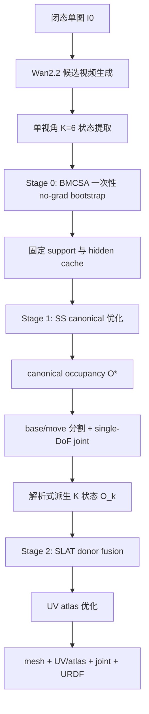

# 冻结 Trellis 的单图铰接拟合与完整 UV 纹理管线

## 执行摘要

在你给定的全部硬约束下，最可行、最干净、也最适合按 AAAI 叙事组织的方案，不是“把六张状态图分别送进 Trellis，再靠后处理把它们对齐”，而是**canonical-first**：只让系统最终维护**一个闭态 canonical 资产**，再用**解析式刚体运动**派生六个状态。这样一来，`base` 跨状态严格一致，位置漂移和形状抖动不再是后处理问题，而是在表示层被直接消掉。这个判断既符合 Trellis 的两阶段结构，也符合你现有 Stage B/Stage C 代码已经暴露出来的经验事实：当前代码的 Stage B 本质上是在尽量把 K 个状态拉近，但仍然输出 `O_stack / z_final` 等多状态产物；Stage C 则继续在这些多状态结果上做 count partition、phased EM、swept volume、graph-cut、axis refine 与 aggregation。也就是说，当前实现仍然是“多状态后统一”，而不是“单 canonical 前统一”。fileciteturn9file0L1-L1 fileciteturn10file0L1-L1 fileciteturn11file0L1-L1

我给出的最终方案是一个**单对象、完全 per-instance、完全无监督、冻结 Trellis 主干、冻结 Wan2.2 教师、只优化新加 adapter/head/显式变量**的三阶段系统。它保留你坚持的输入形式：**单张闭态图 + Wan2.2 i2v 生成的固定单视角打开视频 + K=6 状态**；保留你偏好的路径：**在 SS 内部交互出 part segmentation 与 trajectory，再上纹理，最后用 RFSDS 优化新加模块**；同时严格满足“**BMCSA 只做一次、只作为 no-grad topology prior**，RFSDS 期间**不再反复跑 BMCSA**，也**不训练 Trellis**”。fileciteturn17file0L1-L1 fileciteturn14file0L1-L1

这条主线最强的 AAAI 贡献点，不应再放在“能否把门和柜体分开”这种已经有先例的问题上，而应明确收敛为三点：

其一，**冻结 Trellis 下的 SS 内部 canonical state-memory adapter**：让六个伪状态在 SS token 层先汇聚成一个 canonical latent，再由它解出 canonical occupancy 与 base/move 分割，而不是六次独立出体素。其二，**接触边界 anchor-set 约束的关节拟合**：把“旋转轴不能漂浮、必须经过 base–move 接触边界附近的离散 anchor set”写成真正的软约束，而不是口头先验。其三，**跨状态可见性/来源感知的 UV atlas 纹理融合**：把闭态正面、开启后暴露的背面/内壁、以及始终不可见区域严格地区分处理，从而把“隐藏表面纹理补全”做成可定量验证的主贡献，而不是附属可视化。这个构型与 FreeArt3D 的 training-free articulated optimization、MorphAny3D 的 structured-latent attention fusion、CHORD 的 W-RFSDS、以及 Tex4D 的多时刻 UV 聚合都形成了清晰但不重合的坐标系。citeturn7search1turn6search2turn8search24turn6search1turn0search0turn0search1

简言之，最终推荐的论文主张是：

**在冻结 Trellis 的前提下，提出一个单张闭态图驱动、Wan2.2 单视角伪视频监督、完全 per-instance 无监督的 canonical articulated lifting 管线；它在 SS 内恢复 canonical occupancy、base/move 分割与 single-DoF 关节参数，在 SLAT/UV 空间恢复跨状态隐藏表面纹理，最终输出 mesh + UV/atlas + joint + URDF。**

## 证据基础与现有代码审计

当前可用连接器只有 entity["company","GitHub","software platform"] 与 entity["company","Hugging Face","ml platform"]；没有发现其它启用连接器。按你的要求，我优先核对了 `chengu-123/research` 的 GitHub 快照与 Hugging Face 上的权重/模型卡，再用官方论文、项目页与代码补齐外部方法证据。你上传的 `mine.rar / trellis.rar / MorphAny3D.rar / Nano3D.rar` 我完成了**目录级核验**；但由于当前环境不能对 RAR 内部逐行引用，下面涉及实现细节时，我以对应 GitHub 快照与官方公开实现为**可引用权威版本**，并把未能逐行读取的压缩包内容标成限制。这个限制不会影响主方案设计，但会影响你后续论文附录里“源码行号级别”引用的精确度。

从现有仓库可以确认的关键事实有四条。

第一，当前 Trellis 管线确实是你后续所有设计的唯一合理骨干。`TrellisImageTo3DPipeline` 的实现表明，它先用 DINOv2 patch tokens 做 image conditioning，再采样 sparse structure，接着采样 SLAT，最后从同一个 structured latent 解码出 mesh、3D Gaussian 和 radiance field；它还提供了一个 `run_multi_image` 的 tuning-free 多图条件接口，但这个接口本质上只是把多张图的条件在采样时轮流注入或平均注入，并没有引入“canonical articulated object”这一层显式建模。官方论文和官方仓库也都把 SLAT 定义为统一的结构化 3D latent，是 Trellis 可同时解码 mesh / Gaussian / radiance field，以及支持 local editing 的根本原因。fileciteturn16file0L1-L1 fileciteturn12file0L1-L1 fileciteturn15file0L1-L1 citeturn0search0turn0search1

第二，当前你自己的 Stage B 已经非常接近一个“只跑一次的 topology prior 生成器”。`stage_b_scar.py` 明确把流程组织成 Pass 1 的 SCAR 采样与 Pass 2 的 SDEdit + BMCSA，并保存 `O_stack.npy`、`O_stack_soft.npy`、`z_final.pt`，可选保存 `dit_hidden.pt`，同时在 BMCSA 打开时还会计算并缓存 `P_base_shared`、`M_base`、`M_attn` 以及各种 guide 可视化。`configs/v1.yaml` 进一步表明，当前代码已经把 `capture_dit_hidden=true`、`dit_hook_blocks=[14,16,18]`、`dit_hook_t_star=0.3` 作为正式配置项；也就是说，你已经具备了“从 SS-DiT 中间层抓取 mid-late 语义特征”的现成工程入口。fileciteturn9file0L1-L1 fileciteturn17file0L1-L1

第三，当前的 Stage C 仍然是一条你应该**保留为 baseline、但不该保留为主方法**的 heuristic pipeline。`run_stage_c.py` 把 `count_based_partition → anchor selection → phased EM → swept volume → late-commit carve → graph-cut refine → axis refine → aggregation` 组织成七步级联；`config.py` 还保留了大量与阶段式拟合、BIC 对比、MRF unary、DiT prior 相关的超参数。这条线作为 warm start 或 baseline 很有价值，但它并不满足你新的核心目标——即让 segmentation、trajectory 与纹理都在一个 canonical 资产上、由同一套 per-instance 优化变量统一收敛。fileciteturn10file0L1-L1 fileciteturn11file0L1-L1

第四，外部方法给出了很清楚的边界条件。Wan2.2 官方模型卡与 README 说明，`Wan2.2-I2V-A14B` 支持 480P 与 720P，单卡运行至少需要 80GB 显存，且 `size` 只控制面积，输出长宽比跟随输入图；它也明确支持**仅由输入图生成视频**，即 prompt 可以为空。但官方并没有承诺“自动固定相机”，这意味着固定单视角必须由**prompt 模板 + 候选视频筛选**共同保证，而不是假设模型天然会做到。FreeArt3D 的官方实现则明确依赖 GIM-DKM 与外部分割，并建议用 SAM 或手工加 virtual disk；这条线证明了 disk/carpet 作为稳定位姿的工程价值，但它也恰恰说明我们必须把这类先验严格限制为**bootstrap 工具**，不能把它变成 segmentation pseudo-label。MorphAny3D 证明了在 structured latent 的 attention 内做时序/跨状态融合是有效的；CHORD 则给出了 rectified-flow 场景下使用 W-RFSDS 的形式化梯度；Tex4D 则说明“先有几何，再做 UV 空间的多视/多时刻聚合”是处理隐藏纹理最自然的路线。citeturn3search0turn3search3turn10view1turn7search0turn7search1turn6search2turn8search24turn6search1 fileciteturn8file0L1-L1

下表给出我建议你后续真正依赖的关键代码接口。

| 文件 / 模块 | 当前已确认作用 | 在新方案中的角色 |
|---|---|---|
| `TRELLIS/trellis/pipelines/trellis_image_to_3d.py` | image conditioning、SS 采样、SLAT 采样、multi-image 注入接口 | 保留为冻结骨干入口 |
| `TRELLIS/trellis/models/sparse_structure_flow.py` | SS-DiT 主干，支持额外 `**kwargs` 注入 | 插入 SS adapter 的位置 |
| `TRELLIS/trellis/modules/transformer/modulated.py` | `ModulatedTransformerCrossBlock`，当前 BMCSA 就在这里生效 | 参考其 hook 位点插入新的 canonical adapter |
| `TRELLIS/trellis/models/structured_latent_flow.py` | SLAT-DiT 主干与 sparse transformer | 冻结，作为 donor / texture 解码骨干 |
| `pipelines/stage_b_scar.py` | 一次性 SCAR + SDEdit/BMCSA + hidden capture + 先验缓存 | 只保留为 no-grad bootstrap |
| `pipelines/stage_c_segmatch/run_stage_c.py` | heuristic 关节拟合与分割 | 仅作 baseline / warm-start 备份 |
| `configs/v1.yaml` | Stage B / BMCSA / hidden capture 关键配置 | 作为 bootstrap 配置来源 |

这些文件与接口都已从当前仓库快照中核对到。fileciteturn16file0L1-L1 fileciteturn12file0L1-L1 fileciteturn14file0L1-L1 fileciteturn15file0L1-L1 fileciteturn9file0L1-L1 fileciteturn10file0L1-L1 fileciteturn17file0L1-L1

## 冻结 Trellis 下的主方法

### 核心设计判断

我建议把整条系统彻底改写为一个**三阶段、单外循环、canonical-first**框架。

阶段零只做**一次** bootstrap：利用你现有的 Stage B SCAR + SDEdit/BMCSA 输出一个“不错但不最终”的 K 状态粗对齐结果，并把它压缩成一组 no-grad cache。这里的 BMCSA **只跑一次**，后续不再反复调用，也不让它的参数进入优化图。阶段一是真正的方法主体：在 SS-DiT 中增加新的 canonical-aware adapter 与 head，从 K 个状态条件中恢复一个闭态 canonical sparse structure latent，以及其上的 base/move 分割和 single-DoF 运动参数。阶段二负责纹理：从每个状态的冻结 SLAT donor 中逆变换回 canonical 空间，做跨状态可见性/来源感知融合，再在 UV/atlas 域做低噪声 refinement。整个过程对每个对象重新初始化、单独优化，不跨对象累积参数，因此严格满足“完全 per-instance optimization”。fileciteturn9file0L1-L1 fileciteturn14file0L1-L1 citeturn8search24turn6search1turn6search2

### 总流程



### 输入与输出

| 项目 | 定义 |
|---|---|
| 输入 | 闭态单张图 `I0`；对象类别先验可选但非必须 |
| 中间输入 | Wan2.2 生成的视频，经筛选后提取的六个固定视角状态 `I1...I5` |
| Stage 0 输出 | `Ω_sup`、`z_boot`、`P_base^0`、`P_move^0`、`H_dit`、`A^0`、粗 `T_k^0` |
| Stage 1 输出 | canonical occupancy `O*`、`m_base`、`m_move`、single-DoF 参数、六状态 `O_k` |
| Stage 2 输出 | fused SLAT、mesh、UV、atlas、texture confidence map |
| 最终输出 | `base.obj / move.obj / texture.png / uv.obj / joint.json / urdf` |

### 阶段零

#### Wan2.2 prompt 设计与候选视频筛选

Wan2.2 官方接口表明，`i2v-A14B` 支持 image-only 或 image+prompt，两者都可用；它还明确要求单卡 80GB 级显存，并说明输出长宽比跟随输入图。这意味着你完全可以把视频生成做成一个**小规模候选集搜索**：对于每个对象生成 3 到 5 个候选视频，而不是赌一次 prompt 就对。citeturn3search0turn3search3turn10view1

我建议的 prompt 不是“越长越好”，而是**固定相机约束优先、语义提示次之**。默认关闭自动 prompt extension，因为 prompt extension 会提升细节，但也更容易添加你不想要的镜头语言。候选集建议如下：

第一类是**纯图像条件**，即空 prompt。这是官方明确支持的模式，优点是不会主动注入额外叙事。第二类是**固定相机模板**，例如：

`A locked-off single-view product-shot video of the exact same object in the input image. Strictly the same camera viewpoint, no camera motion, no zoom, no pan, no tilt, no roll, constant focal length, constant framing, constant background. Only the movable part opens smoothly and rigidly from fully closed to open. The rest of the object stays fixed.`

第三类是**类别定制模板**。例如 drawer 用“translates straight out”；laptop / microwave / refrigerator / cabinet door 用“rotates open rigidly around its real hinge”；hinge 方向如果模糊，就左右各出一个候选。

最终候选视频由一个**自动筛选分数**决定，而不是人工挑选。建议分数由四项组成：

\[
S_{\text{video}}=
\lambda_{\text{bg}} S_{\text{bg-static}}+
\lambda_{\text{crop}} S_{\text{crop-stable}}+
\lambda_{\text{mono}} S_{\text{motion-monotone}}+
\lambda_{\text{boot}} S_{\text{bootstrap}}
\]

其中 `S_bg-static` 衡量背景帧间差异，`S_crop-stable` 衡量物体边框尺度/中心是否基本不变，`S_motion-monotone` 衡量运动进度是否单调，`S_bootstrap` 则用一次轻量 Stage 0 快跑后的 base 共识质量打分。我的判断是：**固定单视角不能只靠 prompt 保证，必须靠 prompt + 候选筛选共同保证**。这一点是工程上必须写进论文方法节的。citeturn3search0turn5search1

#### 视频到六状态提取

不要按时间等间隔抽 6 帧。因为 Wan2.2 产生的运动速度通常不是线性的，你要的是**关节进度等间隔**，不是时间等间隔。

我建议这样做：

先用 state0 的物体裁剪框把整段视频归一化到同一 crop。接着对每一帧计算相对于 `I0` 的差异图 `D_t`，仅在物体 crop 内工作。由 `D_t` 的高响应区域做 2D PCA，得到主运动方向 `u`。然后定义一个无监督进度标量：

\[
\rho_t=
\frac{\sum_{x} D_t(x)\, u^\top(x-\bar x_0)}
{\sum_x D_t(x)+\varepsilon}
\]

对序列 `\{\rho_t\}` 做 isotonic regression，强制其单调开合。最后在回归后的进度曲线上按 0%, 20%, 40%, 60%, 80%, 100% 的**进度分位数**选 6 帧，而不是按帧号选。这样做不需要 SAM，也不依赖 DINO 特征，更符合你的“完全无监督 per-instance”要求。

#### 相机、尺度与对齐

这里我只保留两条必要操作。

第一条是**单视角裁剪归一化**：所有状态都用 state0 的统一相机框架，不允许状态之间各自独立缩放。第二条是**可选 virtual disk**：仅当对象缺少明确支撑面、导致 Wan 视频中物体飘动时，才在 bootstrap 前加入 FreeArt3D 风格的 disk/carpet 稳定位姿；disk 只用于 Stage 0，且会在 Stage B 结束后用现有 `remove_disk` 路径彻底移除。由于 FreeArt3D 的官方实现确实把 virtual disk 作为提升稳定性的工程工具，但同时依赖外部分割与 GIM-DKM，这恰好支持我们“借用 disk，但不借用分割伪标签”的取舍。fileciteturn8file0L1-L1 citeturn7search0turn7search1

### 阶段一

#### BMCSA 只做一次的 no-grad topology prior

这一阶段直接复用你现有 Stage B，但我只允许它做一件事：**产出 cache，不产出最终答案**。

具体地，运行一次 `SCAR + Pass-2 SDEdit/BMCSA`，读取并缓存以下内容：

\[
\mathcal C_0 =
\{\Omega_{\text{sup}},\; z_{\text{boot}},\; P_{\text{base}}^{0},\; P_{\text{move}}^{0},\; H_{\text{dit}},\; M_{\text{attn}}^{0},\; A^{0},\; \hat T_k^{0}\}
\]

其中：

- `Ω_sup`：由 `max_k O_k^soft` 阈值化并膨胀得到的固定 support；
- `z_boot`：bootstrap 产出的 SS latent 初值；
- `P_base^0`：由 `P_base_shared` 与 `M_base` 得到的 soft base prior；
- `P_move^0`：support 内 `1 - P_base^0` 的 move prior；
- `H_dit`：当前代码已经支持抓取的 block 14/16/18、`t*=0.3` 的 `dit_hidden`；
- `M_attn^0`：当前 BMCSA 管线已计算的 cross-state semantic agreement mask；
- `A^0`：从接触带中抽出的初始 anchor candidates；
- `\hat T_k^0`：由旧 Stage C 或简化 contact-PCA 得到的粗 motion init。

这一步**完全 no-grad**，RFSDS 阶段不再重新跑 BMCSA，也不优化 BMCSA 参数。等价地说，BMCSA 在新方案里是“拓扑 warm start 生成器”，不是“主方法的一部分”。这比你现有 v9 文档里试图把 BMCSA 继续推入可学习主循环更稳，因为它绕开了最麻烦的梯度链问题，同时仍然保留了你已有代码里最有价值的 prior。fileciteturn9file0L1-L1 fileciteturn17file0L1-L1

#### 真正的方法主体

我建议在 SS 阶段增加四类新模块，全部 **zero-init**，全部 **per-instance 优化**，全部插在冻结 Trellis 主干之外。

| 模块 | 放置位置 | 输入 | 输出 | 是否优化 |
|---|---|---|---|---|
| `CanonicalStateMemoryAdapter` | SS-DiT blocks 14/16/18 之后 | K 状态 token + state embedding + `Ω_sup` | canonical memory 与 state residual | 是 |
| `LatentResidualHead` | block 18 的 canonical memory 之后 | canonical memory | `Δz_can` | 是 |
| `PartHead + AnchorHead` | `z_can` 解码后 | token grid / 64³ field | `m_base,m_move,m_contact,p_anchor` | 是 |
| `JointHead` | move/contact pooled features | canonical tokens + anchor stats | revolute/prismatic 两套参数与 `φ_k` | 是 |

这些新增层**不改变**任何冻结主干参数；它们只是把原来“从图像到多状态体素”的过程，转成“从 K 状态图像条件到单 canonical latent”的过程。

#### adapter 结构

我建议把 `CanonicalStateMemoryAdapter` 设计成两步读写结构。设第 `b` 个选中 block（`b∈{14,16,18}`）输出的冻结 hidden state 为

\[
h_k^{(b)} \in \mathbb R^{L\times C},\qquad
k=0,\dots,K-1
\]

其中当前代码已经表明，SS token 数可以按 `16^3=4096` 理解，而 `dit_hidden` 通道维在你当前 hook 设定中是 1024 维。fileciteturn9file0L1-L1

定义可学习 canonical memory

\[
M^{(b)}\in\mathbb R^{N_m\times d},\quad N_m=64,\ d=128.
\]

首先读入：

\[
\widetilde M^{(b)} =
\mathrm{Attn}\big(
Q=M^{(b)},
K=[P h_0^{(b)};\dots;P h_{K-1}^{(b)}],
V=[P h_0^{(b)};\dots;P h_{K-1}^{(b)}]
\big)
\]

其中 `P: C→d` 是 bottleneck 投影，只在 `Ω_sup` 上工作。然后写回每个状态：

\[
r_k^{(b)}=
W_{\text{up}}
\mathrm{Attn}\big(
Q=P_q h_k^{(b)},
K=\widetilde M^{(b)},
V=\widetilde M^{(b)}
\big)
\]

最后以 zero-init gate 注入：

\[
h_k^{(b)\prime}=h_k^{(b)}+\gamma_b\, r_k^{(b)},\qquad \gamma_b(0)=0.
\]

这保证初始化时系统与原 Trellis 完全等价；只有在 per-instance 优化真的证明它有价值时，adapter 才会偏离零。

#### canonical latent 与 part 预测

从最后一个 adapter 的 canonical memory 预测 SS latent 残差：

\[
z_{\text{can}} = z_{\text{boot}} + \Delta z_{\text{can}}
\]

其中 `Δz_can = LatentResidualHead(\widetilde M^{(18)})`。随后用冻结的 sparse structure decoder 得到 canonical occupancy logits `s(x)`。PartHead 输出三组 64³ logits：`ℓ_base(x),ℓ_move(x),ℓ_contact(x)`。令

\[
o^*(x)=\sigma(s(x)),
\quad
[m_{\text{base}}(x),m_{\text{move}}(x),m_{\text{void}}(x)] =
\mathrm{softmax}(\ell_{\text{base}},\ell_{\text{move}},0).
\]

再定义 canonical base / move occupancy：

\[
B(x)=o^*(x)\,m_{\text{base}}(x),\qquad
M(x)=o^*(x)\,m_{\text{move}}(x).
\]

这一步就是整篇论文最关键的“canonical consistent voxel”来源。此后所有状态都由 `B` 与 `M` 派生，不再让六个状态各自产生最终 SS 几何。

#### 关节表示与解析式状态合成

我建议同时保留两种 single-DoF 假设，并在每次迭代里并行计算两套能量，最后以 softmin 或最终 hard selection 取较优者。

对于 revolute：

\[
T_k^{\text{rev}}(x)=
R(\omega,\phi_k)(x-q)+q
\]

其中 `ω` 是单位轴向量，`q` 是轴上一点。对于 prismatic：

\[
T_k^{\text{pri}}(x)=x+d_k v,\qquad \|v\|_2=1.
\]

状态 `k` 的 soft occupancy 用可微 union 写成：

\[
O_k(x)=1-\big(1-B(x)\big)\big(1-M(T_k^{-1}x)\big).
\]

这里 `\phi_0=0` 或 `d_0=0` 被硬约束为闭态。也就是说，**canonical movable 明确定义为闭态 movable**；这点必须在论文里写得非常明确，不能再像旧方案那样隐含不清。

### 阶段二

#### 为什么纹理必须走 donor fusion + UV，而不是直接“顺手从 state0 烘一下”

因为你的核心卖点正是**隐藏表面纹理**。state0 只看到闭态外表面，真正有价值的纹理恰恰出现在后续打开状态里。Tex4D 已经说明，多时刻、多视角一致纹理的自然归宿是 UV 空间聚合；Nano3D 说明 structured latent feature 可以 training-free 地做坐标级别 merge；MorphAny3D 说明跨状态 attention 融合在 SLAT 域是可行的。三者拼起来，最自然的做法就是：**先从各状态拿 donor，再逆变换回 canonical，再在 UV 里做最终融合和 refinement**。citeturn6search1turn6search0turn6search2

#### donor 生成、逆变换与可见性加权融合

对每个状态 `k`，把 canonical support `Ω_sup` 通过当前估计的 `T_k` 变换到状态坐标，再用冻结的 Trellis SLAT 路径与对应图像 `I_k` 运行一次 donor 推断，得到 sparse latent donor `F_k(c_k)`。然后逆变换回 canonical 坐标：

\[
\widetilde F_k(c)=F_k(T_k(c)).
\]

对每个 canonical 坐标 `c` 计算可见性权重：

\[
w_k(c)=
v_k(c)\,
\cos^\gamma \theta_k(c)\,
\exp\!\big(-\rho_k(c)/\tau_\rho\big)\,
p_k^{\text{prov}}(c),
\]

其中：

- `v_k(c)`：该坐标在状态 `k` 是否可见；
- `\theta_k(c)`：入射角；
- `\rho_k(c)`：当前 donor 重投影误差；
- `p_k^{prov}(c)`：来源可信度，表示该 donor 是否真来自该状态首次可见区域。

最终 canonical fused SLAT 为

\[
F^*(c)=
\frac{\sum_k w_k(c)\widetilde F_k(c)}
{\sum_k w_k(c)+\varepsilon}.
\]

这一步就是“跨状态隐藏面纹理融合”的核心公式。对于始终不可见的区域，`Σ_k w_k(c)=0`，它们不应该被伪装成“真实观测恢复”，而是要回退到 donor prior 或 atlas inpainting，并在最终输出中附带一张**texture confidence map**。这点很重要，因为它决定了你的论文是否“客观真实”。

#### UV atlas 生成与最终优化

在 fused SLAT 上解码 mesh，然后做 UV unwrap。这里不需要重新训练任何 decoder；使用冻结的 mesh decoder 或先由 Gaussian / radiance field 提取 mesh 都可以。Atlas 上每个 texel `u` 的颜色由可见状态加权融合得到：

\[
T(u)=
\frac{\sum_k \omega_k(u)\, C_k(u)}
{\sum_k \omega_k(u)+\varepsilon},
\]

\[
\omega_k(u)=
\text{vis}_k(u)\,
\cos^\eta\theta_k(u)\,
\exp\!\big(-e_k(u)/\tau_e\big).
\]

随后再加一个很小的 `TextureResidual` 只在 UV 上优化，既能保留 donor 的真实来源，又能用低噪声视频教师补偿细节。最终导出 `mesh + uv.obj + atlas.png + confidence.png + urdf`。这一步完全满足你“必须最终输出可用 UV/atlas 纹理贴图”的要求。

## 数学建模与损失设计

### RFSDS 的位置与作用

这里我不建议把 RFSDS 写成“唯一损失”，而建议写成“**主监督梯度**”。CHORD 给出的加权 rectified-flow SDS 梯度为：

\[
\nabla_\theta L_{\text{W-RFSDS}}
=
\mathbb E_{\tau\sim \hat w(\tau),\epsilon}
\Big[
\big(\hat v(z_\tau;\tau,y)-(\epsilon-z)\big)^\top
\frac{\partial z}{\partial \theta}
\Big],
\]

其中 `z` 是渲染后视频的 VAE latent，`\hat v` 是 rectified-flow 模型预测速度，`\hat w(\tau)` 是按噪声权重重采样后的噪声分布。CHORD 还明确用一个 annealed noise schedule，让高噪声阶段先形成 coarse motion，低噪声阶段再补细节。citeturn8search24turn0search8

在本方案中，RFSDS 分成两段使用：

几何段使用高噪声区间 `τ∈[τ_h^-,τ_h^+]`，对**adapter / PartHead / AnchorHead / JointHead / Δz_can / 运动标量**施加主监督；纹理段使用低噪声区间 `τ∈[τ_l^-,τ_l^+]`，对**SLAT donor adapter / UV atlas residual / 可选的少量 texture latent**施加主监督。Wan2.2 模型权重与 Trellis 主干全冻结。也就是说，RFSDS 期间可优化的模块如下：

| 模块 | 几何段 | 纹理段 |
|---|---:|---:|
| Trellis DINOv2 / SS trunk / SS decoder | 冻结 | 冻结 |
| Trellis SLAT trunk / decoder | 冻结 | 冻结 |
| Wan2.2 教师 | 冻结 | 冻结 |
| BMCSA / Stage B | no-grad，仅 Stage 0 一次 | 不参与 |
| `CanonicalStateMemoryAdapter` | 优化 | 冻结 |
| `LatentResidualHead` | 优化 | 冻结 |
| `PartHead / AnchorHead / JointHead` | 优化 | 冻结 |
| `\phi_k / d_k / ω / q / v` | 优化 | 通常固定，必要时小幅微调 |
| `SLAT Donor Adapter` | 冻结 | 优化 |
| `TextureResidual / UV atlas texels` | 冻结 | 优化 |

这正面回答了你最关心的两个实现问题：**BMCSA 只跑一次；RFSDS 时只优化 SS 内新增层，从而输出 canonical-consistent voxel。**fileciteturn9file0L1-L1 fileciteturn14file0L1-L1

### 几何段目标

几何段总目标我建议写成：

\[
\mathcal L_{\text{geo}}
=
\lambda_{\text{rfsds}} \mathcal L_{\text{W-RFSDS}}^{\text{geo}}
+\lambda_{\text{rgb}} \mathcal L_{\text{rgb}}
+\lambda_{\text{sil}} \mathcal L_{\text{sil}}
+\lambda_{\text{prior}} \mathcal L_{\text{prior}}
+\lambda_{\text{kin}} \mathcal L_{\text{kin}}
+\lambda_{\text{contact}} \mathcal L_{\text{contact}}.
\]

其中：

\[
\mathcal L_{\text{rgb}}
=
\sum_{k=0}^{K-1}
\|\alpha_k\odot(\hat I_k-I_k)\|_1
+
\lambda_{\text{lpips}}
\operatorname{LPIPS}(\alpha_k\odot\hat I_k,\alpha_k\odot I_k),
\]

\[
\mathcal L_{\text{sil}}
=
\sum_k \operatorname{BCE}(\hat \alpha_k,\alpha_k).
\]

`L_prior` 不是伪标签监督，而是 bootstrap prior 的软约束，比如：

\[
\mathcal L_{\text{prior}}
=
\operatorname{BCE}(m_{\text{base}},P_{\text{base}}^0)
+
\operatorname{BCE}(m_{\text{move}},P_{\text{move}}^0)
+
\lambda_{\text{sup}}
\operatorname{BCE}(o^*,\mathbf 1_{\Omega_{\text{sup}}}).
\]

这里的 prior 只是防止系统在初期彻底脱离 bootstrap 的合理拓扑，并不把 Stage 0 当成 ground truth。

### 你提出的软先验损失

这是我认为你应该在论文里重点写清楚的一部分。

#### 接触存在与 narrow-band 连通性

先定义 soft contact score：

\[
c(x)=
m_{\text{base}}(x)\cdot
\max_{y\in\mathcal N(x)} m_{\text{move}}(y)
+
m_{\text{move}}(x)\cdot
\max_{y\in\mathcal N(x)} m_{\text{base}}(y),
\]

其中 `\mathcal N(x)` 是 canonical 体素图上的 6 邻域或 26 邻域。这个定义比简单的 `m_base + m_move` 合理，因为它真正刻画的是**边界相邻**而不是“两个 mask 自己都大”。

接触存在项写成：

\[
\mathcal L_{\text{contact-exist}}
=
\operatorname{ReLU}\!\big(\tau_c-\overline c\big)^2,
\quad
\overline c = \frac{1}{|V|}\sum_x c(x).
\]

然后用 graph total variation 与低秩形状约束把它压成一个单一、细长、近连通 band：

\[
\mathcal L_{\text{contact-band}}
=
\sum_{(x,y)\in E}|c(x)-c(y)|
+
\lambda_{\text{rank}}
\frac{\lambda_2(\Sigma_c)+\lambda_3(\Sigma_c)}
{\lambda_1(\Sigma_c)+\varepsilon}.
\]

这里 `Σ_c` 是按 `c(x)` 加权的接触带协方差，`λ_1≥λ_2≥λ_3` 是其特征值。这个项的物理含义是：接触区应更像一条细长的带，而不是散乱多团块。

#### 离散 anchor set 与轴穿过损失

AnchorHead 输出 `p_a(x)`。在高接触带上做 top-M 峰值选取与 farthest-point sampling，得到离散 anchor set：

\[
A=\{a_1,\dots,a_M\},\qquad M\in[8,32].
\]

对 revolute 轴 `\ell(\omega,q)=\{q+t\omega\}`，定义每个 anchor 到轴的距离：

\[
d_i^2 = \|(I-\omega\omega^\top)(a_i-q)\|_2^2.
\]

于是软“轴经过 anchor set”损失写成：

\[
\mathcal L_{\text{axis-anchor}}
=
\sum_{i=1}^M \pi_i d_i^2,
\qquad
\pi_i=
\frac{\exp(p_a(a_i)/\tau_a)}
{\sum_j \exp(p_a(a_j)/\tau_a)}.
\]

如果你更想强调“至少穿过一个局部邻域”，可以用 softmin 版本：

\[
\mathcal L_{\text{axis-softmin}}
=
-\tau_s \log \sum_{i=1}^M \exp(-d_i^2/\tau_s).
\]

两者各有侧重。我的建议是：**主实验用加权平均版本，附录加 softmin ablation**。前者数值更稳，后者更贴近“穿过某个离散 anchor set 或其窄邻域”的口头先验。

#### 单调性与类型选择

对 single-DoF 开合，状态标量应当单调。于是：

\[
\mathcal L_{\text{mono}}
=
\sum_{k=0}^{K-2}
\operatorname{ReLU}(\phi_k-\phi_{k+1}+\delta)^2
\]

或 prismatic 下用 `d_k` 替代。关节类型选择不建议在优化中硬离散化，而建议并行保留 revolute / prismatic 两个分支，分别计算总能量：

\[
E_{\text{rev}},\;E_{\text{pri}}
\]

最后用

\[
\operatorname{softmin}(E_{\text{rev}},E_{\text{pri}})
\]

驱动优化，收敛后再 hard-select。这样数值上更稳，也更符合你现有 Stage C 曾采用的“双模型比较”直觉，但不再依赖那套 heuristic pipeline。fileciteturn10file0L1-L1

### 纹理段目标

纹理段总目标建议写成：

\[
\mathcal L_{\text{tex}}
=
\lambda_{\text{rfsds}}^{\text{tex}}\,
\mathcal L_{\text{W-RFSDS}}^{\text{tex}}
+
\lambda_{\text{rgb}}^{\text{tex}}\,
\mathcal L_{\text{rgb}}^{\text{tex}}
+
\lambda_{\text{uv}}\,
\mathcal L_{\text{uv-cons}}
+
\lambda_{\text{res}}\,
\|\Delta F_{\text{tex}}\|_2^2.
\]

其中 UV consistency 项可以写成：

\[
\mathcal L_{\text{uv-cons}}
=
\sum_{u}
\sum_{k}
\omega_k(u)\,
\|\Pi_k(T(u))-C_k(u)\|_1.
\]

这个项的意义是：atlas texel 一旦被某个状态真正观测到，它就必须能回投到该状态并解释相应颜色；隐藏表面纹理不是从空气里生出来的，而是从“其它状态首次可见信息”里融合出来的。Tex4D 正是通过类似的 UV 聚合与 reference blending 实现 multi-view / temporal consistency，这会让你的相关工作坐标很清晰。citeturn6search1turn1search3

### 伪代码

```python
# Stage 0: one-shot bootstrap
video_set = generate_wan_candidates(I0, prompt_bank)
video = select_best_video(video_set)
frames = extract_k_states(video, K=6)
cache = bootstrap_bmcsa_once(frames)   # no-grad only

# Stage 1: canonical SS optimization
theta_ss = init_object_specific_ss_params(cache)
for it in range(T_geo):
    h = frozen_ss_forward_with_adapters(frames, cache, theta_ss)
    z_can = cache.z_boot + latent_residual_head(h)
    occ_logits = frozen_ss_decoder(z_can)
    m_base, m_move, c_contact, p_anchor = part_anchor_heads(h, occ_logits)

    rev_params, pri_params = joint_head(h, m_move, c_contact, p_anchor)
    O_rev = synthesize_states(occ_logits, m_base, m_move, rev_params)
    O_pri = synthesize_states(occ_logits, m_base, m_move, pri_params)

    loss_rev = geo_loss(O_rev, frames, cache, rev_params)
    loss_pri = geo_loss(O_pri, frames, cache, pri_params)
    loss = softmin(loss_rev, loss_pri)

    optimize(theta_ss, loss)

joint_type, joint_params = select_best_hypothesis()

# Stage 2: SLAT donor fusion + UV refinement
donors = []
for k in range(K):
    donors.append(run_frozen_slat_donor(frame=frames[k], state_transform=joint_params.T[k]))

F_star = inverse_warp_and_fuse(donors, joint_params)
theta_tex = init_texture_params(F_star)

for it in range(T_tex):
    F_tex = F_star + donor_adapter(F_star, theta_tex)
    mesh, rgb_seq = decode_and_render_texture(F_tex, joint_params)
    loss = texture_loss(rgb_seq, frames, mesh, joint_params)
    optimize(theta_tex, loss)

uv_mesh, atlas, confidence = bake_uv_atlas(mesh, frames, joint_params)
export_all(uv_mesh, atlas, confidence, joint_params)
```

## 实验方案与可复现清单

### 数据与对象范围

合成主实验建议以 PartNet-Mobility / SAPIEN 为主，因为它天然提供关节类型、轴、位姿范围与完整几何，最适合验证你想做的“single-DoF + 隐藏纹理 + URDF”三件事。SAPIEN/PartNet-Mobility 的官方论文给出了超过两千个带运动标注的铰接对象；FreeArt3D 的官方实现也明确提供了 PartNet-Mobility 的预处理流程，并在 README 中给出了一个 144 个对象、12 类的处理子集。对你当前任务，最适合先做的六类正好就是你指定的：drawer、cabinet door、microwave/oven、refrigerator、laptop、washing machine/dishwasher。citeturn4search2turn4search21 fileciteturn8file0L1-L1

在真实照片部分，我建议做一个**小而精**的补充实验：每类 5 张到 8 张真实闭态照片，共 30 到 48 个对象。真实集不追求大规模统计，而追求“单图真实输入下，能否输出开合合理的 canonical artifact、能否把开启后出现的内部纹理回灌到 atlas、能否导出可用 URDF”。如果投稿篇幅紧，真实实验可以只做 qualitative + 用户评分，synthetic 负责主量化。

### 视觉 grounding

image_group{"layout":"carousel","aspect_ratio":"16:9","query":["open drawer cabinet product photo single view","open microwave door product photo single view","open laptop hinge product photo single view","open refrigerator door product photo single view"],"num_per_query":1}

这些类别之所以适合做 single-DoF 首版，是因为它们都满足“一个显著可动部件 + 一个稳定 base + 清晰的铰链或滑轨语义”，同时又天然包含你最关心的隐藏面纹理：抽屉内部、门内表面、冰箱内壁、笔记本键盘/屏幕后侧等。

### 指标

我建议把指标明确分成四组。

**几何与分割：**

\[
\text{IoU}_{\text{base}},\quad
\text{IoU}_{\text{move}},\quad
\text{Chamfer},\quad
F\text{-score}
\]

**运动学：**

\[
\text{Acc}_{\text{type}},\quad
\text{Err}_{\omega}(\deg),\quad
\text{Err}_{q}/\text{diag}(\text{bbox}),\quad
\text{MAE}_{\phi}
\]

其中 prismatic 用 `Err_v` 与 `MAE_d`。

**稳定性：**

\[
\text{Drift}_{\text{base}}=
\frac{1}{K}\sum_k
\|\mu(B_k)-\mu(B_0)\|_2,
\quad
\text{Jitter}_{\text{base}}
=
\operatorname{std}_k O_k^{\text{base}}
\]

在我们的 canonical-first 管线里，这两项应该接近 0；这是最能打当前“六状态独立进 Trellis”路线的指标。

**纹理与 UV：**

\[
\text{PSNR}_{\text{vis}},\quad
\text{SSIM}_{\text{vis}},\quad
\text{LPIPS}_{\text{vis}},\quad
\text{PSNR}_{\text{hidden}},\quad
\text{Coverage}_{\text{atlas}},\quad
\text{Coverage}_{\text{prov}}
\]

其中 `PSNR_hidden` 只在 synthetic 上测，因为只有 synthetic 才有 GT 隐藏表面纹理。`Coverage_prov` 表示 atlas 中多少 texel 来自真实跨状态观测，而不是 hallucinated fill。

### 消融

AAAI 主文里，最应该出现的消融不是海量小技巧，而是以下七个“故事驱动”的消融：

| 消融 | 目的 |
|---|---|
| `A0`：六状态直接进 Trellis / multi-image 基线 | 证明 canonical-first 的必要性 |
| `A1`：去掉 Stage 0 BMCSA prior | 证明一次性 topology prior 仍有价值 |
| `A2`：Stage 0 后继续用旧 Stage C，而不用新 SS adapter | 证明 heuristic pipeline 不是最佳主线 |
| `A3`：去掉 contact-anchor loss | 证明“轴不过接触带就会漂浮” |
| `A4`：只做几何，不做 donor fusion / UV | 证明隐藏纹理主贡献不是装饰 |
| `A5`：donor fusion 但不做 provenance / visibility weighting | 证明“跨状态纹理融合”本身必须是有来源感知的 |
| `A6`：几何段不加 W-RFSDS，只用 photometric/silhouette | 证明视频教师对 joint trajectory 的真实贡献 |

### 资源与运行预算

这里我只给出高可信度估计，而不假装精确。

Wan2.2 官方已经明确说明，`i2v-A14B` 单 GPU 推理至少需要 80GB 显存，这与你的 H800 条件是匹配的。citeturn3search0turn3search3

在此基础上，我的估计是：

- Stage 0 候选视频生成：如果每个对象生成 3 到 5 个候选视频，这一段会吃掉最主要的纯推理时间。
- Stage 0 bootstrap：因为只跑一次，可控制在整个 pipeline 的较小比例。
- Stage 1 canonical SS 优化：是主要优化开销。
- Stage 2 donor fusion + UV atlas refinement：通常比几何段更稳定，但会消耗较多显存，尤其在 atlas 分辨率 2048 时明显。

综合来看，**单对象 1 到 2 天**在 2 到 4 张 H800 上是现实的；如果候选视频数压缩到 2 到 3 个、atlas 先用 1024 起步，还可以更快。这里的关键不是算力，而是你是否把系统组织成“BMCSA 只跑一次 + canonical-first”，因为那会决定你是在优化一个对象，还是在反复救火六个对象。

### 可复现脚本清单

我建议你最终把工程组织成下面这些脚本；这既有利于论文 reproducibility，也有利于后续 debug：

| 脚本 | 职责 |
|---|---|
| `00_generate_wan_candidates.py` | 生成 Wan2.2 候选视频 |
| `01_select_video_and_extract_states.py` | 选择最佳候选并提取 K=6 状态 |
| `02_bootstrap_bmcsa_once.py` | 一次性执行 Stage 0，写出 cache |
| `03_optimize_canonical_ss.py` | 优化 SS adapters / PartHead / JointHead |
| `04_run_slat_donors.py` | 为每个状态生成冻结 donor |
| `05_fuse_slat_and_optimize_uv.py` | donor fusion、atlas 初始化与 refinement |
| `06_export_mesh_uv_urdf.py` | 导出 mesh、UV、atlas、confidence、joint、URDF |
| `07_eval_synthetic.py` | synthetic 主量化 |
| `08_eval_real.py` | 真实图像补充实验 |
| `09_ablate_components.py` | 所有关键消融统一入口 |

如果你必须先最小化工程风险，我建议最先落地的是 `02 → 03 → 06` 这一条。也就是说，先把 canonical-consistent voxel、base/move 与 joint 做稳，再上 donor fusion 与 UV。因为你新的论文卖点虽然以隐藏纹理为主，但如果几何与轨迹不稳，纹理贡献根本讲不起来。

## 风险、替代方案与投稿定位

### 我认为最真实的风险

最大的风险不是显存，也不是 Wan2.2 本身，而是**单视角伪视频监督对关节方向的歧义**。例如门把手朝向不明显时，左铰链与右铰链都可能在 2D 上看起来“合理”。这就是我前面坚持做“候选 prompt + 候选视频 + 自动筛选”的原因。如果你只生成一个视频并盲信它，整个后续系统都可能建立在错运动上。

第二个风险是**完全不可见区域的纹理真实性**。你的主贡献是“跨状态把原本在 state0 看不见的表面，借由打开后的状态补回来”，这件事是完全成立的；但若某些 texel 在所有 K 个状态都从未可见，你就不能把它们包装成“真实恢复”。正确做法是输出一张 confidence/provenance map，并在论文里把这部分称为“prior-based fill”。这不是减分，反而会让审稿人觉得你诚实。

第三个风险是**把系统写得过满**。从投稿策略看，我建议主文只讲三件事：SS canonical adapter、contact-anchor kinematic prior、visibility-aware UV fusion。旧 Stage C、更多 multi-joint 延展、甚至 donor fusion 的更多工程细节，都应尽量收进附录或补充材料。否则你的方法会看起来像三篇论文粘在一起。

### 最优替代方案

如果几何段的 W-RFSDS 在早期实验里不稳定，你可以回退到一个更保守、但仍然能发的版本：**几何段只用 photometric + silhouette + contact-anchor prior 优化 canonical SS；纹理段再启用低噪声 W-RFSDS。** 这会削弱“统一视频教师”的纯粹性，但能显著降低初版落地难度。CHORD 已经说明高噪声更适合 coarse motion、低噪声更适合细节；你完全可以把这个思想解释为“我们先验证低噪声纹理分支，再打开高噪声几何分支”。citeturn8search24turn0search8

### 投稿定位

如果你按我上面的版本来做，最合理的 AAAI 叙事不是“我们提出一个全新的 articulated 3D generation foundation model”，而是：

**在严格冻结 3D backbone 与视频教师、且禁止外部分割伪标签的约束下，提出一个完全 per-instance 的 canonical articulated lifting pipeline，并首次把跨状态隐藏表面纹理恢复做成 UV/atlas 级别的主任务。**

这个定位避开了跟 PAct 之类前馈式方案直接比“速度”的短板，也避开了和 FreeArt3D 直接比“多视输入真实度”的短板；你真正赢的是**约束更强、输入更弱、输出更全、hidden texture 更扎实**。PAct 的位置应当是“单图前馈 part-aware generation 的代表”；FreeArt3D 的位置应当是“training-free articulated optimization 的代表”；你的方法则位于两者之间，但在“冻结主干、单图、UV 隐藏纹理融合”这个组合点上形成差异化。citeturn1search2turn7search1turn0search0turn6search1

### 开放问题与局限

本次研究有两个必须如实标注的限制。

其一，`MorphAny3D.rar` 与 `Nano3D.rar` 在当前环境里完成了目录级核验，但没有完成压缩包内部的逐行可引用读取。因此，关于 MorphAny3D 与 Nano3D 的具体实现细节，我这里以公开论文/项目页与你仓库现有设计文档的交叉结论为依据，而不是以压缩包内逐行源码为依据。

其二，本方案是**single-DoF first**。它非常自然地可扩展到“一个 canonical 资产 + 多个 move part + 关节树”的形式，但多关节不是把当前方法简单复制几次就完了。真正扩到多关节时，你必须额外解决 joint ordering、层级接触区分、move–move 交互以及 atlas provenance 冲突。这些都不应在首稿里过度承诺。