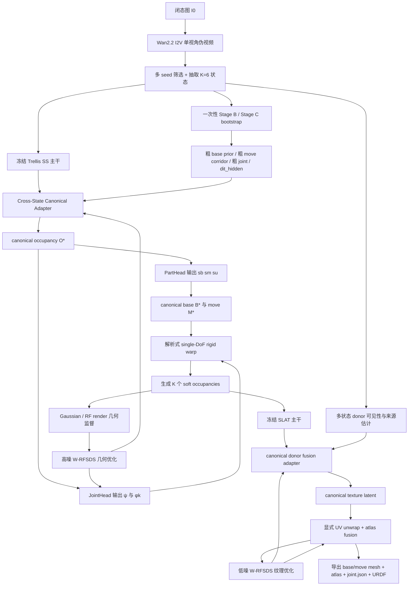

# 冻结 Trellis 主干的单图铰接拟合与细粒度纹理统一方案

## 执行摘要

这份报告给出的不是“再修一次 Stage B/Stage C”的增量方案，而是一个从第一性原理重新闭合的、可以作为 entity["organization","AAAI","ai conference"] 投稿主线的完整方法学设计。核心判断只有一句话：**在你的全部硬约束下，真正正确的变量不是六个最终状态的 voxel，而是一个 canonical 闭态资产；六个状态只应作为观测证据，通过 SS 内部跨状态交互去约束 canonical 几何、部件分割和单关节轨迹，再由解析刚体运动生成各状态，并在 canonical UV/atlas 上完成跨状态纹理融合。** 这个判断同时吸收了你上传的多份方案草稿、v9 设计稿、以及审稿批评中最正确的部分：保留一次性 BMCSA/bootstrap、保留 W-RFSDS 的高/低噪分段思想、保留 anchor-contact 物理先验、保留 canonical-first，但彻底放弃“多状态最终几何 + 后对齐”作为论文主体。fileciteturn79file4 fileciteturn79file5 fileciteturn79file6 fileciteturn77file0

这条路线之所以成立，是因为你要同时满足四个看似冲突的目标：只能用单张闭态图和 entity["organization","Hugging Face","ml platform"] /官方公开的 Wan2.2 单视角伪视频；Trellis 主干完全冻结；不允许用外部分割伪标签初始化；最后还要导出可用 UV/atlas。若仍让六个状态分别独立进入 Trellis，再在体素空间做对齐，那么连续 occupancy logit 的小差异经过硬阈值和 support 提取，必然被放大成 topology jitter；旧 Stage B 文档已经把这一点写得很明确，而 repo 更新后的 canonical 设计文档也已经朝着“单 canonical 资产 + 解析运动派生状态”转向。fileciteturn35file0L1-L1 fileciteturn34file0L1-L1

我最终给出的论文主故事是：**在冻结的 Trellis 上，提出一个单图 + Wan2.2 单视角伪视频驱动的 canonical single-joint articulated lifting 框架：在 SS 内通过跨状态 canonical adapter 恢复闭态 canonical occupancy、base/move 分割和单关节轨迹；在 canonical SLAT/UV 空间通过 donor fusion 与 W-RFSDS 完成细粒度纹理和隐藏表面补全；最终导出 base/move mesh、joint 与可用 UV/atlas。** 这条故事线与 Trellis 官方“两阶段 structured latent”、Wan2.2 官方 I2V-A14B、CHORD 的 W-RFSDS、FreeArt3D 的 training-free articulated optimization、MorphAny3D 的结构化 latent 融合是相容的，但组合方式在当前公开工作中并没有现成等价物。citeturn0search0turn0search1turn0search2turn0search3turn0search4turn0search5turn0search6turn3search12

## 研究边界与证据基础

### 硬约束与未指定假设

本方案严格保留你给定的全部硬约束，不做任何擅自放宽。输入只能是**单张闭态图**与 **Wan2.2 I2V** 生成的**单视角打开视频**；不能引入额外真实视角。模型层面，**Trellis 主干全部冻结**，不能微调 `SS-VAE / SS-DiT / SLAT-DiT / decoder`，只能增加 adapter、head、loss、attention 或结构外设。监督层面，不允许使用 **SAM / Grounded-SAM / DINO** 做 part segmentation 伪标签初始化，不允许使用外部分割标注；训练范式必须是 **per-instance optimization**。输出层面，最终必须导出 **UV/atlas**，隐藏区域纹理只允许通过跨状态融合或低置信 completion 获得。任务层面先做 **single-DoF / single-joint**，优先类别是 drawer、cabinet door、microwave/oven、refrigerator、laptop、washing machine/dishwasher。资源上，你早先给的是 2–4×80GB/H800、单对象 1–2 天；你随后又明确说“现在不需要管显存限制”，因此我把**主稿方案按方法最优而非显存最省**来设计，但报告最后仍保留低/中/高资源裁剪版。Wan2.2 官方模型卡与 README 明确说明 `I2V-A14B` 单 GPU 至少需要约 80GB VRAM，因此你的原始中资源设定本来就与官方边界一致。citeturn0search4turn0search5turn0search6

有几项是当前问题中没有被你显式指定、但实现时必须固定的维度，我按“未指定/假设”处理。其一，输入闭态图是否已经 object-centric crop 未指定；我默认主实验使用非学习型裁剪或人工框选，不引入新的分割器。其二，joint type 是否已知未指定；我采用“类别优先 + 双分支 outer-loop 选择”：drawer 优先 prismatic，door/fridge/laptop 优先 revolute，washing machine/dishwasher 可双分支。其三，真实照片是否有 GT articulation 未指定；因此真实数据只用于定性与少量人工量测。其四，UV atlas 分辨率未指定；方法主稿推荐 2048²，最小可跑版 1024²。其五，是否允许旧 Stage B/Stage C 只做一次 warm start 而不进入主优化，你虽未用这句话明说，但你已经多次强调要“从头重新拟定且逻辑闭环”，因此我把“旧基线降级为一次性初始化器”作为最终裁定。fileciteturn79file4 fileciteturn79file6

### 已访问资源、连接器与检索顺序

本次研究遵循你要求的顺序：**本地权威快照 → GitHub 指定仓库 → Hugging Face / 官方模型资料 → 其他高质量原始论文与项目页**。已启用连接器为 entity["organization","GitHub","code hosting platform"] 与前文已包裹的 entity["organization","Hugging Face","ml platform"]；实际研究中首先核验了你上传的 `mine.rar`、`trellis.rar`、`MorphAny3D.rar`、`Nano3D.rar` 与多份中间方案文档；随后深读 `chengu-123/research`；再核验 Trellis、Wan2.2、CHORD、FreeArt3D、MorphAny3D 的官方资料；最后才把 PartNet-Mobility、Tex4D、TAPESTRY、PAct 等工作作为 related work 与实验对位。上传快照与比较文档本轮已经被当作权威输入整体载入并对照使用。fileciteturn79file3 fileciteturn79file4 fileciteturn79file5 fileciteturn79file6

在指定仓库中，最关键的代码与文档集中在三组。第一组是 vendored Trellis 主干：`trellis_image_to_3d.py`、`sparse_structure_flow.py`、`sparse_structure_vae.py`、`structured_latent_flow.py`、`decoder_gs.py`、`decoder_mesh.py`、`decoder_rf.py` 与 `modulated.py`，它们决定了 SS→SLAT→三类 decoder 的真实数据流与可插入 adapter 的精确位置。第二组是旧 Stage B/Stage C：`stage_b_scar.py`、`run_stage_c.py`、`config.py`、`dit_prior.py`、`anchors.py`、`screw.py`、`configs/v1.yaml`，它们决定了当前 warm start、anchor、EM/BIC、`dit_hidden` 捕获与 SCAR/BMCSA 的真正能力边界。第三组是设计文档：`record/past/stageB/stageb_detail.md` 与 `record/articulated_2026-04-26_final_scheme.md`，它们明确记录了旧路线 jitter 的不可消除性与 canonical 方向的收束趋势。fileciteturn12file0L1-L1 fileciteturn14file0L1-L1 fileciteturn15file0L1-L1 fileciteturn16file0L1-L1 fileciteturn17file0L1-L1 fileciteturn18file0L1-L1 fileciteturn19file0L1-L1 fileciteturn34file0L1-L1 fileciteturn35file0L1-L1

下表给出本报告真正依赖的证据底座。

| 资源 | 角色 | 本报告中的作用 |
|---|---|---|
| 上传快照 `mine.rar / trellis.rar / MorphAny3D.rar / Nano3D.rar` | 本地权威版本 | 约束版本与方案比对基线 |
| `stage_b_scar.py` | 旧多状态一致性主线 | 证明 BMCSA/SCAR 最适合做 warm start，而不适合做最终表示 |
| `run_stage_c.py` + `config.py` | 旧 joint/anchor/EM 管线 | 提供 anchor、BIC、swept-volume carve、axis refine 的初始化资产 |
| `dit_prior.py` | SS hidden 语义分析 | 证明中后层 hidden 比 `z_final` 更适合做分割与运动先验 |
| `anchors.py` + `screw.py` | 接触带与 joint 参数化 | 为 anchor-based soft loss 和单关节解析模型提供直接实现底座 |
| `articulated_2026-04-26_final_scheme.md` | canonical 化设计文档 | 证明 repo 自身已经朝 single-canonical 方向演进 |
| Trellis 官方论文/项目页/代码 | 结构化 3D prior | 约束 SS/SLAT 的职责边界 |
| Wan2.2 官方 README/模型卡 | 单视角 I2V 教师 | 确认 I2V-A14B 能力边界与资源需求 |
| CHORD 官方论文 | W-RFSDS | 为视频教师优化提供理论锚点 |
| FreeArt3D / MorphAny3D / Tex4D / TAPESTRY | 能力模块参照 | 提供 training-free articulation、latent fusion、canonical texture completion 的直接对位 |

fileciteturn12file0L1-L1 fileciteturn34file0L1-L1 citeturn0search0turn0search1turn0search2turn0search3turn0search4turn0search5turn0search6turn3search12turn5search0turn5search2turn5search6

## 第一性原理与问题重构

### 为什么必须从多状态终态表示改成单 canonical 表示

从第一性原理看，若最终可交付物是 **URDF + base/move mesh + single-joint + UV/atlas**，那么系统最终一定需要一个**唯一 canonical 资产**。任何“六个状态各自产生一套几何与纹理，然后在后处理阶段对齐”的方案，都会遇到一个根本矛盾：它也许能在渲染层面做到状态相似，却天然不具备**唯一资产可导出性**。而你要的最终输出恰恰不是“六张图好看”，而是“一个能开合的 3D 资产”。这意味着 canonical-first 不是建模偏好，而是由交付形式反推出来的必要条件。repo 的 canonical 设计草案已经明确转向这一点，而旧 Stage B 文档则把多状态独立采样 + 后对齐的局限记得非常清楚。fileciteturn34file0L1-L1 fileciteturn35file0L1-L1

更形式化地说，若物体只有 single-DoF rigid articulation，那么最小完备变量应写成
\[
\mathcal X=\{O^\star,\;s_b,\;s_m,\;\psi,\;A_{uv}\},
\]
其中 \(O^\star\) 是 canonical occupancy，\(s_b,s_m\) 是 canonical base/move 分区，\(\psi\) 是单关节参数，\(A_{uv}\) 是 canonical atlas。任意状态 \(k\) 都应当由
\[
O_k = \Psi(O^\star, s_b, s_m, \psi_k)
\]
解析生成，而不是各自独立预测。只有这样，base 才是 by-construction 一致的，move 才是 by-construction 通过关节派生的，texture 也才有单一 canonical 归宿。这个逻辑链是闭合的。fileciteturn34file0L1-L1

### 为什么 part segmentation 与轨迹应该在 SS 内产生

Trellis 的官方与源码都说明：SS 决定 structure/support，SLAT 决定在 support 上如何表达 appearance/representation；`trellis_image_to_3d.py` 的主路径是先采 SS，再把 occupied coords 传给 SLAT。也就是说，如果 part segmentation 与运动轨迹被延迟到 voxel 输出之后再分析，那么你是在一个**已经抖动、已经离散化、已经 support 固定**的表示上做识别；这时 SLAT 不可能替你修复几何根因，只能被动继承。既然你偏好的路线本来就是“在 Trellis SS 内部做跨状态 token/feature 交互”，那么从第一性原理看，这也确实是正确路线。fileciteturn37file0L1-L1 citeturn0search0turn0search1

更进一步，在 single-DoF fixed-camera 场景里，base 与 move 的可辨识性恰好可由**不变性群**来定义。base 在世界坐标及状态空间中都不动；move 只有在**逆关节变换回 canonical**之后才不变。因此，最自然的 part loss 不是外部分割监督，而是：
- 静止分量在原状态域内方差最小；
- 可动分量在 inverse-warp 到 canonical 后方差最小。
这就是为什么 part segmentation 与 trajectory 应该耦合求解，而不是先分割、再拟轨、再补纹理。它们共享同一个 invariance principle。fileciteturn16file0L1-L1 fileciteturn31file0L1-L1

### 为什么旧 Stage B 只适合做一次性初始化

旧 Stage B 路线的价值不在“它就是最终答案”，而在“它提供了一次性 warm start”。`stage_b_scar.py`、`config.py` 与 `stageb_detail.md` 表明，SCAR/BMCSA 的价值主要体现在：共享 base prior、`dit_hidden` 中后层 hidden、Pass-2 guide、以及 M_attn 对 move corridor 的粗范围估计；但这些设计始终没有改变一个事实：**K 个状态仍各自走各自的 SS 采样轨迹**，随后才被修补。文档里明确记录了 token 数假设曾出错、long-drawer 会被误吸进 base、guide 会污染 move corridor，以及 final jitter 无法从根上清除。这说明 BMCSA/SCAR 适合做一次性初始化，而不适合成为主方法体。fileciteturn12file0L1-L1 fileciteturn19file0L1-L1 fileciteturn35file0L1-L1

这也是我综合多份草稿后做出的关键裁定。ArtRASA-v9 草稿最值得保留的是 **W-RFSDS 的高/低噪分段调度** 与 **gradient sanity test**，而不是“把 BMCSA 主干参数可学习化并嵌入主循环”；canonical-first 草稿最值得保留的是 **单 canonical 闭态 occupancy、显式 `φ_0=0` 与 contact-anchor 修正**，而不是仅仅把显存问题降维。两者结合后的最优解，就是“**一次性 bootstrap + canonical-first + W-RFSDS schedule + anchor-aware texture fusion**”。fileciteturn79file4 fileciteturn79file5 fileciteturn79file6 fileciteturn77file0

### 最终方案对既有方案的综合裁定

| 候选思想 | 保留部分 | 舍弃部分 | 最终裁定 |
|---|---|---|---|
| 旧 Stage B / BMCSA / SCAR | 一次性 bootstrap、`dit_hidden`、粗 base prior、粗 anchor/joint 初值 | 把 K 状态最终几何当输出、反复在主循环中跑 BMCSA | 仅作 no-grad 初始化器 |
| canonical-first 方案 | 单 canonical 闭态资产、`φ_0=0`、contact field 修正、UV/atlas 导出 | 过于保守而忽略 Wan teacher schedule 的实验论证 | 作为方法主骨架 |
| ArtRASA-v9 / RASA | W-RFSDS 高/低噪分段思想、sanity test、电池式风险管理 | 将速度修正/BMCSA 可学习化作为主创新体 | 只吸收 teacher 使用策略，不采纳其主表示 |
| MorphAny3D | structured latent 内 donor fusion / MCA/TFSA 的思想 | 一维 morphing 设定 | 改写为 canonical atlas donor fusion |
| FreeArt3D | frozen static 3D prior + per-instance optimization 的范式、土地/地毯清理启发 | 多态输入依赖 | 作为范式与 bootstrap 小技巧来源 |

fileciteturn79file4 fileciteturn79file5 fileciteturn79file6 citeturn0search2turn0search3turn3search12

## 最终统一方法

### 建议论文题目与核心贡献

建议题目可以写成：

**Canonical-First Articulation and Texture Completion with Frozen Trellis from a Single Closed Image and Wan2.2 Pseudo-Video**

中文题目可对应为：

**基于冻结 Trellis 的单图 canonical 铰接重建与细粒度纹理补全**

我建议论文主文只打三个贡献，而且必须把逻辑链讲成闭环。第一，提出**SS 内 canonical-aware cross-state adapter**，让 frozen Trellis 在结构阶段直接输出 canonical occupancy、base/move 分割与 single-joint trajectory，而不是输出 K 套彼此独立的终态结构。第二，提出**anchor-based contact-constrained single-joint fitting**，用接触边界离散 anchor 集把“轴/导轨必须贴近真实接触区”写成可微软损失。第三，提出**canonical UV/atlas donor fusion**，把 state0 正面、open state 背面/内表面以及从未观测区域明确区分，完成可导出的纹理资产。fileciteturn17file0L1-L1 fileciteturn18file0L1-L1 citeturn0search2turn0search3turn5search0turn5search2turn5search6

### 整体流水线



整个系统分成四个相位，但外层可以保持为一个统一的 per-instance optimization loop。**Phase A** 是 Wan2.2 伪视频生成与筛选。**Phase B** 是旧 Stage B / Stage C 的一次性 bootstrap。**Phase C** 是 canonical geometry / segmentation / joint 优化，只更新 SS adapter、PartHead、JointHead 与显式关节变量。**Phase D** 是 canonical texture / atlas 优化，只更新 SLAT donor adapter 与 atlas residual。这个“形式一套训练器、机制两阶段”的设计吸收了 v9 草稿中最有价值的部分：不是把几何纹理彻底拆成两个系统，而是通过 teacher 的高/低噪阶段与参数组冻结来实现可解释分工。fileciteturn79file4 fileciteturn79file5 citeturn3search12turn0search4turn0search5turn0search6

### 单视角 Wan2.2 伪视频阶段

Wan2.2 官方明确支持 `I2V-A14B` 的 image-to-video，用法是“输入图像 + 自然语言 prompt”，且单卡至少需要约 80GB VRAM，输出面积可按输入图比例走 480P/720P；但官方并**没有**给出“固定机位铰接视频”的专用模板。所以下面给出的 prompt 不是官方逐字模板，而是基于官方能力边界和公开视频最佳实践的**保守推导**。citeturn0search4turn0search5turn0search6

中文正向 prompt 模板可写作：

> 一个固定机位、固定焦距、单镜头连续拍摄的视频。第一帧尽量严格等于输入图片。相机完全静止，没有平移、没有旋转、没有推拉、没有变焦、没有视角变化。只有【部件名】发生缓慢、连续、刚性的开合运动，物体主体保持静止。材质、纹理、光照、背景保持一致。不要出现相机漂移、额外物体、非刚性形变、纹理闪烁、造型漂移或镜头切换。

英文正向 prompt 模板可写作：

> A locked-off single-camera video. The first frame should match the input image as closely as possible. The camera is completely static: no pan, no tilt, no orbit, no dolly, no zoom, and no viewpoint change. Only the [movable part] performs a slow, rigid opening motion, while the main body remains stationary. Materials, texture, lighting, and background stay consistent. No extra objects, no non-rigid deformation, no shape drift, no flicker, no cuts.

建议负向 prompt 统一强调 camera motion、viewpoint change、background change、extra objects、texture flicker、shape drift、non-rigid deformation。参数上，主稿推荐：4 个 seed；每个 seed 生成 81 帧；推理步数约 50；guidance 约 4.5–6.0；最后按“背景最稳 + bbox 尺度最稳 + optical flow 单调最强”的规则选一条视频，再从该视频抽 K=6 个状态。这里的关键不是“prompt magical control”，而是**prompt 锁定相机 + 多 seed 漂移筛选 + 闭态图重建强锚定**共同减少伪视频偏差。citeturn0search4turn0search5turn0search6

### 一次性 bootstrap 阶段

bootstrap 阶段直接调用你现有仓库中最成熟的旧资产，但只跑一次，不进入主优化环。`stage_b_scar.py` 负责多状态粗对齐、`dit_hidden` 捕获与 BMCSA/SCAR；`run_stage_c.py`、`anchors.py`、`screw.py` 与配置文件负责 joint-free split、anchor、BIC 双假设、swept-volume carve 与 axis refine。这些能力都很有价值，但都不应该再被当成论文的最终形式。它们的最优用法是提供：
\[
\mathcal I_0=\{O^{(0)}_{\text{stack}},\;z^{(0)}_{\text{final}},\;H^{(0)}_{\text{dit}},\;B_0,\;C_0,\;\psi_0,\;\mathcal A_0\},
\]
分别对应粗 occupancy 栈、粗 SS latent、粗语义 hidden、粗 base 先验、粗 move corridor、粗 joint 初值、粗 anchor 集。fileciteturn12file0L1-L1 fileciteturn14file0L1-L1 fileciteturn15file0L1-L1 fileciteturn17file0L1-L1 fileciteturn18file0L1-L1

此外，repo 与 FreeArt3D 思路中“地毯/grounding disk 移除”的小技巧值得保留，但也只保留为初始化预处理：即在构建粗 base prior 与 coarse contact band 之前，先去掉大平面支撑物体的基础盘/地毯支持区域，以免 ground plane 被错误吸入 base。论文中把它定位成工程清理即可，不要把它写成主要贡献。fileciteturn19file0L1-L1 citeturn0search2

### SS 内 canonical-aware cross-state adapter

这是最终方法的第一主贡献，也是你路线 2 的核心落点。

设第 \(k\) 个状态图的冻结图像 encoder 输出为 \(c_k\)，SS-DiT 中后层第 \(b\) 个 block 的 token 为 \(H_k^{(b)}\in\mathbb R^{N\times d}\)。我建议在 block 14/16/18 对应的中后层插入一个**零初始化的 canonical-aware cross-state adapter**，其关键思想是：不是让 6 个状态各自产生终态结构，而是先通过当前 part/joint 假设把各状态中的可动 token 逆变换回 canonical 坐标，再做跨状态稳健融合，最后只回写到**单一 canonical latent**。形式上可写成：
\[
\bar H_c^{(b)}(x)=
\frac{
\sum_{k=0}^{K-1}
w_k(x)\Big[(1-m_k(x))H_k^{(b)}(x)+
\mathcal W^{-1}_{T_k}\!\left(m_k H_k^{(b)}\right)(x)\Big]
}{
\sum_k w_k(x)+\epsilon
},
\]
其中 \(m_k\) 是当前 move 概率，\(T_k(\psi)\) 是当前关节 pose，\(w_k\) 是由 occupancy confidence、visibility reliability 与 state consistency 共同决定的置信权。随后做零初始化残差注意力：
\[
\Delta H_k^{(b)}
=
W_o^{(b)}
\operatorname{Attn}
\big(
H_k^{(b)}W_Q,\;
\bar H_c^{(b)}W_K+b_{\text{pose}}(\psi_k),\;
\bar H_c^{(b)}W_V
\big),
\qquad
W_o^{(b)}\leftarrow 0,
\]
\[
H_k^{(b+1)}=H_k^{(b)}+\gamma_b\Delta H_k^{(b)}.
\]
由于 \(W_o^{(b)}\) 零初始化，step 0 时系统严格退化为 vanilla frozen Trellis；这可以避免一开始就把强静态 3D prior 破坏掉。`dit_prior.py` 也已经说明中后层 1024 维 hidden 比 `z_final` 更有 part/material 区分力，这正好支持在这些位置插入 adapter。fileciteturn12file0L1-L1 fileciteturn16file0L1-L1 citeturn0search1

这里我刻意不采用 v9 草稿中的“速度修正分支作为主体”。那条路线的优点是 teacher 调度和 sanity test，但它把可学习性绑定在“修正 ODE 速度场”上，逻辑上仍离不开对采样轨迹的持续干预；而你明确偏好的是“在 Trellis SS 内部做跨状态 token/feature 交互得到轨迹与部件分割”，因此最终主体仍应是**token 级 canonical adapter**。我吸收的，是 v9 的分阶段 teacher 使用方式，而不是它的表示主体。fileciteturn79file4 fileciteturn79file5

### canonical occupancy、part head 与 joint head

adapter 融合后的 canonical token 特征为 \(\bar H_c\)。在其上定义三个头部：

\[
z_c = z_c^{(0)} + g_{\text{can}}(\bar H_c),
\]
\[
m_c = \sigma(g_{\text{part}}(\bar H_c)),
\]
\[
a_c = \sigma(g_{\text{anc}}(\bar H_c)),
\]
其中 \(z_c\) 送入冻结 SS decoder 得 canonical occupancy：
\[
p_c=\sigma(D_S(z_c)).
\]
base 与 move 分解为
\[
p_B = p_c(1-m_c),\qquad p_M = p_c m_c.
\]

JointHead 则输出 \(\psi\)。对 revolute，
\[
\psi=(\omega,q,\phi_1,\dots,\phi_{K-1}),\qquad \|\omega\|=1,
\]
对 prismatic，
\[
\psi=(v,d_1,\dots,d_{K-1}),\qquad \|v\|=1.
\]
并显式固定
\[
\phi_0=0.
\]
这是 canonical pose 闭合的关键：canonical 就是闭态，`φ_0=0` 不是建议，而是硬约束。fileciteturn77file0

### 解析式 single-DoF 状态生成

对 revolute，
\[
T_k(x)=R(\omega,\phi_k)(x-q)+q.
\]
对 prismatic，
\[
T_k(x)=x+\phi_k v.
\]
可动件 inverse-warp 后，生成第 \(k\) 个状态的 soft occupancy：
\[
\tilde p_{M,k}(x)=\mathcal W_{T_k}(p_M)(x).
\]
最终状态用 soft union 合成：
\[
\hat p_k(x)=1-\big(1-p_B(x)\big)\big(1-\tilde p_{M,k}(x)\big).
\]
这里可在工程实现里用 `softmax_p` 或 noisy-OR 的光滑近似，主文建议用 `softmax_p` 以避免“独立占据”解释的不适定性。更重要的是：**base 的一致性此时是 by-construction，而不是靠损失“学”出来的。** 这使论文从“经验对齐”升级为“结构建模”。fileciteturn79file6

### anchor-based soft loss

你要求必须把 anchor-based soft loss 数学化并纳入总损失，这一点我认为不只是必须，而且应该成为论文最有价值的方法细节之一。

先定义 canonical partition：
\[
s_b(x), s_m(x), s_u(x)\in[0,1],\qquad
s_b+s_m+s_u=1 \text{ on } O^\star.
\]
定义 soft 接触场：
\[
\partial_b(x)=\|\nabla s_b(x)\|_2,\qquad
\partial_m(x)=\|\nabla s_m(x)\|_2,
\]
\[
c(x)=
\sigma\!\left(\frac{\partial_b(x)\partial_m(x)-\tau_c}{\tau_g}\right)
\cdot
\sigma\!\left(\frac{4s_b(x)s_m(x)-\tau_o}{\tau_g}\right).
\]
这里必须是 \(4s_bs_m\)，而不是错误的 \(s_b+s_m\)；这一点来自审稿批评的核心修正，我完全采纳。fileciteturn77file0

从 \(c(x)\) 中提取离散 anchor set
\[
A=\{(a_n,w_n)\}_{n=1}^N,
\qquad
\bar w_n=\frac{w_n}{\sum_j w_j}.
\]
做法是：top-\(N\) 局部峰值 + 带权 FPS/NMS。对 revolute，轴线到 anchor 的距离：
\[
d_n^{\text{rev}}
=
\|(I-\omega\omega^\top)(a_n-q)\|_2.
\]
软最小距离损失：
\[
L_{\text{anchor}}^{\text{rev}}
=
-\log
\sum_{n=1}^{N}
(\bar w_n+\epsilon_w)\,
\exp\!\left(
-\frac{(d_n^{\text{rev}})^2}{2\sigma_a^2}
\right).
\]
对 prismatic，先做加权协方差：
\[
\mu_A=\sum_n \bar w_n a_n,\qquad
\Sigma_A=\sum_n \bar w_n (a_n-\mu_A)(a_n-\mu_A)^\top,
\]
令 \(e_1\) 为最大特征向量，方向项为
\[
L_{\text{dir}}^{\text{pris}}=1-|\hat v^\top e_1|.
\]
anchor band 项为
\[
d_n^{\text{pris}}=
\|(I-\hat v\hat v^\top)(a_n-\mu_A)\|_2,
\]
\[
L_{\text{band}}^{\text{pris}}
=
-\log
\sum_{n=1}^{N}
(\bar w_n+\epsilon_w)\,
\exp\!\left(
-\frac{(d_n^{\text{pris}})^2}{2\sigma_a^2}
\right),
\]
\[
L_{\text{anchor}}^{\text{pris}}
=
L_{\text{dir}}^{\text{pris}}+\lambda_{\text{band}}L_{\text{band}}^{\text{pris}}.
\]

连通性不能再用误命名的 graph-TV，我建议分成两项。第一项是真正的谱连通 surrogate：
\[
L_{\text{spec}}=\frac{1}{\lambda_2(L_G)+\epsilon},
\]
其中 \(L_G\) 是 anchor graph 的归一化 Laplacian。第二项是带状平滑项：
\[
L_{\text{smooth}}
=
\frac{
\sum_{(i,j)\in E}\alpha_{ij}|g_i-g_j|
}{
\sum_i g_i+\epsilon
}.
\]
\(\sigma_a\) 采用 4 voxel → 1 voxel 退火，\(\lambda_{\text{anchor}}\) 与 \(\lambda_{\text{spec}}\) 在几何阶段中期逐步抬高。这样可同时满足“轴应穿过接触边界附近离散 anchor set”与“contact band 应近连通”的几何直觉。fileciteturn17file0L1-L1 fileciteturn18file0L1-L1 fileciteturn77file0

### canonical texture donor fusion 与 UV/atlas

这是论文第二主贡献，也是最贴近你“主贡献偏好为细粒度纹理”的部分。

几何阶段收敛后，固定或近固定 \((p_c,m_c,\psi)\)，提取 canonical mesh \(M_c=(V,F)\)，对 canonical base 与 move 分别做 UV unwrap，得到 atlas 坐标 \(u\in\Omega_{UV}\)。随后对每个 texel 和每个 donor state 计算：
- 可见性 \(V_k(u)\)；
- 前向视角夹角 \(\theta_k(u)\)；
- 深度一致性 \(D_k(u)\)；
- temporal/blur 质量 \(B_k(u)\)；
- 对应颜色 \(I_k(\pi_k(u))\)。

定义 donor 权重：
\[
\alpha_k(u)=
V_k(u)\,
\exp\big(
-\beta_1\theta_k(u)^2
-\beta_2 D_k(u)
-\beta_3 B_k(u)
\big).
\]
于是观测 atlas 为
\[
A_{\text{obs}}(u)=
\frac{\sum_k \alpha_k(u)I_k(\pi_k(u))}
{\sum_k \alpha_k(u)+\epsilon}.
\]
并同时输出
\[
Q(u)=\min\left(1,\sum_k \alpha_k(u)\right),\qquad
P(u)=\arg\max_k\alpha_k(u),
\]
分别作为置信图与来源图。这样 state0 通常主导正面；open states 主导门背面、抽屉内侧、箱体内腔等新暴露区域；从未被任何状态观测到的 texel 则只有 \(Q(u)\approx0\)，只能进入低置信 completion，而不能被伪装成高置信“恢复”。这与 Tex4D/TAPESTRY 对可见证据与缺失区域的严格区分是一致的。citeturn5search0turn5search2turn5search6

在 SLAT 侧，只做小的 donor fusion adapter，而不重写主干。形式上，对 inverse-warp 回 canonical 的每个状态 donor token \(f_k(p)\)，写成
\[
f^\star_{\text{app}}(p)
=
\sum_{k=0}^{K-1}\alpha_k(p)\,f_k(p)+\Delta f_{\text{app}}(p),
\]
其中 \(\Delta f_{\text{app}}\) 是可学习 residual。这样，你吸收了 MorphAny3D 的 structured latent 融合思想，但把它从 morphing 任务改写为了 **canonical texture fusion**。最终导出物体时，base 与 move 的 mesh 分别 bake 各自 atlas，并输出 `mesh_base.glb`、`mesh_move.glb`、`atlas_base.png`、`atlas_move.png`、`joint.json` 与 `object.urdf`。citeturn0search3

## 优化目标与实现细节

### 总损失与两阶段 teacher 调度

综合上述部件，几何阶段总损失建议写成：
\[
L_{\text{geom}}
=
\lambda_{\text{rf}}L_{\text{W-RFSDS}}^{\text{high/mid}}
+\lambda_{\text{close}}L_{\text{close}}
+\lambda_{\text{canon}}L_{\text{canon}}
+\lambda_{\text{seg}}L_{\text{seg-motion}}
+\lambda_{\text{anchor}}L_{\text{anchor}}
+\lambda_{\text{spec}}L_{\text{spec}}
+\lambda_{\text{sweep}}L_{\text{swept-conflict}}.
\]
其中
\[
L_{\text{close}}=
\|\hat I_0-I_0\|_1+\lambda_{\text{lpips}}\operatorname{LPIPS}(\hat I_0,I_0),
\]
\[
L_{\text{canon}}
=
\frac{1}{K}\sum_k
\Big(
\|\mathcal W^{-1}_{T_k}\hat p_k^M-p_M\|_1
+
\|\hat p_k^B-p_B\|_1
\Big),
\]
\[
L_{\text{seg-motion}}
=
\sum_x
\Big[
(1-m_c(x))\operatorname{Var}_k(\hat p_k(x))
+
m_c(x)\operatorname{Var}_k(\mathcal W^{-1}_{T_k}\hat p_k(x))
\Big]
+\lambda_H H(m_c)+\lambda_{TV}\operatorname{TV}(m_c),
\]
\[
L_{\text{swept-conflict}}
=
\sum_x
S(x)\,p_B^{\text{solid}}(x)(1-\chi_{\mathcal C_\delta}(x)),
\qquad
S(x)=\max_k \mathcal W_{T_k}(p_M)(x).
\]
这就把“base 静止不变、move 逆变换后不变、接触带应真实、非法穿模应被抑制”全部写成了和你的物理直觉一一对应的目标。fileciteturn17file0L1-L1 fileciteturn18file0L1-L1

纹理阶段总损失建议写成：
\[
L_{\text{tex}}
=
\lambda_r L_{\text{W-RFSDS}}^{\text{low}}
+\lambda_p L_{\text{vis-photo}}
+\lambda_f L_{\text{atlas-fuse}}
+\lambda_s L_{\text{seam}}
+\lambda_u L_{\text{unseen}},
\]
其中
\[
L_{\text{vis-photo}}
=
\sum_{k,u}\alpha_k(u)\|\hat I_k(\pi_k(u))-I_k(\pi_k(u))\|_1,
\]
\[
L_{\text{atlas-fuse}}
=
\sum_u\sum_{i<j}\alpha_i(u)\alpha_j(u)\|A_i(u)-A_j(u)\|_1,
\]
\[
L_{\text{unseen}}
=
\sum_{u:Q(u)<\tau_q}
\Big(
\lambda_\nabla\|\nabla A(u)\|_1
+
\lambda_s\|A(u)-h_{\text{slat}}(s_c(u))\|_2^2
\Big).
\]
而 teacher 调度吸收 v9 的最佳做法：几何阶段优先采高噪/中噪区间，让 Wan 主要约束 motion/layout；纹理阶段优先采低噪区间，让 Wan 主要约束细节和 region continuity。这不是因为我要把 v9 原样照搬，而是因为 Wan2.2 与 CHORD 的组合本来就最适合这种 coarse-to-fine usage。fileciteturn79file4 citeturn3search12turn0search4turn0search5turn0search6

### 训练流程表

| 相位 | 目标 | 更新变量 | 主要 teacher 区间 | 主要损失 | 备注 |
|---|---|---|---|---|---|
| 伪视频与筛选 | 得到单视角 opening video | 无 | 无 | 无 | 4 seeds → 选 1 |
| bootstrap | 粗对齐、粗 joint、粗 anchor | 无 | 无 | 无 | Stage B/C 各跑一次 |
| 几何热启动 | 稳定 canonical occupancy 与 part 语义 | SS adapter、CanonicalHead、PartHead、JointHead、\(\psi\) | 高噪/中噪 | `L_close`, `L_canon`, `L_seg-motion`, 小权重 `L_anchor` | 300–500 iter |
| 几何主优化 | 收敛 canonical geometry、part、trajectory | 同上 | 高噪/中噪 | `L_W-RFSDS`, `L_canon`, `L_seg-motion`, `L_anchor`, `L_spec`, `L_swept-conflict` | 800–1500 iter |
| 纹理预热 | 建立 donor fusion 与初始 atlas | SLAT donor adapter、atlas residual | 中噪/低噪 | `L_vis-photo`, `L_atlas-fuse`, 小权重 `L_W-RFSDS` | 300–500 iter |
| 纹理精修 | 细粒度纹理与隐藏面补全 | 纹理变量为主，几何变量冻结或低 lr | 低噪 | `L_W-RFSDS`, `L_vis-photo`, `L_seam`, `L_unseen` | 500–1000 iter |
| 导出 | 输出 mesh、UV、atlas、URDF | 无 | 无 | 无 | 三种 decoder 任选其一作为中间体 |

### 关键伪代码

```python
# input: closed image I0

# phase A: pseudo-video
cand = [wan22_i2v(I0, pos_prompt, neg_prompt, seed=s) for s in seeds]
video = select_locked_camera_video(cand)
frames = sample_monotonic_states(video, K=6)

# phase B: bootstrap, run once only
boot = stageB_bootstrap_once(frames)       # O_stack0, z_final0, dit_hidden
warm = stageC_warmstart_once(boot)         # psi0, anchors0, contact_band0

# phase C: geometry
ss_adapter = CanonicalStateAdapter(zero_init=True)
canon_head = CanonicalHead()
part_head = PartHead()
joint_head = JointHead()
psi = warm.psi0

for it in range(T_geom):
    O_star, H = frozen_trellis_ss_with_adapter(I0, frames, boot, ss_adapter)

    p_c = sigmoid(ss_decoder(canon_head(H, boot)))
    m_c = sigmoid(part_head(H, boot))
    psi = joint_head(H, m_c, warm.psi0)

    p_B = p_c * (1 - m_c)
    p_M = p_c * m_c

    states = []
    for k in range(K):
        p_Mk = warp_move(p_M, psi, k)
        p_k = soft_union(p_B, p_Mk)
        states.append(p_k)

    anchors = build_anchor_set(p_B, p_M, part_head.anchor_logits(H))
    video_render = render_geometry(states)

    L = (
        w_rf * wrfsds_high_mid(video_render) +
        w_close * close_image_loss(video_render[0], I0) +
        w_canon * canonical_consistency(states, p_B, p_M, psi) +
        w_seg * seg_motion_loss(states, p_B, p_M, psi) +
        w_anchor * anchor_loss(anchors, psi) +
        w_spec * spectral_connectivity(anchors) +
        w_sweep * swept_conflict(states, p_B, p_M)
    )

    optimize(L, params=[ss_adapter, canon_head, part_head, joint_head, psi])

# phase D: texture
slat_adapter = CanonicalDonorAdapter(zero_init=True)
atlas = init_uv_atlas(mesh_from_canonical(p_B, p_M))

for it in range(T_tex):
    donor_feats = frozen_slat_donors(frames, states, slat_adapter, psi)
    atlas = fuse_into_canonical_atlas(atlas, donor_feats, frames, psi)
    video_render = render_textured(states, atlas)

    L = (
        w_rf * wrfsds_low(video_render) +
        w_vis * visible_photo_loss(atlas, frames, psi) +
        w_fuse * atlas_fusion_loss(atlas) +
        w_seam * seam_loss(atlas) +
        w_unseen * unseen_completion_loss(atlas)
    )

    optimize(L, params=[slat_adapter, atlas])

export_asset(p_B, p_M, psi, atlas)
```

### 推荐起步超参

| 项 | 主稿推荐值 |
|---|---:|
| 状态数 K | 6 |
| Wan seeds | 4 |
| Wan 推理步数 | 50 |
| Wan guidance | 5.0 左右 |
| Wan 生成帧数 | 81 |
| SS adapter 层数 | 3 |
| 插层位置 | 14/16/18 或同等中后层 |
| adapter bottleneck | 64–96 |
| anchor 数 | 32–64 |
| \(\sigma_a\) | 4 voxel → 1 voxel 退火 |
| geometry 迭代 | 1200–2000 |
| texture 迭代 | 800–1500 |
| atlas 分辨率 | 2048² |
| `L_close` 初始权重 | 高 |
| `L_anchor` 初始权重 | 低，随后抬高 |
| `L_spec` | 中等 |
| `L_W-RFSDS` 几何阶段 | 中等，后期增大 |
| `L_W-RFSDS` 纹理阶段 | 中高 |

### gradient sanity test

我吸收 RASA/v9 草稿中最有价值的实验建议之一：**在正式跑主实验前，必须先做 Wan teacher 的梯度方向健全性测试**。否则 reviewer 很容易质疑“你怎么证明 Wan2.2 的视频梯度对 mask/axis/θ 真的有用”。测试方式可以用合成数据中的 GT canonical part、joint 与 state values，人为构造五类扰动：mask、轴方向、轴上一点、joint type、\(\phi_k\)。然后分别在高噪桶与低噪桶中测量
\[
\cos\big(-\nabla_\theta L_{\text{W-RFSDS}},\;\theta^\star-\theta^{\text{wrong}}\big)
\]
的符号与分布。若对 major perturbations 的正向率都上不去，就不要继续用当前 teacher 调度。这条实验不是为了发明新方法，而是为了让整篇论文站得住。fileciteturn79file4 fileciteturn79file5

## 实验设计、AAAI 叙事与优先参考资料

### 数据、基线与指标

主实验使用 PartNet-Mobility / SAPIEN 单关节类别做定量，真实单图只做小规模定性与少量人工量测。这是最合理的，因为 PartNet-Mobility/URDF/SAPIEN 本来就提供了关节类型、状态范围、部件标注与可渲染几何，与你的输出形式天然对齐。优先类别继续保持 drawer、cabinet door、microwave/oven、refrigerator、laptop、washing machine/dishwasher。citeturn2search0turn2search12turn3search0turn3search4turn3search6

定量指标至少分成四组。几何与分割：canonical part IoU、state occupancy IoU、Chamfer、F-score。轨迹与关节：joint type accuracy、axis angular error、axis point distance、state parameter MAE。稳定性：Base Consistency 与 Move Equivariance：
\[
\text{BaseConsistency}
=
\frac1K\sum_k \text{IoU}(B_k,\bar B),
\]
\[
\text{MoveEquivariance}
=
\frac1K\sum_k \text{IoU}(W^{-1}_{T_k}M_k,\bar M).
\]
纹理：visible-region SSIM/PSNR/LPIPS、hidden texture coverage、atlas completeness、texel cross-state variance。你真正要打 reviewers 的，是后两组，而不是只报一个 Chamfer。fileciteturn0file2L1-L1

对比基线至少应包括：Plain multi-state Trellis、One-shot BMCSA + Stage C、FreeArt3D 风格 adaptation、MorphAny3D 风格单纯 latent 融合、以及你的完整方法。同时做以下核心消融：去掉 SS cross-state adapter、去掉 anchor loss、去掉 canonical pose 显式定义、去掉低噪纹理 W-RFSDS、去掉 donor fusion、去掉一次性 bootstrap。若资源允许，再做“all-to-all full attention vs sparse memory adapter”的对比；我预期即使不担心显存，稀疏 memory 依然会因信噪比更高而更稳。fileciteturn79file6 citeturn0search2turn0search3turn3search12

### 资源规划

尽管你最新说“现在不需要管显存限制”，主稿方案仍建议按**最强版**设计、按**多档资源**落地。最强版使用 full K=6、三处 SS adapter、三处 donor 层、2048² atlas、4 seeds Wan 筛选。中资源版是你原始设定：2–4×80GB、单对象 1–2 天。低资源版只能降级做离线 Wan teacher 或 reduced K，不能声称完整在线跑 `I2V-A14B + full W-RFSDS`。这里最重要的工程原则有三个：第一，Wan VAE latent / prompt embedding / teacher 中间结果必须缓存；第二，旧 Stage B/Stage C 只跑一次并缓存；第三，若 OOM，先降 donor K、再降 atlas 分辨率、再降纹理渲染分辨率，不要先砍 canonical 几何和 anchor 约束。citeturn0search4turn0search5turn0search6

### 论文组织建议

如果要把这篇工作组织成一篇真正像 AAAI 的论文，我建议结构如下：引言直接指出“六状态独立 multi-image 3D lifting 在 articulated object 上的结构性失效”；相关工作分成 Trellis/structured latent、single-image articulation、training-free articulated optimization、video-prior distillation、canonical texture fusion 五类；方法部分围绕“canonical necessity → SS adapter → anchor-contact → canonical atlas”四步推进；实验部分先给 gradient sanity test，再给主表，再给纹理表，再给真实图；最后 limitation 明确写 single-joint 与 unseen texture 的边界。你真正要说服审稿人的，不是“我做了很多工程”，而是“**我把一个原本不闭合的问题变成了闭合问题**”。citeturn0search0turn0search1turn0search2turn0search3turn3search12

### 优先参考论文与代码

按优先级排序的原始资料如下，建议你后续实现时就按这个清单开 tab，不要再发散。

| 优先级 | 资料 | 用途 |
|---|---|---|
| 最高 | Trellis 官方论文、项目页与官方实现 | 确认 SS/SLAT/decoder 边界与可插 adapter 的真实位置 citeturn0search0turn0search1 |
| 最高 | Wan2.2 官方 README、模型卡、技术报告 | 确认 I2V-A14B、资源边界与 prompt 能力边界 citeturn0search4turn0search5turn0search6 |
| 最高 | CHORD 官方论文 | 确认 W-RFSDS 公式与 coarse-to-fine teacher 逻辑 citeturn3search12 |
| 最高 | `stage_b_scar.py`、`run_stage_c.py`、`config.py`、`dit_prior.py`、`anchors.py`、`screw.py` | 直接决定 bootstrap、anchor、joint、hidden prior 的可用资产 fileciteturn12file0L1-L1 fileciteturn14file0L1-L1 fileciteturn15file0L1-L1 fileciteturn16file0L1-L1 fileciteturn17file0L1-L1 fileciteturn18file0L1-L1 |
| 高 | FreeArt3D | training-free frozen-3D-prior 范式与地毯/初始化启发 citeturn0search2 |
| 高 | MorphAny3D | structured latent donor fusion 的直接参照 citeturn0search3 |
| 高 | Tex4D / TAPESTRY | canonical atlas、hidden surface、可见性融合的纹理先例 citeturn5search0turn5search2turn5search6 |
| 高 | PartNet-Mobility / SAPIEN | single-DoF 定量主基准 citeturn2search0turn2search12turn3search0turn3search4turn3search6 |
| 对位 | PAct | 同期 single-view articulation 相关工作，用于 related work 与 baseline 定位 citeturn2search6 |

### 最终结论

最终方案可以浓缩成一句话：

**不要再把问题表述成“如何把六个状态更好对齐”，而要把问题改写成“如何用六个状态去约束一个 canonical 资产”。**

因此，这篇论文的最终正确版本应当是：

**一次性 BMCSA/Stage C bootstrap + canonical-first SS cross-state adapter + contact-anchor 单关节约束 + canonical SLAT donor fusion + 显式 UV/atlas + W-RFSDS 分阶段统一优化。**

它比旧路线更强，不是因为它“用了更多模块”，而是因为它把输出变量、监督来源、物理约束和最终交付物第一次放进了同一个逻辑闭环中。只要你按这个版本推进，实现优先级应当是：先跑通一次性 bootstrap；再立住 canonical geometry；再接 anchor-soft loss；最后把 donor fusion 与 atlas 做到可导出。这样做，你的工作才真正有机会从“复杂工程技巧”变成“一篇逻辑上闭合、实验上可证、故事上清楚的 AAAI 论文”。