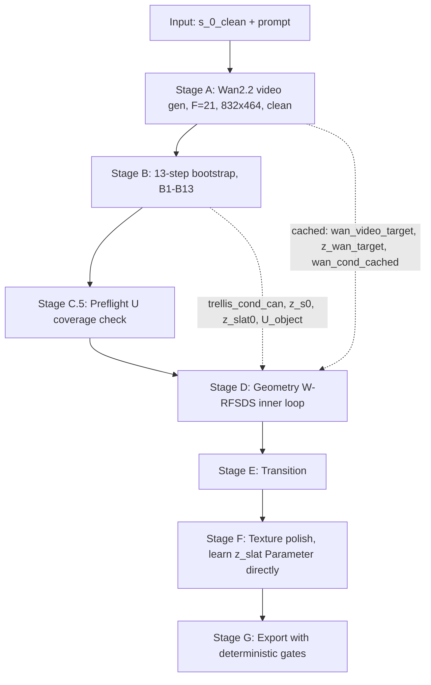

# CAST-U A'B v3 (revision .3) — Pipeline

> **v3.3 vs v3.2 关键改动**：
> 1. **Carpet 全程在 video / render / target 中**：s_0_with_carpet 是用户输入端合成，Stage A/B 不再 add carpet，仅 Stage G Export 时按 is_carpet_mask 过滤
> 2. **Stage A 单 seed 不做 multi-candidate selection**（对齐 CHORD）
> 3. **z_slat 正则改为 normalized delta**：`(z_slat - z_init) / slat_std`，按 channel std 归一化
> 4. **Confidence-aware anchor**：三段 base_conf / move_conf / uncertain，避免 P1 边界不确定区误锁
> 5. **Decoded-geometry drift monitor**：z_slat 解码后的 xyz/scale/opacity drift 每 100 iter 记日志
> 6. **P2 joint type confidence gate**：confidence<0.7 时前 20% 保持 two-branch render
> 7. **Resource fallback 提升为默认**：F=9 + 384×216 前 30%，F=21 + 832×464 后 70%
> 8. **Provenance 改名** `supervision_provenance`，类别收窄 visible_in_all / visible_in_open / never_visible
> 9. **SCAR：z_t mix → x₀_pred mix** — 保留位置对齐，修 ODE 一致性（noise variance 不再降 66%）
> 10. **BMCSA：static M_base → dynamic per-block M** — 每个 block 内从当前 hidden 实时算 cross-state cosine gate，修 Pass-2 演化中 stale 的问题
>
> **v3.3 post-critique fixes (C1/S1/S3/S4/M3)**：
> 11. **(C1) τ_sds 改 inverse-CDF of logit-normal**：删除 main_g1 phase-based mixture，按 TRELLIS 训练 schedule `logitNormal(mean=1.0, std=1.0)` 反 CDF 采样（CHORD §3.2 Eq.(3) 要求）；CFG 25→12 不变
> 12. **(S1) Stage C.5 改周期 silhouette consistency check**：one-time → 每 1000 iter 检查渲染 vs Wan target silhouette IoU < 0.85 触发一次性 U expand + SLAT 重采；U_seed 初始 dilate radius 1 → 2
> 13. **(S3) P1 末 deterministic type vote**：P1 进度 ~85% 时 8×(t,seed) 平均 type_logit；confidence ≥ 0.7 commit；否则克隆 P1 state 两份分别强制 revolute / prismatic 跑剩余 ~10% iter，选 final SDS+rgb loss 低者 commit；P2 永远单 branch render
> 14. **(S4) P2 改 tanh reparameterization**：`delta_z = nn.Parameter(zeros)`, `z_slat = z_init + 3·slat_std·tanh(delta_z)`；manifold-aware 3-σ 硬上界 + 全程可微，AdamW 跑在 delta_z 上无 momentum 破坏；anchor 权重降低 (10→3, 0.1→0.05, 1.0→0.3)
> 15. **(M3) Bootstrap 删 B7 (SLAT sampler on U_seed)**：13 步 → 12 步；B7 输出 z_slat0_seed 从未被下游使用 (B8 用 z_final，B10 在 U_object 上重采 SLAT 直接覆盖)
> 16. **(NEW.1) Canonical state = s_c (c=2 默认)**：phi 序列零点从 s_0 移到 s_c。Bootstrap B7 joint init 输出 φ_0 后做 `φ_0 -= φ_0[c]`；Stage D inner loop 在 cumsum + normalize 后做 `u_shifted = u - u[c]`，`phi_render_rev/pri = u_shifted × {theta_max, disp_max}` 可正可负。**Motivation**：TRELLIS 在 s_0 闭合态对 move 几何 underrep (DINOv2 cond 信息少 → SS-DiT 重建偏小)；s_2 半开 drawer 暴露 front face + 部分侧面 → canonical move 重建更稳。**L_first 仍 anchor frame 0 = s_0_with_carpet 真实输入**（不损失真实数据 anchor 强度）。c=2 固定，不自动选 (per-instance auto-select 留作 future work)。
> 17. **(Q1 增强) B6 加 `O_init_max` 兜底**：`U_seed = {O_mean > 0.3} ∪ {O_max > 0.5} ∪ boundary_band`。原因：大平移 / state 间不重叠时 mean(z_final) 解码出的 trajectory 概率会跌出 boundary band (0.1-0.3) → mean only 漏 voxel；O_max（per-state decode 后 voxel-wise max）兜底"至少一个 state 强占据"的位置。代价：6 次 SS-VAE decode（Bootstrap 一次性）。
> 18. **(NEW.1-consistency) Bootstrap B9 SLAT cond 改用 `trellis_cond_k[CANONICAL_STATE_IDX]`**：原版用 [0]，与 canonical=s_2 不一致（xyz_canon 受 cond 牵引聚集在 s_0 几何，但 phi_shift 要求 xyz_canon ≈ s_2 几何）。修复后 SLAT 真正在 s_2 状态条件下采样，xyz_canon 与 NEW.1 canonical 约定 self-consistent。trellis_cond_k 全部源自 wan_video_target 抽帧，换索引不引入额外 hallucination；frame 8 (= state 2) 暴露的几何比 frame 0 多，SLAT 重建质量更高。
> 19. **(Camera) Stage D 默认相机 = FreeArt3D 渲染相机 + iter-0 IoU 自检**：从 `pipelines/render.py:run_rendering()` 提取硬编码 Blender 相机参数（fov=45°，azi=22.5°，ele=45°，distance=2.1·object_scale，**+Z up**）注入 `StageDCameraConfig.freeart3d_canonical()`；新增 `fov_y_deg` 字段处理 stage_a LANCZOS 800×800→464×832 拉伸（保 45/45° 方 FoV 渲到 464×832 非方 pixel grid）。**TRELLIS canonical world up = +Z** 由 `trellis/utils/render_utils.py:33` 的 `extrinsics_look_at(..., [0,0,1])` 直接确认，**与 Blender 完全一致**，无需坐标系转换；以前的 `world_up_axis` 二元 knob 已删除（没有正确性 ablation 必要）。训练 iter 0 加 silhouette IoU 自检（render frame 0 vs s_0_with_carpet，IoU<0.5 抛 `CameraMismatchError` + 修复指引，diag PNG 写到 `viz/iter_0_camera_diag.png`）。Real photo 输入超出 v1 实验集范围（需用户自己提供 camera）。
> 18. **(NEW.2) Stage A 默认分辨率切到 Wan2.2/CHORD 480P actual output (H=464, W=832)**：旧 v3.3 默认 288×512 不在 Wan2.2 I2V-A14B 官方 area profiles（720*1280 / 1280*720 / 480*832 / 832*480），off-distribution area scale → W-RFSDS 用 Wan DiT 时 v_pred 不可靠 (核心创新 2 失效)。I2V 的 `size` 是面积档，不是固定 H/W；我们用官方 832*480 area profile，但按 CHORD/Wan 实际输出契约固定 tensor shape 为 (464, 832)。改成 (464, 832) 后：lat_h=58, lat_w=104, z_wan_target=[16, 6, 58, 104]，wan_video_target_3FHW=[3, 21, 464, 832]，seq_len = 6·58·104/(2·2) = 9048。Stage D backward 计算开销相对旧默认 ↑2.62×（H800 单卡 P1 5000 iter ~7h → ~18h，可接受）。`pipelines/stage_a_wan.py` 对 actual output (H, W) 做硬校验，不能再把官方 area label 误当成输出 H/W。

---

> **v3.2 vs v3.1 关键改动**（按导师反馈）：
> 1. **P2 删除 `Δ_features_dc`（per-Gaussian SH₀ residual hack）**，改为直接学 `z_slat = nn.Parameter(z_slat0.clone())`。GS 只是 renderer，3D 资产是 SLAT。
> 2. **所有 state 的 SDS / RGB 梯度通过 D_GS backward + warp backward 自动汇聚到同一份 canonical SLAT**（PyTorch autograd 已正确处理）
> 3. **训练 - 导出一致**：D_GS 和 D_Mesh 都读 `z_slat`，导出 mesh 看到与训练相同的 latent（v3.1 的 per-Gaussian residual 在 D_Mesh 路径中丢失）
> 4. **L_z_anchor_base**：用 P1 学的 m_soft 锚住 base voxel 的 SLAT 不漂离 z_slat0
> 5. **Provenance map** 基于 visibility-per-state 显式计算，论文报告 visible_in_all / visible_in_open / hallucinated 比例
> 6. ViPS 的 prompt 是给 VLM 的元指令，不能直接给 Wan2.2。v3.1 的 `build_articulated_prompts` 分层设计保留（用户描述运动 + 我们追加 camera-lock universal addon）

> 工程实现规范文档。配合 `method_v3.md` 一起阅读。
>
> **本版与 v3 的差异**：v3 又被 GPT 查出 13 处 bug（D-v3.3 ~ D-v3.15）。本版（v3.1）已全部修齐：
> - **Python / shape**: build_wan_i2v_cond 的 `F=21` 参数遮蔽 `torch.nn.functional`；`h_lat/w_lat/F_lat` 未赋值
> - **数值语义**: Wan VAE 输入必须 `[-1, 1]`（`sub_(0.5).div_(0.5)`）
> - **坐标系**: Joint / anchor / corridor 必须 `voxel_to_world` 后才能与 D_GS get_xyz 一起算 SE(3)
> - **单位**: revolute (radian) vs prismatic (world unit) phi 必须分离
> - **API**: gaussian_parent_idx 是 trivial `arange.repeat_interleave(32)`
> - **训练 schedule**: τ 必须覆盖 ≥ 0.9 才能用 high-noise expert
> - **CFG**: uncond 用 wan_config.sample_neg_prompt 不是空字符串
> - **shape**: LPIPS / Wan VAE / first frame 三条 shape path 分开
> - **逻辑**: Stage B B9 always rerun SLAT；Warmup α_m 加 BCE prior
> - **正则**: shell sparsity 防 ghost geometry
> - **验证**: W-RFSDS residual 公式 Day-1 必跑 sanity test

---

## 0. 目录

1. 顶层数据流
2. 冻结与可学习模块
3. TRELLIS 关键工程约定
4. **Wan2.2 关键工程约定（v3 完整重写）**
5. Stage A — Wan2.2 视频生成
6. Stage B — Bootstrap（v3 修正 13 步顺序）
7. Stage C — Support Superset
8. **Stage C.5 — Preflight Coverage Check（v3 新增）**
9. Stage D — Geometry W-RFSDS（含 dual-expert switch）
10. Stage E — Transition
11. Stage F — Texture（**v3.2: 直接学 `z_slat` Parameter，不学 `Δ_features_dc`**）
12. Stage G — Export（含 deterministic gate）
13. 推荐文件结构
14. 资源估算 + Fallback Ladder
15. Sanity Check 清单（v3 扩展）

---

## 1. 顶层数据流



---

## 2. 冻结与可学习模块

### 2.1 全程冻结

```
ss_dit                trellis/models/sparse_structure_flow.py
ss_vae_decoder        trellis/models/sparse_structure_vae.py
slat_dit              trellis/models/structured_latent_flow.py  (only Stage B init)
d_gs                  trellis/models/structured_latent_vae/decoder_gs.py
dinov2                torch.hub: dinov2_vitl14_reg

wan22_vae             Wan-AI/Wan2.2-I2V-A14B
wan22_high_noise_dit  Wan-AI/Wan2.2-I2V-A14B (τ > 0.9)
wan22_low_noise_dit   Wan-AI/Wan2.2-I2V-A14B (τ ≤ 0.9)
wan22_t5_encoder      umt5-xxl  (Wan internal, for text cond)
wan22_i2v_pipeline    full pipeline (only Stage A)
```

```python
for module in [ss_dit, ss_vae_decoder, slat_dit, d_gs, dinov2,
               wan22_vae, wan22_high_noise_dit, wan22_low_noise_dit,
               wan22_t5_encoder]:
    for p in module.parameters():
        p.requires_grad_(False)
    module.eval()
```

### 2.2 可学习模块

**P1 (Geometry)**:
```
Δz_s             [1, 8, 16, 16, 16]    init zeros
α_g              [N_obj]               init zeros  (★ residual)
α_m              [N_obj]               init logit(M_attn_boot_64[U_object].clamp(0.05,0.95))
ψ_param          [19]                  init encode_joint(ψ_0)
delta_phi        [5]                   init inverse_softplus(φ_0 increments)

adapter_14/16/18           SSAdapter (output proj zero-init)
H_sup, H_part              ZeroInitResHead (in_dim=3109, hidden=512, out=1)
H_joint                    ZeroInitJointHead (in_dim=3109, hidden=512, out=19)
```

**P2 (Texture)** — **P1 学到的所有几何变量全冻 (α_g, α_m, ψ_param, delta_phi, θ_max, d_max, adapter, heads, Δz_s)**：
```
delta_z          [N_obj, 8]    init torch.zeros_like(z_slat_init)    # ★ v3.3.1 S4: tanh-reparam
# 实际 forward 用: z_slat = z_slat_init + 3.0 * slat_std.view(1,-1) * tanh(delta_z)
# z_slat_init = bootstrap.z_slat0.clone().detach()   # frozen reference
# slat_std    = bootstrap.slat_std                    # [8] from SLAT VAE normalization config
#
# P2 不学 Δ_features_dc (v3.1 hack 已删除)
# P2 不学 z_slat 直接 nn.Parameter (v3.2/v3.3 设计, S4 取代)
# P2 不开 D_GS LoRA
# P2 不学 donor_weights
```

**为什么 tanh reparameterization (★ v3.3.1 S4)**：
- D_Mesh 和 D_GS 都读取**派生后的** z_slat。保证训练-导出一致（导出时同公式重算 z_slat 喂 D_Mesh）
- `delta_z = 0` 时 `z_slat = z_init` (BMCSA 起点)，初始零损失
- tanh 给 **manifold-aware 3-σ 硬上界** + **全程可微**；AdamW 跑在 delta_z 上不被 momentum 破坏
- 替代旧设计 (直接 nn.Parameter on z_slat) 的三个根本问题：硬截断破坏 AdamW m/v 状态、边界梯度不连续、box ≠ valid SLAT manifold
- L_base_anchor 软正则保留但权重降低（tanh 已提供硬约束）

---

## 3. TRELLIS 关键工程约定

### 3.1 Timestep ×1000（**TRELLIS 内部约定，与 Wan 相反**）

```python
pred_v = ss_dit(x_t, 1000.0 * t_raw, cond)
```

证据：`pipelines/samplers/flow_euler.py:38-42`。

### 3.2 q_sample 含 σ_min

```python
σ_min = 1e-5    # trainers/flow_matching/flow_matching.py:62
z_t = (1 - t) * z_s_base + (σ_min + (1 - σ_min) * t) * ε
```

### 3.3 SS-DiT forward 完整序列（v3 修正：补 layer_norm + patchify + unpatchify）

实际 forward (`sparse_structure_flow.py:176-200`):

```python
def forward(self, x, t, cond):
    assert [*x.shape] == [B, in_channels, R, R, R]
    h = patchify(x, self.patch_size)
    h = h.view(*h.shape[:2], -1).permute(0, 2, 1).contiguous()
    h = self.input_layer(h)
    h = h + self.pos_emb[None]
    t_emb = self.t_embedder(t)
    if self.share_mod:
        t_emb = self.adaLN_modulation(t_emb)
    t_emb = t_emb.type(self.dtype); h = h.type(self.dtype); cond = cond.type(self.dtype)
    for block in self.blocks:
        h = block(h, t_emb, cond)
    h = h.type(x.dtype)
    h = F.layer_norm(h, h.shape[-1:])         # ★ v2 缺
    h = self.out_layer(h)
    h = h.permute(0, 2, 1).view(B, out_channels, R, R, R)
    h = unpatchify(h, self.patch_size).contiguous()
    return h
```

### 3.4 Composition wrapper（不 subclass）

完整代码见 method_v3 §7.2。**Wrapper 必须严格复刻上面的完整序列**，包括：
- `patchify` 而非 `x.view`
- `F.layer_norm` 在 `out_layer` 之前
- `unpatchify` 在末尾
- `t_model = torch.full((B,), 1000*t_raw)` 用 batch shape

### 3.5 SparseTensor coords 必须 [N, 4]
```python
batch_col = torch.zeros(N, 1, dtype=torch.int32, device=device)
coords_4 = torch.cat([batch_col, xyz_3.int()], dim=-1)    # [N, 4]
sparse = SparseTensor(feats=feats, coords=coords_4)
```

### 3.6 D_GS / D_Mesh 返回 `List[Gaussian/MeshExtractResult]`，取 `[0]`

### 3.7 opacity gating 用 `get_opacity`（**v3 关键**）

```python
opacity_post = gauss.get_opacity              # sigmoid(_opacity + opacity_bias)
# 不改 gauss._opacity (pre-sigmoid logit)
opacity_gated = opacity_post * gate
```

证据：`representations/gaussian/gaussian_model.py:90-92`。

### 3.8 SLAT post-norm cache
```python
z_slat0 = z_slat_raw.feats * slat_std + slat_mean
```

### 3.9 SS-DiT hidden token 顺序与 reshape（**v3 关键**）

Token 顺序: row-major over (D, H, W) via `meshgrid(..., indexing='ij')`（证据：`sparse_structure_flow.py:103`）。

```python
# Hidden [B, 4096, 1024] → [B, 1024, 16, 16, 16]
h_grid = h_token.permute(0, 2, 1).contiguous().view(B, 1024, 16, 16, 16)
# 不是 h_token.view(B, 1024, 16, 16, 16)
```

### 3.10 grid_sample 5D 轴序（**v3 关键**）

```python
# PyTorch 5D grid_sample: grid[..., 0]=W, [..., 1]=H, [..., 2]=D
grid = torch.stack([w_norm, h_norm, d_norm], dim=-1)
# 不是 stack([d, h, w])
```

### 3.11 SLAT sampler 调用签名（**v3 关键**）

```python
slat = self.slat_sampler.sample(
    flow_model,          # ★ 第一个 positional arg
    noise,               # SparseTensor
    **cond,              # 含 cond, neg_cond
    **sampler_params,
).samples
# .samples 是 sp.SparseTensor
```

证据：`pipelines/trellis_image_to_3d.py:219-252`。

---

## 4. Wan2.2 关键工程约定（v3 完整重写）

### 4.1 Frame count: F % 4 == 1
F=21 = 4·5+1 → latent F_lat=6。证据：`wan/image2video.py:295`。

### 4.2 Spatial: H, W 必须是 8 的倍数（VAE stride），且 H/8, W/8 必须是 2 的倍数（DiT patch_size=(1,2,2)）

832/8=104, 464/8=58 → lat_h=58, lat_w=104。104/2=52, 58/2=29 → 都满足。OK。

### 4.3 Wan VAE encode 输入是 `List[Tensor]` 每个 `[C=3, T, H, W]`，且 **`[-1, 1]` 范围**

```python
# ★ 正确
videos_neg11 = [(rgb_frames_3FHW * 2.0 - 1.0)]    # 必须先 [-1, 1] 归一化!
latent_list = wan_vae.encode(videos_neg11)
z_latent = latent_list[0]      # [16, 6, 58, 104]

# ★ 错误 ✗ — 错的 API
z_latent = wan_vae(rgb_frames.unsqueeze(0))

# ★ 错误 ✗ — 缺归一化, latent 分布会漂
z_latent = wan_vae.encode([rgb_frames_3FHW])[0]   # 输入仍在 [0, 1]
```

证据：
- `wan/modules/vae2_1.py:647-655` 是 List 输入
- `wan/image2video.py:259` 是 `TF.to_tensor(img).sub_(0.5).div_(0.5)`，把图像从 [0,1] 映射到 [-1,1]

**辅助函数（v3.1 必加）**：
```python
def to_wan_vae_input(video_3FHW_float01):
    """Wan VAE 期望 [-1, 1] 输入. 见 image2video.py:259."""
    return video_3FHW_float01 * 2.0 - 1.0
```

### 4.4 Wan DiT timestep 是 [0, 1000) 直接传，**不 ×1000**

```python
# ★ 正确
t_wan = torch.tensor([τ_raw * 999.0], device=device, dtype=torch.float32)
v_pred = wan22_dit(x, t=t_wan, **cond)

# ★ 错误 ✗
t_wan = 1000.0 * τ_raw     # TRELLIS 风格，错
v_pred = wan22_dit(x, t=t_wan, **cond)   # 然后 wan 内部又 *某数...
```

证据：`wan/modules/model.py:466` `sinusoidal_embedding_1d(self.freq_dim, t)`，直接吃 [0, 1000)；`wan/image2video.py:382` 传 scheduler timesteps。

### 4.5 Wan DiT 输入是 `List[Tensor [C_in, T, H, W]]`（**无 batch 维**）

```python
# ★ 正确
x_input = [z_τ_single_C_T_H_W]   # List of [16, 6, 58, 104]
v_pred_list = wan_model(
    x_input,
    t=t_wan,
    context=context_list,        # List of [L_text, 4096]
    seq_len=int_max_seq_len,
    y=[y_single_20ch_T_H_W],     # List of [20, 6, 58, 104]
)
v_pred = v_pred_list[0]          # [16, 6, 58, 104]

# Wan 内部会做 channel-concat: x_internal = cat([z_τ, y], dim=0)  → [36, 6, 58, 104]
# DiT 实际 in_channels = 16 + 20 = 36
# Output predicts velocity for z_τ portion (16-ch)
```

证据：`wan/modules/model.py:410-417` 签名；`model.py:444-445` channel-concat。

### 4.6 Wan I2V condition format（**v3 完整**）

构造在 Stage B 一次性做，缓存全程用。详见 method_v3 §5.4 的 `build_wan_i2v_cond` 完整代码。

返回 dict:
```
{
    'context': List[Tensor [L_text, 4096]],        # T5 text embedding
    'context_null': List[Tensor [L_text, 4096]],   # for CFG
    'seq_len': int,
    'y': List[Tensor [20, F_lat=6, h_lat=58, w_lat=104]],  # mask+vae channel-concat
    'F_lat': 6, 'h_lat': 36, 'w_lat': 64,
}
```

### 4.7 Wan2.2 dual-expert switch (boundary = 0.9, **v3.1 修 D-v3.9**)

```python
# 边界用 >= 与 image2video.py:189 一致
wan_model = wan22_high_noise_dit if τ_raw >= 0.9 else wan22_low_noise_dit
```

证据：
- `wan/configs/wan_i2v_A14B.py:36` `i2v_A14B.boundary = 0.900`
- `wan/image2video.py:189` `if t.item() >= boundary` (t 在 [0, 1000) scale, boundary=900)
- τ ∈ [0, 1] scale 下边界对应 0.9

**重要**：训练 τ schedule **必须真的覆盖 ≥ 0.9** 才能调用 high_noise_expert，否则 dual-expert 是空声明。Main G1 应混合采样（详见 §9.5）。

### 4.8 Wan CFG uncond **不能直接用** `sample_neg_prompt`（**v3.1 修撤回**）

**重要发现**：`shared_config.py:19` 的 Wan 默认 neg prompt 是：
> "色调艳丽，过曝，**静态**，细节模糊不清，字幕，风格，作品，画作，画面，**静止**，..."

包含"静态"和"静止不动的画面"，是 Wan 官方为"动态场景视频"设计的 neg。**直接用会主动惩罚我们想要的 locked camera 行为**——CFG 会推视频"让相机和物体都动起来"。

✗ 错误（GPT 早先建议，v3.1 撤回）：
```python
neg_prompt = wan_config.sample_neg_prompt    # 含"静态/静止", 会推 camera 动
```

✗ 错误（v3 早期）：
```python
context_null = wan_t5_text_encoder([""], device)    # 空 string 不是好 uncond
```

✓ 正确（v3.1）：自定义分层 prompt（详见 method_v3 §5.6）：
```python
pos_prompt, neg_prompt = build_articulated_prompts(user_object_motion, lang='zh')
context = wan_t5_text_encoder([pos_prompt], device)
context_null = wan_t5_text_encoder([neg_prompt], device)
```

`build_articulated_prompts()` 设计原则：
1. 用户只描述物体运动（"抽屉缓慢向外滑出"）—— per object
2. universal camera-lock addon 我们追加（"镜头完全固定，三脚架架设..."）
3. neg prompt 显式列 camera-motion artifacts（镜头平移/旋转/推拉/变焦/晃动）+ 视觉质量
4. **neg prompt 必须 OMIT "静态"/"静止" 字样**，否则 CFG 推 camera 动起来

证据：
- `wan/configs/shared_config.py:19` 默认 neg 含 "静态" 是为动态场景设计
- 我们的任务（locked camera + part 单独动）与 Wan 默认场景反着

### 4.9 CFG 在 W-RFSDS 中保留 — **CHORD 实测 25 → 12 linear decay**

证据：CHORD §A.1 line 788-789:
> "The CFG scale is linearly decayed from 25 to 12."

**v3.1 关键修正**：之前 v3 用 5.0 → 3.0（普通 inference 范围）是错的。**SDS distillation 需要远高于普通 inference 的 CFG**（25-12 vs 5-7），因为 SDS gradient 需要 model 输出 sharp 的 velocity 才能收敛。详见 `schedule_cfg(f_global)` 实现。

```python
v_cond   = wan_model(x, t, context=cond_text, ...)
v_uncond = wan_model(x, t, context=null_text, ...)
v_pred   = v_uncond + cfg_scale * (v_cond - v_uncond)
```

**我们的 cfg_scale schedule（跟 CHORD 实测）**：linear decay 25.0 → 12.0 over training。
- warmup_g0：25.0（强 CFG，几何 layout 必须 sharp）
- main_g1 末：~20.0
- transition 末：~16.0
- texture 末：~12.0

普通 inference 用 5-7 的 CFG，但 **SDS 必须用 12-25** 才能正确收敛。详见 §9.5 `schedule_cfg()` 实现。

### 4.10 Wan VAE encode backward 可以保留 grad
证据：CHORD §D Limitation 明确承认 "a substantial portion of the runtime is spent backpropagating through the VAE"，他们就是这样做的。用 `torch.utils.checkpoint` 控显存。

### 4.11 坐标系统一：voxel ↔ world（**v3.1 新增 D-v3.6**）

TRELLIS Gaussian 在 world space [-0.5, 0.5]，但 U_object / anchors / corridor 在 voxel space [0, 63]。**SE(3) warp / contact loss 前必须显式转换**。

```python
def voxel_to_world(u_xyz, res=64):
    """u_xyz: [N, 3] int in [0, res-1] → [N, 3] float in (-0.5, 0.5)."""
    return (u_xyz.float() + 0.5) / res - 0.5

def world_to_voxel(w_xyz, res=64):
    """Inverse for export."""
    return ((w_xyz + 0.5) * res - 0.5).round().long().clamp(0, res - 1)
```

证据：
- `paper/TRELLIS/trellis/models/structured_latent_vae/decoder_gs.py:95` `aabb=[-0.5,-0.5,-0.5, 1.0,1.0,1.0]`
- `decoder_gs.py:101` `xyz = (x.coords[x.layout[i]][:, 1:].float() + 0.5) / self.resolution`
- `decoder_gs.py:84` `get_xyz: _xyz * aabb[3:] + aabb[:3]` → world = `_xyz - 0.5`

**调用约定**：
- Bootstrap cache 全部 voxel coords（节省存储 + 不丢精度）
- Inner loop 进 SE(3) rollout 前 `U_world = voxel_to_world(U_object)`
- `ψ.origin` 是 learnable，直接用 world space 参数化（init from `voxel_to_world(rough_pivot_voxel)`）
- `anchors_world = voxel_to_world(anchors_object)` 才能与 ψ.origin 在同一坐标系算 contact loss

### 4.12 Joint phi 单位分离 + canonical state shift：revolute (radian) vs prismatic (world unit) （**v3.1 修 D-v3.7 + v3.3.1 NEW.1**）

不能用同一个 `phi_render` scalar 既表 angle 又表 displacement。**v3.3.1 NEW.1 再加 canonical-state shift**：phi 零点从 s_0 平移到 s_c (c=2 默认)。

```python
# ★ v3.1: normalized progress + 独立 limits
delta_u_inc = F.softplus(learnable.delta_phi)            # [5], > 0
u_raw = torch.cat([torch.zeros(1, device=device),
                   torch.cumsum(delta_u_inc, dim=0)])      # [6], 严格递增
u = u_raw / (u_raw[-1] + 1e-6)                            # [6], normalized to [0, 1]

# ★ v3.3.1 NEW.1: shift canonical 零点到 s_c (默认 c=2)
c = CANONICAL_STATE_IDX                                    # default 2 (config hyperparameter)
u_shifted = u - u[c]                                       # [6], u_shifted[c]=0; state < c 为负, state > c 为正
u_render = linear_interp_through(u_shifted, n_out=21)      # [21], 可正可负

# 各自 learnable limit
theta_max = F.softplus(ψ_pred.theta_limit_raw)             # scalar, radians
disp_max  = F.softplus(ψ_pred.disp_limit_raw)              # scalar, world unit

phi_render_rev = u_render * theta_max                      # [21] radians, 可正可负
phi_render_pri = u_render * disp_max                       # [21] world units, 可正可负
```

初始化（让默认行为合理）：
- `theta_limit_raw = inverse_softplus(π/2)` → 默认 revolute 最大 90°
- `disp_limit_raw  = inverse_softplus(0.3)` → 默认 prismatic 最大 0.3 world unit (≈30% 物体尺寸)
- 默认 `c=2`：`u_shifted[0] = -0.4, u_shifted[2] = 0, u_shifted[5] = 0.6`（state 0 反向 warp, state 2 canonical, state 5 正向 warp）

**SE3 解析函数对负 phi 的处理**：
- `SE3_revolute(axis, origin, phi)`：phi 负 → 反向旋转 (axis-angle 公式天然支持)
- `SE3_prismatic(axis, phi)`：phi 负 → 反方向平移 (translate by phi × axis)
- 不需要任何额外分支判断

### 4.13 D_GS parent_idx 是 trivial `arange.repeat_interleave(32)` （**v3.1 修 D-v3.8**）

```python
# ★ 正确: parent_idx 严格 trivial
N_voxel = len(U_object)
gaussian_parent_idx = torch.arange(N_voxel, device=device).repeat_interleave(32)

# ★ 错误 ✗ — 不需要从 get_xyz 反推
gaussian_parent_idx = build_parent_idx_from_output(gauss.get_xyz, U_object_xyz, n_gauss_per_voxel=32)
```

证据：`decoder_gs.py:108-110`：
```python
offset = torch.tanh(offset) / self.resolution * 0.5 * self.rep_config['voxel_size']
_xyz = xyz.unsqueeze(1) + offset      # [N_voxel, 32, 3]
setattr(representation, k, _xyz.flatten(0, 1))    # [N_voxel * 32, 3]
```

`xyz` 来自 `x.coords[x.layout[i]][:, 1:]` 严格按输入 U_object 顺序。`unsqueeze(1) + flatten` 后 `gauss_idx = voxel_idx * 32 + g`，所以 `parent_idx = arange(N).repeat_interleave(32)`。**Trivial 关系，不需要反推**。

推荐包装：
```python
class DGSWithParent(nn.Module):
    def __init__(self, d_gs_frozen):
        super().__init__()
        self.d_gs = d_gs_frozen
        for p in self.d_gs.parameters():
            p.requires_grad_(False)
    def forward(self, sparse_in, n_gauss_per_voxel=32):
        gauss = self.d_gs(sparse_in)[0]
        N_voxel = sparse_in.coords[sparse_in.layout[0]].shape[0]
        parent_idx = torch.arange(N_voxel, device=sparse_in.coords.device).repeat_interleave(n_gauss_per_voxel)
        return gauss, parent_idx
```

---

## 5. Stage A — Wan2.2 视频生成

### 5.1 输入 / 输出

```
Input:
    s_0_clean                  : [3, 464, 832] uint8 RGB, 用户提供
    user_object_motion_prompt  : str, 用户描述部件运动 (per object)

Output:
    wan_video_target_3FHW : [3, 21, 464, 832] uint8 RGB (clean, no carpet)
```

### 5.2 Prompt 分层构造（**v3.1 关键修正**）

**用户输入**只描述物体运动；**universal camera-lock addon + camera-motion neg** 我们自动追加。详细 prompt 模板见 `method_v3.md §5.6` 的 `build_articulated_prompts()`。

```python
# 用户提供
user_object_motion_prompt = "抽屉缓慢、连续地向外水平滑出"   # per object

# 自动构造
pos_prompt, neg_prompt = build_articulated_prompts(
    user_object_motion_prompt, lang='zh'
)
# pos_prompt = user_input + "。镜头完全固定，相机架在三脚架上，..."
# neg_prompt = "镜头平移，镜头旋转，镜头推拉，..." (★ 不含"静态/静止" 字样)
```

**用户输入参考**（按物体类别）：

| 类别 | 推荐 prompt |
|---|---|
| drawer | "抽屉缓慢、连续地向外水平滑出" |
| cabinet door | "柜门缓慢、连续地向外旋转打开" |
| microwave / oven | "微波炉门缓慢向下旋转打开" |
| laptop | "笔记本电脑屏幕缓慢向后旋转打开" |
| refrigerator | "冰箱门缓慢向外旋转打开" |
| washing machine | "洗衣机门缓慢向外旋转打开" |

模式：**"什么部件 + 缓慢连续 + 运动方向"**。相机锁定语义不需要用户写。

### 5.3 Wan2.2 调用（**v3.3: 单 seed, 不做 multi-candidate selection**）

参考 CHORD §A.1：CHORD 用 Wan2.2 I2V 时也是单次推理，不做多 seed 候选筛选。

```python
pos_prompt, neg_prompt = build_articulated_prompts(user_object_motion_prompt, lang='zh')

wan_video_target_3FHW = wan22_i2v_pipeline(
    image       = s_0_with_carpet,     # ★ v3.3: 用户输入端已含 carpet, 直接喂
    prompt      = pos_prompt,
    neg_prompt  = neg_prompt,
    n_frames    = 21,                  # 4·5+1
    resolution  = (464, 832),
    seed        = 42,                  # ★ v3.3: 固定单 seed, 不做候选筛选
    steps       = 50,
    guidance    = 5.0,
)
```

### 5.4 可选：单视频后筛 sanity check（不是 multi-candidate selection）

跑完单次生成后，做一次 background displacement check，**仅用于报告失败**（不是用于多 seed 排序）：

```python
def background_static_check(video, threshold=0.0015):
    """
    Sanity check (not selection): single video must have < 10% frames with large displacement.
    ViPS arxiv 2604.17623 §0.F.3 reports 0.71% reject rate with this threshold.
    """
    bbox_diag = compute_bbox_diagonal(video)
    frame_displacements = optical_flow_magnitude_per_frame(video)
    moved_fraction = (frame_displacements > threshold * bbox_diag).mean()
    return moved_fraction < 0.10

if not background_static_check(wan_video_target_3FHW):
    raise WanQualityError(
        "Wan2.2 generated video with significant background motion. "
        "Try: (a) rewrite prompt more explicit on 'locked camera'; "
        "(b) change seed; (c) lower guidance to 3-4."
    )
```

**关键**：v3.3 不再对多个 seed 排序选最优。若单次生成失败（probability < 5% 根据 ViPS 统计），直接报错让用户调 prompt 或换 seed，不在 pipeline 里自动筛选。

---

## 6. Stage B — Bootstrap (v3 13-step, 修循环依赖)

### 6.1 输出 cache

```
bootstrap/
  z_s0.pt                       [1, 8, 16, 16, 16]
  z_slat0.pt                    [N_obj, 8]   post-norm
  slat_mean.pt                  [8]   SLAT post-norm mean (★ v3.3.1 added: Stage D / F P2 tanh reparam needs it standalone, so D doesn't need to reload TRELLIS just for this 8-vector)
  slat_std.pt                   [8]   SLAT post-norm std  (★ v3.3.1 added: same reason; from paper/TRELLIS/configs/.../slat_flow_img_dit_L_64l8p2_fp16.json normalization config)
  slat_shell_mask.pt            [N_obj] bool  (★ v3.3.1 added: uncertain shell voxels in U_object for L_shell_sparse, computed from boundary_band ∩ U_object)
  dit_hidden_cache.pt           {14, 16, 18}: [1, 4096, 1024]   diagnostic
  O_init.npy                    [1, 1, 64, 64, 64]
  M_attn_boot_64.npy            [64, 64, 64]
  is_carpet_mask.npy            [64^3] bool
  U_object.npy                  [N_obj, 3]    int32
  gaussian_parent_idx.npy       [N_gauss]     int32  (verified from D_GS output)
  psi_0.json
  phi_0.npy                     [6]   ★ canonical-shifted (phi_0[CANONICAL_STATE_IDX]=0 per NEW.1)
  anchors_object.npy            [N_a, 3]
  trellis_cond_can.pt           [1, N_dino, 1024]
  wan_cond_cached.pt            dict (context, context_null, seq_len, y, ...)
  z_wan_target.pt               [16, 6, 58, 104]
  wan_video_target_3FHW.pt      [3, 21, 464, 832] uint8
  s_0_clean.pt                  [3, 464, 832]
```

### 6.2 13-step bootstrap（v3 顺序无循环依赖）

```python
@torch.no_grad()
def stage_b_bootstrap_v3(s_0_clean, prompt):
    # ===== B1: Wan2.2 21-frame clean video =====
    wan_video_target_3FHW = stage_a_wan_video(s_0_clean, prompt, n_frames=21, res=(464, 832))
    
    # ===== B2: 抽 6 帧 + 加 carpet =====
    state_indices = [0, 4, 8, 12, 16, 20]
    s_with_carpet_6 = [wan_video_target_3FHW[:, i] for i in state_indices]
    # v3.3: wan_video 已含 carpet, 不需要 add_grounding_disk
    
    # ===== B3: SCAR-x₀ Pass 1 + Dynamic-M BMCSA Pass 2 (v3.3 重写) =====
    trellis_cond_k = [dinov2(s_with_carpet_k) for s_with_carpet_k in s_with_carpet_6]
    z_final, dit_hidden_cache = run_ss_sampler_v3_3(
        trellis_cond_k,
        capture_blocks=[14, 16, 18],
        # Pass 1: 25 steps K-parallel + SCAR-x₀ mix on steps 0-7
        # Pass 2: SDEdit from t*=0.5, 12 steps, dynamic-M BMCSA on all 24 blocks
    )
    # z_final: [K=6, 8, 16, 16, 16]
    # dit_hidden_cache: {14, 16, 18}: [K, 4096, 1024]
    
    # ===== B4: Merge K + decode occupancy + upsample M_attn =====
    z_s0 = z_final.mean(dim=0, keepdim=True)              # [1, 8, 16, 16, 16]
    O_init = torch.sigmoid(ss_vae_decoder(z_s0))          # [1, 1, 64, 64, 64]
    
    M_attn_boot_16 = compute_token_cosine_consistency(z_final)   # [16, 16, 16]
    M_attn_boot_64 = F.interpolate(
        M_attn_boot_16[None, None].float(),
        size=64, mode='trilinear', align_corners=True
    ).squeeze()                                            # [64, 64, 64]
    
    # ===== B5: FreeArt3D carpet detection =====
    is_carpet_mask = freeart3d_detect_carpet_plane(O_init)    # [64^3] bool
    
    # ===== B6: U_seed (no corridor/anchor dependency yet) =====
    # ★ v3.3.1 S1.b: dilate radius 1 → 2 (更保守覆盖, 给周期 silhouette check 减压)
    # ★ v3.3.1 Q1: O_max 兜底, 接住 mean(z_final) 解码漏掉的 large-displacement trajectory
    O_mean_flat = O_init.view(-1)                              # = sigmoid(decoder(mean(z_final)))
    O_obj_flat = O_mean_flat * (~is_carpet_mask).float()
    boundary_band = ((O_mean_flat > 0.1) & (O_mean_flat < 0.3)) & (~is_carpet_mask)
    
    # ★ Q1: per-state decode + voxel-wise max
    #   K=6 个 latent 单独 decode → [K, 1, 64, 64, 64], voxel-wise max.
    #   对大平移 / state 间不重叠 (mean 解码后 trajectory 概率跌出 0.1-0.3 boundary) 尤其有效.
    O_per_state = torch.sigmoid(ss_vae_decoder(z_final))       # [K=6, 1, 64, 64, 64]
    O_max = O_per_state.max(dim=0, keepdim=False).values       # [1, 64, 64, 64]
    O_max_flat = O_max.view(-1) * (~is_carpet_mask).float()
    
    # 三路并集: mean 高置信 ∨ 任一 state 强占据 ∨ mean 不确定带
    seed_idx = torch.nonzero(
        (O_obj_flat > 0.3) | (O_max_flat > 0.5) | boundary_band, as_tuple=False
    ).squeeze(-1)
    seed_xyz = flat_idx_to_xyz(seed_idx, res=64)
    U_seed = dilate_voxels(seed_xyz, radius=2)                 # ★ S1.b: 1 → 2
    
    # ★ v3.3.1 M3: 原 B7 (SLAT sampler on U_seed) 已删除
    # 原因: z_slat0_seed 从未被下游使用. B8 joint init 用 z_final 不是 SLAT;
    #       B10 always rerun SLAT on U_object 会直接覆盖. 跑这一步浪费 ~30s.
    
    # ===== B7: StageC joint init on U_seed (uses z_final + M_attn + U_seed) =====
    psi_0, phi_0, anchors_object = stage_c_joint_init(
        z_final, M_attn_boot_64, O_init, is_carpet_mask, U_seed
    )
    
    # ★ v3.3.1 NEW.1: shift phi_0 零点到 canonical state c (默认 c=2)
    #   下游 corridor / Stage D delta_phi 初始化 / warmup_G- 都用 shifted phi_0.
    #   差分 (phi_0[1:] - phi_0[:-1]) shift 后不变, delta_phi init 不受影响.
    c = CANONICAL_STATE_IDX                                # default 2
    phi_0 = phi_0 - phi_0[c]                                # phi_0[c] = 0
    
    # ===== B8: Expand U_seed → U_object using ψ_0 / anchors =====
    corridor   = swept_volume_corridor(psi_0, phi_0)
    anchor_band = dilate_voxels(anchors_object, radius=2)
    U_object_xyz = unique_voxels(torch.cat([U_seed, corridor, anchor_band], dim=0))
    
    # ===== B9: SLAT sampler on U_object (★ 唯一一次 SLAT 采样, M3 修后) =====
    # ★ v3.3.2 NEW.1-consistency fix: SLAT 采样的 cond 必须与 canonical state c
    # 一致。SLAT decoder 把 cond 当作 "image evidence", D_GS 解出来的
    # xyz_canon 自然朝该 cond 所表示的几何状态聚集. canonical=s_c 想成立,
    # 必须用 trellis_cond_k[c] 而不是 trellis_cond_k[0]; 否则 xyz_canon ≈
    # s_0 几何, 与 canonical=s_c 的 phi_shift 设计相矛盾, 优化时 ψ 被迫
    # 浪费 capacity 去 bridge 这个内部 inconsistency.
    # trellis_cond_k[c] 来源依然是 wan_video_target 抽帧 -> DINOv2 of
    # state c (默认 c=2, 即 wan_video_target frame 8), 暴露的几何比
    # state 0 的闭合态更多, SLAT 重建质量更好.
    U_object_with_batch = add_batch_col(U_object_xyz)
    z_slat_raw_obj = slat_sampler.sample(
        slat_flow_model,
        sp.SparseTensor(
            feats=torch.randn(len(U_object_xyz), slat_flow_model.in_channels, device=device),
            coords=U_object_with_batch,
        ),
        cond=trellis_cond_k[CANONICAL_STATE_IDX],        # ★ v3.3.2: c=2 not 0
        neg_cond=neg_trellis_cond,
        steps=25, cfg_strength=7.5, verbose=True,
    ).samples
    z_slat0 = z_slat_raw_obj.feats * slat_std + slat_mean
    
    # ===== B10: ★ v3.1 修 D-v3.8: parent_idx 严格 trivial =====
    # decoder_gs.py:108-110 显示 _xyz.unsqueeze(1) + offset, flatten(0,1) 后
    # gauss_idx = voxel_idx * 32 + g, 所以 parent_idx = arange(N).repeat_interleave(32)
    N_voxel = len(U_object_xyz)
    gaussian_parent_idx = torch.arange(N_voxel, device=device).repeat_interleave(32)
    # 不需要 build_parent_idx_from_output_coords, 不需要从 get_xyz 反推
    # Else uses spatial mapping by gauss_xyz / voxel_size
    
    # ===== B11: Wan I2V cond builder (one-time, cached) =====
    # ★ v3.1: 参数名 frame_num 避免遮蔽 torch.nn.functional as F
    wan_cond_cached = build_wan_i2v_cond(
        s_0_clean_float01=s_0_clean.float() / 255.0,
        prompt=prompt,
        frame_num=21, H=464, W=832, device=device,
        wan_config=wan_config,
    )
    # 返回 dict 含 context, context_null, seq_len, y, ...
    
    # ===== B12: Wan VAE 编码 21-frame clean video (latent recon target) =====
    # ★ v3.1 修 D-v3.5: 必须先归一化到 [-1, 1]
    wan_video_target_float01 = wan_video_target_3FHW.to(device).float() / 255.0
    z_wan_target = wan_vae.encode([wan_video_target_float01 * 2.0 - 1.0])[0].detach()
    # z_wan_target: [16, 6, 58, 104]
    
    # ===== B12.5: ★ v3.3.1 added — derived artifacts for Stage D / F =====
    # slat_mean / slat_std are the SLAT post-norm constants used at L711 above.
    # They come from the TRELLIS pipeline's normalization config (see
    # paper/TRELLIS/configs/generation/slat_flow_img_dit_L_64l8p2_fp16.json
    # "normalization" block, "mean" and "std" each length 8). Stage D/F P2's
    # tanh reparameterization
    #     z_slat = z_slat_init + 3.0 * slat_std * tanh(delta_z)
    # needs them as standalone tensors so Stage D can start without reloading
    # the TRELLIS pipeline just to fetch these 8-vectors. Saving them adds
    # ~64 bytes per object.
    #
    # slat_shell_mask: per-voxel bool flag for L_shell_sparse (method.md
    # D-v3.14): voxels whose mean(z_final)-decoded occupancy falls in the
    # boundary band (0.1, 0.3), restricted to U_object and excluding carpet.
    # These are the "uncertain shell" voxels that we encourage to die via the
    # shell-sparsity term during P1 main_g1.
    U_flat_idx = (
        U_object_xyz[:, 0].long() * 64 * 64
        + U_object_xyz[:, 1].long() * 64
        + U_object_xyz[:, 2].long()
    )                                                       # [N_obj]
    O_at_U = O_init.view(-1)[U_flat_idx]                    # [N_obj]
    carpet_at_U = is_carpet_mask[U_flat_idx]                # [N_obj] bool
    slat_shell_mask = (O_at_U > 0.1) & (O_at_U < 0.3) & (~carpet_at_U)
    
    # ===== Save all =====
    save_to_disk({
        'z_s0': z_s0,
        'z_slat0': z_slat0,
        'slat_mean': slat_mean,                              # ★ v3.3.1 [8]
        'slat_std':  slat_std,                               # ★ v3.3.1 [8]
        'slat_shell_mask': slat_shell_mask.cpu().numpy(),    # ★ v3.3.1 [N_obj] bool
        'dit_hidden_cache': dit_hidden_cache,
        'O_init': O_init.cpu().numpy(),
        'M_attn_boot_64': M_attn_boot_64.cpu().numpy(),
        'is_carpet_mask': is_carpet_mask.cpu().numpy(),
        'U_object': U_object_xyz.int().numpy(),
        'gaussian_parent_idx': gaussian_parent_idx,
        'psi_0': psi_0,
        'phi_0': phi_0,
        'anchors_object': anchors_object.numpy(),
        'trellis_cond_can': trellis_cond_k[0].detach(),     # ★ DINOv2(s_0_carpet)
        'wan_cond_cached': wan_cond_cached,                 # ★ Wan I2V cond
        'z_wan_target': z_wan_target,
        'wan_video_target_3FHW': wan_video_target_3FHW,
        's_0_clean': s_0_clean,
    })
```

### 6.3 `run_ss_sampler_v3_3` 完整实现（K-parallel + SCAR-x₀ + Dynamic-M BMCSA）

> 替换 `trellis/pipelines/samplers/flow_euler.py:FlowEulerSampler` 的标准 Euler。Pass 1 K-parallel + 前 8 步 SCAR-x₀ 混合，Pass 2 SDEdit + Dynamic-M BMCSA（在 SS-DiT 的 24 个 block 内执行）。详细设计动机见 `method_v3.md §5.2`。

#### 6.3.1 顶层 sampler

```python
@torch.no_grad()
def run_ss_sampler_v3_3(
    cond_K,                          # List[Tensor [1, N_dino, 1024]] of length K=6
    capture_blocks=(14, 16, 18),     # which blocks to cache hidden states
    P1_steps=25, P2_steps=12,
    t_star=0.5,                      # SDEdit init for Pass 2
    scar_steps=8,                    # SCAR-x₀ mix only at steps 0..scar_steps-1 in Pass 1
    scar_weights=(0.3, 0.4, 0.3),    # (closed, self, open)
    tau_M=0.6, kappa_M=0.1,          # dynamic-M gate parameters
    bmcsa_strength=1.0,
    cfg_strength=7.5,
    neg_cond=None,                   # [1, N_dino, 1024] negative DINOv2 (zeros or learned)
    seed=42,
):
    """
    Returns
    -------
    z_final : Tensor [K, 8, 16, 16, 16]
    dit_hidden_cache : Dict[int, Tensor [K, 4096, 1024]] for blocks in capture_blocks (Pass 2 last step)
    """
    K = len(cond_K)
    cond_K_tensor = torch.cat(cond_K, dim=0)                          # [K, N_dino, 1024]
    if neg_cond is None:
        neg_cond = torch.zeros_like(cond_K_tensor[:1])
    neg_K = neg_cond.expand(K, -1, -1).contiguous()                   # [K, N_dino, 1024]
    σ_min = 1e-5
    device = cond_K_tensor.device
    dtype  = next(ss_dit.parameters()).dtype                          # fp16

    g = torch.Generator(device=device).manual_seed(seed)

    # ============= Pass 1: K-parallel rectified-flow + SCAR-x₀ at first 8 steps =============
    z_K = torch.randn(K, 8, 16, 16, 16, generator=g, device=device, dtype=dtype)
    t_P1 = torch.linspace(1.0, 0.0, P1_steps + 1, device=device)      # 26 bounds → 25 intervals

    for i in range(P1_steps):
        t_curr = t_P1[i].item()
        t_next = t_P1[i + 1].item()
        t_model = torch.full((K,), 1000.0 * t_curr, device=device, dtype=dtype)

        # ---- CFG: 2 forwards, batched as 2K ----
        z_2K = torch.cat([z_K, z_K], dim=0)
        c_2K = torch.cat([cond_K_tensor, neg_K], dim=0)
        t_2K = torch.cat([t_model, t_model], dim=0)
        v_cond, v_uncond = ss_dit(z_2K, t_2K, c_2K).chunk(2, dim=0)   # each [K, 8, 16, 16, 16]
        v_K = v_uncond + cfg_strength * (v_cond - v_uncond)

        # ---- Decode (x_0_pred, ε_pred) from rectified-flow (z_t = (1-t)*x_0 + (σ_min + (1-σ_min)*t)*ε) ----
        x_0_pred = (1 - σ_min) * z_K - (σ_min + (1 - σ_min) * t_curr) * v_K
        ε_pred   = (1 - t_curr) * v_K + z_K

        if i < scar_steps:
            # ---- SCAR-x₀ mix: only on x_0, keep per-sample ε to preserve noise variance ----
            w_closed, w_self, w_open = scar_weights
            x_0_mixed = (
                w_closed * x_0_pred[0:1] +
                w_self   * x_0_pred +
                w_open   * x_0_pred[K - 1:K]
            )
            # Reconstruct z_{t_next} with ORIGINAL per-sample ε (ODE consistent)
            z_K = (1 - t_next) * x_0_mixed + (σ_min + (1 - σ_min) * t_next) * ε_pred
        else:
            # ---- Vanilla rectified-flow Euler step ----
            z_K = (1 - t_next) * x_0_pred + (σ_min + (1 - σ_min) * t_next) * ε_pred

    z_K_P1_end = z_K                                                  # [K, 8, 16, 16, 16]

    # ============= Pass 2: SDEdit init from t* + Dynamic-M BMCSA on all 24 blocks =============
    ε_sde = torch.randn(K, 8, 16, 16, 16, generator=g, device=device, dtype=dtype)
    z_K = (1 - t_star) * z_K_P1_end + (σ_min + (1 - σ_min) * t_star) * ε_sde
    t_P2 = torch.linspace(t_star, 0.0, P2_steps + 1, device=device)

    dit_hidden_cache = {}

    # Install per-block Dynamic-M BMCSA forward hook on every SS-DiT block (24 total).
    # During this `with` block, every self-attn call inside ss_dit uses dynamic-M BMCSA.
    with bmcsa_dynamic_context(
        ss_dit, K=K,
        tau_M=tau_M, kappa_M=kappa_M, strength=bmcsa_strength,
        capture_blocks=capture_blocks, cache=dit_hidden_cache,
    ):
        for i in range(P2_steps):
            t_curr = t_P2[i].item()
            t_next = t_P2[i + 1].item()
            t_model = torch.full((K,), 1000.0 * t_curr, device=device, dtype=dtype)

            # CFG (BMCSA applies to BOTH branches; uncond also uses cross-state K/V mean)
            z_2K = torch.cat([z_K, z_K], dim=0)
            c_2K = torch.cat([cond_K_tensor, neg_K], dim=0)
            t_2K = torch.cat([t_model, t_model], dim=0)
            v_cond, v_uncond = ss_dit(z_2K, t_2K, c_2K).chunk(2, dim=0)
            v_K = v_uncond + cfg_strength * (v_cond - v_uncond)

            x_0_pred = (1 - σ_min) * z_K - (σ_min + (1 - σ_min) * t_curr) * v_K
            ε_pred   = (1 - t_curr) * v_K + z_K
            z_K = (1 - t_next) * x_0_pred + (σ_min + (1 - σ_min) * t_next) * ε_pred

    return z_K, dit_hidden_cache
```

#### 6.3.2 Block 级 Dynamic-M BMCSA

> SS-DiT block 原结构（`sparse_structure_flow.py:DiTBlock`）：`norm1 → self_attn → norm2 → cross_attn → norm3 → mlp`，每个子模块用 adaLN modulation。我们用 forward hook 拦截 `self_attn`，按当前 `h_K` 实时计算 dynamic-M，做 (1-M)·self + M·shared 混合。

```python
class DynamicBMCSAAttnHook:
    """
    Replaces `block.self_attn(h_K_modulated)` with:
      y = (1 - M_dyn) * self_attn(h_K) + M_dyn * shared_kv_attn(h_K)
    where M_dyn ∈ R^L per token, computed from current cross-state cosine agreement.
    """

    def __init__(self, K, tau_M, kappa_M, strength):
        self.K = K
        self.tau_M = tau_M
        self.kappa_M = kappa_M
        self.strength = strength

    def __call__(self, self_attn_module, h_K_modulated):
        """
        h_K_modulated : [K, L=4096, D=1024]   post adaLN(norm1)
        Returns       : [K, L, D]              attention output (pre residual-add, pre adaLN-gate)
        """
        K, L, D = h_K_modulated.shape

        # ---- 1) Dynamic M from CURRENT hidden cosine agreement ----
        h_normed = h_K_modulated / (h_K_modulated.norm(dim=-1, keepdim=True) + 1e-6)
        pairwise = torch.einsum('kld,jld->kjl', h_normed, h_normed)   # [K, K, L]
        eye_K = torch.eye(K, device=h_K_modulated.device, dtype=torch.bool)
        pairwise.masked_fill_(eye_K.unsqueeze(-1), 0.0)
        agree = pairwise.sum(dim=(0, 1)) / (K * (K - 1))              # [L]
        M_dyn = torch.sigmoid((agree - self.tau_M) / self.kappa_M)    # [L]
        eff_M = torch.clamp(self.strength * M_dyn, 0, 1).view(1, L, 1)

        # ---- 2) Two self-attn paths sharing Q, differing in K/V ----
        qkv = self_attn_module.to_qkv(h_K_modulated)                  # [K, L, 3D]
        q, k, v = qkv.chunk(3, dim=-1)                                # [K, L, D] each

        # Per-sample (vanilla self-attn)
        y_self = self_attn_module.attn_compute(q, k, v)               # [K, L, D]

        # Shared K/V = mean over batch dim (cross-state averaging)
        k_shared = k.mean(dim=0, keepdim=True).expand_as(k)           # [K, L, D]
        v_shared = v.mean(dim=0, keepdim=True).expand_as(v)           # [K, L, D]
        y_shared = self_attn_module.attn_compute(q, k_shared, v_shared)

        # ---- 3) Token-wise blend ----
        y_blended = (1 - eff_M) * y_self + eff_M * y_shared           # [K, L, D]
        return y_blended


from contextlib import contextmanager

@contextmanager
def bmcsa_dynamic_context(dit_model, K, tau_M, kappa_M, strength,
                          capture_blocks, cache):
    """
    Install Dynamic-M BMCSA on every block's self-attn for the duration of the with-block.
    Also cache hidden output of `capture_blocks` (post the FULL block) into `cache`.
    """
    hook = DynamicBMCSAAttnHook(K, tau_M, kappa_M, strength)
    handles = []

    def make_self_attn_wrapper(orig_self_attn):
        def patched(h_K_modulated):
            return hook(orig_self_attn, h_K_modulated)
        return patched

    # Monkey-patch each block's self_attn forward call
    saved_forwards = []
    for blk in dit_model.blocks:
        saved_forwards.append(blk.self_attn.forward)
        blk.self_attn.forward = make_self_attn_wrapper(blk.self_attn)

    # Register block-output capture hooks
    def make_capture_hook(blk_idx):
        def hook_fn(module, inp, out):
            cache[blk_idx] = out.detach().clone()                     # [K, L, D]
        return hook_fn

    for idx in capture_blocks:
        h = dit_model.blocks[idx].register_forward_hook(make_capture_hook(idx))
        handles.append(h)

    try:
        yield
    finally:
        for blk, sf in zip(dit_model.blocks, saved_forwards):
            blk.self_attn.forward = sf
        for h in handles:
            h.remove()
```

#### 6.3.3 与 base TRELLIS sampler 的差异表

| 项                       | base TRELLIS `FlowEulerSampler` | `run_ss_sampler_v3_3`                              |
|--------------------------|--------------------------------|----------------------------------------------------|
| batch                    | B=1                            | K=6 (states), CFG 后 2K=12 forwards                |
| 总 step 数               | 25                             | 25 (Pass 1) + 12 (Pass 2) = 37                     |
| cross-state coupling     | 无                             | Pass 1 前 8 步 SCAR-x₀；Pass 2 全 24 block 内 BMCSA |
| SDEdit refinement        | 无                             | Pass 2 从 t*=0.5 加噪重去                          |
| BMCSA M gate             | —                              | dynamic per-block per-token，按 current hidden 算  |
| ε reconstruction         | 单 sample 单 ε                 | Pass 1 SCAR 步内每 sample 用自身 ε（不混）         |
| hidden cache             | 无                             | Pass 2 最末步 block {14, 16, 18}                   |

#### 6.3.4 必须的 sanity assertion（首次跑通时启用）

```python
def assert_scar_invariants(z_K_before, x_0_mixed, ε_pred, z_K_after, t_next, σ_min=1e-5):
    """
    在 Pass 1 SCAR-x₀ 的第一次调用后断言。
    """
    # 1) 重构公式
    z_K_check = (1 - t_next) * x_0_mixed + (σ_min + (1 - σ_min) * t_next) * ε_pred
    assert torch.allclose(z_K_after, z_K_check, atol=1e-4), \
        "SCAR-x₀ reconstruction broken"

    # 2) ε 未被混合（noise variance 保持）
    ε_var_before = ε_pred.var(dim=(1, 2, 3, 4))                # [K]
    assert (ε_var_before > 0.9).all() and (ε_var_before < 1.1).all(), \
        "ε noise variance drifted (SCAR mixed ε by mistake?)"

    # 3) x_0 端 K 个样本的 cross-state cosine 应明显高于 z_K_before 的（mix 后 K 个样本应更相似）
    def cos_to_first(t):
        flat = t.flatten(1)
        return F.cosine_similarity(flat[0:1], flat, dim=-1).mean()
    cos_before = cos_to_first(z_K_before)
    cos_after  = cos_to_first(x_0_mixed)
    assert cos_after > cos_before + 0.05, \
        f"SCAR mix did not increase cross-state similarity ({cos_before:.3f} → {cos_after:.3f})"


def assert_dyn_M_per_block(M_block_a, M_block_b):
    """
    在 Pass 2 不同 block 拿到的 M_dynamic 应当不同（不是 stale 的 M_base）。
    在 stage_b_bootstrap 加 debug hook 记录每个 block 的 M_dyn，跑完后比较。
    """
    rel_diff = (M_block_a - M_block_b).abs().mean() / (M_block_a.mean() + 1e-6)
    assert rel_diff > 0.02, \
        f"M_dynamic indistinguishable across blocks ({rel_diff:.4f}); likely fell back to M_base"
```

---

## 7. Stage C — Support Superset

`U_object` 已在 Stage B step B9-B10 构造。本节只说大小目标。

|U_object|: 10k–30k voxels。Drawer ≤15k，cabinet/fridge ≤25k，长抽屉 ≤30k。

---

## 8. Stage C.5 — Periodic Silhouette Consistency Check（★ v3.3.1 S1 修：one-time → periodic）

旧 v3.3 是 Stage D 开始前 one-time preflight。问题：W-RFSDS 训练中后期可能"想"激活 U_object 外的 voxel (例如 axis origin 学到 body 外，对应过往 7201/7128 oven/microwave 需 multi-start q 才能找到的情况)，一次性 preflight 漏的部分救不回来。

**S1 修复**：改成**每 N iter (默认 1000) 周期性 silhouette consistency check**，IoU < 阈值 (默认 0.85) 触发一次性 U expand + SLAT 重采 + parent_idx 重建 + 可学参数扩张。

```python
@torch.no_grad()
def stage_c5_periodic_silhouette_check(
    bootstrap, learnable, current_state,
    period=1000, iou_threshold=0.85, max_total_expansions=3,
    states_to_check=(0, 5, 10, 15, 20),
):
    """
    在 Stage D / P1 inner loop 中每 `period` iter 调一次.
    
    Returns: True if expansion happened (caller may want to refresh optimizer state).
    """
    if current_state.it == 0 or current_state.it % period != 0:
        return False
    if current_state.n_expansions >= max_total_expansions:
        return False
    
    # 1) 渲染 N 个采样 state, 算与 Wan target frame 的 silhouette IoU
    iou_list = []
    fail_voxels_per_state = []
    
    for k_state in states_to_check:
        # 用当前 learnable (含 adapter / α_g / α_m / ψ_pred) 快速渲染单 state
        rgb_k = quick_render_state_k(bootstrap, learnable, state_idx=k_state)
        target_k = bootstrap.wan_video_target_3FHW[:, k_state]
        
        sil_pred   = silhouette_from_render(rgb_k)         # bool [H, W]
        sil_target = silhouette_from_target(target_k)
        
        iou_k = (sil_pred & sil_target).sum() / max((sil_pred | sil_target).sum(), 1)
        iou_list.append(iou_k.item())
        
        if iou_k < iou_threshold:
            # silhouette diff (target 有 pred 没有的像素) 投影回 3D 找候选缺失 voxel
            diff_mask_2d = sil_target & ~sil_pred
            fail_voxels = backproject_silhouette_diff_to_voxel(
                diff_mask_2d, bootstrap.U_object,
                camera=camera_locked, state_k_T=current_state.T_list[k_state],
            )
            fail_voxels_per_state.append(fail_voxels)
    
    min_iou = min(iou_list)
    logger.info(f"[stage_c5] it={current_state.it} states_IoU={iou_list} min={min_iou:.3f}")
    
    if min_iou >= iou_threshold or len(fail_voxels_per_state) == 0:
        return False
    
    # 2) Expand U_object: 并集 + dilate
    fail_union = unique_voxels(torch.cat(fail_voxels_per_state, dim=0))
    fail_dilated = dilate_voxels(fail_union, radius=2)
    
    new_voxels = setdiff_voxels(fail_dilated, bootstrap.U_object)
    if len(new_voxels) == 0:
        return False
    
    logger.info(f"[stage_c5] expanding U by {len(new_voxels)} voxels (n_exp={current_state.n_expansions + 1})")
    U_expanded = unique_voxels(torch.cat([bootstrap.U_object, new_voxels], dim=0))
    bootstrap.U_object = U_expanded
    bootstrap.U_object_with_batch = add_batch_col(U_expanded)
    
    # 3) Re-run SLAT sampler on expanded U
    bootstrap.z_slat0 = rerun_slat_sampler(U_expanded, bootstrap.trellis_cond_can)
    
    # 4) Rebuild parent_idx
    N_new = len(U_expanded)
    bootstrap.gaussian_parent_idx = torch.arange(N_new, device=device).repeat_interleave(32)
    
    # 5) Expand learnable α_g / α_m / delta_z (if P2 active) to new voxels
    #    旧 voxel 的值保留, 新 voxel 用 init_logit=0 (uncertain) / delta_z=0
    learnable.expand_alpha_g_to_new_voxels(U_expanded, init_logit=0.0)
    learnable.expand_alpha_m_to_new_voxels(U_expanded, init_logit=0.0)
    if hasattr(learnable, 'delta_z'):  # P2 已开始
        learnable.expand_delta_z_to_new_voxels(U_expanded, init=0.0)
    
    # 6) Optimizer 需要重建 (新 Parameter shape 变化, AdamW m/v state stale)
    rebuild_optimizer_with_expanded_params(learnable, current_state)
    
    current_state.n_expansions += 1
    return True
```

**关键设计**：
- `period=1000` 而非 every iter（quick_render 21 frames 仍要 ~3s，每 iter 跑会拖慢 30%+ 训练）；
- `iou_threshold=0.85` 经验值（toy / 30857 / 7201 上 calibrate）；
- `max_total_expansions=3` 兜底：超过说明 Bootstrap 阶段失败需要重启而非继续 expand；
- 新 voxel 的 `α_g, α_m` init 为 `logit(0.5) = 0`（uncertain），让 W-RFSDS 决定激活；
- 新 voxel 的 `delta_z` init 为 0（tanh(0)=0 → z_slat = z_init），保持 manifold；
- Expansion 后 optimizer 必须 rebuild —— 新 Parameter shape 不同，AdamW m/v state 失效。

**为什么不允许无限 expand**：每次 expand 触发 SLAT 重采 + 渲染 cost 上升；3 次硬上界是 sanity check —— 超过说明 Bootstrap 阶段几何信号根本不可靠，应当 abort 重启而非继续打补丁。

---

## 9. Stage D — Geometry W-RFSDS

### 9.1 Inner-loop pseudocode (full v3)

```python
@torch.enable_grad()
def stage_d_inner_loop(it, total_iters, cfg, bootstrap, ss_dit_w, learnable):
    f_global = it / total_iters
    phase = phase_of(f_global, cfg)
    
    # ★ v3 修正: Warmup G- (0-5%) 跳过 SS-DiT
    if phase.name == 'warmup_g-':
        return stage_d_warmup_skip_dit(it, cfg, bootstrap, learnable)
    
    t_ss = sample_t_schedule(f_global, phase)
    τ_sds = sample_uniform(sample_tau_range(phase))
    λ_sup, λ_part, λ_joint = schedule_lambdas(f_global)
    λ_sds, λ_lat, λ_rgb = schedule_w_rfsds_weights(phase)
    T_g, T_m = schedule_temperatures(f_global, phase)
    cfg_scale = schedule_cfg(phase)
    ε = torch.randn_like(bootstrap.z_s0)
    
    # ----- z_s_base + staged detach -----
    z_s_base = bootstrap.z_s0 + learnable.Δz_s
    z_for_q = stage_detach(z_s_base, f_global, mode="q_sample")
    
    σ_min = 1e-5
    z_t = (1 - t_ss) * z_for_q + (σ_min + (1 - σ_min) * t_ss) * ε
    
    # ----- One-step SS-DiT forward (v3 wrapper) -----
    pred_v, captured = ss_dit_w.forward_capture(
        z_t, t_ss, bootstrap.trellis_cond_can
    )
    
    # ----- Stable geometry decode -----
    occ_logits = ss_vae_decoder(z_s_base)
    
    # ----- v3 sample_hidden_at_U -----
    feat, occ_at_U = sample_hidden_at_U(
        captured, bootstrap.U_object, occ_logits
    )
    
    # ----- Gate logits -----
    r = occ_at_U.squeeze(-1) + learnable.α_g + λ_sup  * learnable.H_sup(feat).squeeze(-1)
    b =                        learnable.α_m + λ_part * learnable.H_part(feat).squeeze(-1)
    
    # ----- BinaryConcrete + STE -----
    g_obj = BinaryConcreteSTE(r, T_g)
    m_obj = BinaryConcreteSTE(b, T_m)
    
    # ----- Joint residual (★ v3: soft m for pool) -----
    m_soft = torch.sigmoid(b)
    weights = m_soft / (m_soft.sum() + 1e-6)
    F_pool = (weights.unsqueeze(-1) * feat).sum(dim=0)
    Δψ = learnable.H_joint(F_pool)
    ψ_for_warp = stage_detach(learnable.ψ_param, f_global, mode="joint",
                              ema_buf=learnable.psi_ema)
    ψ_pred = project_joint(ψ_for_warp + λ_joint * Δψ)
    type_soft = torch.sigmoid(ψ_pred.type_logit)
    
    # ----- ★ v3.1: Normalized progress + separate revolute/prismatic limits -----
    # ----- ★ v3.3.1 NEW.1: + canonical state shift (c=2 默认) -----
    delta_u_inc = F.softplus(learnable.delta_phi)
    u_raw = torch.cat([torch.zeros(1, device=device), torch.cumsum(delta_u_inc, dim=0)])
    u = u_raw / (u_raw[-1] + 1e-6)                                # [6] in [0, 1]
    u_shifted = u - u[CANONICAL_STATE_IDX]                        # ★ NEW.1: [6], shifted[c]=0
    u_render = linear_interp_through(u_shifted, n_out=21)         # [21], 可正可负
    
    theta_max = F.softplus(ψ_pred.theta_limit_raw)                 # scalar radians
    disp_max  = F.softplus(ψ_pred.disp_limit_raw)                  # scalar world unit
    
    phi_render_rev = u_render * theta_max                          # [21] radians, 可正可负
    phi_render_pri = u_render * disp_max                           # [21] world unit, 可正可负
    
    # ----- ★ v3.1: voxel_to_world for ψ.origin, anchors, etc. -----
    # ψ_pred.origin 已经是 world space (init from voxel_to_world)
    # U_world 用于 SE(3) warp 时按需 voxel_to_world(U_object)
    
    # ----- Canonical Gaussians (once per iter, parent_idx trivial) -----
    sparse_in = sp.SparseTensor(
        feats=bootstrap.z_slat0,
        coords=bootstrap.U_object_with_batch
    )
    gauss_can, gaussian_parent_idx = d_gs_with_parent(sparse_in)    # ★ wrapper
    
    opacity_canon = gauss_can.get_opacity      # post-sigmoid
    xyz_canon     = gauss_can.get_xyz
    rot_canon     = gauss_can.get_rotation
    scale_canon   = gauss_can.get_scaling
    sh_canon      = gauss_can._features_dc
    
    g_per_gauss = g_obj[gaussian_parent_idx]
    m_per_gauss = m_obj[gaussian_parent_idx]
    
    # ----- ★ v3.1: Two-branch SE(3), separate phi for revolute/prismatic units -----
    # ψ_pred.origin 已经是 world space, axis 是单位向量
    T_revolute  = [SE3_revolute(ψ_pred.axis, ψ_pred.origin, phi_render_rev[t]) for t in range(21)]
    T_prismatic = [SE3_prismatic(ψ_pred.axis, phi_render_pri[t]) for t in range(21)]
    
    rgb_revolute = render_21_with_warp(
        xyz_canon, rot_canon, scale_canon, sh_canon, opacity_canon,
        g_per_gauss, m_per_gauss, T_revolute,
        cfg_warp=cfg.warp,  # includes quaternion rotation for move Gaussians
    )
    rgb_prismatic = render_21_with_warp(
        xyz_canon, rot_canon, scale_canon, sh_canon, opacity_canon,
        g_per_gauss, m_per_gauss, T_prismatic, cfg_warp=cfg.warp,
    )
    
    rgb_frames_T3HW = (1 - type_soft) * rgb_revolute + type_soft * rgb_prismatic
    # rgb_frames_T3HW: [21, 3, 464, 832] in [0, 1]
    
    # ★ v3.1: 两种 shape 用于不同 path
    rgb_frames_3THW = rgb_frames_T3HW.permute(1, 0, 2, 3)    # [3, 21, H, W] for Wan VAE
    
    # ----- ★ v3.1: Losses with correct shape conventions -----
    L_sds = W_RFSDS_Wan(
        rgb_frames_3THW, bootstrap.wan_cond_cached, τ_sds, cfg_scale=cfg_scale
    )
    L_lat_rec = L_latent_rec_Wan(
        rgb_frames_3THW, bootstrap.z_wan_target
    )
    
    # LPIPS / L1 期望 [N, 3, H, W]
    wan_target_T3HW = bootstrap.wan_video_target_3FHW.permute(1, 0, 2, 3).float() / 255.0
    L_rgb_rec = (
        F.l1_loss(rgb_frames_T3HW, wan_target_T3HW)
        + lpips_loss(rgb_frames_T3HW, wan_target_T3HW)
    )
    s_0_norm = (bootstrap.s_0_clean.float() / 255.0).unsqueeze(0)    # [1, 3, H, W]
    L_first = (
        F.l1_loss(rgb_frames_T3HW[0:1], s_0_norm)
        + lpips_loss(rgb_frames_T3HW[0:1], s_0_norm)
    )
    
    # ★ v3.1: contact_anchor 用 world space (D-v3.6)
    anchors_world = voxel_to_world(bootstrap.anchors_object, res=64)
    L_contact = contact_anchor_loss(ψ_pred, anchors_world)
    
    L_gate = (torch.sigmoid(r) * (1 - torch.sigmoid(r))).mean() + \
             (torch.sigmoid(b) * (1 - torch.sigmoid(b))).mean()
    
    # ★ v3.1: shell sparsity 防 ghost geometry (D-v3.14)
    if bootstrap.shell_mask is not None:
        L_shell_sparse = torch.sigmoid(r[bootstrap.shell_mask]).mean()
    else:
        L_shell_sparse = 0.0
    
    # ★ v3.1: α_m BCE prior in warmup (D-v3.12)
    if phase.name == 'warmup_g0':
        m_target = torch.sigmoid(logit(bootstrap.M_attn_boot_64_at_U.clamp(0.05, 0.95)))
        L_m_prior = F.binary_cross_entropy_with_logits(learnable.α_m, m_target)
    else:
        L_m_prior = 0.0
    
    L_z = (learnable.Δz_s ** 2).mean()
    
    # ★ v3.1: total loss with shell sparsity + α_m prior
    λ_shell = schedule_lambda_shell(f_global)        # 0.02 main_g1, 0 elsewhere
    λ_m_prior = schedule_lambda_m_prior(f_global)    # 0.5 in warmup_g0, decay to 0 by 30%
    
    loss = (
        λ_sds * L_sds + λ_lat * L_lat_rec + λ_rgb * L_rgb_rec
      + cfg.λ_first * L_first + cfg.λ_contact * L_contact
      + cfg.λ_gate * L_gate + cfg.λ_z * L_z
      + λ_shell * L_shell_sparse                     # ★ v3.1
      + λ_m_prior * L_m_prior                        # ★ v3.1
    )
    
    optimizer.zero_grad()
    loss.backward()
    optimizer.step()
```

### 9.2 W_RFSDS_Wan 实现（**v3.1 加 [-1,1] 归一化 + sample_neg_prompt**）

```python
def W_RFSDS_Wan(rgb_frames_3FHW_float01, wan_cond, τ_raw, cfg_scale=5.0):
    """
    rgb_frames_3FHW_float01: [3, 21, 464, 832] in [0, 1]  (grad-enabled, from renderer)
    wan_cond: dict from build_wan_i2v_cond (context_null 已用 sample_neg_prompt)
    τ_raw: scalar in [0, 1]
    """
    # ★ v3.1 D-v3.5: 归一化到 Wan VAE 期望的 [-1, 1]
    rgb_frames_neg11 = rgb_frames_3FHW_float01 * 2.0 - 1.0
    
    # ★ Wan VAE encode: list input
    z_θ_list = wan_vae.encode([rgb_frames_neg11])    # grad-enabled
    z_θ_C_T_H_W = z_θ_list[0]                         # [16, 6, 58, 104]
    z_θ = z_θ_C_T_H_W.unsqueeze(0)                    # [1, 16, 6, 58, 104]
    
    with torch.no_grad():
        ε = torch.randn_like(z_θ)
        z_τ = (1 - τ_raw) * z_θ.detach() + τ_raw * ε
        
        # ★ Wan timestep is [0, 1000) directly, NOT *1000
        t_wan = torch.tensor([τ_raw * 999.0], device=z_τ.device, dtype=torch.float32)
        
        # ★ v3.1 D-v3.9: Dual-expert switch with >= (match image2video.py:189)
        wan_model = wan22_high_noise_dit if τ_raw >= 0.9 else wan22_low_noise_dit
        
        # ★ Wan model input is List[Tensor [C, T, H, W]] without batch
        x_input = [z_τ.squeeze(0)]    # List of [16, 6, 58, 104]
        
        # ★ CFG: cond + uncond
        v_pred_cond = wan_model(
            x_input, t=t_wan,
            context=wan_cond['context'],
            seq_len=wan_cond['seq_len'],
            y=wan_cond['y'],
        )[0].unsqueeze(0)    # [1, 16, 6, 58, 104]
        
        v_pred_uncond = wan_model(
            x_input, t=t_wan,
            context=wan_cond['context_null'],
            seq_len=wan_cond['seq_len'],
            y=wan_cond['y'],
        )[0].unsqueeze(0)
        
        v_pred = v_pred_uncond + cfg_scale * (v_pred_cond - v_pred_uncond)
    
    # SDS residual (CHORD Eq. 3; Wan flow_prediction convention v = ε - z_0)
    # ★ v3.1 D-v3.15: Day-1 sanity test required (see method_v3.md §8.4)
    residual = v_pred - ε + z_θ.detach()
    
    return (residual.detach() * z_θ).sum() / z_θ.numel()
```

### 9.3 L_latent_rec_Wan（**v3.1 加归一化**）

```python
def L_latent_rec_Wan(rgb_frames_3FHW_float01, z_wan_target):
    """
    rgb_frames_3FHW_float01: [3, 21, H, W] in [0, 1]
    z_wan_target: [16, 6, h_lat, w_lat] cached (already from [-1,1] input).
    """
    rgb_frames_neg11 = rgb_frames_3FHW_float01 * 2.0 - 1.0      # ★ v3.1
    z_render = wan_vae.encode([rgb_frames_neg11])[0]
    return ((z_render - z_wan_target.detach()) ** 2).mean()
```

注：Stage B 缓存 `z_wan_target` 时同样必须用归一化版（v3.1 修 D-v3.5）：
```python
wan_video_target_float01 = wan_video_target_3FHW.float() / 255.0
z_wan_target = wan_vae.encode([wan_video_target_float01 * 2.0 - 1.0])[0].detach()
```

### 9.4 render_21_with_warp (v3: rotate quaternion)

```python
def render_21_with_warp(
    xyz_canon, rot_canon, scale_canon, sh_canon, opacity_canon,
    g_per_gauss, m_per_gauss, T_list, cfg_warp,
):
    rgbs = []
    for t in range(21):
        T_t = T_list[t]
        R = T_t[:3, :3]
        trans = T_t[:3, 3]
        
        # Base contribution: 不变
        means_base    = xyz_canon
        opacity_base  = opacity_canon.squeeze(-1) * g_per_gauss * (1 - m_per_gauss)
        rot_base      = rot_canon
        
        # Move contribution: warp position AND rotation
        means_move    = (R @ xyz_canon.T).T + trans                      # [N_gauss, 3]
        opacity_move  = opacity_canon.squeeze(-1) * g_per_gauss * m_per_gauss
        
        # ★ v3: 旋转 Gaussian quaternion
        R_quat = rotation_matrix_to_quaternion(R)                         # [4]
        rot_move = quat_multiply(
            R_quat.unsqueeze(0).expand(rot_canon.shape[0], -1),
            rot_canon
        )                                                                  # [N_gauss, 4]
        
        # Concat
        means_all    = torch.cat([means_base, means_move], dim=0)
        opacity_all  = torch.cat([opacity_base, opacity_move], dim=0).unsqueeze(-1)
        rot_all      = torch.cat([rot_base, rot_move], dim=0)
        scale_all    = torch.cat([scale_canon, scale_canon], dim=0)
        sh_all       = torch.cat([sh_canon, sh_canon], dim=0)
        
        rgb_t = diff_gaussian_rasterize(
            means3D=means_all, opacities=opacity_all,
            rotations=rot_all, scales=scale_all, shs=sh_all,
            raster_settings=cfg_warp.raster_settings,
        )
        rgbs.append(rgb_t)
    
    return torch.stack(rgbs)    # [21, 3, 464, 832]
```

### 9.5 Schedule

```python
def sample_t_schedule(f_global, phase):
    if phase.name == 'warmup_g-':    return None      # skipped
    if phase.name == 'warmup_g0':    return 0.30
    if phase.name == 'main_g1':      return float(np.random.uniform(0.25, 0.55))
    if phase.name == 'transition':   return float(np.random.uniform(0.20, 0.40))
    if phase.name == 'texture':      return None      # frozen


import math
from scipy import stats

def sample_tau_inverse_cdf_logit_normal(
    iter_idx, total_iters, mean=1.0, std=1.0, jitter=0.02,
):
    """
    ★ v3.3.1 C1 修: 替代 phase-based mixture, 全程统一用 inverse-CDF of training schedule.

    CHORD §3.2 Eq.(3) W-RFSDS 显式要求 σ ~ ŵ(σ) = w(σ)/∫w.
    TRELLIS SS-DiT 训练用 logitNormal(mean=1.0, std=1.0)
        (ss_flow_img_dit_L_16l8_fp16.json:60-64).
    Wan2.2 也是 logit-normal RF schedule (SD3 系列约定).

    iter=0 → quantile≈1 → τ≈0.95 (重整体 layout, 触发 Wan high_noise_expert)
    iter=I → quantile≈0 → τ≈0.05 (重细节)
    P(τ ≥ 0.9) ≈ 14% under logitNormal(1, 1), 自然触发 high expert.
    """
    quantile = 1.0 - (iter_idx + 1) / (total_iters + 1)
    if jitter > 0:
        quantile = max(min(quantile + (torch.rand(1).item() - 0.5) * jitter, 1 - 1e-3), 1e-3)
    z = stats.norm.ppf(quantile)
    tau = 1.0 / (1.0 + math.exp(-(mean + std * z)))
    return float(tau)


def sample_tau_for_sds(phase, iter_idx, total_iters):
    """★ v3.3.1 C1 修: phase-mix → inverse-CDF logit-normal."""
    if phase.name == 'warmup_g-':    return None                            # skipped
    if phase.name == 'warmup_g0':    return 0.85                            # fixed (warmup 保留)
    if phase.name in ('main_g1a', 'main_g1b', 'transition'):
        # P1 / transition 用 mean=1.0 (mode ≈ 0.73), 偏中-高噪
        return sample_tau_inverse_cdf_logit_normal(iter_idx, total_iters, mean=1.0, std=1.0)
    if phase.name == 'texture':
        # P2 用 mean=0.0 (mode ≈ 0.5), 偏中-低噪 (CHORD §A.1 texture stage)
        return sample_tau_inverse_cdf_logit_normal(iter_idx, total_iters, mean=0.0, std=1.0)
    return None


def schedule_lambdas(f_global):
    if f_global < 0.05:    return 0.0, 0.0, 0.0
    elif f_global < 0.10:  return 0.0, 0.02, 0.0       # small λ_part starts
    elif f_global < 0.30:
        x = (f_global - 0.10) / 0.20
        return lerp(0, 0.3, x), lerp(0.02, 0.3, x), lerp(0, 0.5, x)
    else:                  return 0.3, 0.3, 0.5


def schedule_w_rfsds_weights(phase):
    if phase.name == 'warmup_g-':    return 0.0, 0.0, 0.0     # 跳过
    if phase.name == 'warmup_g0':    return 1.0, 0.0, 0.0
    if phase.name == 'main_g1':      return 1.0, 0.1, 0.0
    if phase.name == 'transition':   return 0.5, 0.5, 0.1
    if phase.name == 'texture':      return 0.2, 1.0, 1.0


def schedule_temperatures(f_global, phase):
    if phase.name == 'warmup_g-':    return 1.5, 1.5
    if phase.name == 'warmup_g0':    return 1.5, 1.5
    if phase.name == 'main_g1':
        x = (f_global - 0.10) / 0.50
        return cosine_anneal(1.5, 0.4, x), cosine_anneal(1.5, 0.4, x)
    if phase.name == 'transition':
        x = (f_global - 0.60) / 0.15
        return cosine_anneal(0.4, 0.2, x), cosine_anneal(0.4, 0.2, x)
    if phase.name == 'texture':      return 0.15, 0.15


def schedule_cfg(f_global):
    """
    ★ v3.1 关键修正: CFG scale 跟随 CHORD 实测 (25 → 12 linear decay).
    CHORD §A.1 line 788-789: "The CFG scale is linearly decayed from 25 to 12."
    
    SDS distillation 需要的 CFG (25-12) 远高于普通 inference (5-7.5).
    早先 v3.1 默认 5.0 → 3.0 是错的, 这是普通 generation 的值, 对 SDS 太弱.
    Higher CFG 强制 video model 输出更"sharp/确信"的 velocity, 是 SDS 收敛的关键.
    """
    if f_global < 0.05:    return 25.0    # warmup_g- skipped
    elif f_global < 0.60:  return lerp(25.0, 20.0, (f_global - 0.05) / 0.55)
    elif f_global < 0.75:  return lerp(20.0, 16.0, (f_global - 0.60) / 0.15)
    else:                  return lerp(16.0, 12.0, (f_global - 0.75) / 0.25)
    # 整体范围: 25 (high noise geometry) → 12 (low noise texture)
    # 与 CHORD 一致


def schedule_lambda_shell(f_global):
    """★ v3.1 D-v3.14: shell sparsity 防 ghost geometry."""
    if f_global < 0.10:    return 0.0      # 早期不剪
    elif f_global < 0.30:  return lerp(0.0, 0.02, (f_global - 0.10) / 0.20)
    else:                  return 0.02


def schedule_lambda_m_prior(f_global):
    """★ v3.1 D-v3.12: α_m BCE prior anchored to M_attn_boot_64, decay to 0 by 30%."""
    if f_global < 0.05:    return 0.0      # warmup G- α_m frozen, no need prior
    elif f_global < 0.10:  return 0.5      # warmup G0 strong prior
    elif f_global < 0.30:  return lerp(0.5, 0.0, (f_global - 0.10) / 0.20)
    else:                  return 0.0


def stage_detach(tensor, f_global, mode, ema_buf=None):
    """★ v3: use GLOBAL progress, not per-phase iter."""
    if f_global < 0.05:    return tensor.detach()
    elif f_global < 0.15:
        if mode == "joint":
            ema_buf.mul_(0.95).add_(0.05 * tensor.detach())
            return ema_buf.clone()
        else:
            ρ = (f_global - 0.05) / 0.10
            return tensor.detach() + ρ * (tensor - tensor.detach())
    else:                  return tensor
```

### 9.6 Warmup G- (0-5%) 跳过 SS-DiT 实现

```python
def stage_d_warmup_skip_dit(it, cfg, bootstrap, learnable):
    """0-5% global: 只训 Δz_s + α_g + α_m via decoder path only."""
    z_s_base = bootstrap.z_s0 + learnable.Δz_s
    occ_logits = ss_vae_decoder(z_s_base)              # [1, 1, 64, 64, 64]
    
    U_flat_idx = (bootstrap.U_object[:, 0] * 64*64
                + bootstrap.U_object[:, 1] * 64
                + bootstrap.U_object[:, 2])
    occ_at_U = occ_logits.view(-1)[U_flat_idx]
    
    r = occ_at_U + learnable.α_g
    b = learnable.α_m
    
    g_obj = BinaryConcreteSTE(r, T_g=1.5)
    m_obj = BinaryConcreteSTE(b, T_m=1.5)
    
    # Render with frozen joint (ψ_0, phi_0) — no W-RFSDS yet
    sparse_in = sp.SparseTensor(feats=bootstrap.z_slat0, coords=bootstrap.U_object_with_batch)
    gauss_can = d_gs(sparse_in)[0]
    g_per_gauss = g_obj[bootstrap.gaussian_parent_idx]
    m_per_gauss = m_obj[bootstrap.gaussian_parent_idx]
    
    T_list_rev = [SE3_revolute(bootstrap.psi_0.axis, bootstrap.psi_0.origin, bootstrap.phi_0[t])
                  for t in linear_interp_indices(6, 21)]
    rgb_frames = render_21_with_warp(
        gauss_can.get_xyz, gauss_can.get_rotation, gauss_can.get_scaling,
        gauss_can._features_dc, gauss_can.get_opacity,
        g_per_gauss, m_per_gauss, T_list_rev, cfg.warp,
    )
    rgb_frames_3THW = rgb_frames.permute(1, 0, 2, 3)
    
    L_first = (
        l1_loss(rgb_frames_3THW[:, 0], bootstrap.s_0_clean.float() / 255.0)
        + lpips_loss(rgb_frames_3THW[:, 0], bootstrap.s_0_clean.float() / 255.0)
    )
    L_gate = (torch.sigmoid(r) * (1 - torch.sigmoid(r))).mean() + \
             (torch.sigmoid(b) * (1 - torch.sigmoid(b))).mean()
    L_z = (learnable.Δz_s ** 2).mean()
    
    loss = cfg.λ_first * L_first + cfg.λ_gate * L_gate + cfg.λ_z * L_z
    
    optimizer.zero_grad()
    loss.backward()
    optimizer.step()
```

---

## 9.7 P1 末 Type Vote + 必要时 Dual-Clone Commit（★ v3.3.1 S3 新增）

P1 进度 ~50% (Main G1a 末) 时调用一次 deterministic type vote；若 confidence < 0.7 触发 dual-clone (一份强制 revolute、一份强制 prismatic，各跑剩余 ~10% iter)，最终选 final SDS+rgb loss 低者 commit 给 P2。

```python
@torch.no_grad()
def p1_type_vote(p1_state, learnable, bootstrap,
                 t_list=(0.30, 0.35, 0.40, 0.45), seed_list=(42, 1337)):
    """
    P1 进度 ~50% 调用. 8×(t,seed) 组合做 deterministic eval, 平均 type_logit.
    Returns: p_type_avg, confidence ∈ [0.5, 1.0]
    """
    logit_acc = 0.0
    n_total = 0
    for t in t_list:
        for s in seed_list:
            torch.manual_seed(s)
            ε = torch.randn_like(bootstrap.z_s0)
            z_s_base = bootstrap.z_s0 + learnable.Δz_s
            z_t = (1 - t) * z_s_base + (σ_min + (1 - σ_min) * t) * ε
            _, captured = ss_dit_w.forward_capture(z_t, t, bootstrap.trellis_cond_can)
            occ_logits = ss_vae_decoder(z_s_base)
            feat, _ = sample_hidden_at_U(captured, bootstrap.U_object, occ_logits)
            
            m_soft = torch.sigmoid(
                learnable.α_m + learnable.λ_part_cur * learnable.H_part(feat).squeeze(-1)
            )
            weights = m_soft / (m_soft.sum() + 1e-6)
            F_pool = (weights.unsqueeze(-1) * feat).sum(dim=0)
            ψ_logit = (
                learnable.ψ_param + learnable.λ_joint_cur * learnable.H_joint(F_pool)
            )
            type_logit = ψ_logit[..., type_idx].item()    # type_idx 在 ψ encode 中固定
            logit_acc += type_logit
            n_total += 1
    
    logit_avg = logit_acc / n_total
    p_type_avg = 1.0 / (1.0 + math.exp(-logit_avg))
    confidence = max(p_type_avg, 1 - p_type_avg)
    return p_type_avg, confidence


def commit_type_or_dual_clone(p_type_avg, confidence, p1_state, learnable, bootstrap,
                              dual_clone_iters_frac=0.10):
    """
    confidence ≥ 0.7 → 直接 commit
    confidence < 0.7 → 克隆两份 P1 state, 分别强制 type, 各跑 dual_clone_iters_frac × total iter
                       比 final (L_sds + L_rgb_rec) 选低者 commit
    """
    if confidence >= 0.7:
        bootstrap.type_hard = bool(p_type_avg > 0.5)
        logger.info(f"[P1 type vote] confidence={confidence:.3f} ≥ 0.7 → direct commit "
                    f"type_hard={bootstrap.type_hard} (revolute={not bootstrap.type_hard})")
        return 'direct_commit', None
    
    logger.info(f"[P1 type vote] confidence={confidence:.3f} < 0.7 → dual-clone")
    
    # 克隆 P1 state 两份
    state_rev = deepcopy(p1_state)
    state_pri = deepcopy(p1_state)
    learnable_rev = deepcopy(learnable)
    learnable_pri = deepcopy(learnable)
    
    # 强制 type_logit 极端值 (forward 内 ψ_pred.type_logit 被覆盖)
    learnable_rev.force_type_logit = float('-inf')   # → sigmoid = 0 → revolute
    learnable_pri.force_type_logit = float('+inf')   # → sigmoid = 1 → prismatic
    
    # 各跑剩余 ~10% iter (用 Main G1b schedule)
    n_iter_each = int(dual_clone_iters_frac * total_iters)
    final_loss_rev = run_p1_g1b(state_rev, learnable_rev, n_iter=n_iter_each)
    final_loss_pri = run_p1_g1b(state_pri, learnable_pri, n_iter=n_iter_each)
    
    logger.info(f"[dual-clone] revolute final loss = {final_loss_rev:.4f}, "
                f"prismatic final loss = {final_loss_pri:.4f}")
    
    if final_loss_rev <= final_loss_pri:
        bootstrap.type_hard = False
        return 'dual_clone_committed_revolute', (state_rev, learnable_rev)
    else:
        bootstrap.type_hard = True
        return 'dual_clone_committed_prismatic', (state_pri, learnable_pri)
```

**触发时点**：在 Main G1a (10-50%) 结束、Main G1b (55-65%) 开始之前调用。

**Cost**：vote 本身 8 次 deterministic forward ≈ 30s；dual-clone 触发概率 ~20% (经验估计) × 10% iter × 2 份 = ~4% 额外训练时间。

**进 P2 的契约**：`bootstrap.type_hard` 必须已 set，P2 inner loop 用单 branch render；不再有 "P2 中决定 type" 的代码路径。

---

## 10. Stage E — Transition (65-75%, ★ v3.3.1 S3 调整范围)

冻结 U（一直就是）。Gate 温度退到 `T_g = T_m = 0.2`。**准备 P2：把 P1 末 `z_slat0`、`type_hard`、`ψ_pred_p1`、`phi_render_p1` 等冻结量写入 bootstrap**，P2 init `delta_z = nn.Parameter(zeros)`。lr 降到 P1 的 `0.1×`。

注：原 v3.3 Transition 起点为 60%。S3 把 P1 末 50-55% type vote + 55-65% G1b 之后，Transition 改为 65-75%。

---

## 11. Stage F — Texture (v3.3.2: D_GS-output gradient biasing + ARAP-style spatial smoothness; v3.3.1 S4 tanh reparam 基础上)

> **v3.3.2 工程要点**（与 method.md §11 v3.3.2 增量节对应）：
> 1. **D_GS-output gradient biasing**（method.md §11.7）：在 `gauss_can = d_gs(...)` 之后立即用 `scale_grad` 包住 `_xyz / _scaling / _rotation / _opacity`，`_features_dc` (SH₀) 不动。`α_geom` 从 cfg 取（default 0.1），扫 ablation [0.0, 0.05, 0.1, 0.2, 0.5, 1.0]。
> 2. **ARAP-style spatial smoothness on delta_z**（method.md §11.10）：P2 init 时 `precompute_knn_indices(U_object, k=6)` 一次性算 KNN，主循环加 `L_delta_smooth = delta_z_smoothness_loss(...)` (Gaussian-weighted L2 on neighbor diff)，权重 0.5。
> 3. **Ablation 矩阵纳入 §15 sanity check list**（4-run A1-A4 + 6-value ALPHA_GEOM 扫 + 5-value L_smooth 权重扫）。
>
> 不变项：tanh reparameterization (S4) / 单 branch render (S3) / type committed at P1 end / drift monitor (仅 logging) / anchor 三段 confidence-aware weights。

### 11.1 唯一可学参数（★ v3.3.1 S4 修：tanh reparameterization；v3.3.2 不变）

```python
# ★ v3.3.1 S4: 学的是 delta_z (residual in tanh-space), 不是 z_slat 本身
z_slat_init   = bootstrap.z_slat0.clone().detach()              # [N_obj, 8] frozen reference
slat_std_safe = bootstrap.slat_std.clamp_min(1e-3).to(device)   # [8]
delta_z       = nn.Parameter(torch.zeros_like(z_slat_init))     # delta_z=0 → z_slat=z_init

# 实际 forward 时派生:
# z_slat = z_slat_init + 3.0 * slat_std_safe.view(1, -1) * torch.tanh(delta_z)

# ★ 删除项 (v3.3.1 取代):
#   - z_slat = nn.Parameter(z_slat0.clone())   # 旧 v3.2/v3.3 设计 (S4 取代)
#   - Δ_features_dc / donor_weights            # 更早 v3.1 hack (已删)
```

### 11.2 P1 学的所有几何变量全冻 + type 已 committed

```python
# 从 P1 末尾固化（已经在 bootstrap 里 detach 后存盘）
α_g_p1, α_m_p1                  # frozen, hard-thresholded for P2
g_per_voxel = (sigmoid(r_p1) > 0.5).float()
m_per_voxel = (sigmoid(b_p1) > 0.5).float()
m_soft_p1 = sigmoid(b_p1).detach()                    # 用于 anchor 正则的权重

g_per_gauss = g_per_voxel.repeat_interleave(32)
m_per_gauss = m_per_voxel.repeat_interleave(32)

ψ_pred_p1, phi_render_p1          # frozen joint

# ★ v3.3.1 S3: type 已在 P1 末 (50-65% iter) 通过 deterministic vote + 必要时 dual-clone 选 loss 低者 commit
assert hasattr(bootstrap, 'type_hard'), "type must be committed before P2 entry (S3)"
type_hard = bootstrap.type_hard                       # bool, fixed for entire P2

# Δz_s, adapter, H_sup, H_part, H_joint 全部 not trainable
```

### 11.3 Inner loop（★ v3.3.1 S3 单 branch + S4 tanh reparam；v3.3.2 加 gradient biasing + L_delta_smooth）

```python
# ★ S4: optimizer 跑在 delta_z 上 (不是 z_slat)
optimizer = torch.optim.AdamW([delta_z], lr=1e-3, weight_decay=0)
lr_scheduler = CosineAnnealingLR(optimizer, T_max=N_p2, eta_min=1e-5)

# ★ S3: type committed → T_list 全 P2 不变, 可一次性 cache 21 个 SE(3) 矩阵
T_list = [SE3_rollout(ψ_pred_p1, phi_render_p1[k], type_hard) for k in range(21)]

# ★ v3.3.2: ARAP-style smoothness 需要 KNN, 一次性算 (U_object 全 P2 不变)
knn_idx, knn_dist_sq = precompute_knn_indices(
    bootstrap.U_object, res=64, k=6,
)    # 各 [N_obj, 6]; cost ~50ms; 整个 P2 复用

for it in range(N_p2):
    # ===== ★ S4: reparameterize z_slat (manifold-bounded) =====
    z_slat = z_slat_init + 3.0 * slat_std_safe.view(1, -1) * torch.tanh(delta_z)
    
    # ===== forward: D_GS 解码 canonical Gaussians (every iter, no detach) =====
    sparse_in = SparseTensor(z_slat, bootstrap.U_object_with_batch)
    gauss_can = d_gs(sparse_in)[0]    # ★ 全通道 grad 回流到 z_slat 再到 delta_z
    
    # ===== ★ v3.3.2: D_GS-output gradient biasing (method.md §11.7) =====
    # 几何属性的反向梯度按 alpha_geom 缩放; SH₀ 保持 full grad.
    # Forward 100% identity (loss 数值不变); 不引入新可学参数.
    gauss_can._xyz      = scale_grad(gauss_can._xyz,      cfg.p2_alpha_geom)   # default 0.1
    gauss_can._scaling  = scale_grad(gauss_can._scaling,  cfg.p2_alpha_geom)
    gauss_can._rotation = scale_grad(gauss_can._rotation, cfg.p2_alpha_geom)
    gauss_can._opacity  = scale_grad(gauss_can._opacity,  cfg.p2_alpha_geom)
    # gauss_can._features_dc (SH₀) 不动, 保持 full grad
    
    # ===== 21-frame render with frozen joint, single branch (★ S3) =====
    rgb_T3HW = render_21_with_warp(
        gauss_can, T_list,            # T_list cached, 全 P2 不变
        g_per_gauss, m_per_gauss,
        cfg_warp=cfg.warp,
    )                                                  # [21, 3, 464, 832] in [0, 1]
    
    # ===== losses =====
    rgb_3THW = rgb_T3HW.permute(1, 0, 2, 3)
    # ★ C1: inverse-CDF logit-normal(0, 1), mode≈0.5, P2 偏中-低噪
    τ_low = sample_tau_inverse_cdf_logit_normal(it, N_p2, mean=0.0, std=1.0)
    L_sds = W_RFSDS_Wan(
        rgb_3THW, bootstrap.wan_cond_cached, τ_low,
        cfg_scale=12.0,                                # CHORD texture stage 实测
    )
    L_lat_rec = L_latent_rec_Wan(rgb_3THW, bootstrap.z_wan_target)
    
    wan_target_T3HW = bootstrap.wan_video_target_3FHW.permute(1, 0, 2, 3).float() / 255.0
    L_rgb_rec = F.l1_loss(rgb_T3HW, wan_target_T3HW) + lpips_loss(rgb_T3HW, wan_target_T3HW)
    
    # ★ v3.3.1: s_0_with_carpet 全程一致 (carpet 在 video 里)
    s_0_norm = (bootstrap.s_0_with_carpet.float() / 255.0).unsqueeze(0)
    L_first = F.l1_loss(rgb_T3HW[0:1], s_0_norm) + lpips_loss(rgb_T3HW[0:1], s_0_norm)
    
    # ★ S4: anchor 改在 delta_z 上 (tanh 已限上界, 软正则鼓励 base voxel 接近 0)
    delta_z_sq_per_voxel = delta_z.pow(2).mean(dim=-1)              # [N_obj]
    
    # confidence-aware 三段权重 (保留 v3.3 设计)
    m_soft = m_soft_p1.detach()
    base_conf = ((0.5 - m_soft) / 0.5).clamp(0, 1)
    move_conf = ((m_soft - 0.5) / 0.5).clamp(0, 1)
    uncertain = (1 - base_conf - move_conf).clamp_min(0)
    
    L_base_anchor      = (base_conf  * delta_z_sq_per_voxel).mean()
    L_move_smooth      = (move_conf  * delta_z_sq_per_voxel).mean()
    L_uncertain_anchor = (uncertain  * delta_z_sq_per_voxel).mean()
    
    # ★ v3.3.2: ARAP-style spatial smoothness on delta_z (method.md §11.10)
    # Gaussian-weighted 邻域差分平方; 抑制 D_GS 解码后 voxel-邻域 SH₀ 高频 speckle.
    L_delta_smooth = delta_z_smoothness_loss(
        delta_z, knn_idx, knn_dist_sq, sigma=cfg.p2_smooth_sigma,    # default 1.0/64
    )
    
    # ★ S4: anchor 权重显著降低 (tanh 已提供硬上界, 软正则只作 prior)
    loss = (
        0.2 * L_sds + 1.0 * L_lat_rec + 1.0 * L_rgb_rec
      + cfg.λ_first * L_first
      + 3.0  * L_base_anchor          # ★ v3.3.1: 10.0 → 3.0
      + 0.05 * L_move_smooth          # ★ v3.3.1: 0.1 → 0.05
      + 0.3  * L_uncertain_anchor     # ★ v3.3.1: 1.0 → 0.3
      + 0.5  * L_delta_smooth         # ★ v3.3.2 NEW (ARAP-style 邻域)
    )
    loss.backward()
    optimizer.step()
    optimizer.zero_grad()
    lr_scheduler.step()
    
    # ★ S4: Drift monitor — 仅 logging, 不 intervene (tanh 已硬约束)
    if it % 100 == 0:
        with torch.no_grad():
            gauss_init_check = d_gs(SparseTensor(z_slat_init, bootstrap.U_object_with_batch))[0]
            xyz_drift     = (gauss_can.get_xyz     - gauss_init_check.get_xyz).pow(2).mean().sqrt().item()
            scale_drift   = (gauss_can.get_scaling - gauss_init_check.get_scaling).pow(2).mean().sqrt().item()
            opacity_drift = (gauss_can.get_opacity - gauss_init_check.get_opacity).pow(2).mean().sqrt().item()
            tanh_sat      = (delta_z.detach().abs() > 2.0).float().mean().item()
        logger.info(f"P2 it={it} drift: xyz={xyz_drift:.4f} scale={scale_drift:.4f} "
                    f"opacity={opacity_drift:.4f} tanh_sat={tanh_sat:.2%}")
        if xyz_drift > 0.05:
            logger.warning(f"xyz_drift={xyz_drift:.4f} > 0.05; tanh 已硬约束但解码端仍漂, 参考 ablation 调小 tanh scale 3.0→2.0")
        if tanh_sat > 0.30:
            logger.warning(f"tanh_sat={tanh_sat:.2%} > 30%; 3σ 上界可能太紧, 参考 ablation 调大 tanh scale 3.0→4.0")
```

### 11.4 关键 implementation 约束（★ v3.3.2 更新）

```
✓ gauss_can = d_gs(sparse_in)[0] — NOT .detach()
✓ delta_z 是 nn.Parameter, requires_grad=True (唯一可学参数, v3.3.2 不变)
✓ z_slat 由 z_init + 3·std·tanh(delta_z) 派生, 全程可微
✓ z_slat_init 是 .clone().detach(), 不变
✓ slat_std_safe = bootstrap.slat_std.clamp_min(1e-3), 不变
✓ m_soft_p1 是 .detach(), 用作 anchor 权重
✓ T_list 在整个 P2 cache, 不变 (type committed)
✓ rgb backward 全通道 → gauss_can → z_slat → tanh → delta_z, 完整链路
✓ 21 个 state 的梯度 PyTorch 自动 sum 到同一份 delta_z
✓ 导出时 D_Mesh 用同一公式: z_slat = z_init + 3·std·tanh(delta_z_final)

★ v3.3.2 新增约束:
✓ scale_grad 必须在 gauss_can 用于 render 之前 apply (否则 backward chain 已建无法修改)
✓ scale_grad 只对 _xyz / _scaling / _rotation / _opacity 应用, _features_dc (SH₀) 不动
✓ Forward 100% identity (loss 数值, render 像素值不变); 反向梯度被缩放
✓ alpha_geom 默认 0.1, 从 cfg.p2_alpha_geom 读, ablation 必扫
✓ knn_idx / knn_dist_sq 在 P2 init 一次性算, 不能每 iter 重算 (浪费 ~50ms)
✓ L_delta_smooth 在 latent space (delta_z) 上做, 不在 Gaussian SH₀ 上做 (避免额外 backward path through D_GS)
✓ p2_smooth_sigma 默认 1.0/64 (一个 voxel 边长 in world units)
✓ 不引入新可学参数 (delta_z 仍是唯一; 不让 Gaussian 参数变可学)
```

### 11.5 D_GS-output gradient biasing 工程要点（★ v3.3.2 新增）

method.md §11.7 给设计动机，本节给落地细节。

```python
# pipelines/stage_d/grad_utils.py  (or stage_f/)
import torch

class _ScaleGrad(torch.autograd.Function):
    """Forward identity; backward scales gradient by ctx.alpha."""
    @staticmethod
    def forward(ctx, x: torch.Tensor, alpha: float) -> torch.Tensor:
        ctx.alpha = float(alpha)
        return x
    
    @staticmethod
    def backward(ctx, grad_output: torch.Tensor):
        return grad_output * ctx.alpha, None    # None for alpha (non-tensor)


def scale_grad(x: torch.Tensor, alpha: float) -> torch.Tensor:
    """Apply alpha-scaling on backward; forward is identity (returns x unchanged)."""
    return _ScaleGrad.apply(x, alpha)
```

**调用约定**：
```python
gauss_can = d_gs(sparse_in)[0]              # frozen D_GS forward
# ★ 立即用 scale_grad 包住几何属性 (写回 _xyz 等 raw attr, 不写 get_xyz)
gauss_can._xyz      = scale_grad(gauss_can._xyz,      cfg.p2_alpha_geom)
gauss_can._scaling  = scale_grad(gauss_can._scaling,  cfg.p2_alpha_geom)
gauss_can._rotation = scale_grad(gauss_can._rotation, cfg.p2_alpha_geom)
gauss_can._opacity  = scale_grad(gauss_can._opacity,  cfg.p2_alpha_geom)
# gauss_can._features_dc (SH₀) 不动, 后续 render 通过 get_xyz / get_opacity 等 property 访问.
# Property layer 会再做 aabb scaling / sigmoid, 不影响 grad path (单 elementwise op).
```

**为什么写 `._xyz` 而不是 `.get_xyz = ...`**：
- `get_xyz` 是 property（含 aabb scaling: `_xyz * aabb[3:] + aabb[:3]`），不能被 setattr
- `_xyz` 是底层 nn.Parameter / Tensor，可 setattr
- 后续 render 调用 `gauss_can.get_xyz` 时 property 重新算 `_xyz_scaled * aabb_scale + aabb_offset`，scale_grad hook 已埋在 `_xyz` 里，梯度通过 property 的 elementwise op 反向时被正确缩放

**梯度比例监控**（每 100 iter）：
```python
if it % 100 == 0:
    # 不在前向加 hook (会影响 grad 累积), 用 autograd.grad 离线探测一次
    with torch.enable_grad():
        z_slat_probe = z_slat_init + 3.0 * slat_std_safe.view(1,-1) * torch.tanh(delta_z.detach().clone().requires_grad_())
        # ... (一个小 probe forward, 不保留 graph)
    # 实操简化: 直接读 delta_z.grad 在某 iter 的 norm, 比较 SH₀-only vs full pipeline
    logger.info(f"P2 it={it} alpha_geom={cfg.p2_alpha_geom} delta_z.grad_norm={delta_z.grad.norm():.4e}")
```

### 11.6 ARAP-style spatial smoothness 工程要点（★ v3.3.2 新增）

method.md §11.10 给设计动机，本节给落地细节。

```python
# pipelines/stage_d/p2_losses.py  (or stage_f/)
import torch
from .feature_sample import voxel_to_world

@torch.no_grad()
def precompute_knn_indices(U_object_xyz: torch.Tensor, res: int = 64, k: int = 6):
    """One-time at P2 init; U_object 不变, 整个训练复用.
    
    Args:
        U_object_xyz: [N_obj, 3] int voxel coords in [0, res)
        res: voxel grid resolution (default 64)
        k: number of nearest neighbors (default 6 for face-adjacent)
    
    Returns:
        knn_idx       : [N_obj, k] long, k nearest neighbor voxel indices (排除自身)
        knn_dist_sq   : [N_obj, k] float, 对应世界空间平方距离
    """
    coords_world = voxel_to_world(U_object_xyz, res=res)        # [N_obj, 3] in (-0.5, 0.5)
    dist = torch.cdist(coords_world.float(), coords_world.float())   # [N_obj, N_obj]
    dist.fill_diagonal_(float('inf'))                            # 排除自身
    knn_dist, knn_idx = dist.topk(k, largest=False)              # 各 [N_obj, k]
    return knn_idx, knn_dist.pow(2)


def delta_z_smoothness_loss(
    delta_z: torch.Tensor,           # [N_obj, 8]
    knn_idx: torch.Tensor,            # [N_obj, k]
    knn_dist_sq: torch.Tensor,        # [N_obj, k]
    sigma: float = 1.0/64,            # Gaussian kernel std in world units
) -> torch.Tensor:
    """
    L_smooth = mean_i mean_k [ w_ij * mean_c(||delta_z_i - delta_z_j||^2) ]
    w_ij = exp(-||p_i - p_j||^2 / (2 sigma^2))
    """
    weights = torch.exp(-knn_dist_sq / (2 * sigma * sigma))      # [N_obj, k]
    neighbors = delta_z[knn_idx]                                  # [N_obj, k, 8]
    diff_sq = (delta_z.unsqueeze(1) - neighbors).pow(2).mean(dim=-1)   # [N_obj, k]
    return (weights * diff_sq).mean()
```

**关键工程点**：
- `precompute_knn_indices` 在 P2 init 调用一次，结果 cache 在 P2 训练 state 里
- `cdist` 在 N_obj = 30k 时占 ~7GB 显存（30k × 30k float），用完即可丢；若 OOM 可改 chunked 计算
- 默认 `k=6` 对应 voxel 6-邻接结构（front/back/left/right/up/down）；ablation 可扩 `k=26` (face+edge+corner)
- 默认 `sigma=1.0/64`：一个 voxel 边长，距离 2 voxel 的邻居权重 = `exp(-4/2) ≈ 0.14`，距离 3 voxel 权重 ≈ 0.01（自然截断）
- 默认权重 0.5；ablation 扫 [0.0, 0.1, 0.5, 1.0, 2.0]

**与 base/move 边界的关系**：
- base voxel 的 delta_z 被 `L_base_anchor`（权重 3.0）拉向 0
- 与之相邻的 move voxel 在 smoothness 项作用下也倾向接近 0 → 边界处 move 学得保守
- 这是想要的行为：边界 voxel 纹理 ambiguous，保守 > 激进
- 若 ablation 显示边界过保守（move 纹理细节丢失），可在 smoothness 项里乘 `(1 - is_boundary_mask)` 跳过边界（但默认不开）

**与 D_GS 的关系**：
- smoothness 在 latent space 做（delta_z），不在 Gaussian SH₀ 上做
- D_GS 是 frozen MLP，相似 latent → 相似 Gaussian → 相似 SH₀ (locally Lipschitz)
- 这个间接效应是想要的：smoothness 通过 D_GS 自然传到 SH₀，**不需要额外 backward path through D_GS for an SH₀-side loss**

### 11.7 Provenance map

```python
@torch.no_grad()
def compute_provenance(z_slat_final, bootstrap):
    """Visibility-based texture provenance after P2."""
    sparse_in = SparseTensor(z_slat_final, bootstrap.U_object_with_batch)
    gauss = d_gs(sparse_in)[0]
    N_gauss = gauss._xyz.shape[0]
    
    visibility = torch.zeros(N_gauss, 21, dtype=torch.bool)
    for k in range(21):
        T_k = SE3_rollout(bootstrap.ψ_pred_final, bootstrap.phi_render_final[k], bootstrap.type_hard)
        visibility[:, k] = compute_visibility(gauss, T_k, bootstrap.m_per_gauss, camera_locked)
    
    parent_idx = torch.arange(len(bootstrap.U_object)).repeat_interleave(32)
    is_base = (bootstrap.m_per_voxel[parent_idx] < 0.5)
    
    provenance = torch.empty(N_gauss, dtype=torch.long)
    for i in range(N_gauss):
        if is_base[i] and visibility[i].all():
            provenance[i] = 0    # visible_in_all_states
        elif visibility[i].any():
            provenance[i] = 1    # visible_in_open_states
        else:
            provenance[i] = 2    # hallucinated_by_W-RFSDS
    
    return provenance
```

---

## 12. Stage G — Export (v3: deterministic gate)

### 12.1 Deterministic gate protocol

```python
@torch.no_grad()
def export_deterministic_gates(learnable, bootstrap, ss_dit_w, lambda_sup_final, lambda_part_final):
    """
    v3: 训练时随机性导致 gate 不可复现。Export 固定 t/seed 多样本平均。
    """
    fixed_t = [0.25, 0.30, 0.35, 0.45]
    fixed_seeds = [42, 1337, 2025, 7890]
    
    N_obj = len(bootstrap.U_object)
    r_acc = torch.zeros(N_obj, device=device)
    b_acc = torch.zeros(N_obj, device=device)
    n_total = 0
    
    for t_ss in fixed_t:
        for seed in fixed_seeds:
            gen = torch.Generator(device=device).manual_seed(seed)
            ε = torch.randn(bootstrap.z_s0.shape, generator=gen, device=device)
            
            z_s_base = bootstrap.z_s0 + learnable.Δz_s
            σ_min = 1e-5
            z_t = (1 - t_ss) * z_s_base + (σ_min + (1 - σ_min) * t_ss) * ε
            
            pred_v, captured = ss_dit_w.forward_capture(
                z_t, t_ss, bootstrap.trellis_cond_can
            )
            occ_logits = ss_vae_decoder(z_s_base)
            feat, occ_at_U = sample_hidden_at_U(
                captured, bootstrap.U_object, occ_logits
            )
            
            r = occ_at_U.squeeze(-1) + learnable.α_g + lambda_sup_final * learnable.H_sup(feat).squeeze(-1)
            b = learnable.α_m + lambda_part_final * learnable.H_part(feat).squeeze(-1)
            
            r_acc += r
            b_acc += b
            n_total += 1
    
    r_final = r_acc / n_total
    b_final = b_acc / n_total
    
    g_hard = (torch.sigmoid(r_final) > 0.5)
    m_hard = (torch.sigmoid(b_final) > 0.5)
    
    return g_hard, m_hard, r_final, b_final
```

### 12.2 Mesh + atlas + URDF
（同 v2 §12.2-12.3 但全部 SparseTensor 都用 [N,4] 含 batch col）

---

## 13. 推荐文件结构

```
cast_u_v3/
├── configs/
│   └── v3.yaml
├── pipelines/
│   ├── stage_a_wan.py
│   ├── stage_b_bootstrap.py
│   ├── stage_c5_preflight.py            # ★ v3 新增
│   ├── stage_d_geometry.py
│   ├── stage_e_transition.py
│   ├── stage_f_texture.py
│   └── stage_g_export.py
├── modules/
│   ├── ss_dit_wrapper.py               # ★ v3 完整 forward_capture
│   ├── ss_adapter.py
│   ├── heads.py
│   ├── binary_concrete.py
│   ├── analytic_se3.py
│   ├── gaussian_warp.py                 # ★ v3 含 quaternion 旋转
│   ├── coord_mapping.py                 # ★ v3 修 permute + grid_sample 轴序
│   ├── sparse_tensor_helpers.py
│   └── stage_detach.py
├── losses/
│   ├── w_rfsds_wan.py                  # ★ v3 Wan I2V 正确 API
│   ├── first_frame.py
│   ├── contact_anchor.py
│   └── gate_entropy.py
├── wan_helpers/                         # ★ v3 新增
│   └── i2v_cond_builder.py             # build_wan_i2v_cond
├── trellis_vendor/
├── wan_vendor/
├── bootstrap_cache/
├── outputs/
├── train.py
├── infer.py
└── eval.py
```

---

## 14. 资源估算 + Fallback Ladder

H800 80GB 单卡，**v3.3 默认走 staged fallback（不是 full Level 0）**：

| 阶段 | iter 比例 | F | 分辨率 | 耗时 | 显存峰值 |
|---|---|---|---|---|---|
| Stage A (Wan2.2 single seed) | — | 21 | 832×464 | 3–5 min | ~35 GB |
| Stage B (Bootstrap) | — | — | — | 10–20 min | ~40 GB |
| Stage C.5 (Preflight) | — | — | — | 2–5 min | ~20 GB |
| **Stage D Warmup G- + G0** | **0–10%** | 9 | 384×216 | ~5–10 min | **~30 GB** |
| **Stage D Main G1 (early)** | **10–30%** | 9 | 384×216 | ~30 min | **~30 GB** |
| **Stage D Main G1 (late)** | **30–60%** | 21 | 832×464 | ~1–2 h | ~55 GB |
| **Stage D Transition E** | 60–75% | 21 | 832×464 | ~30–60 min | ~55 GB |
| **Stage F P2 (texture, early)** | 75–85% | 9 | 384×216 | ~10–20 min | ~35 GB |
| **Stage F P2 (texture, late)** | 85–100% | 21 | 832×464 | ~30–50 min | ~45 GB |
| Stage G (Export) | — | — | — | 5–15 min | ~25 GB |
| **Total** | | | | **~3.5–5 h** | per object |

### 14.1 v3.3 Staged Default 的设计原则

```
Phase 0-30%: F=9 + 384×216
    - Wan2.2 latent 仅 3 frames (9 = 4·2+1, F_lat = (9-1)//4 + 1 = 3)
    - 早期 coarse layout, 用低分辨率足够
    - 显存 ~35GB 留足 backward 余量

Phase 30-100%: F=21 + 832×464
    - 完整 latent 6 frames, 完整分辨率
    - 后期 fine geometry / texture detail, 高分辨率有用
    - 显存 ~55GB

切换点 (30%) 选择理由:
    - Stage D 30% 时 m_soft / α_g 已基本收敛, 几何骨架定型
    - 低 F 阶段只需 coarse signal, 不影响最终质量
    - 显存预算从 ~55GB 节约到 ~35GB, 早期 OOM 概率显著降低
```

实施需要切换时**重新构造** `wan_cond_cached` 和 `z_wan_target`（mask shape 不同），所以 Stage B 要 **cache 两份**：

```python
# Stage B 末尾, 算 F=9 和 F=21 两套
wan_cond_cached_F9  = build_wan_i2v_cond(s_0_with_carpet, prompt, frame_num=9,  H=216, W=384, ...)
wan_cond_cached_F21 = build_wan_i2v_cond(s_0_with_carpet, prompt, frame_num=21, H=464, W=832, ...)

z_wan_target_F9  = wan_vae.encode([to_wan_vae_input(wan_video_target_F9)])[0].detach()
z_wan_target_F21 = wan_vae.encode([to_wan_vae_input(wan_video_target_F21)])[0].detach()
```

`wan_video_target_F9` 通过对 21 帧均匀抽 9 帧 (`[0, 2, 5, 7, 10, 12, 15, 17, 20]`) 得到。

### 14.2 极限显存超限时的进一步 fallback

如果 30% 之后切到 F=21 仍 OOM：

```
Level A: 全程 F=9 384×216 (不切到 F=21)
    显存 ~35GB

Level B: + gradient_checkpoint on Wan VAE + SS-DiT
    显存 ~25GB

Level C: top-k Gaussian pruning to 150k
    显存 ~20GB

Level D: 256×144 proxy renderer for first 50%
    显存 ~15GB
```

进入 Level B 以上意味着实际硬件不够，建议升级到 H100 80GB 或 H200 141GB。

---

## 15. Sanity Check 清单（v3 扩展）

### 15.1 静态结构
```
✓ ss_dit.forward 没被 torch.no_grad 包裹
✓ ss_dit, ss_vae_decoder, slat_dit, d_gs, dinov2, wan22_vae, wan22_high_noise_dit,
  wan22_low_noise_dit, wan22_t5_encoder 全部 requires_grad_(False)
✓ adapter, head, 显式 Parameter requires_grad_(True)
✓ adapter, H_sup, H_part, H_joint output projection zero-init
✓ SS_DiT_WithAdapters 是 composition wrapper (持有 base 引用), 不是 subclass
```

### 15.2 SS-DiT wrapper（v3 关键）
```
✓ forward_capture 用 patchify(x, base.patch_size), 不是 x.view
✓ adapter 在 block 输出后注入 (post-block residual)
✓ head 读 post-adapter hidden
✓ F.layer_norm(h, h.shape[-1:]) 在 out_layer 之前
✓ out_layer 之后有 permute + view + unpatchify
✓ t_model = torch.full((B,), 1000.0 * t_raw) 用 batch shape
```

### 15.3 TRELLIS 约定
```
✓ SS-DiT timestep = 1000 * t_raw (TRELLIS 内部约定)
✓ q_sample 用 (1-t)*z + (σ_min + (1-σ_min)*t)*ε, σ_min=1e-5
✓ pred_x0 不参与主版本 decoder
✓ SparseTensor coords 是 [N, 4] 含 batch index 列
✓ z_slat0 是 post-norm
✓ d_gs(sparse_in) 返回 List, 取 [0]
✓ opacity gating 用 gauss.get_opacity (post-sigmoid), 不改 ._opacity
✓ SLAT sampler 调用传 slat_flow_model 作第一个 positional arg
```

### 15.4 Wan2.2 约定（v3 + v3.1 增量）
```
✓ F = 21 (4·5+1)
✓ resolution 832×464 (H/8=58, W/8=104 满足 VAE stride; /2=29,52 满足 DiT patch)
✓ wan_vae.encode 输入是 List[Tensor [C=3, T, H, W]], 取 [0]
✓ Wan DiT timestep IS [0, 1000) 直接传, NOT * 1000
✓ Wan DiT 输入是 List[Tensor [C, T, H, W]] 无 batch 维
✓ Wan I2V cond 是 dict 含 context, context_null, seq_len, y
✓ Wan dual-expert switch: τ ≥ 0.9 → high_noise_dit, < 0.9 → low_noise_dit
✓ z_τ 和 y 在 wan_model 内部 channel-concat (model.py:444-445)
✓ wan_cond_cached 在 Stage B 一次性构造, inner loop 直接用
✓ z_wan_target 在 Stage B 缓存
✓ CFG: cond + uncond 两次 wan_model.forward
```

### 15.4.1 Wan2.2 v3.1 新增（必须全部满足）
```
✓ Wan VAE encode 之前必须 rgb_frames * 2 - 1 归一化到 [-1, 1]      [D-v3.5]
✓ Wan VAE 输入归一化 helper to_wan_vae_input(video) 一致调用
✓ z_wan_target 在 Stage B 缓存时也用归一化后的输入                 [D-v3.5]
✓ build_wan_i2v_cond 参数名是 frame_num=21, 不是 F=21              [D-v3.3]
✓ build_wan_i2v_cond 内部 C_lat, F_lat, h_lat, w_lat = y_vae.shape  [D-v3.4]
✓ CFG uncond 用 wan_config.sample_neg_prompt (完整中文负 prompt)    [D-v3.10]
✓ Main G1 τ_sds 30% 概率 ∈ [0.9, 0.98], 70% ∈ [0.6, 0.9]            [D-v3.9]
   (这样 dual-expert switch 才真正调用 high_noise_dit)
✓ W-RFSDS Day-1 sanity test: verify residual = v_pred - ε + z_θ 与
   scheduler.step 方向一致 (用 Wan 真实 inference 中的 (z_t, t, v_pred)) [D-v3.15]
```

### 15.4.2 坐标系 / phi 单位（v3.1 新增）
```
✓ voxel_to_world(u, res=64) = (u + 0.5) / 64 - 0.5                  [D-v3.6]
✓ ψ_pred.origin 是 world space (-0.5, 0.5), init from voxel_to_world(rough_pivot_voxel)
✓ anchors_world = voxel_to_world(anchors_object) 才能与 ψ.origin 在同一坐标算 contact loss
✓ SE3_revolute(axis_world_unit, origin_world, phi_rev_radians)
✓ SE3_prismatic(axis_world_unit, phi_pri_world_units)
✓ phi_rev = u * theta_max (radian), phi_pri = u * disp_max (world unit) 分离  [D-v3.7]
✓ theta_max = softplus(theta_limit_raw), init inverse_softplus(π/2)
✓ disp_max  = softplus(disp_limit_raw),  init inverse_softplus(0.3)
```

### 15.4.3 D_GS parent_idx 和 SLAT rerun（v3.1 新增）
```
✓ gaussian_parent_idx = torch.arange(N_voxel).repeat_interleave(32)  [D-v3.8]
✗ NOT from gauss.get_xyz 反推
✓ Stage B B10 always rerun SLAT sampler on final U_object            [D-v3.11]
✗ NOT "if U size change > 10% then rerun"
```

### 15.4.4 Shape 约定（v3.1 新增 D-v3.13）
```
✓ Render output:    rgb_frames_T3HW = [T=21, 3, H=464, W=832] in [0, 1]
✓ Wan VAE encode:   rgb_frames_3THW = rgb_frames_T3HW.permute(1,0,2,3)
✓ LPIPS / L1:       rgb_frames_T3HW (LPIPS 期望 [N, 3, H, W])
✓ First frame:      rgb_frames_T3HW[0:1] vs s_0_clean.unsqueeze(0) (都 [1, 3, H, W])
✓ Wan VAE target:   wan_video_target_3FHW = bootstrap... in [3, T, H, W]
   归一化后 wan_vae.encode([wan_video * 2 - 1])
```

### 15.4.5 损失新增项（v3.1）
```
✓ L_shell_sparse = sigmoid(r[shell_mask]).mean()                     [D-v3.14]
   仅对 boundary / uncertain shell voxel 鼓励稀疏
✓ L_m_prior = BCE_with_logits(α_m, logit(M_attn_boot_64))            [D-v3.12]
   仅 warmup_g0 (5-10%) 启用, λ decay to 0 by 30%
✓ Warmup G- (0-5%): α_m 完全冻结, 不参与 BinaryConcrete (use logit(α_m_init).detach())
```

### 15.5 Coord mapping（v3 关键）
```
✓ Hidden reshape: h.permute(0,2,1).contiguous().view(B, C, R, R, R)
✗ NOT h.view(B, C, R, R, R)
✓ grid_sample 5D grid 顺序: stack([w_norm, h_norm, d_norm], dim=-1)
✗ NOT stack([d, h, w])
✓ U coords 除以 63 (因为 U 在 [0, 63]), 不是 15
✓ grid_res 从 hidden.shape[1] ** (1/3) 推, 不硬编码 16
✓ M_attn_boot 16³ → 64³ trilinear upsample, 然后取 U_object_flat_idx 索引
✓ M_attn_boot_16.npy 和 M_attn_boot_64.npy 同时缓存 (旧 StageB 做法)
```

### 15.6 可学参数初始化
```
✓ α_g zero-init (residual, 避免与 occ_logits 双重计数)
✓ α_m = logit(M_attn_boot_64[U_object].clamp(0.05, 0.95))
✓ delta_phi = inverse_softplus(φ_0 increments)
✓ ψ_pred = project_joint(ψ_param + λ_joint · Δψ); ψ_param 不被覆盖
✓ phi 长度 6, 含 phi[0]=0
```

### 15.7 Stage B 顺序（v3 关键）
```
✓ B6 U_seed 构造时不引用 ψ_0 / anchors (还未计算)
✓ B8 StageC joint init 用 U_seed 不用 U_object
✓ B9 才用 ψ_0 / anchors 扩展 U_seed → U_object
✓ B10 必要时重跑 SLAT sampler
✓ B11 gaussian_parent_idx 从 D_GS 实际输出 coords 反推
✓ B12 wan_cond_cached 一次性构造
✓ B13 z_wan_target 一次性缓存
```

### 15.8 训练步结构
```
✓ d_gs 在 K loop 外调用一次
✓ slat_dit 不出现在 inner loop (Stage D / F)
✓ ε 在 21 帧间共享 (单 ε for q_sample)
✓ stage_detach 用 global_iter / total_iters, 不用 per-phase iter
✓ Warmup G- (0-5%) 跳过 SS-DiT forward, 只走 decoder path
✓ Joint type soft blend 在 RGB 渲染端 (不在 SE(3) 矩阵层面)
✓ Render base + move 双贡献 concat (2*N_gauss)
✓ Move Gaussian 旋转 quaternion 和 position 同步
✓ Move-weighted pool 用 soft sigmoid(b), 不用 hard m_obj
✓ L_gate_entropy 用 sigmoid soft 值
```

### 15.9 carpet 隔离 — **DEPRECATED in v3.3**，整体逻辑替换为 §15.12（v3.3 carpet 全程在 video / render / target 中）。
旧 v3.2 假定 carpet 仅在 Stage B 抽样 6 帧后人工合成；v3.3 改为用户输入端就含 carpet，所以 Stage A Wan 输出 21 帧带 carpet，Stage D / F 全程一致。
保留以下 v3.3 仍然成立的子项：
```
✓ FreeArt3D 检测 → is_carpet_mask（基于 O_init 几何特征，不依赖输入图是否含 carpet）
✓ contact_anchor / joint loss 用 is_carpet_mask 排除 carpet voxel
✓ Stage G Export 按 is_carpet_mask 过滤 base/move/URDF
```
v3.3 不再成立的旧项（应反向）：
```
✗ Stage A Wan 输入是 s_0_clean (无 carpet)            → 改：s_0_with_carpet
✗ Wan 输出 21 帧全 clean                             → 改：21 帧全含 carpet
✗ Stage B 仅给抽样 6 帧加 carpet                      → 改：抽样 6 帧已含 carpet, 不 add
✗ U_object 已剥离 carpet voxels                       → 改：U_object 含 carpet voxel
✗ Stage D 渲染没有 carpet                             → 改：Stage D render 含 carpet
✗ wan_video_target / s_0_clean / z_wan_target 全 clean → 改：全部含 carpet (一致)
```

### 15.10 P2 Texture（★ v3.3.2: 加 gradient biasing + ARAP smoothness; v3.3.1 S3+S4 不变）
```
✓ P2 唯一可学: delta_z = nn.Parameter(torch.zeros_like(z_slat_init))      # ★ S4
✓ Forward 时派生: z_slat = z_slat_init + 3.0 * slat_std.view(1,-1) * tanh(delta_z)   # ★ S4
✓ P2 不学: Δ_features_dc (v3.1 hack 已删), z_slat 直接 Parameter (v3.2/v3.3 已被 S4 取代),
           donor_weights, Δz_slat residual, D_GS LoRA
✓ d_gs(SparseTensor(z_slat, U_obj))[0] 不 detach 输出, 全通道 backward → tanh → delta_z
✓ z_slat_init = bootstrap.z_slat0.clone().detach() 作 frozen reference
✓ slat_std_safe = bootstrap.slat_std.clamp_min(1e-3) 从 SLAT-VAE normalization config 取

✓ ★ S3: type 必须已 committed (P1 末 vote + 必要时 dual-clone)
    assert hasattr(bootstrap, 'type_hard') before P2 entry
    P2 永远单 branch render with bootstrap.type_hard
    T_list cached for entire P2 (类型已定 + 几何冻 + phi 冻)

✓ ★ S4: anchor 改在 delta_z 上 (不再在 z_slat - z_init):
    base_conf = clamp((0.5 - m_soft) / 0.5, 0, 1)
    move_conf = clamp((m_soft - 0.5) / 0.5, 0, 1)
    uncertain = clamp(1 - base_conf - move_conf, 0, 1)
    delta_z_sq = delta_z.pow(2).mean(dim=-1)
    L_base_anchor      = (base_conf * delta_z_sq).mean()  权重 3.0   (v3.3 是 10.0)
    L_move_smooth      = (move_conf * delta_z_sq).mean()  权重 0.05  (v3.3 是 0.1)
    L_uncertain_anchor = (uncertain * delta_z_sq).mean()  权重 0.3   (v3.3 是 1.0)
    # 权重降低原因: tanh 已提供 manifold-aware 硬上界, anchor 只作软 prior

✓ ★ S4: Drift monitor (每 100 iter) — 仅 logging, 不 intervene:
    xyz_drift_rmse, scale_drift, opacity_drift, rotation_cos, tanh_sat
    warning if xyz_drift > 0.05 → 参考 ablation 调小 tanh scale (3.0→2.0)
    warning if tanh_sat > 30%  → 参考 ablation 调大 tanh scale (3.0→4.0)

✓ ★ τ schedule (C1): inverse-CDF logit-normal(mean=0.0, std=1.0)  for P2
   (P1/transition 用 mean=1.0, P2 用 mean=0.0 → 偏中-低噪, 对齐 CHORD §A.1 texture stage)

✓ α_g, α_m, ψ_param, delta_phi, theta_max, disp_max, adapter, H_* 全 frozen
✓ Δz_s frozen (P1 学完后不再动)
✓ supervision_provenance 类别: visible_in_all / visible_in_open / never_visible
✓ 不写 "texture source from frame X" 或 "donor fusion" 主张
✓ 不再有 type_uncertain / get_p2_render_mode / two_branch_soft 分支 (S3 删除)

★ v3.3.2 新增 (gradient biasing):
✓ scale_grad 在 gauss_can = d_gs(...) 之后立即 apply, 必须在 render 调用之前
✓ scale_grad 只对 _xyz / _scaling / _rotation / _opacity 应用, _features_dc (SH₀) 不动
✓ 写 _xyz 不写 get_xyz (后者是 property, 不可 setattr)
✓ Forward 100% identity (loss / render 像素值不变); 仅反向梯度被缩放
✓ alpha_geom 默认 0.1, 从 cfg.p2_alpha_geom 读
✓ ablation 必扫: alpha_geom ∈ [0.0, 0.05, 0.1, 0.2, 0.5, 1.0] (6 run)
✓ 不引入新可学参数 (唯一可学仍是 delta_z)
✓ 与 §11.6 drift monitor 配合: 预期 alpha_geom=0.1 下 xyz_drift_rmse 进一步降低 ~10x

★ v3.3.2 新增 (ARAP-style L_delta_smooth):
✓ KNN 在 P2 init 时一次性算 (knn_idx, knn_dist_sq), 整个训练复用
✓ U_object 全 P2 不变是前提; 若 Stage C.5 触发 U expand 必须重算 KNN
✓ 默认 k=6 (face-adjacent), sigma=1.0/64 (一个 voxel 边长)
✓ Gaussian-weighted by spatial distance (非均匀), 自然保留 base-move 边界纹理跳变
✓ L_smooth 在 latent space (delta_z) 做, 不在 Gaussian SH₀ 上做
✓ loss 权重默认 0.5; ablation 扫 [0.0, 0.1, 0.5, 1.0, 2.0]
✓ cdist 在 N_obj=30k 时占 ~7GB 显存, 可 chunked 计算; 用完即丢

★ v3.3.2 主 ablation 矩阵 (论文 §4 必跑, 4 run on 同一样本):
✓ A1 baseline:    L_sds=0.2, L_lat_rec=1.0, L_rgb_rec=1.0, L_first, anchor 全, L_smooth=0.5
✓ A2 no SDS:      L_sds=0,   L_lat_rec=1.0, L_rgb_rec=1.0, ...  (W-RFSDS 是不是冗余)
✓ A3 no L_lat:    L_sds=0.2, L_lat_rec=0,   L_rgb_rec=1.0, ...  (L_lat_rec 是不是主导)
✓ A4 SDS-dominant: L_sds=0.8, L_lat_rec=0,  L_rgb_rec=0.5, ... (W-RFSDS 翻成主导能否成立)
✓ 判读: A2 显著差于 A1 → W-RFSDS 必要; A4 ≈ A1 或更好 → W-RFSDS 可以主导;
        若 A2 ≈ A1 → framing 必须降级 (L_lat_rec 是主信号, W-RFSDS 仅 regularizer)
```

### 15.11 v3.3 Staged F resolution / fallback
```
✓ Stage D 0–30%: F=9 + 384×216 (wan_cond_cached_F9, z_wan_target_F9)
✓ Stage D 30–100%: F=21 + 832×464 (wan_cond_cached_F21, z_wan_target_F21)
✓ Stage F P2 早期 (0–10% of P2): F=9 + 384×216
✓ Stage F P2 晚期 (10–100% of P2): F=21 + 832×464
✓ Stage B 缓存两套 wan_cond_cached / z_wan_target
✓ 切换 F 时 phi_render 仍是 21 维, 但 render 出来的 rgb 在不同 F 下抽样 / 插值不同
```

### 15.12 v3.3 Carpet 全程一致
```
✓ 用户在输入端合成 s_0_with_carpet (FreeArt3D grounding disk)
✓ Stage A: 直接喂 s_0_with_carpet, Wan 生成全程含 carpet 视频
✓ Stage B: 抽样 6 帧不再 add carpet (已含)
✓ U_object 包含 carpet voxel (不剔除)
✓ Stage D/F: render 含 carpet, target 含 carpet, 一致
✓ contact_anchor / joint loss 用 is_carpet_mask 排除 carpet voxel
✓ Stage G Export: base/move 按 is_carpet_mask 过滤掉 carpet voxel
```

### 15.13 v3.3 SS-DiT sampler (SCAR-x₀ + Dynamic-M BMCSA)
```
# ----- Pass 1 SCAR-x₀ (steps 0..7) -----
✓ K=6 cond_K 并行喂入 ss_dit, batch 维 = K (CFG 后 = 2K)
✓ 每步先做 forward, 拿到 v_K [K, 8, 16, 16, 16]
✓ 显式从 (z_K, v_K, t) 反解 x_0_pred 和 ε_pred (rectified-flow 解析公式)
✓ 混的是 x_0_pred, NOT z_t                           [SCAR-v3.3 关键]
✓ 混合权重 = (0.3, 0.4, 0.3) 对应 (state[0], state[k], state[K-1])
✓ ε_pred 保持 per-sample, 重构 z_{t_next} 时用自身 ε  [variance 不退化关键]
✓ Step 8..24 切回 vanilla rectified-flow Euler (NO mix)

# ----- Pass 2 SDEdit + Dynamic-M BMCSA (steps 0..11) -----
✓ 从 Pass-1 末态 z_K_P1_end 用 t*=0.5 加噪重启: z_K = (1-t*)*z_K_P1_end + (σ_min + (1-σ_min)*t*)*ε
✓ 新采的 ε_sde 独立于 Pass 1 的 ε_pred
✓ 全 24 个 SS-DiT block 内 self_attn 走 Dynamic-M BMCSA
✓ M_dynamic 是 [L=4096] per-token, 每 block 内从 CURRENT h_K_modulated 算 (NOT stale M_base)  [BMCSA-v3.3 关键]
✓ cross-state agreement = mean over k≠j of <h_normed[k], h_normed[j]>  (排除自己 ×自己)
✓ sigmoid 参数: tau_M=0.6, kappa_M=0.1
✓ 两路 attn: y_self = self_attn(h_K) 用 per-sample K/V, y_shared = self_attn(h_K, K/V mean over batch)
✓ 混合: y_blended = (1-eff_M) * y_self + eff_M * y_shared, eff_M = clamp(strength * M_dynamic, 0, 1)
✓ CFG cond + uncond 都走 BMCSA (uncond 内部也 K/V 跨 batch 均)

# ----- 缓存 -----
✓ dit_hidden_cache 仅记 Pass 2 最末步 capture_blocks={14, 16, 18} 输出 [K, 4096, 1024]
✓ 不缓存 Pass 1 (避免混淆 cross-state 信号未对齐时的 hidden)

# ----- 必须的 sanity assertion (首次跑通启用一次) -----
✓ assert_scar_invariants:
    - z_K_after == (1-t_next)*x_0_mixed + (σ_min+(1-σ_min)*t_next)*ε_pred (重构正确)
    - ε_pred variance ∈ [0.9, 1.1] (没误混 ε)
    - cos_similarity(x_0_mixed) - cos_similarity(z_K_before) > 0.05 (混真有效)
✓ assert_dyn_M_per_block: 抽 block 12 vs block 20 的 M_dyn, relative diff > 0.02 (没退到 stale)
```

### 15.14 Export deterministic
```
✓ 用 4 个 fixed t + 4 个 fixed seed = 16 samples 平均
✓ r_final, b_final 通过 sigmoid + 0.5 threshold
✓ U_carpet 不进 base/move/URDF
✓ subset feats 用 index_of(subset_voxels in U_object) 取
```

### 15.15 梯度流 dry run
```
✓ Δz_s.grad is not None
✓ α_g.grad is not None
✓ α_m.grad is not None
✓ ψ_param.grad is not None
✓ delta_phi.grad is not None
✓ adapter_{14,16,18}.params.grad is not None
✓ H_sup / H_part / H_joint.params.grad is not None
✓ ss_dit / ss_vae_decoder / slat_dit / d_gs.params.grad is None
✓ wan22_vae / wan22_high_noise_dit / wan22_low_noise_dit.params.grad is None
```

---

## 总结

v3 与 v2 的实质差异：

- **W-RFSDS 接口完全按 Wan2.2 实际 API 重写**（VAE list 输入、timestep [0,1000)、dual-expert、List[Tensor] 输入、y channel-concat、CFG cond+uncond）
- **SS-DiT wrapper 完整复刻 TRELLIS forward**（patchify + layer_norm + unpatchify）
- **Hidden→U 坐标映射两处 bug 修复**（permute reshape + grid_sample 轴序）
- **Stage B 顺序重排**（B6 之前不引用 ψ_0/anchors，避免循环依赖）
- **M_attn_boot 16³ → 64³ 上采**
- **Warmup G- 跳过 SS-DiT**（前 5% 只走 decoder path 训 Δz_s/α_g/α_m）
- **Stage C.5 preflight coverage check 新增**
- **Move Gaussian quaternion 旋转**
- **Move pool 用 soft sigmoid(b)**
- **gaussian_parent_idx 从 D_GS 输出反推**
- **Export deterministic protocol**
- **P2 删除 `donor_weights / Δz_slat / D_GS LoRA`**

所有声明经 TRELLIS / Wan2.2 实际源码 `file:line` 核验。
